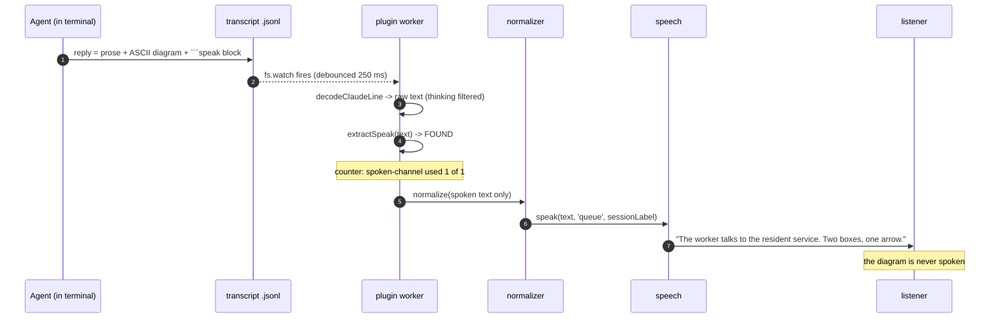
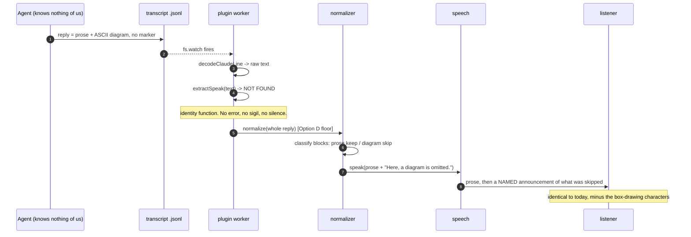
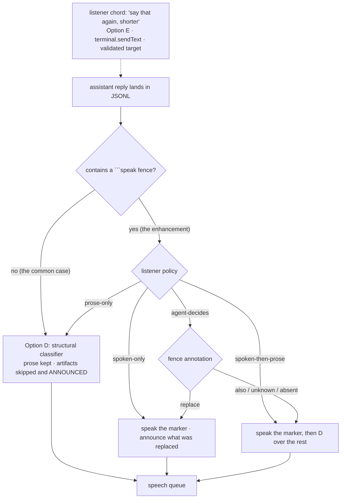

# D002 — How does an agent choose what is spoken?

**Status:** open, pending the listener's taste calls (Q8) and four new empirical probes (Q43-Q46).
**Raised:** 2026-08-21, after `docs/.research/q-round1-orca-api.md` and
`docs/.research/q-round1-buzz-transcript.md` closed Q1-Q4.
**Governs:** roadmap phase M14 (`docs/TASKS.md` "Phase M14", tasks T140-T146 — reordered
2026-08-21 so Option D is first, and gate M14 split into M14a / M14b).
**Answers:** Q5, Q6, Q7 of `docs/.discussion/000-open-questions.md`. Designs but does **not** pick
Q8 — that belongs to the listener, in Voice Lab (PITFALLS P23).

> **Amended 2026-08-21 — round-3 reconciliation.** Findings from `docs/design/008-crossreview-round3.md`,
> `docs/design/007-user-stories.md` §30 and `docs/design/006-fma.md` §15b were resolved **in this
> document, in place**. Every amendment carries a dated note naming the finding that forced it.
> Ledger of what changed and what was deferred: `docs/design/009-reconciliation.md`.

---

## Question

Huddle mode speaks the **whole** assistant reply. `packages/plugin/src/huddle/index.ts:179` hands
every decoded reply straight to `speak(text, 'queue', label)`, and
`packages/core/src/normalizer/index.ts:91-113` normalizes whatever arrives. That is correct when the
reply is prose. It is wrong when the reply is an artifact: an ASCII diagram is spoken as
box-drawing characters, a table is spoken cell by cell, a stack trace is spoken as punctuation.

`block/buzz` does not have this problem, because **its agent chooses**. So:

> By what mechanism does an agent tell us what to say aloud — given that we cannot give it a tool,
> cannot reach its system prompt, and must assume it has never heard of us?

### The ground we are standing on

Four results are settled. They are cited, not assumed, and this document does not re-open them.

| | Verdict | Evidence |
|---|---|---|
| An agent-callable `speak` **tool** | **Impossible.** No MCP surface exists in the plugin system; `contributes` is `.strict()` with seven keys, none tool-shaped. | `orca/src/shared/plugins/plugin-capabilities.ts:15-23`, `plugin-manifest.ts:99-129`; grep for `mcp` across the plugin tree returns nothing (`q-round1-orca-api.md` Q1) |
| **System-prompt injection** | **Impossible.** ORCA never builds a system prompt; `contributes.agents` is validated (`plugin-artifact-validation.ts:60-65`) and consumed by nothing (`plugin-content-pack-registry.ts:13-27`). Skills are hard-rejected (`plugin-marketplace.ts:14-25`). | `q-round1-orca-api.md` Q3 |
| A **marker in the reply text** | **Mechanically viable.** A fence with info string `speak` survives byte-for-byte into `message.content[].text` in the raw JSONL; the info-string field is a passthrough (22 distinct strings observed across 4,192 transcripts). | `q-round1-buzz-transcript.md` Q2 |
| The **only** plugin→agent channel | `terminal.sendText` — panel-callable, `mutation: true`, `text` 1..4096 chars, explicit `terminalId`, and an **`enter` flag that decides whether the text is characters in a buffer or a submitted user turn**. Returns `{ accepted }`, which is **always `true`**; every failure throws (E-02). With `enter: true` it lands as a user turn and appears in the transcript. | `orca/src/shared/plugins/plugin-host-api.ts:45-52,133-142`; `enter` → `\r` at `orca/src/main/runtime/orca-runtime.ts:39794-39810` |

And the shape worth copying, from buzz: it uses **neither** a marker **nor** a tool. It makes the
*destination* the channel — the agent posts an ordinary message to the huddle channel, and
everything else it produces is silent (`buzz/desktop/src-tauri/src/huddle/agents.rs:32-47`, pinned
by a test at `:303-311`). Six lines of agent-facing contract, total. Its non-cooperation mode is
**silence**, never garbage. ORCA has no second destination to send to, so a marker is our
substitute for one — but the *properties* are what we are copying, not the transport.

### The bad thing that already happens today

This is not a greenfield decision. There is a live wrong behaviour to fix.

`packages/core/src/normalizer/index.ts:122-144` strips fenced code, and with the default policy
`'announce'` (called at `:96`) it substitutes `CODE_PLACEHOLDER` — *" . Here, a code block is omitted. "*
(`:88`). So **if an agent emitted a ```speak block into ORCA today, the listener would hear
"Here, a code block is omitted."** and then the prose. The do-nothing baseline is already the
disqualifying failure mode described in Q6. Whatever we choose, the `speak` info string must be
stripped **silently and unconditionally**, independent of `codeBlocks` policy.

---

## Options

Five options. Each is judged on four axes, in this order of importance:

1. **Does the agent need to know?** (because we cannot tell it — Q3)
2. **What happens when it does not cooperate?** (because most will not — Q6)
3. **What does the SIGHTED reader see?** (because we do not own the renderer — Q7)
4. **Can the target be validated rather than trusted?** (because of buzz #6298)

### Option A — a fenced ```speak block, extracted from the reply

The agent writes what it wants heard inside a fence whose info string is `speak`. The plugin
extracts it before normalization and speaks that instead of, or alongside, the prose.

````
Here is the layout:

┌──────┐   ┌──────┐
│ worker│──▶│service│
└──────┘   └──────┘

```speak
The worker talks to the resident service over loopback. Two boxes, one arrow.
```
````

- **Agent must know:** yes, fully. This is the option's whole cost.
- **Non-cooperation:** no block, no change — we fall back to today's path. **Safe**, provided the
  extractor's absence-case is the identity function.
- **Sighted reader:** sees the fence. It is real noise, and we cannot hide it (Q7 below).
- **Validation:** the target is a *substring of a record we already hold*, not an identifier we
  interpolated into a prompt. There is nothing to misroute. This is the strongest possible answer
  to the #6298 class of failure: buzz's bug was possible because the destination was carried in
  text; here the destination is "this same reply", which cannot be wrong.
- **Cost to build:** a pure function in `packages/plugin/src/huddle/decoders.ts`. `decodeClaudeLine`
  (`:29-58`) already returns the raw text; extraction is one more step on a string. Zero new
  capabilities, zero upstream dependency.

### Option B — a convention the USER pastes into their own `CLAUDE.md`

We publish six lines. The user, if they want the feature, pastes them into their own agent config.

> **This is a bootstrapping mechanism, not a rival syntax.** It is orthogonal to A: B is *how the
> agent learns* the convention that A defines. It is listed as an option because the alternative
> to B is "no agent ever learns", which is a real and defensible position.

- **Agent must know:** yes, and B is the only durable way it can.
- **Non-cooperation:** the user never pastes it → identical to A's absence case → safe.
- **Sighted reader:** unchanged.
- **Hard constraint:** `CLAUDE.md` is **user-owned configuration**. We **document** the snippet in
  our README; we **never write to it**. Writing to a user's agent config from a plugin is the exact
  hazard ORCA's own consent model exists to prevent, and `contributes.agents` being validated-but-
  unwired (`plugin-artifact-validation.ts:60-65` with no consumer) means ORCA deliberately has no
  such path. Do not build one out of `fs`.
- **Validation:** none needed; nothing is interpolated.

### Option C — a summarizing pass over the finished reply

When a reply lands, hand it to a second model (or a second agent turn) and speak the summary.

- **Agent must know:** no. **This is the option's one genuine advantage.**
- **Non-cooperation:** not applicable — the original agent is not involved.
- **Sighted reader:** sees nothing changed.
- **Against, and it is decisive for v1:**
  - **Latency.** R4.2 requires first audio under ~500 ms on the default backend
    (`HANDOFF.md` "The user's binding requirements"). A summarization round-trip is seconds, and
    it cannot start until the reply is *complete*, which forfeits R4.1 sentence streaming outright.
  - **R3.4** requires the default path to need no account, no API key, no network. A summarizer is
    a second model. A local one large enough to summarize well is far past the 50 MB plugin cap
    (P4) and would compete with Piper for the same CPU.
  - **It can be wrong, and wrongly confident.** A summary that drops the one number the listener
    was waiting for fails silently, and the listener cannot see the original to catch it. For
    assistive tech that is the worst failure class we have (P22).
- **Verdict:** not for v1. Revisit only as an explicit, listener-invoked action ("summarize that"),
  never as the automatic path.

### Option D — heuristic extraction: read the prose, skip the artifact

No agent involvement at all. Classify each block of the reply structurally and speak only the
speakable parts, announcing what was skipped.

This is **not hypothetical** — it is a strict extension of what
`packages/core/src/normalizer/index.ts` already does. Stage 1 already drops fenced code and
announces the omission (`:122-144`); the roadmap already commits to headings, lists, tables and
paths (`HANDOFF.md` "Settled findings"). Option D is that work carried to its conclusion: add a
structural classifier for ASCII art, box-drawing runs, stack traces and wide tables, and give each
skipped construct a *named* spoken announcement rather than a generic placeholder.

- **Agent must know:** **no.** Works on every reply from every agent from day one.
- **Non-cooperation:** the concept does not apply; there is nothing to cooperate with.
- **Sighted reader:** sees nothing changed.
- **Validation:** the classifier is deterministic and fixture-testable. It can be wrong (it may skip
  something worth hearing), which is why **every skip must be announced aloud** — buzz's rule,
  `agent_tts_routing.rs:27-40`, truncates at 8,096 chars and appends *"... message truncated."*
  **in the audio**, because the listener cannot see a log.
- **Against:** a heuristic cannot know *intent*. It can decline to read the diagram; it cannot
  produce the one sentence that describes the diagram. It raises the floor; it does not reach the
  ceiling.

### Option E — the pull-based recap: the listener asks, over `terminal.sendText`

Invented here, and it is the answer to the bootstrapping problem rather than a rival to A.

The listener presses a chord ("say that again, shorter"). The plugin calls `terminal.sendText`
against an explicitly resolved `terminalId`, sending a short, **self-describing** request:

> `Reply with only a two-sentence spoken summary of your last message, inside a fenced block whose
> info string is speak. No other text.`

The agent replies; the Option A extractor picks the block up; it is spoken.

- **Agent must know:** **no — the instruction carries its own definition.** This is buzz's
  guidelines event (`agents.rs:32-47`) reduced from once-per-huddle to once-per-request, using the
  one channel ORCA actually gives us. It bootstraps itself.
- **Non-cooperation:** the agent replies in prose without a fence → Option D handles it → we speak
  the prose. Degrades to *the current behaviour*, never to garbage.
- **Sighted reader:** sees an extra user turn and an extra assistant turn in their transcript. This
  is the real cost and it is not small.
- **Costs, stated plainly:**
  - It **consumes agent attention** — a whole turn, tokens, and possibly a tool budget.
  - It **appears in the transcript** permanently, polluting the written record the sighted reader
    (and the next agent, and the next compaction) will read.
  - It is **listener-initiated only**. It cannot make ordinary replies better; it can only rescue
    one that was unlistenable.
- **Validation — and this is where #6298 lives.** `workspace.readContext` returns terminals of the
  **focused worktree only**, and each entry carries **`id` and nothing else**
  (`plugin-host-api.ts:25-43`). There is no session id, no transcript path, no title. So we can
  address *a* terminal but **cannot prove it is the terminal of the session huddle is following** —
  precisely buzz's failure, where one wrong interpolated identifier sent every spoken reply to the
  wrong channel with no error. See "Validating the target" below; this gap is why Option E ships
  behind an explicit confirmation and not as an automatic path.

### Options considered and rejected on syntax grounds

| Variant | Why not |
|---|---|
| A trailing sigil line (`>>speak: ...`) | A partially-emitted or mis-copied sigil is **read aloud verbatim**. Q6 disqualifies any option whose non-cooperation mode is a spoken sigil. Rejected outright. |
| An HTML comment (`<!-- speak: ... -->`) | Attractive for Q7 — it is invisible in *rendered* markdown. But ORCA runs the agent in a terminal, and whether the agent CLI's TUI renderer hides or prints an HTML comment is **unverified**. Held as Q45 with an exact probe; do not build on it (P0). |
| A JSON block (```json {"speak": ...}) | All of A's costs plus a parse failure mode. The fence's info string is already a perfectly good discriminator. |

---

## The cooperating path



## The non-cooperating path — the one that matters



The second diagram is the product. The first is the enhancement.

---

## Q5 — replace or supplement, and who chooses

**Three distinct policies exist, and they are not equivalent:**

| Policy | Heard | Good for |
|---|---|---|
| `spoken-only` | the marker block, nothing else | a reply that is mostly artifact |
| `spoken-then-prose` | the marker block, then the normalized reply | a reply where the marker is a lead-in |
| `prose-only` | the normalized reply; the marker is stripped silently | a listener who does not trust agent summaries |

**Who chooses: the listener owns the policy; the agent may only express a preference.**

The reasoning is the same reasoning as P22 — *"reading something you didn't ask for and can't stop
is worse than silence"*. If the agent chooses, then a badly-behaved agent can silently suppress the
content the listener was actually waiting for, and the listener has no way to know something was
withheld. That is exactly the C-option failure we rejected above, arriving by a different door.

So the mechanism is:

1. A listener setting picks one of the three policies. Its **default is Q8 — taste, settled in
   Voice Lab, not here** (PITFALLS P23).
2. The agent **may** annotate the fence — ```` ```speak replace ```` vs ```` ```speak also ```` —
   and that annotation is honoured **only** when the listener's policy is a fourth value,
   `agent-decides`. An unknown annotation degrades to `also` (supplement), never to `replace`,
   because supplementing can only add information and replacing can remove it.
3. Whichever policy is active, **omission is announced**. If the marker replaced 900 words of
   prose, the listener hears that it did. This is buzz's truncation rule
   (`agent_tts_routing.rs:27-40`) generalized: every omission is announced *in the audio stream*,
   because the listener cannot see a log.

---

## The reply that does not fit — a cap on the huddle path

> **Added 2026-08-21 (round 3 reconciliation), forced by B-05.** This document quotes buzz's
> truncation rule three times as the model for announcing an omission, and **adopts only the
> announcement, not the cap**. The cap is the mechanism; the announcement is what makes the cap
> honest.

**There is no length cap on the huddle path at all.** `packages/plugin/src/huddle/index.ts:179`
hands the whole decoded reply to `speak(text, 'queue', label)`. The chunker splits at
`DEFAULT_MAX_UNITS = 200` (`packages/core/src/chunker/index.ts:53`) and the queue caps at eight
**replies, not chunks** (`packages/plugin/src/main.ts:48`). So **a single reply is never dropped by
overflow, however long it is** — the overflow rule cannot help, because there is only one item.

The arithmetic: 40,000 characters ≈ 200 chunks; at ~200 characters ≈ 30 words ≈ 10 s of speech,
that is **~33 minutes of audio**, plus ~200 sink spawns at ~970 ms each on v1 macOS
(`packages/plugin/src/sinks/subprocess-sink.ts:8-10`) — another ~3 minutes of silence distributed
through it. Stop works (003), but the listener who wanted the last sentence must sit through the
whole thing or lose all of it. That is P22's sentence — *"reading something you didn't ask for"* —
reached by a route no design closed.

The comparison is damning because the project already found the answer and declined to copy it.
buzz caps at 8,096 characters and appends *"... message truncated."* **aloud**
(`agent_tts_routing.rs:27-40`, cited by 003 §9 adoption 3). Our own clipboard path already does
both — `DEFAULT_MAX_CHARS = 20_000`, truncation announced (`packages/plugin/src/clipboard.ts:63`).
The huddle path, which takes **untrusted input from a model**, does neither.

**The mechanism.**

1. A **per-utterance character cap on the huddle path**, applied after the Option D classifier and
   before chunking, so the cap counts *speakable* characters rather than box-drawing runs the
   classifier was going to skip anyway.
2. **The truncation is announced aloud**, in buzz's shape and in Option D's announcement vocabulary
   (Q47) — *"that reply was long; I read the first two minutes."*
3. **The remainder is retained**, in 003 §7's replay buffer, and the announcement says how to reach
   it — *"press R for the rest."* Nothing is lost; it merely is not read unasked.
4. Entering the replay buffer **marks the reply as seen** (003 §7.1), so a truncated reply cannot
   come back through the B-01 door on the next re-fork.

**The number is taste and belongs to the listener**, in Voice Lab's Panel F beside
`input.clipboardCap` — which is the identical control for the other input. **The existence of the
cap is correctness and is settled here.** A lab that ships without the control still ships with a
cap; the control only changes where it sits.

**Verify by effect.** Feed a 40,000-character reply through the huddle path and assert the sink
produced fewer than N seconds of audio **and** that the truncation sentence is among the utterances.
Run the same fixture with the cap disabled and assert the duration goes up — without that negative
control the first assertion is a ritual.

---

## Q6 — degradation when the agent does not cooperate

**Assume the cooperation rate is near zero.** Section "Adoption reality" below argues it literally
is in month one.

| Option | Non-cooperation mode | Verdict |
|---|---|---|
| A — ```speak fence | no fence → extractor is the identity function → today's behaviour | **Safe** |
| A — *partial* fence (opened, never closed) | today: `stripFencedCode` swallows the remainder and announces a code block (`normalizer/index.ts:122-144`; the discarded `announced` flag is at `:141-142`) — the listener loses the rest of the reply | **Must be fixed**: an unterminated `speak` fence extracts to end-of-message and is announced as truncated, never dropped |
| A — a *sigil* variant | the sigil is spoken aloud | **DISQUALIFIED.** An option whose non-cooperation mode reads a raw marker aloud is not a candidate. |
| B — user config | not pasted → nothing happens | **Safe** |
| C — summarizer | not applicable, but its *failure* mode is a confident wrong summary the listener cannot check | **Worst of the five** |
| D — heuristic | not applicable; it can misclassify, and every misclassification is **announced** | **Safe by construction** |
| E — `terminal.sendText` recap | agent replies in prose → D handles it | **Safe**, but see the target-validation gap |

**The rule this produces, and it is the load-bearing sentence of this document:**

> The extractor's absence-case must be the **identity function**, and its presence-case must be the
> only behaviour change. Nothing about the marker path may alter what happens to a reply that does
> not contain a marker. Pin it with a test: for a corpus of real replies containing no marker,
> `speakableOf(reply)` is byte-identical before and after M14 ships.

That test is the M14 equivalent of P18's `scripts/smoke-activate.mjs` — it drives the real path and
fails loudly, rather than trusting a defensive fallback to be harmless.

---

## Q7 — does the written reply still show the marker?

**Yes, and we cannot change that.** We do not own the renderer. The agent CLI renders its own
markdown into a TTY; ORCA hosts the terminal. A ```speak fence will be visible to the sighted
reader as a fenced block, and there is no plugin surface that post-processes assistant output —
that is the same absence recorded as upstream issue
[#15637](https://github.com/stablyai/orca/issues/15637) (no plugin route to assistant text).

Three honest responses, in the order we should take them:

1. **Make the noise small and last.** The convention says: one short block, at the very **end** of
   the reply, two sentences maximum. A trailing two-line fence is a footnote; an opening one is an
   interruption. This is a convention property, so it costs nothing to specify and is the only
   lever we actually hold.
2. **Make the noise mean something to the sighted reader too.** A two-sentence summary at the end of
   a long reply is *useful* to a skimming reader. Framed that way the fence is not overhead, and
   the convention is easier to justify to an agent, to a reviewer, and to ourselves.
3. **Probe the invisible variants before assuming they are unavailable.** Q45 below.

We should not pretend this is free. It is a real tax on the written reply, paid so the spoken reply
can be good. The listener is the one who decides whether the trade is worth it.

---

## Q8 — the option space only

Q8 asks which is heard by default when both a marker and prose exist. **This document does not
answer it.** The option space is the four values in the Q5 table: `spoken-only`,
`spoken-then-prose`, `prose-only`, `agent-decides`. The default is set in Voice Lab, by the
listener, after hearing the same fixture under each (PITFALLS P23: *"ship the mechanism and let the
listener choose the values"*).

What this document *does* fix, because it is correctness and not taste: `agent-decides` must
degrade to `spoken-then-prose` on any ambiguity, never to `spoken-only`.

---

## The bootstrapping problem

This is the crux. Q3 is resolved negative: **there is no supported way to tell the agent anything**
at session start. Buzz's whole design rests on being able to post six lines into the agent's
channel session prompt (`agents.rs:32-47`), delivered *before* agents join
(`huddle/mod.rs:256-265`, whose comment says the ordering is deliberate). We have no equivalent.

Four routes exist. All four are worse than buzz's. Here they are with their real costs.

| Route | How the agent learns | Cost | Verdict |
|---|---|---|---|
| **1. User pastes into their own `CLAUDE.md`** | permanently, every session, every project it is scoped to | one manual step, once, per machine or per repo; **we may never write this file ourselves** | **The only durable route.** Ship the snippet in the README, six lines, pinned by a test the way buzz pins theirs (`agents.rs:303-311`). |
| **2. `terminal.sendText` at huddle start** | one out-of-band user turn, once per session | consumes agent attention; **permanently in the transcript**; costs tokens on every session start whether or not the feature is used; and lands mid-work if the agent is busy | **Rejected as automatic.** Injecting an unasked-for user turn into someone's agent session is the plugin equivalent of unsolicited audio, which buzz's own issue #4403 calls hostile. |
| **3. `terminal.sendText` on demand (Option E)** | the request carries its own definition | one turn, only when the listener asks for it | **Accept, behind an explicit chord.** The cost is paid only when the listener has decided the recap is worth it. |
| **4. Never — rely on Option D** | it never does | none | **This is the default state of the world and must be a first-class supported mode.** |

**The conclusion the evidence forces:** route 4 is what actually happens, route 1 is what we hope
for, route 3 is the escape hatch, route 2 is a trap. Therefore **Option D is the product and Option
A is an enhancement** — not the other way round, which is how the roadmap used to read.

**Gate M14 must be satisfiable by Option D alone.**

> **Resolved 2026-08-21 (round 3 reconciliation), forced by 007 C6.** `docs/TASKS.md` "Phase M14"
> listed T140a (the marker) first and the heuristic last, inverting this document's conclusion.
> **It has been reordered**: Option D is now T140a, Option A is T140b, Option E is T140c, and B and
> C are recorded as closed-negative rather than as open options. **The gate is split**, exactly as
> this paragraph asked: **M14a** — with no marker present, the diagram is not spoken and the
> omission is announced by name (holdable with zero agent cooperation); **M14b** — with a marker
> present, the one-sentence description is what is spoken. A gate that only passes with a
> cooperating agent is a gate we cannot hold.

---

## Adoption reality — what fraction of replies use this in month one?

**Almost none. Plausibly zero outside the author's own machine.** The chain of conditions:

1. The plugin system is off by default (`HANDOFF.md` "Settled findings").
2. The user must install the plugin and consent to its capabilities.
3. The user must then find and paste the six-line snippet into their own `CLAUDE.md`.
4. The snippet must be in scope for the repo they are working in.
5. The agent must then actually follow it — and it is one instruction among hundreds in a long
   context, with no tool call to anchor it and no error if it is ignored.

Steps 3 to 5 have no enforcement anywhere. Even buzz, which *can* inject its guidelines and pins the
wording with a test, still writes them as a plea (*"your FIRST tool call must..."*) rather than a
constraint. We have strictly less leverage than they do.

**Three design consequences, and they are not negotiable:**

- **The fallback path is the product.** Every hour spent on Option D is spent on the path that
  serves 100 percent of replies. Every hour on Option A serves the fraction of replies from agents
  that were told. Sequence the work accordingly: **D first, then A, then E.**
- **No feature may be gated on cooperation.** If huddle mode is only good when the agent plays
  along, huddle mode is not good.
- **The counter must be visible.** "Spoken channel used in N of M replies this session" is the
  measurement that tells us in month two whether route 1 works at all. Without it we will be
  guessing, and the global rule applies: an indicator that never changes is a broken indicator.
  This counter *will* read 0 for a long time, and 0 is a real reading — which is exactly what makes
  it a working indicator rather than a decorative one.

---

## Validating the target — the buzz #6298 lesson

Buzz issue #6298: the huddle instructions once interpolated the **parent** channel id instead of
the huddle's, so *"every spoken reply is silently posted to the wrong channel"*
(`docs/.research/prior-art-buzz.md`, via `q-round1-buzz-transcript.md` Q4). One wrong identifier,
carried in prompt text, no error anywhere, whole feature dead.

The generalization: **any identifier that travels through text, and is not checked against the
system that owns it, will eventually be wrong and will fail silently.** Our design has exactly two
such identifiers. Both get a named check.

**1. The extraction target — structurally cannot be wrong.** Option A's "destination" is the same
record we already decoded. There is no identifier to carry. This is not luck; it is the reason to
prefer A over anything that names a session, a pane, or a channel in text. *Design rule: prefer the
mechanism with no identifier to interpolate.*

**2. The `terminal.sendText` target — CAN be wrong, and today we cannot fully prove it right.**
`workspace.readContext` returns terminals of the **focused worktree**, each carrying `id` and
nothing else (`plugin-host-api.ts:25-43`). Huddle identifies its session by transcript path and, per
`q-round1-buzz-transcript.md` Q27, by `~/.claude/sessions/<pid>.json` (`sessionId`, `cwd`, `pid`).
**There is no join between the two.** `cwd` ↔ worktree path is the same many-to-one ambiguity that
caused P22 when two agents share one worktree — and three of the terminals observed in that probe
did share `/Users/m5air/source/orca-plugin-tts`.

So Option E ships with four checks, and is refused rather than guessed when any fails:

> **Amended 2026-08-21 (round 3 reconciliation), forced by X-01 and E-02 / C-06.** Check 2 was
> written as a refusal, and it was correct — but as written it fires in *every* real configuration,
> because a worktree that runs an agent and a control pane always has more than one terminal.
> `docs/.discussion/003-panel-and-control-channel.md` §2D.1 now supplies the **positive** resolution
> that makes check 2 discriminating instead of merely safe. And check 3 was **wrong**: it told the
> implementer to watch a value that can never change.

1. **Resolve, never assume.** `terminalId` comes from `workspace.readContext` on every send. The API
   itself refuses "the active terminal" by design (`plugin-host-api.ts:46-47`); we must not
   reintroduce that concept with a cached id.
2. **Resolve the ambiguity, and refuse only when it cannot be resolved.** Use the nonce handshake
   of 003 §2D.1 — a probe sent to every terminal in the worktree with **`enter: false`**, answered
   by whichever one is running `orca-tts control`. Option E's recap request then goes to the
   terminal the *listener's agent* is in, which is the one the handshake did **not** claim, and only
   when exactly one such candidate remains. If two or more remain, **do not send** — say aloud
   which session we would have asked and let the listener confirm. Silence plus a question beats a
   message in a stranger's terminal.
3. **Catch and name the throw. Do not read the acknowledgement.**
   `terminal.sendText` returns `{ accepted: boolean }` (`plugin-host-api.ts:52`) and **`false` is
   never constructed anywhere in ORCA's tree** — `sendTerminal`
   (`orca/src/main/runtime/orca-runtime.ts:18559-18614`) has two success returns, both hard-coded
   `accepted: true`, and every other path throws (`terminal_not_writable`, `invalid_terminal_send`,
   `TERMINAL_INPUT_TOO_LARGE_ERROR`), as does the binding
   (`orca/src/main/plugins/plugin-host-method-bindings.ts:99-106`). So *"log the `false`, and say
   it"* was an instruction to watch a permanently-green light — the exact anti-pattern this project
   names as **an indicator that never changes is a broken indicator**. Wrap the call, branch on the
   thrown error's code, and **say the reason**. The throw is strictly better than the boolean it
   replaces, because it carries one.
4. **Verify by effect, with a before/after probe.** After a send, the *expected* consequence is a
   new user turn in the transcript we are watching, carrying our own text. If it does not appear
   within a bounded window, the message went somewhere else — announce that, do not retry blindly.
   This is the project's standing rule: watch a named value move, and an after-only reading proves
   nothing.

Check 4 is the one that would have caught #6298. Check 3, as originally written, would have caught
nothing at all.

**One flag, stated because it is the whole safety boundary.** Option E's recap request is the
**only** send in this project that uses `enter: true`, and it uses it because a recap request *is*
deliberately a user turn that the listener asked for. Every other send — every probe, every control
envelope — is `enter: false`. 003 §2D.3 holds that rule; this document conforms to it.

---

## Recommendation

**A layered ladder, built bottom-up, in this order. Not a single option.**



1. **Option D is the floor and the deliverable.** It is the only option that serves every reply from
   every agent, needs no cooperation, and cannot leak a marker into the audio. Split gate M14 so
   that D alone satisfies "the diagram is never spoken".
2. **Option A is the enhancement, layered on top.** A ```` ```speak ```` fence, extracted in
   `decoders.ts` before normalization, with the absence-case pinned as the identity function.
   Convention: one block, at the end, two sentences.
3. **Option B is the onboarding, documented and never written.** Six lines in the README, in buzz's
   style, pinned by a test so the wording is treated as behaviour. **We never touch a user's
   `CLAUDE.md`.**
4. **Option E is the escape hatch, listener-invoked only**, behind the four validation checks above.
   Never automatic, never at session start.
5. **Option C is rejected for v1** on R4.1, R4.2, R3.4 and on its unverifiable-failure mode.

**Immediate correctness fix, independent of everything above:** the `speak` info string must be
stripped silently regardless of the `codeBlocks` policy
(`packages/core/src/normalizer/index.ts:88` `CODE_PLACEHOLDER`, called at `:96`, `stripFencedCode` at `:122-144`). Today it would be announced as *"Here, a
code block is omitted."* — which is the disqualifying failure mode arriving through the front door.

---

## Engineer prompt

> Read `docs/.research/q-round1-orca-api.md` (Q1, Q3 resolved negative; the `terminal.sendText`
> surprise S1) and `docs/.research/q-round1-buzz-transcript.md` (Q2 resolved yes; Q4, buzz's
> destination-as-channel design). Then, **in this order**:
>
> 1. Run the four probes Q43-Q46 below and record the results next to the questions in
>    `docs/.discussion/000-open-questions.md`. Q45 in particular decides whether Q7's tax is
>    avoidable; do not build on a guess (P0).
> 2. Implement **Option D only**. Extend `packages/core/src/normalizer/index.ts` with a structural
>    classifier for box-drawing runs, ASCII art, stack traces and wide tables. Every skip gets a
>    *named* spoken announcement, not the generic `CODE_PLACEHOLDER` at `:88`. Build T143's fixture
>    first (a reply with an ASCII diagram plus a one-line description) and make T144 pass with **no
>    marker present**.
> 3. Only then implement **Option A**: `extractSpeak(text)` in
>    `packages/plugin/src/huddle/decoders.ts`, called before normalization. Write the
>    identity-function test first — a corpus of real marker-free replies whose `speakableOf` output
>    is byte-identical before and after your change. If that test is hard to write, the seam is
>    wrong.
> 4. Fix the `speak` info string strip in `stripFencedCode` in the same change as step 3, and pin
>    it: policy `'announce'` must still not announce a `speak` fence.
> 5. Wire the "spoken channel used in N of M replies" counter. It will read 0. That is the point.
> 6. Write the six-line README snippet (Option B) and pin its wording with a test, the way
>    `buzz/desktop/src-tauri/src/huddle/agents.rs:303-311` pins theirs. **Do not write to any
>    user-owned file.**
> 7. Leave Option E unbuilt until Q43 and Q44 are answered. If they come back negative, Option E is
>    dead and this document should say so.
>
> Do not set the Q5/Q8 default. Wire all four policies and leave the default to Voice Lab.

---

## New open questions opened by this document

For cataloguing in `docs/.discussion/000-open-questions.md`.

| # | Kind | Question | Exact probe / note |
|---|---|---|---|
| Q43 | E | Can a plugin join a `workspace.readContext` `terminals[].id` to an agent `sessionId` or transcript path? Without it, Option E cannot prove its target. | The entry carries only `id` (`plugin-host-api.ts:32-39`; the `id` field is `:36`). Probe: open two terminals in one worktree, call `workspace.readContext` from the panel, and try to distinguish them by any means. If none exists, file it upstream alongside [#15639](https://github.com/stablyai/orca/issues/15639). |
| Q44 | E | When `terminal.sendText` writes into a terminal whose agent is **mid-turn**, what happens — queued as the next user turn, interleaved into the running turn, or dropped? Option E's safety depends on the answer. | Send with `enter: true` while an agent is visibly working; read the resulting transcript records and their ordering. |
| Q45 | E | Does an HTML comment (`<!-- speak: ... -->`) survive verbatim into the JSONL **and** render invisibly in the agent CLI's TUI? If both, Q7's tax on the sighted reader largely disappears. | Two halves. JSONL half: rerun the Q2 probe shape with a comment instead of a fence. TUI half: emit one in a live session and look. |
| Q46 | E | Does the ```` ```speak ```` fence survive equally in the **non-Claude** transcript formats `decodeGenericLine` handles (`decoders.ts:60-71`)? Q2 proved it only for Claude JSONL. | Run the Q2 probe through a codex / grok / omp session in ORCA and read the raw record. |
| Q47 | D | What is the **named vocabulary** of skip announcements for Option D — "a diagram", "a table of N rows", "a stack trace", "a code block"? This is the option space; the wording is taste and belongs to Voice Lab. | Design here, default in M11. |
| Q48 | D | Should the marker convention be **per-reply opt-in** (agent adds a fence) or **per-session opt-in** (a listener toggle that also changes what we announce)? Bears on whether the "N of M" counter measures agent behaviour or listener behaviour. | Argue in a later revision of this document. |
