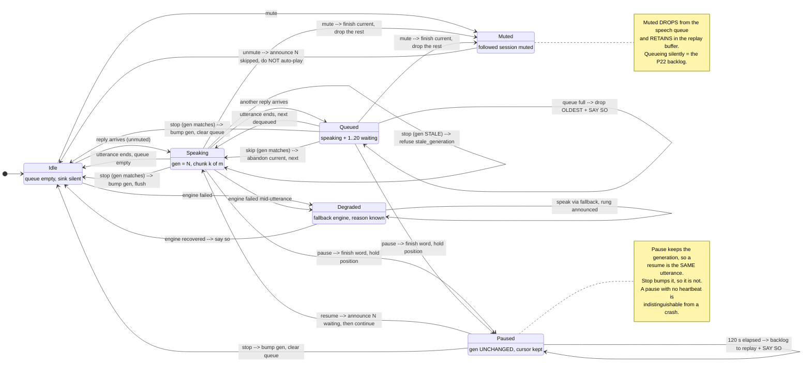
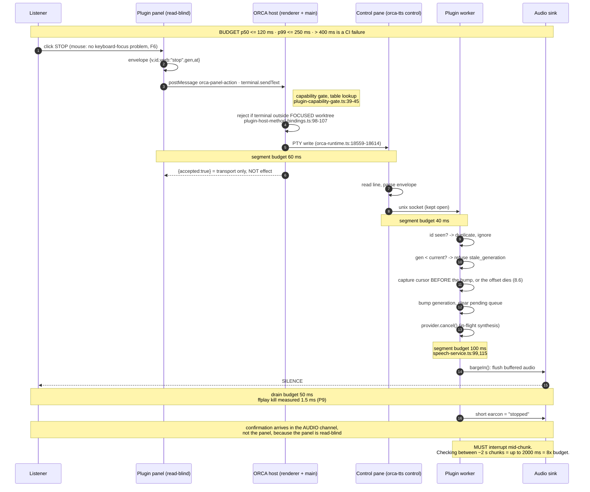
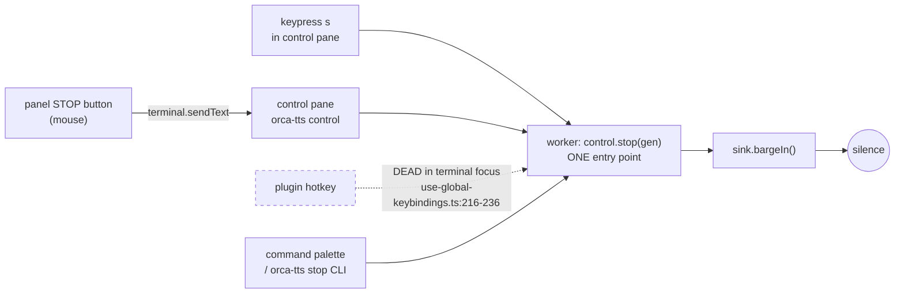

# 003 — The panel, and the control channel that has to exist behind it

> **Status:** open for review. Written 2026-08-21.
> **Answers:** Q12, Q13, Q14, Q28, Q29, Q30 of `docs/.discussion/000-open-questions.md`.
> **Consumes as settled:** Q9, Q10, Q11, Q27 (see `docs/.research/q-round1-orca-api.md` and
> `docs/.research/q-round1-buzz-transcript.md`).
> **Opens:** Q43–Q50, listed at the end.
> **Revised 2026-08-21** after `docs/.research/q-round1-platform.md` reported word-boundary
> callbacks and pause/resume on all three platforms — see section 8, which is load-bearing for the
> display model of section 4 and adds a third control.

> **Amended 2026-08-21 — round-3 reconciliation.** Findings from `docs/design/008-crossreview-round3.md`,
> `docs/design/007-user-stories.md` §30 and `docs/design/006-fma.md` §15b were resolved **in this
> document, in place**. Every amendment carries a dated note naming the finding that forced it.
> Ledger of what changed and what was deferred: `docs/design/009-reconciliation.md`.
>
> Every claim about ORCA's API carries a `file:line` into `/Users/m5air/source/orca` at
> `87097551f8e98a21c3afa7d457f66d6fd1f94038` (PITFALLS P0). Where this document adds a citation the
> round-1 research did not have, it says so.

---

## 0. Why this document exists

The user's words after the session that produced PITFALLS P22:

> *"this is really confusing, what is it even reading right now… a way to control something and not
> feel helpless and suffer hearing random stuff."*

Two separate failures are named there, and they need two separate answers.

| Failure | Named need | Answered in |
|---|---|---|
| *"what is it even reading right now"* | **observability** — the listener cannot see the queue | 4 · The display surface |
| *"a way to control something"* | **agency** — the listener cannot stop it | 2 · The control channel |

The worst state this system can be in is **"I cannot tell what is happening and I cannot stop it."**
Every recommendation below is chosen against that sentence, not against elegance.

---

## 1. Ground truth, restated so the argument is checkable

Six facts constrain everything that follows. Five are settled; the sixth is new to this document.

**F1 — Exactly three host methods are panel-callable.** `workspace.readContext`,
`terminal.sendText`, `notifications.show`. The set is derived from the spec table by filtering
`panel: true`, so it cannot drift (`src/shared/plugins/plugin-host-api.ts:261-265`). All thirteen
method names are at `plugin-host-api.ts:124-244`; there is no `terminal.create`, no
`terminal.read`, and no way for a plugin to open a pane.

**F2 — There is no storage channel from a panel, in either direction.** `storage.get`,
`storage.set`, `storage.delete`, `storage.keys`, all three `secrets.*`, both `settings.*`, and
`events.subscribe` are `panel: false` (`plugin-host-api.ts:154-244`). The refusal is hard, not a
silent no-op: `plugin-capability-gate.ts:39-45` returns `code: 'panel_forbidden'`, pinned by
`src/main/plugins/plugin-host-conformance.test.ts:201-207`.

**F3 — The panel postMessage bridge is a transport for host actions only. There is no
panel→worker message.** This document verified it rather than assuming it, because option (B) of
the brief depends on it. The request schema constrains `action` to a panel-callable host action:
`src/shared/plugins/plugin-panel-bridge.ts:38-44` —

```ts
export const panelActionRequestSchema = z.object({
  type: z.literal(PANEL_ACTION_REQUEST_TYPE),
  requestId: z.string().min(1).max(128),
  action: z.string().min(1).refine(isPluginPanelAction, 'not a panel-callable action'),
  params: z.unknown().optional()
})
```

The file's own header says it plainly at `:11-13`: *"Param/result schemas come from the host API v0
spec table — the panel bridge is a transport, not a second contract."* The only other message types
on the bridge are `orca-panel-ping` / `orca-panel-pong` (`:17-18`), which are the watchdog. There is
no relay to the worker anywhere in `src/main/plugins/plugin-panel-controller.ts`. **Option (B) is
dead. It does not exist and cannot be made to exist without an upstream change.**

**F4 — Rate budget: 30 messages per 10 000 ms, sliding, 64 KB each, per plugin and shared by every
panel session.** `plugin-panel-bridge.ts:22-23`; sliding-window eviction at
`plugin-panel-message-budget.ts:29-38`; per-identity sharing at
`plugin-panel-call-admission.ts:35-36`; oversized messages still spend rate budget
(`plugin-panel-message-budget.ts:33-42`). The watchdog pings every 10 s and pongs are charged to the
same budget, so **one slot per window is not ours** (`plugin-panel-bridge.ts:35-36`).

**F5 — Live sessions are enumerable.** `~/.claude/sessions/<pid>.json` carries `sessionId`, `cwd`,
`name`, `status`, `messagingSocketPath`. Liveness must come from `kill(pid,0)` or the socket, never
from `updatedAt`. Full evidence in `q-round1-buzz-transcript.md` "Q27".

**F6 — NEW, and it is the load-bearing one: a plugin keybinding does not fire while a terminal has
focus, on any policy setting.** The brief listed this as upstream issue #15642; this document
locates the cause. Plugin chords are dispatched from a single site, guarded by a context test —
`src/renderer/src/app-shell/use-global-keybindings.ts:216-236`:

```ts
      // Plugin chords are user-reviewed instructional content. They win over
      // built-in defaults only in app focus; terminal/editor/browser handlers
      // retain their own shortcut authority.
      if (context === 'app') {
        const pluginCommand = findPluginCommandForKeybinding(...)
```

and `context` is binary — it is `'terminal'` whenever the xterm textarea holds focus
(`src/renderer/src/app-shell/app-command-handlers.ts:67-71`):

```ts
export function getKeybindingContext(target: EventTarget | null): KeybindingContext {
  return target instanceof HTMLElement && target.classList.contains('xterm-helper-textarea')
    ? 'terminal'
    : 'app'
}
```

Note what this is **not**. Built-in ORCA actions get a policy escape hatch: under the default
`orca-first`, `keybindingIsActiveInContext` returns `true` unconditionally in terminal context
(`src/shared/keybindings.ts:1902-1914`), and a definition may set `allowInTerminal`
(`keybindings.ts:152,1895`). Plugin commands reach neither. The plugin keybinding contribution
schema has only `command`, `key`, `when: 'global' | 'worktree'`
(`src/shared/plugins/plugin-content-pack-contributions.ts:25-41`), and the synthesized definition
hardcodes `scope: 'global'` with no `allowInTerminal`
(`src/renderer/src/lib/plugin-command-keybindings.ts:19-35`).

> **Consequence, stated bluntly.** The user is dyslexic and voice-first. They spend their day with
> focus in an agent terminal. **A plugin hotkey is dead in exactly the situation where Stop is
> needed.** Any design that answers "how do I stop it" with "press the hotkey" answers it wrong.

The command palette remains reachable — its open chord is a built-in action, active in terminal
context under the default `orca-first` policy (`keybindings.ts:1907-1911`), and plugin commands are
listed in it (`src/renderer/src/components/cmd-j/plugin-quick-actions.ts:11`). That is a working
path, but it is *open palette → type → read a filtered list → Enter*: several seconds, and it costs
reading, which is the thing this project exists to avoid.

---

## 2. The control channel

### Question

A panel cannot call `storage.*`, cannot post to the worker, and cannot receive a push. A plugin
hotkey is dead while a terminal has focus. **So by what physical path does a Stop press become
silence, and how fast?**

### Options

#### A — `terminal.sendText` into the agent's own terminal

The panel types a command into the terminal the agent is running in.

- Works today, no upstream change (`plugin-host-api.ts:134-142`, `panel: true`).
- The text lands in the agent's composer as a user turn. It appears in the transcript, costs agent
  attention, and pollutes the very transcript our huddle reads back.
- Round-trip latency is an agent turn: seconds, unbounded.
- **Verdict: unacceptable for a control pressed every minute.** Reject.

#### B — The panel's own `postMessage` bridge to the worker

**Verified non-existent.** See F3. Reject, and record it so nobody re-proposes it.

#### C — Controls live in the command palette and hotkeys; the panel is display-only

- Zero new machinery.
- Dies on F6: the hotkey does not fire in terminal focus, and the palette costs reading and
  seconds.
- It also does not work, because **display-only is itself impossible today** — see section 4.
  A panel with no data and no controls is a blank rectangle.
- **Verdict:** correct as a *supplement*, insufficient as *the* answer. Keep the palette entry and
  the hotkey; do not let them be the only route.

#### D — A dedicated control pane: `terminal.sendText` into a terminal running our own reader

> **Amended 2026-08-21 (round 3 reconciliation), forced by findings X-01 and X-02 of
> `docs/design/008-crossreview-round3.md`.** The first draft of this option assumed the panel could
> pick the control pane's `terminalId`, and gave one stdin two mutually exclusive reading modes.
> Both were wrong, and the first one was dangerous: guessing the id types a control envelope into
> the *agent's* terminal, where it lands as a user turn, the agent answers it, and huddle reads the
> answer aloud. A Stop press would produce speech. The target-resolution handshake (2D.1), the
> framing sentinel (2D.2) and the `enter` flag rule (2D.3) below replace those assumptions. The
> option's verdict is unchanged; its mechanism is not.

The user opens one terminal pane per worktree and runs `orca-tts control`. That process:

1. renders the live dashboard (section 4) by reading the worker's state file;
2. reads single keypresses from a raw-mode stdin, per the one keyboard table in section 4a — and,
   being focused, has **no** keybinding problem at all;
3. reads **framed envelopes** off the same stdin, which is where `terminal.sendText` writes
   (2D.2 — an envelope is *not* a line, and must not be read as one);
4. forwards every command over a kept-open unix socket to the worker;
5. answers the panel's target-resolution nonce (2D.1), which is how the panel learns which
   `terminalId` it is.

`terminal.sendText` writes straight to the PTY — `orca-runtime.ts:18559-18614`
(`getLivePtyForHandle` → `writeTerminalAction`) — so a foreground process reading stdin in that
pane receives it. This is a *new* citation; round-1 established the method was panel-callable but
not that it reaches a foreground reader.

##### 2D.1 — Target resolution: a nonce handshake, never a guess

**The panel cannot tell the control pane from the agent's terminal by looking.**
`workspace.readContext` maps every terminal to `({ id: terminal.handle })` and nothing else — no
title, no cwd, no command, no pid (`src/main/plugins/plugin-host-service-bindings.ts:57-59`). And
`terminal.sendText` re-lists the active worktree's terminals and throws for anything outside it
(`src/main/plugins/plugin-host-method-bindings.ts:92-109`), so the candidate set is exactly *"every
terminal in this worktree"* — which, by this document's own design, contains at least one agent
terminal **and** the control pane.

002 already wrote the rule that forbids guessing here: *"Refuse on ambiguity. If the focused
worktree has more than one terminal and we cannot distinguish them, do not send"* (002, "Validating
the target", check 2). Applied to this option, that refusal fires in the only configuration this
document designs for. So the panel must **make the ambiguity resolvable**, not tolerate it:

```
on panel load, and again whenever workspace.readContext reports a different
worktree, a different terminal-id set, or a send throws:

  nonce = "n-" + <monotonic> + "-" + <random>            // one per probe round
  for each terminalId in workspace.readContext().terminals:
      terminal.sendText({ terminalId, text: FRAME(probe{nonce}), enter: FALSE })

  the control pane, on receiving a framed probe, writes {nonce, terminalId?} to
  the worker over its unix socket; the worker records (nonce -> the pane that answered)

  the panel learns the answering id by the only read it has: it re-sends its NEXT
  real command to each candidate in turn only until one is acknowledged, or — the
  cheaper route — the worker writes the resolved id into the control pane's own
  rendered state, and the pane prints it for the user, who never has to read it
  because the panel's button now works.

  no answer within 750 ms  ->  state = no_control_pane (section 5), buttons DISABLED
  more than one answer     ->  state = no_control_pane, reason "two control panes
                               in one worktree"; the user is told to close one
```

Three properties this buys, and each is the answer to a way the old design failed:

- **`enter: false` on every probe.** A probe is characters in a buffer. It is never a user turn, so
  a probe that lands in the agent's terminal is visible junk the user can clear — not a message the
  agent answers and huddle then speaks. This is the single line that separates an annoyance from
  the failure this document exists to prevent.
- **The id is cached for the session and re-probed on change**, so the 60 ms segment of the Stop
  budget (Q13) is not spent re-discovering the target on every press.
- **`no_control_pane` is a first-class state, reached by evidence.** The panel renders it when
  nothing answered — not when a heuristic felt unsure.

**One thing this handshake assumes and nobody has run.** That a **raw-mode** stdin reader in an
ORCA pane receives `terminal.sendText` bytes at all when `enter: false` — i.e. that the PTY write
reaches the reader without a submit. `orca-runtime.ts:39794-39810` says the payload is written
straight through and `\r` is merely appended when `enter` is set, so it should; *"should"* is not
evidence, and PITFALLS **P0** is explicit about that. Recorded as **Q60** in
`docs/.discussion/000-open-questions.md`, with its probe. **Do not build 2D.1 before running it.**
If it comes back negative, the cheapest reversible fallback is `enter: true` **for the probe only**,
carrying a string that is inert in every shell and in an agent composer (a lone `#` comment) — and
`enter: false` stays mandatory for real envelopes.

**Verify by effect.** The test that could fail: two terminals in one worktree, one running
`orca-tts control` and one running an agent; run the probe; assert the resolved id is the control
pane's **and** assert the agent's transcript gained **no** new user record. An assertion on the
transcript is the one that would have caught the original design.

##### 2D.2 — Framing: one stdin, two streams, and the envelope's own letters are the control keys

Single-keypress reading requires `stdin.setRawMode(true)`. In raw mode there is no line discipline:
bytes arrive as they land. `terminal.sendText` writes the payload straight to the PTY and appends
`\r` only when `enter` is set (`orca-runtime.ts:39794-39810`, `buildSendPayload`, reached via
`sendTerminal` at `:18559-18614`). So an envelope does not arrive as a *line*; it arrives as ~70
individual keystrokes — and the string `{"v":1,"id":"c-…","verb":"stop",…}` contains `s`, `t`, `o`,
`p`, `n`, `m`, `f` and `p`. Reading it as keypresses fires stop, skip, mute, follow and pause in
whatever order the JSON spells them. **"Reads keypresses and also reads lines" is not
implementable.**

**The frame, specified.** Every envelope on the wire is wrapped in an OSC sequence a keyboard
cannot produce:

```
FRAME(payload) = ESC ] 777 ; orca-tts ; <payload-json> BEL
              =  \x1b]777;orca-tts;{"v":1,…}\x07
```

The control pane's stdin reader is a two-state machine:

| State | On `\x1b` | On `\x07` | On anything else |
|---|---|---|---|
| `KEYS` | enter `FRAME`, start buffering | — (a bare BEL is discarded) | dispatch as a keypress |
| `FRAME` | reset the buffer (a truncated frame is discarded, counted, never executed) | parse the buffer as an envelope; on parse failure refuse `unknown_verb` and count it; return to `KEYS` | append to the buffer |

Rules that make the frame safe rather than merely present:

1. **Nothing inside a frame is ever dispatched as a keypress.** That is the whole point.
2. **A frame is bounded.** More than 4,096 buffered bytes without a BEL discards the buffer and
   returns to `KEYS` — the same cap `terminal.sendText` already enforces on the sending side, so an
   unterminated frame cannot wedge the reader.
3. **The escape prefix is chosen because no key produces it.** A user pressing `Esc` sends a bare
   `\x1b`, which enters `FRAME` and is discarded 4,096 bytes or one BEL later; that costs an
   ignored `Esc`, not a wrong command. If that proves annoying in use, the fix is a timeout on
   `FRAME`, not a different sentinel.
4. **The counters are visible.** Discarded frames and unparseable frames are counted and shown in
   the TUI, because a silently-dropped control message is exactly the class of failure P18 records.

##### 2D.3 — The `enter` flag, stated once, because it is the difference between a buffer and a turn

`terminal.sendText` takes `{terminalId, text, enter}`. `enter` appends `\r` to the PTY payload
(`orca-runtime.ts:39794-39810`). In a shell or an agent CLI that `\r` is what **submits**. This
document therefore fixes it:

| Send | `enter` | Why |
|---|---|---|
| target-resolution probe (2D.1) | **`false`** | a probe that lands in an agent terminal must never become a user turn |
| every control envelope (section 3) | **`false`** | the frame is self-terminating (BEL); `\r` adds nothing and would submit if the target were ever wrong |
| 002's Option E recap request | **`true`** | it *is* deliberately a user turn, sent to a target resolved by 2D.1, with the listener's explicit consent |

**Rule: `enter: true` is only ever used for text a human asked us to say on their behalf.** No
control path sets it. A future control path that wants it is a design change, not a parameter.

Costs, stated honestly:

- **The user must open the pane by hand.** There is no `terminal.create` in the thirteen methods
  (`plugin-host-api.ts:124-244`). This is a real onboarding step, not a detail. → Q43.
- **`terminal.sendText` refuses a terminal outside the *focused* worktree.** The binding resolves
  the active worktree and rejects anything not in its terminal list
  (`plugin-host-method-bindings.ts:98-107`: *"terminal is outside the active worktree"*). So it is
  **one control pane per worktree**, and the panel must handle "no control pane in this worktree"
  as a named state, not a dead button. → Q44.
- **The probe costs one `terminal.sendText` per terminal per probe round**, against the 30-per-10 s
  bridge budget (F4). Probing is rare — load, worktree change, and after a throw — so it is
  budgeted as a user action, not as telemetry.
- One visible pane of screen real estate. But this cost buys the display surface, which is the only
  way we get one at all — see section 4.

#### E — A CLI the user types anywhere: `orca-tts stop`

Free, works from any shell, no panel needed. But it is a typed command, not an interrupt: seconds,
and it costs spelling. **Keep as the always-available floor; never as the primary.**

### Recommendation

**Adopt D as the primary, with C and E as named, always-present fallbacks. Reject A and B
permanently.**

Stop is reachable by four physically distinct routes, ordered by how fast they are and by whether
they survive terminal focus:

| # | Route | Works while a terminal has focus? | Realistic press-to-silence |
|---|---|---|---|
| 1 | keypress `s` in the control pane | yes (it *is* the focused terminal) | ~20–60 ms |
| 2 | panel Stop button (mouse) → `terminal.sendText` → control pane → socket | yes | ~40–120 ms |
| 3 | plugin hotkey | **no** (F6) | ~20–50 ms when it fires at all |
| 4 | command palette entry, or `orca-tts stop` in any shell | yes | seconds |

Route 2 is the one that answers the user's sentence, because a mouse click has no keyboard-focus
problem. Route 1 is the one that is fastest. Route 3 is a bonus that must never be documented as
*the* way to stop, because it silently does nothing in terminal focus and PITFALLS P18 is exactly
the shape of failure that produces.

**All four routes converge on one worker entry point** — `control.stop({generation})` — so there is
one implementation of Stop, one generation counter, and one audible confirmation. Four routes, one
mechanism; anything else gives us four subtly different Stops.

### Q13 — the Stop latency number

**Budget: p50 ≤ 120 ms, p99 ≤ 250 ms, from input event to the last audio sample leaving the device.
Above 400 ms is a defect that fails CI, not a slow day.**

Why 250 ms and not something looser:

1. **Above roughly 250–300 ms, people stop attributing the effect to their own action** and press
   again. A Stop that has to be pressed twice teaches the user that the control is unreliable, which
   is precisely the helplessness in P22.
2. **The competing timescale is the audio chunk, not the poll.** We synthesize in sentence chunks of
   roughly 2 s. A Stop implemented as "check the flag between chunks" is up to **2 000 ms** —
   eight times over budget and, worse, *variable*, so it feels random. **The barge-in must be able
   to interrupt mid-chunk.** buzz reached the same conclusion and moved barge-in into a separate
   10 ms monitor thread, precisely because the synthesis worker can block for hundreds of ms inside
   model inference (`tts_speaker_cancellation.rs:15-94`, via `q-round1-buzz-transcript.md`).
3. **The budget is achievable with headroom on route 2**, so it is a real target rather than an
   aspiration:

| Segment | Budget | Basis |
|---|---|---|
| click → panel JS → bridge → capability gate → PTY write | 60 ms | local IPC; the gate is a synchronous table lookup (`plugin-capability-gate.ts:39-45`) |
| PTY → control-pane reader → unix socket → worker | 40 ms | line read on an already-running process, kept-open socket |
| worker: bump generation, clear queue, cancel synthesis | 100 ms | `provider.cancel()` + `playback.bargeIn()`, already implemented (`packages/plugin/src/speech-service.ts:99` (`cancelSynthesis` → `provider.cancel()`) and `:115` (`bargeIn()`)) |
| audio device drain | 50 ms | requires a bounded sink buffer; `ffplay.kill()` measured at 1.5 ms (PITFALLS P9) |
| **total** | **250 ms** | |

4. **Polling cannot carry this and the arithmetic proves it.** The floor on a panel poll is
   `10 000 / 30 = 333 ms` per message (F4), and one slot per window belongs to the watchdog, so the
   sustainable floor is ~345 ms. Mean detection latency on a polled Stop is therefore ~170 ms and
   the worst case ~345 ms **before** the 150 ms of cancel-and-drain. Worst case ≈ **495 ms —
   double the budget.** This is the whole reason Stop is a push and not a poll, and it stays true
   even after `storage.get` becomes panel-callable.

**Verify by effect, not by presence.** The test is not "the stop message was sent". It is a
harness that starts a 30-second utterance, presses Stop at a known wall-clock instant, and asserts
the sink produced **no samples** after `press + 250 ms`. A test that only asserts `accepted: true`
could not have failed and is therefore not a check.

### Engineer-prompt — control channel

> Build `orca-tts control`, a foreground TUI that runs in one ORCA terminal pane per worktree.
> It (a) renders the dashboard of section 4 from the worker's state file, (b) reads single
> keypresses, (c) reads newline-delimited commands on stdin, and (d) forwards both over one
> kept-open unix socket to the plugin worker. Every command carries the envelope of section 3.
> Expose one worker entry point per verb; the panel button, the keypress, the palette command and
> the CLI must all call the same one.
> **Do not** add a poll loop on the Stop path. **Do not** implement Stop as a check between chunks.
> Ship with a latency test that fails above 400 ms, measured from the synthetic input event to the
> last sample out of the sink — not from the message send.
> Land the panel's *disabled-with-reason* states (section 5) in the same change, because a Stop
> button that silently does nothing when the control pane is missing is PITFALLS P18 again.

---

## 3. Q12 — the command envelope: schema, idempotency, staleness

### Question

The moment any surface sends a command to the worker, we have written a homemade RPC. An
unspecified one produces the failure this whole document exists to prevent: **a stale Stop that
fires against the wrong utterance** — the user stops utterance 7, the message arrives 900 ms late,
utterance 8 has already begun, and the system silences a reply they wanted. That is P22's failure
class returning through a new door.

This applies to *every* route in section 2 — and to a polled storage flag too, if `storage.get`
ever becomes panel-callable (orca#15643, open and cold per Q9). One envelope, all routes.

### Schema

```
{
  "v":     1,                      // envelope version; unknown version => reject, name the reason
  "id":    "c-<monotonic>-<rand>", // unique per press; the idempotency key
  "verb":  "stop" | "skip" | "pause" | "resume" | "mute" | "unmute"
           | "follow" | "unfollow" | "replay",
  "gen":   1734,                   // speech generation the sender BELIEVED was current
  "arg":   { … },                  // verb-specific; e.g. follow => { sessionId }
  "at":    1787265562456           // sender's epoch ms, for staleness only
}
```

`gen` is the whole design. The worker already carries a playback generation counter
(`PlaybackQueue.generation`, used at `packages/plugin/src/speech-service.ts:253-257`); buzz
independently arrived at the same primitive and for the same reason —
*"a stale Stop click cannot silence a later utterance"*
(`tts.rs:604-610`, `tts_pipeline_controls.rs:37-59`, via `q-round1-buzz-transcript.md`).

### Rules

**R1 — Idempotency, by id.** The worker keeps the last 64 `id`s. A repeat is acknowledged and
otherwise ignored. This matters because a nervous user presses Stop three times, and because a
retransmitting transport must be safe.

**R2 — Staleness, by generation, not by clock.** A `stop` whose `gen` is older than the worker's
current generation is **refused**, with the named reason `stale_generation`. It is not silently
dropped and it is not applied. Clocks are not the test: `at` is used only for the coarse guard in
R3, because the panel's clock and the worker's clock are different processes and `updatedAt`-style
timestamps have already lied to us once (F5).

**R3 — A coarse absolute guard.** A command older than 5 000 ms by `at` is refused as
`expired`, regardless of generation. This catches a control pane that was suspended and resumed, or
a queued PTY write delivered late.

**R4 — Verb-specific staleness.**

| Verb | Stale means | On stale |
|---|---|---|
| `stop` | `gen` < current | refuse `stale_generation`; say nothing aloud (the user got their silence from the earlier press) |
| `skip` | `gen` < current | refuse `stale_generation`; **never** skip the current item on a stale press — that is the exact "wrong utterance" bug |
| `mute` / `unmute` | never stale | it is a level, not an edge; last write wins |
| `pause` / `resume` | never stale | also a level (section 8.7); does **not** bump the generation; `resume` when not paused is a no-op |
| `follow` | `arg.sessionId` no longer live (F5) | refuse `session_gone`, **announced aloud** |
| `replay` | never stale | reads the last-20 buffer |

**R5 — Every refusal is named and every refusal is audible.** Nine named codes already exist on the
panel bridge (`plugin-panel-bridge.ts:53-62`) and we mirror that discipline on our own channel:
`stale_generation`, `expired`, `duplicate`, `session_gone`, `no_control_pane`, `unknown_verb`.
The listener cannot see a log, so a refusal that matters to them is spoken — briefly, and with an
earcon rather than a sentence where a sentence would be slower than the thing it describes.

**Every earcon this document emits — the Stop confirmation (§10.2), Pause, the paused heartbeat
(§8.7 rule 4) and the refusal earcon above — comes from the reserved *control band* of the one
earcon table, `docs/design/005-agent-identity.md` §11.1, implemented in `@orca-tts/core`.** This
document does not mint tones. That reservation exists because 005 allocated all 30 identity motifs
from a single perceptual space, so an unreserved control earcon would, by construction, be some
live agent's identity — and a listener who has learned "rising G5-A5 is Cedar" would hear that exact
motif as the confirmation of a Stop (X-03).

**R6 — Ordering is not assumed.** Commands are independent; nothing depends on arrival order.
`gen` plus `id` makes ordering irrelevant, which is what lets four transports coexist.

### Engineer-prompt — envelope

> Implement the envelope as a shared schema module used by the worker, the control TUI, the panel
> and the CLI. Property-test the staleness rules directly: generate interleavings of
> `speak → stop → speak` with the stop delayed by 0–2 000 ms and assert that **no utterance whose
> generation is newer than the stop's `gen` is ever silenced**. Assert that a duplicated `id` has no
> second effect. Assert that every refusal path returns one of the six named codes and that none
> returns a bare `false`.

---

## 4. The display surface — and the fact that a plugin panel cannot be one today

### Question

What does the listener see, and where does it come from?

### The blocking fact

**A plugin panel can display nothing that the worker knows.** Its one read method is
`workspace.readContext`, whose entire result is (`plugin-host-api.ts:26-43`):

```ts
  .object({
    branch: z.string().max(PLUGIN_WORKSPACE_LABEL_MAX_LENGTH),
    displayName: z.string().max(PLUGIN_WORKSPACE_LABEL_MAX_LENGTH),
    terminals: z.array(z.object({ id: z.string()... }).strict()).max(PLUGIN_WORKSPACE_TERMINAL_LIMIT)
  })
```

`branch`, `displayName`, and a list of opaque terminal ids — not even terminal titles. Storage is
refused (F2), there is no host→panel push (orca#15638, open), and there is no worker→panel message
(F3). The panel is **write-capable and read-blind**.

This reframes M13. The item is written as *"the panel that shows what is happening (blocked
upstream)"*, and it is right that it is blocked — but the block is on **display**, not on
**control**. Control works today.

### Options for a display surface

| Option | Available today | Rich? | Notes |
|---|---|---|---|
| Plugin panel | **no** (read-blind) | — | Unblocks if orca#15643 lands; still one-way and polled |
| `notifications.show` | yes, worker and panel (`plugin-host-api.ts:144-152`) | poor | Transient, OS-styled, good for edges: switches, skips, degradation |
| The audio stream itself | yes | poor but *always heard* | The only surface guaranteed to reach a listener who is not looking |
| **The control pane TUI** | yes | **rich, live, zero-latency** | Our own process, our own screen; no bridge, no budget, no cap |

### Recommendation

**The dashboard is the control-pane TUI. The plugin panel is a fixed, always-visible control strip
that says honestly that it cannot see.** The audio stream carries every omission. Notifications
carry the edges.

This is the inversion the panel-callable set forces on us, and it is better than what we were
aiming at: the TUI has no 30-per-10-s budget, no 64 KB cap, no watchdog, and no polling latency. It
refreshes as fast as the worker writes state, and its keypresses are the fastest Stop we have.

What the TUI shows, in priority order — the first three answer *"what is it even reading right
now"*:

1. **Now reading** — session identity (section 6), the text, a **live per-word cursor where the
   engine reports boundaries** (section 8), elapsed / estimated seconds.
2. **Queue** — depth, and each item labelled with **its own** session, because P22 was the audio
   silently changing owner.
3. **Stop** — in a pre-reserved fixed-height slot (section 9), with **pause** and **skip** in the
   row beside it, never inside it (section 8.7).
4. **Engine and degradation rung** — Piper / `say` / silent, and *why* if degraded.
5. **Roster** — every live session (F5), each marked followed / muted / running.
6. **Last 20** — replayable.

### The polling arithmetic, for when the panel can read

Recorded now so that the day `storage.get` becomes panel-callable nobody writes a 1-second poll and
discovers the ceiling by being refused.

```
budget                        30 messages / 10 000 ms, sliding, per plugin, shared by all panels
                                                       (plugin-panel-bridge.ts:22-23,
                                                        plugin-panel-call-admission.ts:35-36)
watchdog pong                 -1 per window            (plugin-panel-bridge.ts:35-36)
usable                        29 per 10 s

poll every 1000 ms   =  10/window  + 1 pong = 11   ->  18 slots spare      OK
poll every  500 ms   =  20/window  + 1 pong = 21   ->   8 slots spare      OK, tight
poll every  333 ms   =  30/window  + 1 pong = 31   ->  REFUSED             the hard ceiling
poll every  250 ms   =  40/window                  ->  REFUSED for 3/4 of every window
two panels @ 1000 ms =  20/window  + 2 pongs = 22  ->   7 slots spare      OK
two panels @  500 ms =  40/window                  ->  REFUSED
```

**Rule: one panel, 1 Hz nominal, 2 Hz for five seconds after any user action, self-limited by a
token bucket capped at 24 per 10 000 ms so we refuse ourselves before the host refuses us.** Six
slots stay reserved for user actions, because a user hammering Stop must never lose to our own
telemetry. Refusals arrive as `rate_limited` (`plugin-panel-bridge.ts:53-62`) and must be surfaced
by name — collapsing them to a boolean recreates PITFALLS P18 on the bridge.

And: the panel must yield often enough to answer the 10 s ping within 5 s
(`plugin-panel-bridge.ts:35-36`), or it is demoted to an errored badge while still working.

### ASCII wireframe — the control pane TUI

Fixed 80×24. Every region has a fixed height, so nothing ever reflows under the reader's eye and
the Stop row is always on the same line.

```
┌─ Read Aloud ─────────────────────────────── engine: Piper (amy-low) · 58 ms ─┐
│                                                                              │
│  NOW READING            plugin-tts-13                              0:07/0:19 │   <- rows 3-6,
│  The normalizer now announces the file name first, then the ▐folder▌,        │      fixed height 4
│  then the kind. That was the third listening fix in a row.                   │      ▐  ▌ = word
│  ████████████████████████░░░░░░░░░░░░░░░░░░░░░░░░░░░░░░░░░░░░  38%           │      cursor, EXACT
│                                                                              │      (section 8.3)
│  ┌────────────────────────────────────────────────────────────────────────┐  │   <- row 8-10,
│  │                          [ S ]   S T O P                               │  │      PRE-RESERVED
│  └────────────────────────────────────────────────────────────────────────┘  │      fixed height 3
│    [ Space ] pause    [ N ] skip    [ M ] mute plugin-tts-13                 │      NEVER MOVES
│  QUEUE  2 waiting                                                            │   <- rows 12-15,
│    1.  plugin-tts-13   "I have updated the roadmap and reconciled..."   0:12 │      fixed height 4
│    2.  orca-5c         "The panel bridge is a transport, not a..."      0:31 │
│        (empty)                                                               │
│                                                                              │
│  SESSIONS                                                                    │   <- rows 17-20,
│    > plugin-tts-13    orca-plugin-tts   main          following   busy       │      fixed height 4
│      orca-5c          orca             panel-bridge   muted       busy       │
│      math-study-f8    Math Study        main          idle        idle       │
│                                                                              │
│  LAST 20   [ R ] replay  [ ↑↓ ] choose            2 skipped while muted      │   <- row 22
│  [ F ] follow   [ U ] unfollow   [ ? ] help            control: connected    │   <- row 23
└──────────────────────────────────────────────────────────────────────────────┘
```

### ASCII wireframe — the plugin panel, as it can actually be built today

Narrow (right sidebar), read-blind, and honest about it.

```
┌────────────────────────────┐
│ Read Aloud                 │
├────────────────────────────┤
│                            │
│  ┌──────────────────────┐  │  <- pre-reserved, fixed height,
│  │       ■  STOP        │  │     identical box whether idle
│  └──────────────────────┘  │     or speaking (buzz adoption 8)
│                            │
│   [ pause ]    [ skip ]    │  <- secondary row, fixed-width
│   [ mute ]                 │     labels: pause <-> resume
│                            │
├────────────────────────────┤
│ STATUS                     │
│                            │
│  ⚠ not connected           │  <- NOT a frozen last-known value
│                            │
│  This panel cannot read    │
│  the plugin's state.       │
│  ORCA gives panels no      │
│  channel to it (#15638).   │
│                            │
│  Live status is in the     │
│  Read Aloud terminal pane  │
│  and is spoken aloud.      │
│                            │
│  (When a channel exists,   │
│   this region shows the    │
│   SENTENCE being read,     │
│   never a per-word cursor  │
│   — see 8.3.)              │
│                            │
├────────────────────────────┤
│ control pane: found        │
│   (worktree: orca-plugin-  │
│    tts, branch main)       │
└────────────────────────────┘
```

When the control pane is missing, the same region reads:

```
│  ✖ no control pane in     │
│    this worktree           │
│                            │
│  Buttons cannot reach the  │
│  plugin from here.         │
│                            │
│  Open a terminal in this   │
│  worktree and run:         │
│    orca-tts control        │
```

and the buttons render **disabled with that reason attached** — see section 5.

---

## 4a. The one keyboard and spoken-control vocabulary

> **Added 2026-08-21 (round 3 reconciliation), forced by X-09 and 007 C1.** Three documents had
> independently assigned keys, and they inverted each other: `Space` meant *pause* in the control
> pane and *play* in the Voice Lab; *stop* was `s` in one and `.` in the other; `R` meant *replay
> audio* in one and *restore a settings snapshot* in the other; `M` meant *mute* in one and *reveal
> more controls* in the other. A fourth list — 005 §11.2's *"our own control vocabulary (`stop`,
> `skip`, `status`, `next`)"* — was shorter than either and constrained the call-sign word list
> against the wrong set.
>
> **This table is the single source. `docs/design/004-voice-lab.md` §8 and
> `docs/design/005-agent-identity.md` §11.2 cite it; they do not restate it.** It ships as data —
> one map in `@orca-tts/core` — consumed by the TUI, the lab and the future voice-command path, so
> the three can never drift again. The bindings below are the defaults; the listener may rebind,
> and rebinding rebinds *both* surfaces at once, which is the property that matters.
>
> **The lab ships first (M11), so the lab's habit is the one that forms.** That argued for taking
> the lab's bindings wholesale. It is not what this table does, for one reason: the lab's `.` for
> stop and `S` for snapshot are *arbitrary*, while the TUI's `s` for stop is the fastest
> press-to-silence route in the system (route 1, ~20–60 ms) and is the one binding a listener must
> be able to hit without looking. So `s` wins, and everything that collided with it moved. Where
> the lab's choice was not load-bearing — `Space`, `E`, `C`, `?` — it was kept.

### 4a.1 Transport — identical meaning on every surface

| Key | Verb | Control-pane TUI | Voice Lab | Changed from |
|---|---|---|---|---|
| `Space` | **play / pause toggle** | pauses, then resumes, the current utterance | starts the fixture; pressing again pauses, again resumes | nothing — this *is* the reconciliation. One verb, "toggle playback", which happens to have nothing to start in the TUI and something to start in the lab |
| `p` | pause / resume alias | yes | yes | 003 already had it; 004 gains it, and **004's `,` is retired** |
| `s` | **stop** | yes | yes | **004's `.` becomes an alias, not the primary**; `s` is canonical because it is the fastest route we have |
| `.` | stop alias | yes | yes | kept so the lab's early muscle memory is not punished |
| `n` | skip | yes | unassigned (the lab has no queue) | unchanged |
| `R` | **replay** the last thing played | replay from the last-20 buffer, `↑` `↓` to choose | replay the last fixture or confirmation played | **004's "restore a snapshot" moves off `R`** |
| `m` | **mute** | mute the highlighted session | mute the speak-on-change confirmations | **004's `V` is retired**; `m` means mute on both |
| `?` | describe what is focused | help | speak the focused control's one-line description | unchanged in spirit on both |
| `Esc` | close whatever opened | yes | yes; focus never moves as a side effect | unchanged |

### 4a.2 Surface-specific — no key may mean two things

| Key | Surface | Does |
|---|---|---|
| `f` / `u` | TUI | follow / unfollow the highlighted session |
| `↑` `↓` | TUI | choose among the last 20 |
| `↑` `↓` | Lab | previous / next control (skips collapsed panels) |
| `←` `→` | Lab | change the focused control's value by one step |
| `Tab` | Lab | next panel |
| `+` / `-` | Lab | **reveal / collapse that panel's More tier** — moved off `M`, which is mute |
| `C` | Lab | compare A/B · `1` `2` keep first / keep second |
| `E` | Lab | explain — the stage ladder |
| `K` / `L` | Lab | **snapshot ("keep") / restore ("load")** — moved off `S` / `R`, which are stop and replay |

`↑` `↓` carrying different meanings on the two surfaces is deliberate and is not a collision: in
each case it means *"move through the list this surface is about"*, and the two surfaces are never
on screen at once.

### 4a.3 The spoken control vocabulary

The words below are what a future voice-command path listens for, and are therefore the words the
call-sign list may not contain (005 §11.2 cites this row, and its four-word list is superseded):

```
play · pause · resume · stop · skip · next · replay · mute · unmute
follow · unfollow · status · help · louder · quieter · faster · slower
```

`louder` / `quieter` / `faster` / `slower` are listed although no verb implements them yet,
precisely so a call-sign named "Slower" cannot be minted today and collide when they arrive.

### 4a.4 Plugin chords, and the sentence that must stay in the README

Plugin chords are dead in terminal focus on any policy setting (F6), so **no key in 4a.1 may be
documented as reachable by a chord alone.** The chords we declare are a bonus: `Mod+Shift+S` speak
clipboard, `Mod+Shift+X` stop, `Mod+Shift+H` toggle huddle, `Mod+Shift+U` say status,
`Mod+Shift+K` skip, `Mod+Shift+L` unfollow, `Mod+Shift+P` pause. All are drawn from the free set
vendored at ORCA `0f26ff4a` / v1.4.185 (`C H K L P Q S U W X Y`) and pinned by
`packages/plugin/src/manifest/keybindings.test.ts` (P19). Re-extract when bumping the supported
ORCA version.

---

## 5. Q14 — hide the controls, or disable them with a reason?

### Question

When the control channel is unavailable, does the panel hide its buttons or show them disabled?

### Options

- **Hide.** Clean. Also indistinguishable from "this plugin has no controls" and from "the panel
  failed to load". The user learns nothing and has nowhere to go.
- **Show enabled anyway.** The button lies. A press does nothing. This is PITFALLS P18 —
  *"defensive fallbacks convert a loud crash into a silent nothing"* — reproduced in a UI.
- **Show disabled, with the specific reason and the specific fix.**

### Recommendation

**Disabled, with the named reason and the remedy — never hidden, never a frozen lie.**

Three concrete states, each with distinct copy, because "unavailable" covers three different faults
and one word for three faults is how P17 cost us an hour:

| State | Cause | Panel says |
|---|---|---|
| `no_control_pane` | no `orca-tts control` in the focused worktree | *"no control pane in this worktree — open a terminal here and run `orca-tts control`"* |
| `rate_limited` | our own bridge budget spent (F4) | *"too many actions just now — retrying in Ns"*, with N counting down |
| `capability_denied` / `consent_required` | consent not granted for `terminal:send` | *"Read Aloud needs terminal permission — approve it in Settings → Plugins"* |
| `action_failed` | `terminal.sendText` **threw** — the resolved id is gone, the worktree changed under us, or the payload exceeded the host's cap | *"that terminal is no longer reachable — finding the control pane again"*, and the 2D.1 probe re-runs once |

**A note the manifest forces (007 C2).** `terminal:send` is **not** among the four capabilities the
shipped manifest declares (`events:subscribe`, `storage`, `settings:own`, `notifications:show`), so
route 2 cannot work until M13 adds it — and adding a capability changes the consent fingerprint, so
every existing install must **re-consent**. That is a first-run dialog in the middle of an upgrade,
and it belongs in M13's task list and in the user flow, not in a footnote here.

Two rules govern the status region, both from PITFALLS:

**An indicator that never changes is a broken indicator.** The panel must never show a last-known
value as if it were current. Because it is read-blind (section 4), its status region shows
`not connected` **permanently and truthfully** rather than a stale snapshot. Q131b's requirement —
*"say not connected rather than showing a frozen lie"* — is satisfied by construction here, not by
discipline.

**Verify by effect.**

> **Amended 2026-08-21 (round 3 reconciliation), forced by findings E-02 / C-06.** This paragraph
> previously derived the control-pane indicator from `terminal.sendText`'s `{ accepted: boolean }`
> and called it *"a real check"*. **It was not a check at all.** `accepted: false` is never
> constructed anywhere in ORCA's tree: `sendTerminalText` returns `{ accepted: result.accepted }`
> (`src/main/plugins/plugin-host-service-bindings.ts:61-64`) from `sendTerminal`
> (`src/main/runtime/orca-runtime.ts:18559-18614`), which has exactly two success returns, both
> hard-coded `accepted: true`, and **throws** on every other path — `terminal_not_writable`,
> `invalid_terminal_send`, `TERMINAL_INPUT_TOO_LARGE_ERROR` — as does the binding itself
> (`plugin-host-method-bindings.ts:99-106`: *"no active worktree is available for terminal input"*,
> *"terminal is outside the active worktree"*). A boolean that can only ever be `true` is a
> permanently-green light, and this project's own standing rule is that **an indicator that never
> changes is a broken indicator.** The sentence *"It is a real check"* is deleted.

The indicator is derived instead from two things that **can** fail:

1. **The rejection path, caught and named.** Every `terminal.sendText` call is wrapped. A throw
   arrives at the panel as `{ ok: false, code }` through the bridge
   (`plugin-panel-bridge.ts:53-62`), and the code is mapped onto the three named states below —
   `action_failed` and `capability_denied` / `consent_required` and `rate_limited`. This is
   strictly better than the boolean it replaces, because the throw **carries a reason** and the
   boolean did not.
2. **The nonce handshake of 2D.1**, which is the only positive evidence a control pane exists. No
   answer within the window is `no_control_pane`. It could not have been said before this round,
   because until 2D.1 there was no probe at all — only an assumption wearing a probe's clothes.

`{ accepted }` is retained for exactly one purpose: it distinguishes "the host accepted the write"
from "the host threw". It is **never** read as evidence that a control pane exists, received the
bytes, or acted on them. Effect is proven by the handshake and by the audio, not by the transport's
receipt.

And the confirmation of a successful Stop does **not** come back through the panel. It arrives in
the audio stream — the silence itself, plus a short earcon — because that is the channel the
listener is actually in.

---

## 6. Q28 — a session's display identity, to a *listener*

### Question

Today the spoken identity is the last three path segments plus eight hex characters
(`packages/plugin/src/huddle/index.ts:55-60`), and this string is **spoken aloud on every switch**:

```
"orca plugin tts, session 111693de"
```

**Eight hex characters read to a dyslexic listener is close to worst-case output.** `111693de` has
no syllable structure, no meaning, and no error correction — mishear one character and you have
learned nothing. It is also unstable across sessions in the same project, so it never becomes
familiar.

### Options

| Option | Source | Spoken example | Verdict |
|---|---|---|---|
| Worktree path tail | current | *"orca plugin tts"* | collides constantly — three live sessions share this worktree today (F5) |
| Branch | `workspace.readContext.branch` (`plugin-host-api.ts:28`) | *"panel bridge"* | meaningful, but many sessions share `main` |
| Session registry `name` | `~/.claude/sessions/<pid>.json` (F5) | *"orca plugin tts 13"*, *"math study f8"* | **already pronounceable, already unique, already chosen by tooling the user uses** |
| ORCA tab title | `orca terminal list --json` | *"ORCA TTS plugin integration"* | best prose, but costs a subprocess and cannot be joined to a `sessionId` (F5) |
| Colour | — | unspeakable | useful in the TUI, useless in audio |
| Generated call-sign | `fnv1a32(sessionId)` → **one**-word list of 64 (`005` §11.2) | *"Willow"* | maximally distinct and host-independent — which is why X-04 promoted it from this table's last row to layer 0. "Arbitrary" was the objection; P28's *guaranteed-on-all-three is 1* is the answer to it |

### Recommendation

> **Amended 2026-08-21 (round 3 reconciliation), forced by X-04 and 007 C4.** This section
> originally minted its **own** call-sign — two words, *"amber falcon"*, from an unspecified hash,
> at **rank 4 of 5**, *"used ONLY to break a collision"*, with collisions resolved by **appending**.
> `docs/design/005-agent-identity.md` §11.2 mints a **different** call-sign — one word, one or two
> syllables, `WORDS[fnv1a32(sessionId) mod 64]`, at **rank 0**, mandatory for every tier ≥ 1
> identity, with collisions resolved by **probing to a different word**. Given the same two
> colliding sessions, this document emitted *"orca plugin tts 13, amber falcon"* while 005 emitted
> *"Willow"* — for the same session, in the same audio stream. Both cannot be the default.
>
> **005 wins, and this section now consumes its call-sign rather than defining a rival one.** The
> argument is P28's: guaranteed-on-all-three voice-based identity is **1**, so the only mechanisms
> that work on every platform are the ones we generate ourselves, and 005 is the document that
> specifies its hash exactly, states its cardinality, and probes rather than appends. This section
> keeps what it was actually good at: the **display-name chain** — how a session is *described* at
> length, on a switch, in the TUI roster, and on request.

**The call-sign is 005's.** `callSign = WORDS[fnv1a32(sessionId) mod 64]`, one word, one or two
syllables, collision-resolved by double-hash probing over the live roster
(005 §7.3, §11.2). This document does not redefine it, does not use two words, and does not resolve
collisions by appending. Where this document previously said *"amber falcon"*, read *"Willow"*.

**What this section owns is the long form** — the *display name* — resolved once per session and
then cached, never re-derived per utterance:

```
1. session registry `name`, spoken with hyphens as word breaks     "orca plugin tts 13"
2. branch, if the name is missing or duplicated                    "on branch panel bridge"
3. worktree displayName                                            "orca plugin tts"
4. the call-sign alone, if none of the above resolves              "Willow"
5. never, under any circumstance, hex
```

Three rules attach to it.

**A collision in the long form is broken by the call-sign, which cannot collide.** If two live
sessions resolve to the same display name, each is spoken as *"orca plugin tts 13, Willow"* and
*"orca plugin tts 13, Cedar"*. The call-sign has already been probed to uniqueness against the live
roster by 005 §7.3, so this is disambiguation by a value that is *known* distinct — not, as the
first draft had it, by a value minted here and hoped to be.

**Identity is spoken on transitions, not on every utterance — except where 005 makes it
mandatory.** Speak the long form when the followed session changes, on the first utterance of a
turn, and after any silence longer than ~30 s. But **005 §13 rule 1 overrides this**: any identity
in tier ≥ 1 or overflow is named every turn regardless, because those identities sit at the
perceptual floor. That override is correctness, not taste, and it is 005's to make.

**Both documents write into one audio stream and neither costs the total.** X-05 of
`docs/design/008-crossreview-round3.md` measured the stack — earcon, call-sign, re-spoken long form
— at ~2.7 s of preamble in front of a 1.0 s reply on the guaranteed floor. That finding is **not
resolved here**: it needs an utterance-preamble budget owned by whichever module assembles the
utterance, with the percentage set by the listener in Voice Lab. Recorded as open (`Q61`) rather
than quietly left out.

**The default wording is taste, and taste belongs to the listener (PITFALLS P23).** Ship the
mechanism and the option space; settle *"orca plugin tts 13"* versus *"session orca plugin tts
13"* versus *"thirteen"* in Voice Lab, with a replay button, not over chat.

Two mechanical notes for the implementer: glob `~/.claude/projects/*/<sessionId>.jsonl` to find a
transcript — **never re-derive the project directory from `cwd`**, which breaks on paths containing
spaces or `@` (F5). And the identity string is display-only; every internal reference stays
`sessionId`.

---

## 7. Q29 presence, and Q30 per-session mute

### Q29 — what does "in the huddle" mean?

Three predicates, all of them now computable, which was not true before Q27 resolved:

| Predicate | Source | Meaning to a listener |
|---|---|---|
| `running` | `~/.claude/sessions/*.json` + `kill(pid,0)` (F5) | *could* speak to me |
| `followed` | our lock (`HuddleController#locked`, `huddle/index.ts:68`) | *is* speaking to me |
| `spoke-recently` | our own last-utterance clock | *was* speaking to me |

**Recommendation: "in the huddle" means `running` and not muted. "The voice" means `followed`.**
`spoke-recently` is a display decoration, never a membership test.

The reasoning is that a listener asks two questions and only two: *who could interrupt me* and *who
is talking now*. `running` answers the first; `followed` answers the second. Defining membership by
`spoke-recently` would make the roster flicker as sessions go quiet — an indicator that changes for
reasons the user did not cause, which is as bad as one that never changes.

Concretely: the roster lists every `running` session; the followed one carries a `>` marker in the
TUI and is the one whose name is spoken; muted ones are struck through. `worktreeId` is nullable on
`agent.status.changed` (`src/shared/plugins/plugin-events.ts:28-33`), so a status change can arrive
with no worktree and the roster must survive it.

### Q30 — a muted session's reply: dropped, or queued silently?

**Recommendation: dropped from the speech queue, retained in the replay buffer, and the omission is
counted and announced.**

Queueing is the P22 failure with a new name. P22's third fault was *"backlog priming was a single
global boolean… so every reply in it counted as fresh and the whole history was read out."* A muted
session accumulating a silent queue is a loaded gun: unmute after ten minutes and the listener is
buried in stale replies they cannot stop — the exact experience that produced *"I feel helpless."*

The usual objection to dropping is that text is lost. **It is not.** The replies are on disk in the
transcript, and the last-20 buffer holds them for replay. Mute is therefore correctly understood as
a **speech filter, not a delivery filter**: nothing is lost, it merely is not read.

Rules:

1. A muted session's reply is never enqueued for speech.
2. It **is** appended to the last-20 replay buffer, with its session label.
3. The count of muted-away replies is displayed continuously in the TUI
   (*"2 skipped while muted"*).
4. On unmute, the worker says one sentence — *"three replies were skipped while muted; press R to
   replay"* — and then goes quiet. It **never** auto-plays the backlog.
5. Mute is a level, not an edge (section 3, R4): a repeated mute is a no-op, and the state survives
   a worker re-fork by living in plugin storage, because ORCA reaps an idle worker after five
   minutes and PITFALLS P20 records what in-memory state costs us.

### 7.1 What must never be re-spoken — the 301st reply

> **Added 2026-08-21 (round 3 reconciliation), forced by B-01.** None of the four designs asked
> what happens at reply 301, and the answer is **P22's third fault with a new cause: the history
> gets read out again.**
>
> **Status: IMPLEMENTED while this section was being written.** Commit `393248f` *"gate dedup on a
> per-file high-water mark, not an evictable id set"* landed part 2 below —
> `#highWater = new Map<string, number>()` (`packages/plugin/src/huddle/index.ts:97`), persisted
> under `HUDDLE_HIGH_WATER_KEY` (`:42`, read at `:112`, written at `:296`). The gate itself is
> `packages/plugin/src/huddle/index.ts:266-268`: *"The high-water mark is the gate. The id set is
> only a secondary filter for duplicates within…"*. `MAX_REMEMBERED_IDS` is now
> explicitly **not** load-bearing (`:44-47`). This section stays as the design record, and the two
> replay-buffer rules at the end are **not** covered by that commit — check them before closing
> B-01.

`MAX_REMEMBERED_IDS = 300` (`packages/plugin/src/huddle/index.ts:44`) caps the set of
already-spoken reply uuids, and `#spoken` is trimmed to the last 300 (`:293-294`). Reply 1's id is
then **evicted while its transcript line is still on disk**. `WATCH_WINDOW_MS` re-opens the watch on
every `agent.status.changed`, and ORCA re-forks the worker after five minutes idle (P20/P6), at
which point `#spoken` is restored from storage — with at most 300 entries, or rebuilt empty. A long
session on the far side of an eviction re-reads replies the listener already heard, and this
section's own replay buffer makes it worse: a muted session's replies go to the replay buffer, and
the replay buffer's relationship to `#spoken` was undefined.

**The mechanism, in two parts. The first is required; the second is the durable answer.**

**1. The id set becomes a floor, not a fence (required, ~3 lines).** Alongside `#spoken`, keep
`#oldestRemembered` — the id and the record timestamp of the oldest entry still in the set. A reply
is spoken only if it is **not** in `#spoken` **and** its record is **newer than
`#oldestRemembered`**. Anything older than the floor is, by construction, something we either spoke
or deliberately declined to speak, and is never spoken again. This turns an unbounded failure into
a bounded one and cannot regress: the floor only ever moves forward.

**2. A per-file high-water mark (the durable answer).** Remember, per transcript file, the **byte
offset last read** — one number per session, O(1), and it cannot be evicted into a re-speak because
there is nothing to evict. Persisted alongside the mute state in plugin storage, keyed by transcript
path, pruned when the file is gone. The id set stays as a within-file dedup for the P20 race
(records that arrive out of order at the tail); the offset is what stops the *history* being
re-read.

**Two rules that close the replay-buffer gap:**

- Entering the replay buffer **marks a reply as seen**. A muted session's reply is dropped from the
  speech queue and retained for replay (Q30), and both of those facts advance `#spoken` and the
  high-water mark. Unmuting must never re-speak what mute already accounted for.
- Replaying from the buffer (`R`) **does not** rewind either. Replay is an explicit request; the
  high-water mark records what arrived, not what was heard.

**Verify by effect, with a probe that could fail.** Feed a transcript of 305 replies through the
watcher, restart the worker between replies 300 and 301, and assert the sink produced **exactly
305 utterances** — not 306, and not 605. Run the same fixture with the floor removed and assert the
count goes **up**; without that negative control the test is a ritual, because a passing count
proves nothing about which mechanism produced it.

---

## 8. Word boundaries, pause/resume, and the shape of the status model

### 8.1 What arrived after this document was drafted

`docs/.research/q-round1-platform.md` "Unused capabilities" reports two primitives we are not using,
both available on all three platforms:

- **Word-boundary callbacks.** macOS **MEASURED** with a compiled Swift probe: nine words in, nine
  `willSpeakRangeOfSpeechString` callbacks out, each carrying the exact `NSRange` into the source
  string, and it ran **headless** via `synth.write(_:toBufferCallback:)` — 55 050 PCM frames, no
  audio device. Windows exposes `SpeakProgress` (word-level), `PhonemeReached`, `VisemeReached`.
  Linux reports index marks over the speech-dispatcher **SSIP socket** — not the `spd-say` one-shot
  CLI we shell out to today.
- **Pause / resume, distinct from stop.** macOS `pauseSpeaking(at: .word)` / `continueSpeaking()`,
  where `.word` means *finish the current word, then pause*. Windows `Pause()` / `Resume()` plus
  `SynthesizerState`. Linux SSIP `PAUSE` / `RESUME`. Our provider's `cancel()` is `SIGKILL` on the
  child: a hard stop with no position and no resume.

The first one matters more than it looks. A moving cursor over the words being spoken is the
mechanism every serious reading-assistive tool uses, and for a dyslexic reader who *is* looking at
the screen it converts the panel from a status readout into a reading aid. That is a larger prize
than anything else in section 4.

It is also the one place in this document where the right answer is **"design for it, do not ship it
yet"**, and the rest of this section is the argument for why, plus the exact obligation M13 takes on
so that shipping it later is not a rebuild.

### 8.2 The bandwidth arithmetic — a per-word push does not merely waste the budget, it starves Stop

Speech runs at roughly 150–180 words per minute, i.e. **2.5–3.0 words per second**.

```
budget                          30 messages / 10 000 ms, sliding, per plugin   (F4)
watchdog pong                   -1 per window
usable                          29 per 10 s

per-word push, one message per word:
  2.5 words/s  ->  25 messages / 10 s   ->  26 with pong   ->   3 slots left
  3.0 words/s  ->  30 messages / 10 s   ->  31 with pong   ->   REFUSED
```

Read the low end again: **one speaking session consumes 26 of 29 slots and leaves three for
everything else** — every user action, every other poll, in a window shared by every panel we ship
(`plugin-panel-call-admission.ts:35-36`). The high end is refused outright.

The disqualifier is not the waste. It is that **telemetry would compete with the interrupt.** The
one thing this document exists to guarantee is that a Stop press is never the message that gets
rate-limited. A per-word cursor is the single most effective way to make that happen. Reject it on
those grounds alone.

**The batched alternative: one message per utterance, not one per word.** The worker publishes a
*schedule* — the spoken text plus an array of `{offset, length, tMs}` — and the reader interpolates
locally.

Size, against the 64 KB structured-clone **estimator**, not `JSON.stringify().length`
(`plugin-panel-message-budget.ts:77-199`; numbers cost 8 bytes, object keys cost 4 + their UTF-8
length, array entries carry 4 bytes of overhead each):

```
per word:  3 numbers                  = 24 B
         + 3 one-char keys (4 + 1)    = 15 B
         + array-entry overhead       =  4 B
                                       ------
                                        43 B

100 words  ~  4.3 KB of schedule + the text itself
64 KB cap  ~ 1,200 words of schedule, before the text
```

**Rule: cap a schedule message at 400 words** and continue it on the next poll, leaving generous
headroom for the text, the wrapper object, and the estimator's own overhead. Also note the estimator
rejects a non-plain prototype, a function, or a symbol outright (`:113`, `:184`) — the schedule must
be plain data, built fresh, never a class instance.

That is a **100× reduction**: a 100-word utterance costs one message instead of one hundred.

### 8.3 …but an interpolated cursor is a lying cursor, and this is where the design turns

Word boundaries are **reports of the past**. `willSpeakRangeOfSpeechString` fires as a word *begins*,
so at any poll instant the worker knows only which words have already been spoken. Advancing a
cursor between polls means *predicting* the next ones.

At 1 Hz polling and 2.5–3.0 words/s, the panel must predict two to three words forward. **±1 word is
the best case**, and every comma, every long token, every `<break>` we later express in SSML makes it
worse.

For a status readout, ±1 word is fine. **For a reading aid it is disqualifying.** A cursor sitting on
the wrong word does not degrade gracefully into a slightly-worse cursor; it teaches the reader that
the cursor is not to be trusted, and an untrusted cursor is worse than no cursor, because now there
are two things to reconcile instead of one. That is the same principle as *an indicator that never
changes is a broken indicator*, in its other form: an indicator that changes **wrongly** is worse
than one that is absent.

So the surfaces split, and they split along exactly the line section 4 already drew:

| Surface | Cursor granularity | Why |
|---|---|---|
| **control-pane TUI** | **exact, per word** | receives every boundary over the unix socket — no bridge, no budget, no poll, no prediction |
| **plugin panel** | **chunk / sentence, labelled approximate** | one poll of latency; honest at that granularity, dishonest at word granularity |

The TUI gets the reading aid. The panel gets an honest coarse indicator that says which *sentence*
is being read and does not pretend to more. That this fell out of an argument about bandwidth,
independently of the argument in section 4 about read-blindness, is a reason to trust it.

### 8.4 The real blocker is not bandwidth — it is offset provenance

A word boundary is an offset into **the string handed to the synthesizer**. That is the *normalized*
string, not the agent's reply.

Our normalizer is twelve stages of rewriting, and the HANDOFF "what listening taught us" table is a
list of the rewrites: paths announced name-first with the kind last, units expanded before numbers,
table values paired with their headers, URLs replaced by their destination. `packages/core/src/normalizer/`
becomes *"in folder packages core src normalizer"* — a completely different length at a completely
different offset.

**So a cursor over the written reply requires the normalizer to emit a source→spoken offset map,
composed across all twelve stages.** That is real work in `@orca-tts/core`, it is larger than the
display work it enables, and it is a hard dependency. It is also independently valuable: the Voice
Lab's stage-attributed diff (Q24) wants the same map.

**The obligation this places on M13 is small, and skipping it is expensive.** A status object shaped
`{ nowReading: string, elapsed: number }` must be rebuilt the day a cursor exists. One shaped like
this does not:

```
{
  utteranceId, sessionId, gen,
  spokenText,        // exactly what the synthesizer was given
  sourceText,        // the reply as written
  sourceMap:  null,  // [[spokenOffset, sourceOffset, length], ...] — null until the normalizer emits it
  cursor:     null,  // { spokenOffset, length, atEpochMs } — null on engines with no boundaries
  chunkIndex, chunkCount,
  startedAtEpochMs, estimatedMs
}
```

**Nullable-and-present is the entire point.** Every consumer written against this model renders
*"no cursor available on this engine"* today — a named, honest state (section 5) — and lights up
without a rewrite when `sourceMap` and `cursor` become non-null.

### 8.5 Milestone placement, and the reason

**A live word cursor is not M13.** Three dependencies, in order:

1. **An engine that reports boundaries at all.** Our default is Piper via `sherpa-onnx-node`, and
   **nobody has checked whether it surfaces anything word-level** — it is a sentence-in,
   samples-out API as far as we have read it. This is Q49 below, with its probe. It is the gating
   dependency, and the consequence if the answer is no is severe: the cursor would exist only on
   the OS-native fallback path, appearing and vanishing as the engine degrades. **An assistive
   feature that is sometimes there is worse than one that never is** — the user cannot build a
   habit on it.
2. **A streaming sidecar.** On macOS this is free, because the boundary API and the P9/P10 escape
   are *the same call*: `AVSpeechSynthesizer.write` delivered 55 050 PCM frames headless *with* the
   nine callbacks, with no 414 ms spawn tax and no unseekable-file problem. The sidecar we already
   need for streaming audio is the thing that unlocks the cursor. They are one milestone, not two,
   and that materially improves the case for building the sidecar.
3. **Normalizer offset provenance** (8.4).

**M13's obligation is exactly two things:** ship the status model of 8.4 with its nullable fields,
and make the control-pane socket capable of carrying per-boundary events rather than only whole-state
snapshots. Both are approximately free at design time and neither can be retrofitted cheaply.
**Do not ship a predicted cursor** at any granularity finer than the chunk.

### 8.6 What this does, and does not do, to the Stop latency argument

It changes the cost of **over-stopping**. It does not change the cost of a **slow** stop.

- **It makes Stop cheap to press.** With a recorded offset, *"what did I miss"* is answerable: the
  TUI shows, and the worker can say, *"stopped four words into the second sentence — press R to
  replay from there."* A control you are afraid to press is a control you do not have, so this is a
  genuine improvement to the thing P22 was about.
- **It does not relax the budget.** The reason for p99 ≤ 250 ms is perceptual and unaffected by
  hindsight: past roughly 250–300 ms a person stops attributing the silence to their own press and
  presses again. Knowing afterwards what was missed does not change what the press felt like.
  **The budget stands: p50 ≤ 120 ms, p99 ≤ 250 ms, above 400 ms is a CI failure.**
- **It adds one ordering constraint to the Stop path.** The stop handler must capture `cursor` at the
  instant of barge-in **before** it bumps the generation, or the offset dies with the utterance. One
  line, easy to get wrong, and invisible until someone asks "where did it stop?" — so it belongs in
  the engineer-prompt and in a test.

### 8.7 Pause / resume — a third control, not a variant of Stop

**Recommendation: adopt pause as a first-class control alongside stop and skip.** It is cheap, it
exists on all three platforms, and it is the control the user's own sentence actually asks for.
*"Reading something you didn't ask for and can't stop"* is answered by Stop; *"wait, let me think
about that sentence"* is answered by nothing we ship today.

**Semantics.** Pause is a **level**, like mute — not an edge, and therefore never stale (section 3,
R4). It pauses at a word boundary where the engine supports one (macOS `.word`), otherwise at the
end of the current chunk. `resume` continues the **same utterance at the same generation**: pause
does **not** bump the generation, and that is precisely what distinguishes it from Stop.

| Control | Generation | Queue | Current utterance | Audible confirmation |
|---|---|---|---|---|
| **Stop** | bumped | cleared | abandoned | silence, then a short earcon |
| **Skip** | bumped | kept | abandoned, next begins | the next item's session name |
| **Pause** | **unchanged** | kept, and still growing | **held, position kept** | short earcon, then silence |
| **Mute** (per session) | unchanged | that session's items dropped | finishes | count announced |

> **Amended 2026-08-21 (round 3 reconciliation), forced by 007 C3.** This rule previously restated
> the cap as *"the normal cap still applies while paused: 20 queued"*. The number was wrong and
> there were three of them: `packages/plugin/src/main.ts:96` ships `maxQueued: 8`,
> `packages/plugin/src/speech-service.ts:74` declares `DEFAULT_MAX_QUEUED = 20`, and this document
> reasoned against 20. **The one value is 8** — it is what the listener has actually been living
> with, and 20 replies of backlog is ~3 minutes of unrequested speech, which is the P22 experience
> with a cap on it rather than a cure. `DEFAULT_MAX_QUEUED` must be changed to 8 so there is one
> constant, and this document now **cites** 004 Panel F row 36 rather than restating a number.

**The backlog rule, because pause has exactly the P22 shape that mute has.** While paused the queue
keeps accepting replies, so resuming after ten minutes is a flood — the precise experience that
produced *"I feel helpless"*. Therefore:

1. the normal cap still applies while paused — **`queue.maxQueued`, whose one value is 8**
   (`docs/design/004-voice-lab.md` Panel F row 36; see the amendment note below) — drop the
   **oldest**, and **say so**;
2. after **120 s** paused the worker moves the queued backlog to the replay buffer and says so once
   — *"paused two minutes; six replies moved to replay"*;
3. resume **announces before it speaks** — *"resuming; two replies waiting"* — and never floods;
4. **paused is never silently forever.** To a listener who is not looking, *paused* and *crashed* are
   the same experience. The TUI shows `PAUSED` in the row beside the Stop slot, and the worker emits
   a soft earcon every 30 s while paused. That earcon is the entire difference between *"I paused
   it"* and *"it died."* An indicator that never changes is a broken indicator; a pause with no
   heartbeat is one.

**Where it sits.**

- **Not in the Stop slot.** The pre-reserved fixed-height Stop slot stays single-purpose and
  byte-identical idle-versus-speaking (section 9, adoption 1). A mode-dependent Pause/Resume label
  in that slot re-introduces the moving target that the adoption exists to prevent.
- **Panel:** the secondary control row — `[ pause ] [ skip ] [ mute ]` — with the label toggling
  between `pause` and `resume` inside a **fixed-width box**, so that row does not reflow either.
- **Control-pane TUI:** **Space** primary, `p` alias — per the one keyboard table, section 4a.1,
  where `Space` is the play/pause **toggle** on both surfaces. `p` survives a terminal that
  swallows Space.
- **Plugin hotkey:** `Mod+Shift+P`. `P` is in the free set vendored at ORCA `0f26ff4a` / v1.4.185
  (`C H K L P Q S U W X Y`) and we currently use only `S X H U` — PITFALLS P19, re-extract when
  bumping the supported ORCA version. And remember F6: like every plugin chord it is dead in
  terminal focus, which is why **Space in the control pane is the primary and the chord is the
  bonus.**

**Provider consequence.** `cancel()` as `SIGKILL` cannot implement this. Pause needs a provider verb
that keeps the process and its position — `pauseSpeaking(at: .word)`, `Pause()`, SSIP `PAUSE` — which
means the provider interface grows `pause()` / `resume()` alongside `cancel()`, and every provider
that cannot honour them must **say so by name** (`pause_unsupported`) rather than silently mapping
pause onto stop. Silently mapping pause onto stop is PITFALLS P18 with a friendlier label.

### Engineer-prompt — status model, cursor, and pause

> Ship the status object of 8.4 in M13, with `sourceMap` and `cursor` present and null. Make the
> control-pane socket carry incremental boundary events, not only whole-state snapshots. Render
> "no cursor on this engine" as a named state, not as a blank.
> **Do not** ship a per-word cursor in the panel, and **do not** interpolate one — chunk granularity
> only, labelled approximate.
> Add `pause` / `resume` to the envelope verb set as **levels**: they must not bump the generation,
> and a resume must be a no-op when not paused. Add `pause()` / `resume()` to the provider interface
> with an explicit `pause_unsupported` refusal; no provider may map pause onto cancel.
> Tests that could actually fail: (a) a stop mid-utterance records a `cursor` whose offset is inside
> the current chunk — assert the ordering by making the generation bump observable; (b) resume after
> a 130-second pause speaks the announcement and **not** the backlog; (c) a paused worker emits a
> heartbeat earcon within 35 s, asserted on the sink, not on a log line; (d) a schedule message for
> a 400-word utterance passes ORCA's structured-clone size estimator with the real estimator, not an
> approximation of it.

## 9. Adopted from buzz, and why

Three adoptions, each with the failure it prevents. Evidence in
`docs/.research/q-round1-buzz-transcript.md`.

**1. The Stop control sits in a pre-reserved fixed-height slot, asserted by a byte-identical
bounding-box test.** buzz replaces the participant's name with the Stop button *in place*, and pins
it with an E2E test asserting identical bounding boxes idle versus speaking
(`ParticipantList.tsx:328-349`; `huddle-transcription.spec.ts:717-745`).
**Why we adopt it:** a control that moves must be *looked at* before it can be pressed. Our user is
voice-first and often not looking at the screen. A Stop that shifts by twelve pixels when speech
starts is a Stop you cannot hit by muscle memory — and the one moment you need it is the moment it
has moved. This costs one CSS rule and one test, and both wireframes above already reserve the slot.
**The test is the adoption**, not the layout: without it the slot silently stops being fixed on the
first restyle.

**2. Named rejection reasons, so "why did it not speak" is always answerable.** buzz's eligibility
filter rejects on six named grounds (`ttsLiveMessages.ts:53-75`). Our decoder returns `null` for six
different reasons with no distinction, and ORCA's own panel bridge already models the discipline
with nine codes (`plugin-panel-bridge.ts:53-62`).
**Why we adopt it:** silence is ambiguous — it means "nothing to say", "filtered", "muted",
"rate-limited", "engine down", or "crashed", and the listener cannot tell those apart. Every
suppression path returns a named reason; the reasons are visible in the TUI and countable in tests.
This is the same lesson as P18: a boolean where a reason belongs converts a diagnosable fault into a
mystery.

**3. Every omission is announced in the audio stream, because the listener cannot see a log.** buzz
truncates at 8 096 characters and appends *"... message truncated."* **aloud**
(`agent_tts_routing.rs:27-40`). P22's third fault was dropping the oldest queued utterance
*silently* — the reply the user was waiting for.
**Why we adopt it:** the listener's only guaranteed channel is the audio. Anything not in the audio
did not happen, from their point of view. So: queue overflow, mute skips, degradation to a fallback
engine, a refused command, and a session switch are all spoken — briefly, with an earcon where a
sentence would take longer than the event it describes. The existing `onDropped` hook
(`packages/plugin/src/speech-service.ts:65` declaration, fired at `:177`) is the seam; today it only logs and notifies, and
it must also speak.

Two more worth naming even though they are not this document's scope: buzz spends an entire tool
call on an immediate spoken acknowledgment because *"the pickup is the feedback that you heard
them"* (`agents.rs:40-41`) — we have no equivalent and the whole working phase is silent; and buzz's
model-readiness ticker answers *"why is nothing speaking yet"* during a cold start, which is exactly
our first-run Piper model download (P14/P15) and which we currently answer with silence.

---

## 10. Diagrams

### 10.1 The speech pipeline



### 10.2 A Stop press, from click to silence, with the latency budget



### 10.3 Where a Stop can come from, and which routes survive terminal focus



---

## 11. Summary of recommendations

| # | Question | Recommendation |
|---|---|---|
| 1 | Control channel | Dedicated control pane per worktree (`orca-tts control`); panel buttons reach it via `terminal.sendText`; palette and CLI as fallbacks. Option A rejected (agent attention), option B **verified non-existent** (F3). |
| 1a | **Target resolution (X-01)** | A **nonce handshake with `enter: false`** (2D.1), never a guess. The answering id is cached and re-probed on worktree change or on a throw. No answer → `no_control_pane`, buttons disabled. `enter: true` is used **only** for text a human asked us to say (2D.3). |
| 1b | **Framing (X-02)** | Envelopes are wrapped in `\x1b]777;orca-tts;…\x07`; the control pane's stdin is a two-state machine, raw-mode keypresses outside frames, envelopes inside, nothing inside a frame ever dispatched as a key (2D.2). |
| 1c | **Keyboard vocabulary (X-09)** | **One table, section 4a**, cited by 004 §8 and 005 §11.2. `Space` = play/pause toggle everywhere; `s` = stop everywhere; `R` = replay everywhere; `m` = mute everywhere. The lab's `S`/`R` snapshot-restore move to `K`/`L`; its `M` more-tier moves to `+`; its `V` and `,` are retired. |
| 1d | **The 301st reply (B-01)** | The remembered-id set becomes a **floor**, not a fence, and a **per-file byte high-water mark** is the durable bound (7.1). Entering the replay buffer marks a reply seen. |
| 2 | Q13 Stop latency | **p50 ≤ 120 ms, p99 ≤ 250 ms, > 400 ms fails CI.** Must interrupt mid-chunk. Polling cannot meet it: worst case ≈ 495 ms. |
| 3 | Q12 envelope | `{v,id,verb,gen,arg,at}`. Idempotent by `id` (last 64). Stale by **generation**, not clock. 5 s absolute guard. Six named refusal codes. |
| 4 | Q14 unavailable | Disabled **with the named reason and the remedy**. Never hidden, never a frozen last-known value. |
| 5 | Display surface | The control-pane TUI, not the plugin panel — the panel is read-blind today. Poll ceiling recorded for when #15643 lands: 1 Hz nominal, self-capped at 24/10 s. |
| 6 | Q28 identity | **The call-sign is 005's** (one word, `WORDS[fnv1a32(sessionId) mod 64]`, probed — X-04). This document owns the *display name* chain: registry `name` → branch → displayName → call-sign alone. **Never hex.** Long-form collisions are disambiguated by the already-unique call-sign. Spoken on transitions — except that 005 §13 rule 1's every-turn naming for tier ≥ 1 overrides it. |
| 7 | Q29 presence | "In the huddle" = `running` and not muted. "The voice" = `followed`. `spoke-recently` is decoration. |
| 8 | Q30 mute | **Dropped** from speech, **retained** for replay, count announced, never auto-played on unmute. |
| 9 | Word cursor | **Exact per-word in the TUI; chunk-level and labelled approximate in the panel.** Per-word push would spend 26 of 29 bridge slots and starve Stop; interpolation lies by ±1 word. Batch as one schedule per utterance, capped at 400 words. |
| 10 | Status model | Ship `{spokenText, sourceText, sourceMap:null, cursor:null, chunk…}` in M13 so the cursor is not a rebuild. Cursor itself is post-M13, gated on Q49. |
| 11 | Pause/resume | A third control, a **level**, generation unchanged, position kept. Beside the Stop slot, never in it. **Space** in the TUI, `Mod+Shift+P` chord, `[ pause ]` in the panel. 120 s backlog rule + 30 s heartbeat earcon. |

---

## 12. New open questions

Proposed for `000-open-questions.md`; not added there by this document.

> **Note added 2026-08-21 (round 3 reconciliation).** The numbers below **collide** with Q43–Q52 as
> opened by `002`, `004` and `005`, all four of which started at Q43 without consulting the arbiter
> (`006` §15b X5; PITFALLS P12). Cite these as **`003` Q43**, **`003` Q45**, and so on — never
> bare. See the collision note in `docs/.discussion/000-open-questions.md`.
>
> **Two of them changed status in this round.** `003` Q44 (*"is one control pane per worktree
> acceptable"*) is now partly answered by §2D.1: the panel resolves its target by handshake, so the
> per-worktree constraint is a scoping decision rather than an unsolved addressing problem.
> `003` Q45 and Q46 remain unanswered and are the reason the 400 ms CI gate of section 2 is a
> **target, not yet a gate** — `008` C-02 is right that a gate on an architecture whose viability is
> the same document's open question is a red light nobody can turn green. **Sequence the probes
> first; make it a gate second.**

| # | Kind | Question |
|---|---|---|
| Q43 | D | The control pane must be opened by hand — there is no `terminal.create` among the thirteen host methods (`plugin-host-api.ts:124-244`). What is the onboarding? A first-run notification with the command? A palette command that types it into a terminal the user picks? Does the plugin degrade gracefully to palette-only until it exists? |
| Q44 | D | `terminal.sendText` refuses terminals outside the **focused** worktree (`plugin-host-method-bindings.ts:98-107`). One control pane per worktree is the consequence. Is that acceptable, or does the panel's Stop need a route that does not depend on which worktree is focused? |
| Q45 | E | Is `orca-tts control` viable as a foreground TUI inside an ORCA pane — does it survive pane restore, daemon reconnect, and resize? Probe: run it, detach and reattach the worktree, assert the socket reconnects and a Stop still lands within budget. |
| Q46 | E | Does the plugin worker's lifetime allow a listening unix socket at all? ORCA reaps an idle worker after five minutes (PITFALLS P20/P6). Does the socket survive the reap, and does the control pane detect the re-fork rather than writing into a dead socket? This is the single largest risk to the recommendation. |
| Q47 | D | Should the panel's Stop button also fire `notifications.show` as a visible receipt, given the panel cannot observe the effect? It costs one of thirty budget slots and adds an OS notification per press — likely too noisy for a control pressed every minute, but the alternative is a button with no visible feedback at all. |
| Q48 | E | Is `~/.claude/sessions/` written by every agent CLI ORCA supports, or only by Claude Code? Carried forward unresolved from `q-round1-buzz-transcript.md` "Q27". If it is Claude-only, the roster in section 4 and the identity chain in section 6 both need a fallback for other agents. |
| Q49 | E | **Gating for the word cursor.** Does `sherpa-onnx-node` (our default Piper path) surface any word-, token- or index-level progress callback, or is it strictly sentence-in / samples-out? Probe: enumerate the offline-TTS binding's exported surface and its callback parameters, and synthesize a known nine-word sentence counting callbacks — the same shape as the macOS Swift probe that MEASURED nine. If the answer is no, a per-word cursor exists only on the OS-native fallback, and section 8.5's "sometimes there is worse than never there" objection decides whether we ship it at all. |
| Q50 | D | Pause needs `pause()` / `resume()` on the provider interface, and `cancel()` today is `SIGKILL` on the child. What is the contract for a provider that cannot pause — refuse by name with `pause_unsupported` (recommended in 8.7), or degrade to stop? Degrading silently is PITFALLS P18; degrading loudly costs a spoken sentence on every press. Settle it before the provider seam is widened. |
