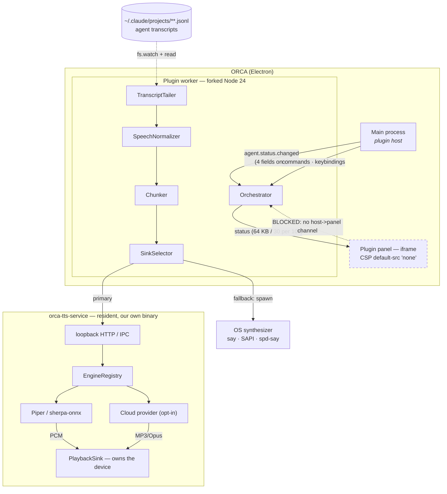
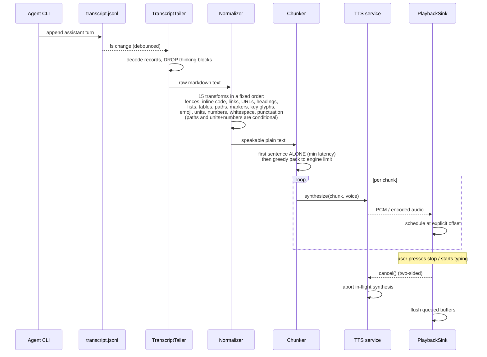
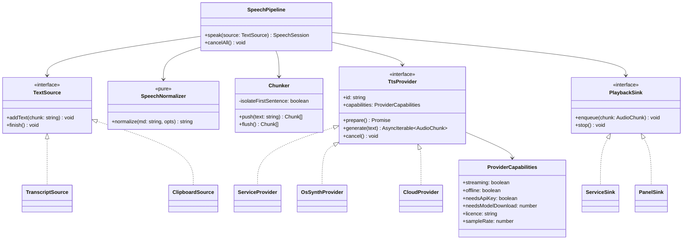
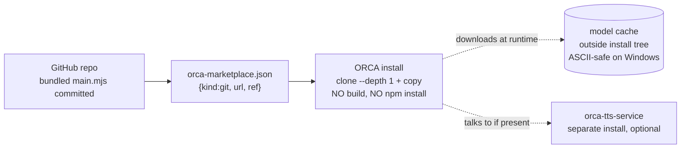

# Architecture — ORCA TTS plugin

**Status:** design, ratified by D001 on 2026-08-20. **No code exists yet.**
Every constraint below is MEASURED — see `docs/.research/orca-empirical-findings.md`.

---

## 1. Component relationships (runtime)



**Read as:** the plugin worker is the *brain* and owns no audio. The service is the *voice*. The OS
synthesizer is the *floor* that guarantees we never fail silently. The panel is currently a
display only — the dashed edge is the one missing upstream primitive.

---

## 2. Why the audio does not live where you would expect

```
                 can synthesize?   can play PCM?   can reach text?   verdict
                 ---------------   -------------   ---------------   -------
 Plugin panel         YES (1)        YES (2)            NO (3)       excellent speaker,
                                                                     no wire to it
 Plugin worker        NO  (4)        NO  (5)            YES          brain, not voice
 Resident service     YES            YES                via worker   where audio belongs

 (1) speechSynthesis: 180 voices, start->boundary->end fires. MEASURED.
 (2) AudioBufferSourceNode: 4 ms drift, 2 ms stop, decodes MP3/Opus/AAC/WAV. MEASURED.
 (3) no host->panel push; connect-src 'none'; bridge is panel->host only. MEASURED.
 (4) cannot load a .node addon from a bundled main.mjs; 50 MB / 2000-file cap.
 (5) no maintained instant-stop Node audio sink; afplay refuses stdin (~970 ms gaps).
```

---

## 3. Data flow — huddle mode (agent reply spoken aloud)



**The two-sided cancel is the point.** Killing only the player leaves the synthesizer producing
speech for text the user already interrupted.

---

## 4. Class design (worker side)



`PanelSink` is written but unreachable until upstream PR #1. That is deliberate: the day the
channel lands, it is a sink swap, not a rewrite.

---

## 5. Degradation ladder — how "never fail silently" is actually true

```
  service warm + model ready ──▶ Piper via service        52-65 ms/sentence   BEST
            │ service cold
            ▼
  service warm-up in progress ─▶ OS synthesizer            ~414 ms spawn      GOOD
            │ service absent / not installed
            ▼
  no service at all ───────────▶ OS synthesizer            ~414 ms spawn      OK
            │ OS synth missing (rare Linux)
            ▼
  nothing available ───────────▶ visible error + log       silent = bug       FLOOR
```

Windows arm64 has no sherpa build (PITFALLS P7), so it lives permanently on rung 2 and the UI
must say why.

---

## 6. Install topology



Hard caps: **2,000 files, 50 MB.** A neural voice does not fit — models download at runtime into a
cache outside the content-hash-verified install tree, mirroring ORCA's own STT model manager.

---

## 7. What is blocked, and on what

| Capability | Blocked by | Unblocked by | Interim |
|---|---|---|---|
| Panel plays audio | no host→panel channel | upstream PR #1 | service owns playback |
| Reliable session correlation | `paneKey` has no session id | upstream PR #2 | `worktreeId` path heuristic |
| Speak real editor selection | no `selection:read` | upstream PR #3 | clipboard + last-reply |
| Agents beyond claude/codex/grok/omp | no transcript decoders | upstream | unsupported, stated in docs |
| Windows arm64 neural voice | no sherpa build | upstream sherpa | OS synthesizer |
