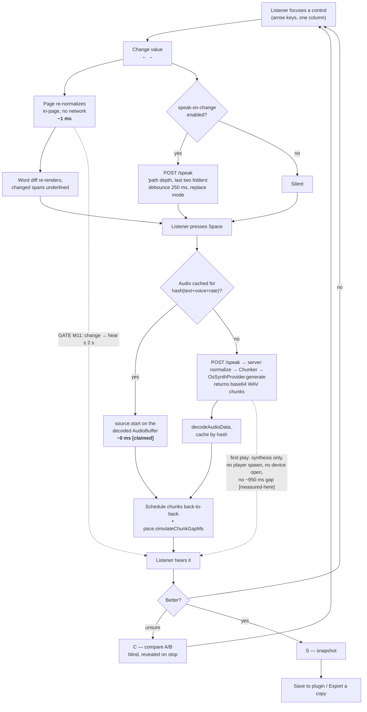

# 004 — Voice Lab

**Status:** design, implementable. **Milestone:** M11 (`docs/TASKS.md` "Phase M11", T110–T114).
**Written:** 2026-08-21. **Author-facing gate:** *change a control, hear the difference in under
two seconds, without touching ORCA* (`docs/TASKS.md:292`).

**Why this exists.** PITFALLS P23: tuning speech by ear over a chat loop does not converge. Every
remaining quality question in this project is taste, and taste settles only by hearing the same
sample repeatedly. This document designs the instrument that lets the listener settle it, and
deliberately does **not** settle it for them.

**Scope change since the milestone was written.** Q35 resolved negative — ORCA's settings
capability renders nothing at all, so there is no host settings form to target. The Voice Lab is
therefore also the settings UI, and its export format is the settings format. M11 and M12 fuse at
the schema. That raises the bar on "The export format" below from convenience to contract.

> **Amended 2026-08-21 — round-3 reconciliation.** Findings from `docs/design/008-crossreview-round3.md`,
> `docs/design/007-user-stories.md` §30 and `docs/design/006-fma.md` §15b were resolved **in this
> document, in place**. Every amendment carries a dated note naming the finding that forced it.
> Ledger of what changed and what was deferred: `docs/design/009-reconciliation.md`.

> **Amended 2026-08-21 — the latency measurement pass** (`docs/.research/latency-measurements.md`,
> `pnpm bench:latency`). **The Q20 verdict below is unchanged and is now measured rather than
> asserted**, but two things it said are wrong and are corrected in place: the inter-chunk gap is the
> **audio device**, not the process spawn (finding 1 / PITFALLS **P32**), and section 9's cold-path
> gate budget was costed against `say ""`'s 414 ms spawn when a real sentence through `generate()`
> costs **p50 1,054–1,163 ms**. Every latency number in this document now carries an R006 label.
> Row 34's `970` preset, which shipped as *"(v1 macOS, measured)"* against a third-party changelog,
> now carries the real citation and run count.

---

## 1. What the lab is, in one paragraph

`pnpm voice-lab` starts a Node server bound to `127.0.0.1` (T111a) that imports the **TypeScript
source** of `normalize()` and the real `OsSynthProvider`, and serves one self-contained HTML page
with no CDN and no build step. The page holds a fixture, a control surface of 46 controls, and a
Play button. Changing a control re-normalizes instantly in the page's own memory, and re-synthesis
is a single POST that returns WAV bytes the browser plays and caches. Nothing about ORCA is
involved, and nothing about the neural engine is required (Q25 resolved: the OS synthesizer settles
these decisions; M11 does not wait for M9).

> **Build hazard — CLOSED. Amended 2026-08-21 (round 3 reconciliation), forced by E-08.** This
> paragraph asserted that `packages/core/dist/` is tracked and stale, and instructed the
> implementer to delete it from the index before T111. `git ls-files packages/core/dist` returns
> **zero files**; it was already untracked when this document was written. The instruction was a
> no-op and is withdrawn. **The rule it was protecting still holds and is not withdrawn:**
> `scripts/voice-lab.mjs` imports the **TypeScript source** of `@orca-tts/core`, never a build
> output, or the lab tunes a normalizer that is not the one that ships. Enforce it mechanically —
> a test that asserts the lab's resolved module path contains `/src/` — rather than as an
> instruction to a human, which is what X6 of `docs/design/006-fma.md` flagged.

---

## 2. Q20 — who plays the audio

**Verdict: the BROWSER plays. The server synthesizes and returns bytes; it never spawns a player.**

### The argument against server playback

| Cost | Measured | Label | Evidence |
|---|---|---|---|
| **One audio-device open per chunk**, giving a ~950 ms inter-sentence gap on macOS | p50 950 / 937 / 897 ms, n=18 per run, three runs | `[measured-here]` | `docs/.research/latency-measurements.md` 1.1; `packages/plugin/src/sinks/subprocess-sink.ts:8-10` |
| …of which the **player process spawn** is | 2.3 / 2.9 ms, n=12 per run — **0.25 % of the gap** | `[measured-here]` | `latency-measurements.md` 1.1, PITFALLS **P32** |
| Temp-dir round trip per chunk: `mkdtemp` → `writeFile` → spawn → `rm` | 0.33 / 0.42 ms, n=20 — **0.03 % of the gap** | `[measured-here]` | `sinks/subprocess-sink.ts:52-61`; `latency-measurements.md` 1.1 |
| Every replay re-pays synthesis: a **real sentence** through `OsSynthProvider.generate()` | p50 1,163 / 1,054 ms, n=9 per run | `[measured-here]` | `latency-measurements.md` 1.3 (`say ""` alone is 414 ms, PITFALLS P10) |
| `listVoices()` per call on macOS | p50 487 / 472 ms, p95 591 / 547 ms, n=6 per run | `[measured-here]` | `latency-measurements.md` 1.6, revising P28's ~450 ms upward |

> **Amended 2026-08-21, forced by finding 1 of `latency-measurements.md`.** The first row previously
> read *"One player process per chunk"* and cited the sink's own header for it. **The mechanism was
> wrong.** Decomposed, ~893 ms of the 950 (99.7 %) is CoreAudio device open, pre-roll, post-roll and
> teardown. This does not weaken the Q20 verdict — it **strengthens** it, because the browser path
> removes a device open per chunk, which is the whole cost, rather than a process spawn, which is
> 2 ms. It does change what M9 has to do: hold the **device** open, not the process (P32).
| It builds a second playback path the plugin does not use, contradicting R5.2 / constitution R023 — providers emit audio and never own playback (`packages/core/src/types/index.ts:33-38`) | — |

A four-sentence fixture replayed server-side is four device opens: roughly 4 × 950 ms of gap
`[derived]` from the p50 above, on top of ~1.1 s of synthesis per sentence `[measured-here]`, every
single time the listener presses Play. That does not meet a two-second gate on the
*first* play and cannot meet it on a replay at all, because there is nothing to replay from.

### The argument for browser playback

The provider already yields a `wav` buffer, not an OS-specific stream:

- `packages/providers/src/os-synth/index.ts:338` — `yield { data, format: 'wav', sampleRate: …, channels: 1 }`
- `packages/providers/src/os-synth/index.ts:352` — the darwin command forces
  `--data-format=LEI16@22050` with the comment *"WAV, never the default AIFF: decodeAudioData
  rejects AIFF-C (measured, E6e)"*.

That comment is the point: **the browser path was already anticipated in our own provider.** The
bytes on the wire are already `decodeAudioData`-shaped. So:

- `POST /speak {text, options}` → server runs `normalize()` → `Chunker` → `provider.generate()` and
  returns a JSON envelope of base64 WAV chunks. No player is spawned anywhere.
- The page decodes each chunk once into an `AudioBuffer`, keyed by
  `hash(chunkText + voice + rate)`, and schedules them back-to-back on one `AudioContext` — which
  also removes the ~950 ms gap from the lab `[measured-here]` — one `AudioContext` stays open for
  the whole session, so the device is opened once rather than once per chunk.
- **Replay is a cache hit: `source.start()` on an already-decoded buffer, ~0 ms `[claimed]`** — no
  probe has run; this is reasoning about `source.start()`. Scrubbing,
  looping one sentence, and instant A/B all fall out of the same cache for free.

**One code path is still preserved where it matters.** The shared path with the plugin is
*normalize → chunk → synthesize* — the whole decision surface this lab exists to tune. Playback is
precisely the layer the constitution says providers must not own, and the layer M9 is going to
rewrite anyway. Sharing it would share the part that is scheduled for demolition.

### Does a Swift sidecar change this verdict? No — it strengthens it

`AVSpeechSynthesizer.write(_:toBufferCallback:)` was MEASURED yielding 55,050 PCM frames headless,
with no process spawn and no audio device touched (`q-round1-platform.md` "Unused capabilities" 1).
That removes the 414 ms `say` spawn `[measured-here]` (5 runs, PITFALLS P10) and the temp-WAV round
trip from the *synthesis* side of the ledger. **It does not remove the synthesis itself, and that is
now the larger term:** a real sentence through `generate()` is p50 1,054–1,163 ms `[measured-here]`,
so roughly 640–750 ms `[derived]` is the engine, not the spawn. The sidecar drives the same
`AVSpeechSynthesizer` voices, so whether it starts *emitting* sooner is a streaming question, not an
engine-speed one — that is exactly what `010`'s SPIKE-1 measures, and it is now the probe this
document's cold-path budget depends on too. It changes nothing on the *playback* side, because the sidecar's output is
`AVAudioPCMBuffer` — which is more Web-Audio-native than WAV, not less: raw interleaved PCM goes
straight into an `AudioBuffer` with no `decodeAudioData` step at all.

So the sidecar makes the cold path faster and leaves the warm path exactly where it is. **The one
requirement it places on M11**: the lab's audio layer must accept any chunk the provider
contract allows — today `'wav'` (`providers/src/os-synth/index.ts:338`), tomorrow `'pcm-s16le'`
(`core/src/types/index.ts:3-10` declares `format` at `:7`, provider-chosen). Branch on
`chunk.format`, do not assume WAV. That is a ten-line precaution now instead of a rewrite later.

### Consequence, stated rather than hidden

The lab does not reproduce v1's ~950 ms inter-chunk gap, so **pacing controls are tuned against a
floor that does not exist in the shipped plugin**. Mitigation: control `pace.simulateChunkGapMs`
(row 34 below), default `0`, with presets `0` (M9 target) and `950` (v1 macOS, `[measured-here]`:
p50 950 / 937 / 897 ms, n=18 per run over three runs, `docs/.research/latency-measurements.md` 1.1).

> **Amended 2026-08-21, forced by finding E-05 and the R006 label sweep.** The preset was `970`,
> carrying the label *"(v1 macOS, **measured**)"*, which nothing in this repo supported: 970 came
> from the `speak11` changelog — a third-party measurement of someone else's player — and lost its
> `[measured-third-party]` label in transit through the sink's header, where it was then re-invented
> as a local measurement. It has since turned out to be right to within 2–8 % of our own p50, which
> is luck rather than evidence. The preset now carries the number measured on **our** sink, with its
> run count and its source. This was the only place in the repository where a label was not merely
> dropped but **upgraded**, and it shipped as a slider a listener would tune against.

The
listener can hear either world. This is the same "engine-provisional" tagging Q25's resolution
already requires.

### Failure modes — there are **three** provider outcomes, not two

> **Amended 2026-08-21 (round 3 reconciliation), forced by X-10.** This section previously named
> one failure mode, and it does not fire on the most common Linux desktop. **On the stock Ubuntu
> `spd-say` rung the provider speaks out loud and yields no bytes at all**, so the browser-plays
> architecture receives an empty chunk array, the `503` never fires, the AudioBuffer cache has
> nothing to cache, and the A/B compare, the per-stage play, the 0 ms replay and the two-second
> gate all silently do nothing **while the room fills with speech the page cannot stop, scrub or
> repeat**. The lab appears to work and is silent — on the exact machine PITFALLS P25 exists for.
> R016 says a limitation is named in the body of the document, and this one was absent from the
> section that decides the architecture (C-07).

| Outcome | What the provider does | What the lab does |
|---|---|---|
| **bytes** | yields audio chunks (`os-synth/index.ts:338`; every rung except the one below) | decode, cache, play in the browser — the design above |
| **throw** | `provider.generate()` throws, or the platform has no synthesizer at all | `POST /speak` returns **`503`** with the provider's error text, and the page **says so aloud and in text**. Never a silent dead Play button (constitution: never fail silently; PITFALLS P18) |
| **spoke-elsewhere** | `packages/providers/src/os-synth/index.ts:321`: the backend is not in `LINUX_WAV_BACKENDS` (`:146`), so `#speakDirect()` (`:407`) hands the text to speech-dispatcher, **the daemon speaks it, and nothing is yielded** | a **named state**, below |

**The `spoke-elsewhere` state is a capability read, not a guess.** The provider already knows which
rung it is on — `get linuxBackend()` (`os-synth/index.ts:226`) — so `POST /speak` returns
`200 { played: 'elsewhere', backend: 'spd-say' }` before synthesizing, and the page:

1. **says it aloud, through the same daemon that will speak everything else**, because that is the
   only audio channel that works on this machine:
   > *"This machine's speech service played that. The lab cannot replay, compare or scrub it.
   > Install espeak-ng to use the lab: `sudo apt install espeak-ng`."*
   The install hint is the one already written at `os-synth/index.ts:148`
   (`LINUX_INSTALL_HINT`, used at `:160`, `:267`) — not a second copy of it.
2. **disables, with the reason attached and never hides**, the four affordances that depend on
   owning the bytes: Compare (A/B), replay, per-stage play, and the cold/warm timing readout. A
   disabled control with a stated reason is 003 §5's rule; a control that silently does nothing is
   PITFALLS P18.
3. **keeps everything that does not depend on playback**: the written-vs-spoken pane, the word
   diff, the stage ladder, the export. Tuning *what the words are* still works on this rung. Only
   tuning *how they sound* does not.

**Stated plainly, because R016 requires it and because the alternative is discovering it in use:
the M11 gate — "change a control, hear the difference in under two seconds" — is NOT satisfiable
on the stock-Ubuntu `spd-say` rung.** R013 says a feature that degrades on one OS is not done. The
honest remedy is the install hint, and the honest statement is that the lab's *audio* half has a
platform prerequisite that the plugin's audio half does not.

**Verify by effect.** Force `linuxBackend` to `spd-say` and assert `POST /speak` returns the
`spoke-elsewhere` envelope, that the page renders the four controls disabled, and that the
announcement was **spoken**, asserted on the daemon call and not on a log line. Run the same probe
with `espeak-ng` present and assert the controls are **enabled** — without that half, the test
cannot fail for the right reason.

---

## 3. Q21 — A/B, labelled or blind

**Verdict: blind while it plays, revealed the instant it stops. No extra click, no extra reading.**

The listener is one person tuning their own tool, not a research subject — so ceremony that costs a
click per trial is worse than the bias it removes. But the bias is real and cheap to remove: knowing
"this is the one I just changed" is exactly the expectation effect that made the chat loop fail.

Design:

1. `A` and `B` hold two full control sets. Pressing **Compare** plays A, the `control.compare`
   separator (300 ms — `005` §11.1b, the one deliberate exception to the control band's 150 ms,
   because a separator has to read as a gap), then B.
2. During playback the page shows only "first" and "second" — never which set.
3. On stop, the page speaks and shows *"first was your current set; second was path depth, last two folders"* — the **single differing control** is named, not the whole set.
4. **Keep first / keep second** — one key each (`1` / `2`). The chosen set becomes current.
5. Optional **Blind × 3** for a control the listener does not trust themselves on: the order is shuffled per trial, three trials, and the page reports "you chose the second set 3 of 3 times" before revealing. This is opt-in, one keystroke, and never the default.

---

## 4. Q23 — pipeline intermediates, and Q24 — diff granularity

**Q23 verdict: progressive disclosure. Written-vs-spoken is the default and only view; the stage
ladder is one keystroke (`E`, "explain") away and is never on screen unless asked for.**

**Correct the count first.** There are **15** transforms in `normalize()`
(`packages/core/src/normalizer/index.ts:96-109`), not 12. Three different counts exist in the repo —
`000-open-questions.md` Q23 says 12, and the in-file banner
comments are misnumbered (`index.ts:477` labels the number stages "stage 10"; `index.ts:618` labels
`collapseWhitespace` "stage 11" while sitting below `tidyPunctuation` at `:607`). `docs/architecture.md:95`
now correctly says 15 — that half of the disagreement is already closed. **Fix these before the lab
renders a stage ladder**, or the UI will disagree with the source it is displaying.

The stage view, when opened, is a vertical ladder of 15 rows. Each row shows only the text that
**that stage changed**, not the whole document — a stage that changed nothing renders as one dim
line, "no change". Every row is independently playable, so "why does this line sound wrong" is
answered by playing the stage before and the stage after.

**Q24 verdict: word-level diff, stage-attributed.**

- Character-level is noise for a dyslexic reader: `session_handler.py` → `session handler, python` diffs into a dozen fragments that carry no meaning.
- Word-level with no attribution tells you *what* changed and leaves you guessing *which control to turn*.
- **Word-level, each changed span carrying the stage that produced it**, turns a diff into a control: hover or focus a changed span and the page names the stage *and the control that governs it*, with a key to jump straight to that control. Spans from unconfigurable stages say so ("stage 9, `stripMarkdownMarkers` — fixed by design").

Every word span in the spoken pane carries `data-start` / `data-end` — its character offsets into
the spoken string — not merely a diff class. That costs two attributes today and is what makes a
live word cursor a later *display* change rather than a later rewrite (section 6a).

Attribution is computed server-side by running the 15 stages incrementally and recording each
stage's output; `POST /normalize` returns `{spoken, stages: [{n, name, text, controlIds}]}`.
The page computes the word diff locally. There is no diff library — a longest-common-subsequence
over whitespace-split tokens is ~40 lines and keeps the page CDN-free.

---

## 5. Q26 — does a session survive a reload

**Verdict: yes, and more than a reload.**

| Layer | Mechanism | Lifetime |
|---|---|---|
| Working set | `localStorage['voice-lab.current']`, written on every change (debounced 200 ms) | survives reload and restart |
| A/B slots | `localStorage['voice-lab.a']` / `.b` | same |
| Named snapshots | `localStorage['voice-lab.snapshots']`, listed by name, restorable by arrow keys | same |
| **Source of truth** | the exported JSON file on disk (section 7) | forever, and version-controllable |

A reload that loses ten minutes of ear-tuning re-creates the P23 failure in miniature. Autosave is
not a feature here, it is the same lesson. `localStorage` may throw or come back empty; every read
and write is wrapped and the page renders correctly from defaults when it does.

---

## 6. The control surface

46 controls, six panels (omissions 7 · structure 7 · names and paths 9 · numbers 4 · voice and pacing 9 · interruptions and announcements 10 — row 46 is new; see B-05). Each panel opens with a **Common** tier of two to four controls; the rest
are behind **More** (`M`) on that panel. Nothing is displayed as a grid; one column, one control per
row, full width (section 8).

**Tag column:** `EI` engine-independent — the decision transfers to any engine. `EP`
engine-provisional — M9 or another platform may invalidate the chosen value; the export records
which provider and platform it was tuned on. `PP` pacing-provisional — judged today against a floor
that changes (section 2).

### Panel A — What gets left out, and how you are told

The single strongest listening lesson in the project is applied inconsistently today: code blocks
get a lead-in (H1) and URLs get a destination (H2), while **emoji vanish with no signal at all**
(H18). Same class of loss, opposite treatment. This panel is where that gets settled.

| # | Control | Type | Legal values | Today | Tier | Feeds | `path:line` | Tag |
|---|---|---|---|---|---|---|---|---|
| 1 | `omit.codeBlocks` | select | `announce` · `drop` | `announce` | Common | stage 1 `stripFencedCode` | `core/src/normalizer/index.ts:96,122` | EI |
| 2 | `omit.codeBlockPhrase` | text (template: `{lang}` `{lines}`) | any string ≤ 120 chars | `" . Here, a code block is omitted. "` | Common | stage 1 | `index.ts:88` | EI |
| 3 | `omit.codeBlockDetail` | multi-toggle | `language` · `lineCount` | neither | More | stage 1 (fills the template) | `index.ts:122-144` (new capture) | EI |
| 4 | `omit.inlineCode` | select | `strip` · `verbatim` · `announce` | `strip` | More | stage 2 `stripInlineCode` | `index.ts:148` | EI |
| 5 | `omit.urls` | select | `host-phrase` · `host-and-path` · `label-only` · `drop-silent` | `host-phrase` | Common | stage 4 `stripUrls` | `index.ts:197` | EI |
| 6 | `omit.urlPhrase` | text (template: `{host}` `{path}`) | any string ≤ 120 chars | `"a link to {host}"` | More | stage 4 | `index.ts:187-192` | EI |
| 7 | `omit.emoji` | select | `silent` · `announce-count` · `name` | `silent` | Common | stage 11 `stripEmoji` | `index.ts:467-475` | EI |

### Panel B — How structure is spoken

| # | Control | Type | Legal values | Today | Tier | Feeds | `path:line` | Tag |
|---|---|---|---|---|---|---|---|---|
| 8 | `struct.headingCue` | select | `none` · `level-word` ("section", "subsection") · `prefix-word` · `pause-only` | `none` — all six levels collapse | Common | stage 5 `headingsToPauses` | `index.ts:233-242` | EI |
| 9 | `struct.headingPauseMs` | slider | 0–1500 ms, step 50 — **milliseconds, never "comma vs full stop"** (6a) | 0; a heading becomes a plain sentence and the pause is whatever the engine gives a full stop | More | stage 5 → pause token | `index.ts:233` (the pause point is `endWithStop` at `:240`) | **EP** |
| 10 | `struct.orderedLists` | select | `numeral` ("1, alpha" → heard as "one, alpha") · `word` ("first, alpha") · `drop` (v1) | **`numeral`** — **not** `drop`; verified by effect, `normalize("1. alpha\n2. beta")` returns `"one, alpha. two, beta."` | Common | stage 6 `listItemsToSentences` | `index.ts:272-282`; the option at `normalizer/index.ts:20,50` | EI |
| 11 | `struct.bulletMarker` | select | `drop` · `say-item` | `drop` | More | stage 6 | `index.ts:263` (marker detection) · `:278` (drop) | EI |
| 12 | `struct.tableLeadIn` | text | any string ≤ 60 chars | `"Table."` | More | stage 7 `tablesToRows` | `index.ts:311` | EI |
| 13 | `struct.tableHeaderRepeat` | select | `every-cell` · `row-start` · `first-row-only` · `never` | `every-cell` | Common | stage 7 | `index.ts:321` | EI |
| 14 | `struct.tableFirstCellHeader` | toggle | on · off | off — first cell is spoken bare | More | stage 7 | `index.ts:315,323` | EI |

> **Amended 2026-08-21 (round 3 reconciliation), forced by X-07.** Row 10 was written as *"the one
> item in this document I would call a comprehension bug"* on the premise that today's behaviour is
> `drop`. **It is not, and was not when this was written.** Commit `5cab7eb` changed the default to
> `'numeral'`; verified by effect, `normalize("1. alpha\n2. beta")` returns
> `"one, alpha. two, beta."`. The legal values are `'numeral' | 'word' | 'drop'`
> (`normalizer/index.ts:20`), not this document's `drop · number · ordinal`, and the option is
> spelled **`orderedLists`**, plural. The row is corrected above; the comprehension bug is closed.

The option space still belongs here — the default is still the listener's, and `drop` remains
reachable for anyone who wants v1's behaviour back. What changed is that the *shipped* default is
already the comprehensible one, so the lab is choosing between three good answers rather than
rescuing a bad one.

### Panel C — How names, paths and identifiers are spoken

Q39 and Q41 live here. **The option spaces below are the deliverable; Q40 and Q42 — which option is
the default — are the listener's, and are deliberately left unset.**

| # | Control | Type | Legal values | Today | Tier | Feeds | `path:line` | Tag |
|---|---|---|---|---|---|---|---|---|
| 15 | `path.style` | select | `spoken` · `terse` · `verbatim` | `spoken` | Common | stage 8 `speakFilePaths` | `index.ts:93,348` | EI |
| 16 | `path.extensionStyle` | select | `word-last` · `word-first` · `raw-last` · `omit` | `word-last` | Common | stage 8 | `index.ts:103` (read at the call site) `,388-397` | EI |
| 17 | `path.namePhrase` | text (template `{name}`) | ≤ 60 chars | `"file named {name}"` | More | stage 8 | `index.ts:386-396` (the folder phrase is built at `:381`) | EI |
| 18 | `path.folderPhrase` | text (template `{folders}`) | ≤ 60 chars | `"in folder {folders}"` | More | stage 8 | `index.ts:386-396` (the folder phrase is built at `:381`) | EI |
| **19** | **`path.depthPolicy`** — **Q41's option space** | select | `full` · `last-n` · `first-n` · `filename-only` · `filename-then-location` · `elide-middle` ("packages, then two folders, then normalizer") | `full`, unlimited | Common | stage 8 | `index.ts:371-374` | EI |
| 20 | `path.depthN` | slider | 1–8 | n/a — no limit exists | Common | stage 8 | `index.ts:371-374` | EI |
| 21 | `path.extensionWords` | key/value editor | 32 rows today; add/remove/edit | fixed table; unknown suffixes fall to `"dot xyz"` (`index.ts:380`) | More | stage 8 | `index.ts:55-62` | EI |
| **22** | **`ident.style`** — **Q39's option space** | select | `verbatim` · `underscore-pause` (`_flush_buffer` → "flush, buffer") · `split-words` ("flush buffer") · `split-and-announce` ("the function flush buffer") · `spell-leading-underscore` ("underscore flush buffer") | `verbatim` — `_flush_buffer()` is spoken raw | Common | stages 2 + 9 | `index.ts:148,425` | EI |
| 23 | `ident.parens` | select | `keep` · `drop` · `say-call` ("a call to") | `keep` | More | stages 2 + 9 | `index.ts:425` | EI |

Row 22 must not fight stage 9. `stripMarkdownMarkers` deliberately preserves dunders and leading
underscores (`index.ts:425`, the M2 anti-goal gate); `ident.style` is the *only* place that decides
what an underscore sounds like, and stage 9 keeps them intact so that it can.

### Panel D — Numbers and units

| # | Control | Type | Legal values | Today | Tier | Feeds | `path:line` | Tag |
|---|---|---|---|---|---|---|---|---|
| 24 | `num.expandIntegers` | toggle | on · off | on | Common | stage 13 `expandNumbers` | `index.ts:94,107,518` | EI |
| 25 | `num.expandUnits` | toggle | on · off | on | Common | stage 12 `expandUnits` | `index.ts:107,561` | EI |
| 26 | `num.unitWords` | key/value editor | 11 rows today | fixed table | More | stage 12 | `index.ts:65-77` | EI |
| 27 | `num.decimals` | select | `engine` · `words` | `engine` — `3.14` handed through | More | stage 13 | `index.ts:540-546` | **EP** |

Rows 24 and 25 are **the fix for H16**: today one flag (`expandNumbers`) gates both behaviours
(`index.ts:107`), so a listener who wants "fifty two milliseconds" but numeral-shaped counts cannot
have it. The lab splits them, and the split must land in the schema **before M12 freezes it**.

### Panel E — Voice and pacing

> **Amended 2026-08-21 (round 3 reconciliation), forced by X-07.** This panel's preamble asserted
> **H24** — *"`SpeechService` calls `provider.generate(chunk.text)` with no options at all"*, called
> *"the single largest gap found in the audit"* — as a current defect. **It was already fixed when
> this document was written.** Commit `6b776d4` landed the wire; `speech-service.ts:257` reads
> `this.#deps.provider.generate(chunk.text, this.#synthesizeOptions())`, built by `#synthesizeOptions()` at `:232` from
> `SpeechServiceDeps.voice` and `.rate` (`:57-58`). PITFALLS **P26** records the fix *and* the
> reachability test that pins it. Two more claims in this panel were stale in the same way and are
> corrected in place: row 29's *"Linux drops it entirely"* and row 33's *"never forwarded"*. Three
> "Today" columns asserting defects that no longer exist is the P0 failure arriving through the
> front door — a reader who follows the citation cannot tell a stale pointer from a fabricated one.

This panel exists because voice and rate are **the two settings every user asks for first**, and
until commit `6b776d4` no caller could reach them (H24, now closed — see the note above). The wire
exists; **what does not exist is a way for the listener to choose the values**, and that is what
M11 is for. `SynthesizeOptions.voice` and `.rate` (`packages/core/src/types/index.ts:26-31`) are
implemented by `OsSynthProvider` on all three platforms (`providers/src/os-synth/index.ts:346-372`
for darwin and win32; the Linux branch is `linuxCommand()`, `:175`) and are now forwarded by
`SpeechService`. The remaining gap is the **UI**, not the wire.

> **The durable fix for this whole class, applied from here on.** Cite a **symbol name plus the
> line**, not a bare line number, and re-derive against `HEAD` rather than inheriting from a
> research round. A `scripts/check-citations.mjs` that greps every `path:line` out of `docs/` and
> asserts the line still contains the expected token is ~40 lines and **could actually fail** —
> which is more than can be said for a convention.

| # | Control | Type | Legal values | Today | Tier | Feeds | `path:line` | Tag |
|---|---|---|---|---|---|---|---|---|
| 28 | `voice.id` | select | populated at runtime from `provider.listVoices()` — never a hard-coded name | **reachable, unset** — the wire landed in `6b776d4`; nothing chooses a value yet | Common | `SynthesizeOptions.voice` | `speech-service.ts:257`; `os-synth/index.ts:351` (darwin `-v`), `:365` (win32 `SelectVoice`), `:175` `linuxCommand` (linux) | **EP** |
| 29 | `voice.rate` | slider | 0.5–2.0, step 0.05 | **reachable, unset, and honoured on all three** — Linux no longer drops it (`5cab7eb`/`6b776d4`) | Common | `SynthesizeOptions.rate` | `os-synth/index.ts:366` (win32 `$s.Rate`); darwin `-r` and the Linux `-r`/`-s` are in `#command()` `:346-372` and `linuxCommand` `:175` | **EP** |
| 30 | `voice.pitch` | slider | −50…+50, `engine` default | no field exists | More | needs `[[pbas]]` / SSML `<prosody>` / `-p` | `q-round1-platform.md` Q33 | **EP** |
| 31 | `voice.volume` | slider | 0–100 | no field exists | More | `[[volm]]` / `Volume` / `-a` | `q-round1-platform.md` Q33 | **EP** |
| 32 | `pace.chunkMaxUnits` | slider | 40–600, step 20 | 200 | Common | `ChunkerOptions.maxUnits` | `core/src/chunker/index.ts:53` | **PP** |
| 33 | `pace.isolateFirstSentence` | toggle | on · off | `true`, **and forwarded** — `speech-service.ts:245-246` passes it alongside `maxUnits` (`6b776d4`) | More | `ChunkerOptions.isolateFirstSentence` | `chunker/index.ts:66`; `speech-service.ts:245-246` | **PP** |
| 34 | `pace.simulateChunkGapMs` | slider | 0–1500; presets `0` (M9 target), `950` (v1 macOS, `[measured-here]` — p50 950/937/897 ms, n=18 ×3, `docs/.research/latency-measurements.md` 1.1) | n/a — lab-only | Common | lab playback scheduler only | `sinks/subprocess-sink.ts:8-10` | **PP** |
| 35 | `pace.sentencePauseMs` | slider | 0–800 ms, step 25 | none — pauses come only from emitted punctuation | More | pause token → rendering stage (6a) | H39 | **EP** |
| 44 | `pace.pauseBackend` | select | `punctuation` (today, all platforms) · `ssml` (`<break time>`; macOS `AVSpeechUtterance`, Windows `SpeakSsml`, Linux `espeak-ng -m`) · `in-band` (macOS `[[slnc]]`, MEASURED) | `punctuation` — the only one implemented | Common | how rows 9 and 35 are encoded (6a) | `q-round1-platform.md` Q33 / "Unused capabilities" 3 | **EP** |

`voice.id` carries a specific trap. `say` accepts an unknown voice name, **exits 0, writes a
full-length WAV, and silently substitutes the fallback** — three different `-v` arguments produced
byte-identical audio (`q-round1-platform.md`, macOS silent-fallback hazard). That is PITFALLS P18's
exact shape. The lab must therefore populate this control **only** from `listVoices()`, never accept
free text, and verify a selection by effect the first time it is used: synthesize a two-word probe
under the chosen voice and under the platform default and compare the bytes. Identical bytes → the
lab says *"that voice did not take; the system substituted its default."* Cache the voice list; it
costs **p50 487 / 472 ms** per enumeration on macOS `[measured-here]` (n=6 per run, two runs,
`docs/.research/latency-measurements.md` 1.6 — worse than P28's ~450 ms, which strengthens the
requirement rather than changing it).

### Panel F — What interrupts what, and what gets announced

| # | Control | Type | Legal values | Today | Tier | Feeds | `path:line` | Tag |
|---|---|---|---|---|---|---|---|---|
| 36 | `queue.maxQueued` | slider | 1–20, **default 8** | **8** shipped at `main.ts:96`, while `DEFAULT_MAX_QUEUED = 20` at `speech-service.ts:74` — see the note below; **the one value is 8** | Common | `SpeechService` queue | `plugin/src/main.ts:96`; `speech-service.ts:74` | EI |
| 37 | `queue.overflowPolicy` | select | `drop-oldest` · `drop-newest` | `drop-oldest` (P22's third fault) | More | queue | `speech-service.ts:74,155-177` | EI |
| 38 | `announce.mode` | select | `replace` · `queue` | `replace` — status and toggle speech cuts off a reply in progress | Common | `speak(text, mode)` (P21) | `main.ts:121,134,148` | EI |
| 39 | `announce.sessionLabel` | select | `call-sign` · `call-sign-plus-name` · `registry-name` · `branch` · `displayName` — **no hex value exists** | last 3 path segments + 8 hex chars, which is the defect M15 exists to remove | Common | huddle session label | `plugin/src/huddle/index.ts:55-60`; the chain is `003` §6, the call-sign is `005` §11.2 | EI |
| 40 | `announce.sessionLabelHashChars` | slider | 0–8, **default 0** | 8 | More | same | `huddle/index.ts:55-60` | EI |
| 41 | `announce.switchPhrase` | text (template `{label}`) | ≤ 80 chars | `"Now reading from {label}."` | More | huddle switch | `huddle/index.ts:118-119` | EI |
| 42 | `announce.statusTemplate` | text | ≤ 160 chars | fixed order and phrasing | More | status command | `main.ts:124-136` | EI |
| 43 | `input.clipboardCap` | slider | 2,000–50,000 chars | 20,000 | More | clipboard read | `plugin/src/clipboard.ts:63` | EI |
| **46** | **`input.huddleReplyCap`** — **new, forced by B-05** | slider | 2,000–50,000 chars | **no cap exists at all**; `huddle/index.ts:179` speaks the whole reply, and the eight-reply queue cap cannot drop a single 40,000-character item | Common | huddle speak path | `plugin/src/huddle/index.ts:179`; the mechanism is `002` "The reply that does not fit" | EI |
| 45 | `interrupt.granularity` | select | `immediate` · `at-word` (finish the current word, then stop) · `pause-keeps-position` | `immediate` — `cancel()` is `SIGKILL` on the child | Common | barge-in / skip / stop | `providers/src/os-synth/index.ts` cancel path; `q-round1-platform.md` "Unused capabilities" 2 | **EP** |

> **Amended 2026-08-21 (round 3 reconciliation), forced by X-04, 007 C4 and 007 C7.** Two rows in
> this panel shipped a **correctness failure as a tunable**, and one shipped an option space that
> could express neither of the two designs that own the question.
>
> **Row 40 defaulted to 8 hex characters.** `003` §6 says *"never, under any circumstance, hex"* and
> `005` §11.2 calls the eight-character slice *"a non-answer to who is speaking"* and the reason
> M15 exists. Both treat it as **correctness**, not taste. A lab that ships a slider defaulting to
> the value two designs forbid invites the listener to select it. **The row is kept — 0 is a useful
> setting and removing the control would remove the only way to say "none" — but its default is now
> `0`, it moves to the More tier, and the lab speaks a one-time warning if it is ever set above 0.**
>
> **Row 39's option space is replaced.** It offered `path-tail-3-plus-hash` (the forbidden value)
> and `call-sign (word pair)` — which encodes `003`'s two-word call-sign, a shape that no longer
> exists: X-04 resolved the call-sign in favour of `005`'s **one word**, and `003` §6 is now the
> display-name chain that consumes it. It also had **no `registry-name` option at all**, which was
> `003`'s rank-1 recommendation and is `005`'s long form — so the listener could not hear either
> design's recommended default in the instrument built to choose defaults. The new space is the
> resolved chain: `call-sign · call-sign-plus-name · registry-name · branch · displayName`.
>
> **The listener still chooses. They simply cannot choose hex.** Which of the five is the default is
> taste and is left unset here, exactly as Q40 and Q42 are.

`"orca-plugin-tts, session 111693de"` is spoken aloud on every session switch, and eight hex
characters read to a dyslexic listener is close to the worst case the project has. Q28 asks the same
question from the other end, and `005` answers it.

**The queue cap, settled (007 C3).** Three values existed: `main.ts:96` ships `maxQueued: 8`,
`speech-service.ts:74` declares `DEFAULT_MAX_QUEUED = 20`, and `003` §8.7 reasoned against 20.
**The one value is 8.** It is what the listener has actually been living with, and twenty queued
replies is roughly three minutes of unrequested speech — the P22 experience with a cap on it rather
than a cure. `DEFAULT_MAX_QUEUED` must be changed to **8** so there is one constant and not two,
and `003` §8.7 now cites row 36 rather than restating a number. The slider's range stays 1–20
because a listener who wants a deeper queue may have one; the *default* is the thing that was
ambiguous.

**Row 46 exists because the queue cap cannot help.** `queue.maxQueued` counts **replies**, so a
single reply is never dropped by overflow however long it is. A 40,000-character reply is roughly
200 chunks, ~33 minutes of audio, and on v1 macOS another ~3 minutes of inter-chunk silence. buzz
caps at 8,096 characters and announces the truncation **aloud**; `003` §9 adoption 3 cites that and
adopts only the announcement. Row 46 is the cap. **Its existence is correctness and is settled in
`002`; only its number is taste and lives here**, next to `input.clipboardCap`, which is the
identical control for the other input.

### What is deliberately absent

The audit found 39 constants; 15 are **defensible as fixed** and are *not* controls: `KEY_GLYPHS`
(H5), the large-number cutoff (H13), `#42` as digits (H14), the empty-output threshold (H17), the
`ABBREVIATIONS` table (H21), overflow-notice coalescing (H23), sample rate (H27), spawn timeout
(H28), clipboard timeout (H30), watch window (H31), debounce (H32), remembered-id cap (H33), and
the ambiguity window (H34). A lab that exposes everything is not a lab, it is a config file with a
Play button. Each of these is shown in the stage view as "fixed by design" so the listener can see
that the decision was made, not overlooked.

**Bug, not a control — H25, and it is already fixed.**

> **Amended 2026-08-21 (round 3 reconciliation), forced by X-07.** This paragraph listed H25 —
> *"rate … silently dropped on Linux"* — as a live R1 parity defect to be fixed during M11.
> **It was closed before this document was written.** `linuxCommand()`
> (`packages/providers/src/os-synth/index.ts:175`, called at `:374`) pushes `-r` on the `spd-say`
> rung and `-s <wpm>` on the espeak rungs. `005` §2 said so in the same commit, so the two
> designs disagreed with each other about the same line of code. Nothing here needs fixing;
> row 29's "Today" column is corrected accordingly.

---

---

## 6a. Prosody, word boundaries, and pause — what M11 must not foreclose

Late empirical input (`q-round1-platform.md` "Unused capabilities") changes what a good instrument
looks like here. Four capabilities exist on all three platforms and are used on none of them. The
question for M11 is not "should we adopt them" — it is "does the M11 control surface survive their
arrival". Verdicts first:

| Capability | M11 verdict | Why |
|---|---|---|
| **SSML** (`<break>`, `<prosody>`, `<emphasis>`) | **Deferred to M12a, but the control surface is designed in its units today** | Emitting SSML changes `normalize()`'s output contract. Doing it inside M11 would make the milestone a normalizer rewrite. |
| **Word-boundary callbacks** → a live word cursor | **Deferred; not reachable from the code path we ship** | Requires a sidecar or a socket client, not a spawned CLI. But the lab's markup must make it a later addition, not a later rewrite. |
| **Pause/resume distinct from stop** | **In M11, as a transport control and one setting** | Free in the browser; the lab is exactly where we learn whether pause-at-word matters. |
| **PCM-from-sidecar** | **Not in M11; already accommodated** | See section 2. Branch on `chunk.format`. |

### SSML — the case, and what it costs

The team lead's argument is correct and is the strongest single point raised against my first draft.
The HANDOFF "what listening taught us" table is a list of *prosody* complaints — "omissions abrupt",
"table rows too quick", "headings become pauses". Today the normalizer fakes every one of those by
emitting punctuation and hoping the engine honours it: the code-block lead-in is given *its own
sentence* purely so the engine pauses either side of it (`core/src/normalizer/index.ts:86-88`, and
the comment says so). That is a pause expressed as a full stop — an on/off switch with no dial.
`<break time="500ms"/>` is the dial, MEASURED parsing correctly on macOS, and available on Windows
(`SpeakSsml`, also the only route to pitch there) and Linux (`espeak-ng -m --ssml-break`).

**What it costs, stated plainly, because it is not just a new control:**

1. **`normalize()` stops being plain text.** It is documented as pure, synchronous and
   dependency-free (`index.ts:1-13`), and its output is fed to `Chunker` (`speech-service.ts:243` → `:245-247`),
   which splits on `.` `!` `?` (`chunker/index.ts:37`). Emitting `<break/>` mid-sentence means the
   chunker must not split inside a tag and must not count markup toward `maxUnits`. That is a real
   change to two modules and their 94 tests, not an addition.
2. **Escaping becomes mandatory, in both directions.** Any `<` or `&` in an agent reply becomes
   malformed SSML. Windows already interpolates text into a PowerShell string escaped only for `'`
   (`providers/src/os-synth/index.ts:360-370`; `$s.Speak('…')` at `:368`), and macOS `say` does not take SSML at all — it takes
   the older in-band `[[...]]` commands, which means user text containing `[[` is a live injection
   today (MEASURED). See Q45.
3. **It fragments the provider contract.** `say` needs `[[slnc 500]]`, `AVSpeechUtterance` needs
   SSML, `espeak-ng` needs `-m`, `spd-say` needs `-x`, Windows needs `SpeakSsml` instead of `Speak`.
   Four renderings of one intent.

**Recommendation: adopt the intent now, defer the encoding.** `normalize()` gains an internal
**pause token** — one sentinel the pipeline emits with a millisecond value — and a final
**pause-rendering stage** converts it, per provider, to punctuation (today), SSML, or `[[slnc]]`.
The pipeline is written once against milliseconds; only the last stage learns new dialects. Two
consequences for this document, both already applied:

- Every pause control in section 6 is **denominated in milliseconds** (rows 9, 35), never as
  "comma vs full stop". A listener who picks 400 ms keeps that number when SSML lands; a listener
  who picked "a full stop" would have to re-tune from scratch.
- Row 44, `pace.pauseBackend`, makes the rendering audible and comparable *in the lab*, which is
  how we find out whether SSML is worth the cost before paying it in the plugin.

**Dependency, written as one:** M12a "pause primitive" — pause token in `normalize()`, chunker
tag-awareness, per-provider rendering, escaping contract (Q45). It blocks nothing in M11 and M11
blocks nothing of it. Until it lands, rows 9 and 35 render through the punctuation backend and are
tagged **EP**, exactly like `voice.rate`.

### The live word cursor — deferred, with one cheap non-foreclosure

For a dyslexic listener who is also watching the screen, a cursor moving word by word over the
spoken text is plausibly the most useful thing a display can do — nine words in, nine
`willSpeakRangeOfSpeechString` callbacks out, each with the exact `NSRange`, MEASURED headless.
It is also unreachable from what we ship: `OsSynthProvider` spawns a CLI and reads a finished WAV
(`os-synth/index.ts:310-345`; the `readFile` is at `:336`). There is no callback to subscribe to. Reaching it means the macOS
Swift sidecar, `SetOutputToAudioStream` + `SpeakProgress` on Windows, and the SSIP socket on Linux —
three new integrations, which is a milestone, not a task.

**M11 pays one cheap insurance premium instead.** The spoken pane already renders word-level spans
for the diff (section 4). Requirement: those spans carry **stable character offsets into the spoken
string** (`data-start`, `data-end`), not just their diff class. A word cursor then becomes "add a
class to the span whose range contains the callback's offset" — a display change, not a re-render of
the pipeline. Cost today: two attributes per span. Cost if omitted: rebuilding the pane.

**Dependency, written as one:** M13a "word cursor", after a streaming provider exists. It also
delivers precise resume after barge-in (Q19) rather than discard-or-restart.

### Pause as distinct from stop — this one is in M11

Today `cancel()` is `SIGKILL` on the child — a hard stop with no position. PITFALLS P22 is explicit
that "reading something you didn't ask for and can't stop" is the worst failure this project has;
*pause*, which keeps the position, is a different and cheaper affordance than *stop*, which loses
it. All three platforms have it (`pauseSpeaking(at: .word)` / `Pause()`/`Resume()` / SSIP
`PAUSE`), and macOS's `.word` boundary — finish the current word, then stop — is what a listener
actually means.

In the browser this is free: `AudioContext.suspend()` / `resume()`. So the lab gets pause as a
**transport key** (`p` pause/resume, alongside `s` stop — §4a) *and* as row 45,
`interrupt.granularity`, which is the setting the plugin will need once a provider can honour it.
The lab is the right place to discover whether "finish the word" is audibly better than "cut now",
because that is a taste question and this document does not answer taste questions.

---

## 7. The export format — which is now also the settings format

```jsonc
{
  "schemaVersion": 1,
  "kind": "orca-tts-settings",
  "provenance": {
    "tunedWith": "os-synth",          // provider id — an EP value tuned elsewhere is suspect
    "platform": "darwin",             // rate/voice do not port across these
    "voiceListHash": "sha256:…",      // detects "this voice no longer exists on this machine"
    "labVersion": "0.0.0",
    "tunedAt": "2026-08-21T00:00:00Z"
  },
  "normalize":  { "codeBlocks": "announce", "pathStyle": "spoken", "extensionStyle": "word-last",
                  "expandIntegers": true, "expandUnits": true,
                  "orderedLists": "numeral",       // X-07: the FIFTH NormalizeOptions field.
                                                   // It exists in the type and was absent here.
                  "pathDepthPolicy": "last-n", "pathDepthN": 2, "identStyle": "split-words" },
  "chunk":      { "maxUnits": 200, "isolateFirstSentence": true },
  "synthesize": { "voiceIndex": 3,                 // an INDEX into the host's runtime voice list,
                  "voiceNameChecksum": "Samantha", // never a name (P28, 005 section 9). The name
                  "rate": 1.0 },                   // travels only as a checksum.
  "runtime":    { "maxQueued": 8, "announceMode": "replace", "sessionLabel": "call-sign",
                  "sessionLabelHashChars": 0,      // C7: hex is not an option; 0 is the default
                  "huddleReplyCap": 8000 },        // B-05: the cap's EXISTENCE is correctness
  "phrases":    { "codeBlock": " . Here, a code block is omitted. ", "url": "a link to {host}",
                  "pathName": "file named {name}", "pathFolder": "in folder {folders}",
                  "tableLeadIn": "Table.", "switch": "Now reading from {label}." },
  "expected": [                        // T113's oracle — written by the lab, read by the test
    { "fixture": "paths.md", "spoken": "see file named index, typescript, …" }
  ]
}
```

> **Amended 2026-08-21 (round 3 reconciliation), forced by X-07 and 006 §15b X1.** Two fields were
> wrong in a schema this document calls *"a contract"*.
>
> **`orderedLists` was missing entirely.** `NormalizeOptions` has **five** fields
> (`core/src/normalizer/index.ts:22-52`); this block carried four. A field that exists in the type
> and not in the schema is exactly PITFALLS **P26**'s shape — *"a field that cannot be walked is not
> a setting, it is a comment"* — and this schema freezes at `schemaVersion: 1` before M12.
>
> **`"voice": "Samantha"` persisted a name.** `005` §9 and P28 both say the opposite: the three
> platforms share **no** voice name, `say -v NotAVoiceAtAll` exits 0 and emits the default voice's
> exact bytes, and Windows `SelectVoice` binds by case-sensitive substring. So a settings file
> naming a voice binds silently to something else on any other machine. It is now an **index**, with
> the name kept only as a **checksum** — index authoritative, name verified, mismatch discards the
> map. `provenance.voiceListHash` was already in this document doing half the job; this completes it.

**Four sections, because there are four consumers**, and this is the shape T124 must iterate:
`normalize` → `NormalizeOptions` (`core/src/normalizer/index.ts:22-52`), `chunk` →
`ChunkerOptions` (`core/src/chunker/index.ts:27-34`), `synthesize` → `SynthesizeOptions`
(`core/src/types/index.ts:26-31`), `runtime` + `phrases` → the plugin's own literals. T124 as
written iterates `NormalizeOptions` alone; that assertion would be green today while rate, voice and
chunk size stay unreachable — a check that could not have failed on the things most likely to be
wrong. **T124 must iterate this schema, not `NormalizeOptions`.**

**How the plugin consumes it.** `packages/core/src/settings/` (T120) owns the schema, the defaults
and a `parse(unknown): Settings` that falls back **per field** and returns the list of fields it
rejected (T123). The lab imports the same module — it does not re-declare the shape, and no
generator sits between them (this answers Q36 in favour of "the lab imports it"). The plugin reads
the JSON on activate and on change (T121); every default comes from the schema, never from a call
site (T122). Since Q35 killed the host settings form, the file's location is the contract: the
plugin reads `~/.orca/read-aloud/settings.json`, and the lab writes exactly that path when the
listener presses **Save to plugin** — with **Export a copy** as the separate, version-controllable
artifact.

### T113 — how the round-trip test proves the two agree

1. Fixtures are committed (T110), so the input is fixed.
2. The lab writes `expected[]` — one `{fixture, spoken}` pair per fixture, from the very text it
   just spoke, not re-derived.
3. The test loads the exported JSON, calls `parse()`, then `normalize(fixtureText, settings.normalize)`
   and asserts equality with `expected[].spoken`, per fixture.
4. **The negative control, without which step 3 is a ritual:** the test also mutates one field
   (`pathDepthN`) and asserts the comparison now **fails**. A round-trip test that cannot fail is
   not a test — it is a check that both sides read the same file.
5. Chunk boundaries are asserted too (`chunk` section), because chunking is what the listener
   actually heard, and a settings file that reproduces the words but not the pauses has not
   reproduced the experience.
6. T114 runs steps 1–5 headless on all three OSes. No audio, no provider, no `expected` for the
   `synthesize` section — those are EP by definition and cannot be asserted cross-platform.

---

## 8. Accessibility of the lab itself

The person operating this instrument is dyslexic and voice-first. A dense grid of small labelled
sliders is precisely the wrong instrument, and building one would repeat the project's own mistake
at the UI layer. Five rules, each with a mechanism.

**1. One column. One control per row. Full width.** No two-dimensional scanning, ever. A row is at
least 64 px tall with a hit target spanning the full row width. Panels are collapsed by default
except the one in focus.

**2. Keyboard is the primary interface, not an accommodation.**

> **Amended 2026-08-21 (round 3 reconciliation), forced by X-09 and 007 C1.** This table inverted
> the control pane's on four keys: `Space` meant *Play* here and *pause* there; *stop* was `.` here
> and `s` there; `R` meant *restore a snapshot* here and *replay audio* there; `M` meant *reveal
> more controls* here and *mute* there. For a listener who is not looking at the screen and is
> building muscle memory across both surfaces in the same hour, a control that **changes meaning**
> is worse than one that moves — and `003` §9 adoption 1 spends a CSS rule and an E2E test to
> prevent the lesser hazard.
>
> **The one table now lives in `docs/.discussion/003-panel-and-control-channel.md` §4a, and this
> document cites it rather than restating it.** The lab ships first, so the lab's habit is the one
> that forms — that argued for keeping the lab's bindings wholesale, and it is not what happened,
> for one reason: `s` for stop is the fastest press-to-silence route in the system and the one
> binding a listener must be able to hit without looking. So `s` won and the collisions moved.
> Where the lab's choice was not load-bearing — `Space`, `E`, `C`, `?`, the arrows — it was kept.

The bindings, reproduced here for reading convenience only — **§4a is the source, and it ships as
one map in `@orca-tts/core` consumed by both surfaces**:

| Key | Does | Changed? |
|---|---|---|
| `↑` `↓` | previous / next control (skips collapsed panels) | — |
| `←` `→` | change the focused control's value by one step | — |
| `Space` | **play / pause toggle** — starts the fixture, pauses it, resumes it | now a toggle, matching the TUI |
| `s` | **Stop** · `.` retained as an alias | **`s` is now primary**; `.` demoted to alias |
| `p` | pause / resume alias | **new**; `,` is retired |
| `R` | **replay** the last thing played | **was "restore a snapshot"** |
| `m` | **mute** the speak-on-change confirmations | **was `V`** |
| `K` / `L` | snapshot ("keep") / restore ("load") | **were `S` / `R`** |
| `+` / `-` | reveal / collapse that panel's More tier | **was `M`** |
| `Tab` | next panel | — |
| `C` | Compare (A/B, section 3) · `1` `2` keep first / keep second | — |
| `E` | Explain — open the 15-stage ladder for the current fixture | — |
| `?` | speak the focused control's one-line description | — |
| `Esc` | close whatever opened; focus never moves as a side effect | — |

Focus never moves on its own. No modal steals it, no re-render resets it, and changing a value does
not re-order anything on screen.

**3. The lab speaks what you just changed — in the voice being tuned.** On any change, the page
POSTs to `/speak` a short confirmation and plays it: **"path depth, last two folders"** — control
name, then value, nothing else. This is the answer to the brief's question, and it does more than
confirm: it is a live sample of the voice and rate under test, so `voice.rate` is judged by the
sentence that announces `voice.rate`. Three guards:

- Debounce 250 ms, `replace` mode — dragging a slider must not queue thirty confirmations (the P21 lesson).
- The confirmation is spoken through the **same** normalize → chunk → synthesize path as the fixture, so it is never a second speech implementation that can drift.
- Toggle-able (`m`, per §4a — **was `V`**), and automatically muted while a fixture is playing.

**4. Minimal reading, and no reading required to operate.** Every control's *value* is a word, never
a number alone: `path.depthN` reads "last two folders", not "2". Sliders announce their value on
change. The written-vs-spoken panes use a large serif face, generous line height, and no syntax
colouring; the only colour is the diff highlight, and it is never the sole carrier of meaning — a
changed span is also underlined and reachable by keyboard.

**5. Audible state, always.** Play, stop, skip and error each have a distinct earcon so
"is it doing anything" never needs to be read. A `503` from `/speak` is spoken aloud, not shown as a
red border, and so is the `spoke-elsewhere` state (section 2). This is the same requirement as the
plugin's: never fail silently.

> **Amended 2026-08-21 (round 3 reconciliation), forced by X-03.** This rule minted *"four distinct
> 150 ms earcons"* and section 3 minted a *"300 ms"* compare separator, while `005` §11.1
> independently allocated **all 30** motifs of a six-note pentatonic space to agent identity and
> `003` needed four more again. Nothing reserved a band, so every control earcon the lab plays is,
> by construction, some live agent's identity — and a listener who has learned "rising G5-A5 is
> Cedar" would hear that exact motif as the confirmation of a Stop.
>
> **The lab does not mint tones.** Every earcon it plays comes from the reserved **control band** of
> the one earcon table — `docs/design/005-agent-identity.md` §11.1, implemented in
> `@orca-tts/core`. The lab's four states map onto `control.play`, `control.stop`, `control.skip`
> and `control.error`; the A/B separator is `control.compare`. Their durations come from that table,
> not from this document.

### Wireframe

```
┌───────────────────────────────────────────────────────────────────────────────────┐
│  VOICE LAB                       fixture: paths.md  ▾        [Space] Play  [.] Stop │
│  set: A ●  B ○      [C] compare      [S] snapshot      [E] explain      [V] speak-on │
├───────────────────────────────────────────────────────────────────────────────────┤
│  WRITTEN                                    │  SPOKEN                              │
│  see packages/core/src/normalizer/index.ts  │  see ˍfile named indexˍ, ˍtypescriptˍ,│
│  now                                        │  ˍin folder packages core src         │
│                                             │  normalizerˍ, now                     │
│                                             │  ˍ underlined = changed. [E] why      │
├───────────────────────────────────────────────────────────────────────────────────┤
│  ▾ NAMES & PATHS                                                        [M] more    │
│                                                                                     │
│   ▸ How a path is said            ‹ spoken ›                                  EI    │
│   ▸ Where the file kind goes      ‹ kind last ›                               EI    │
│   ▸ How much of the folder        ‹ last two folders ›                        EI    │
│   ▸ How an identifier is said     ‹ verbatim: flush underscore buffer ›       EI    │
│                                                                                     │
│  ▸ WHAT GETS LEFT OUT (7)      ▸ STRUCTURE (7)      ▸ NUMBERS (4)                   │
│  ▸ VOICE & PACING (9)          ▸ INTERRUPTIONS (10)                                 │
├───────────────────────────────────────────────────────────────────────────────────┤
│  ♪ playing · 1.2 s        [Save to plugin]   [Export a copy]   46 controls · 8 EP   │
└───────────────────────────────────────────────────────────────────────────────────┘
```

`[E] explain` opens over the written/spoken panes, not beside them:

```
│  STAGE LADDER — paths.md                                        [Esc] close        │
│   1 stripFencedCode      no change                                                 │
│   2 stripInlineCode      no change                                                 │
│   …                                                                                │
│   8 speakFilePaths       packages/core/src/normalizer/index.ts                     │
│                       →  file named index, typescript, in folder packages core src │
│                          ▸ governed by: How a path is said · How much of the folder │
│                          ▸ [p] play this stage   [P] play the stage before          │
│   9 stripMarkdownMarkers no change — fixed by design                               │
```

---

## 9. The tune–listen–adjust loop, with the gate



**Gate budget, per segment, labelled.**

| Segment | Cost | Label |
|---|---|---|
| in-page re-normalize | ~1 ms | `[claimed]` — no probe; reasoning about pure functions |
| **`OsSynthProvider.generate()`, one real sentence** (the 414 ms `say` spawn is *inside* this, not on top of it) | **p50 1,163 / 1,054 ms**, p95 1,244 / 1,084, min 900, n=9 per run | `[measured-here]` — `latency-measurements.md` 1.3 |
| loopback round trip `127.0.0.1` | <5 ms | `[claimed]` |
| `decodeAudioData` on a ~60 KB WAV | 8–10 ms | `[measured-here]` third-party-to-this-doc — `docs/.research/orca-empirical-findings.md` |
| **cold-path total, one sentence** | **~1.1–1.2 s of a 2 s gate** | `[derived]` |
| warm path — `source.start()` on a decoded `AudioBuffer` | ~0 ms | `[claimed]` — reasoning about `source.start()`, no probe |

> **Amended 2026-08-21, forced by finding 3 of `docs/.research/latency-measurements.md`.** This
> paragraph was headed *"measured against numbers we already have"* and costed the cold path as
> *"one `say` spawn ≈ 414 ms plus synthesis"* — treating the 414 ms as the dominant term with
> synthesis as an unquantified extra. **That is backwards.** 414 ms is `say ""`, empty string, zero
> synthesis; a real sentence end to end is **p50 1,054–1,163 ms**, so synthesis proper is roughly
> 640–750 ms *on top of* the spawn. The verdict does not change — the gate is still met — but
> **"comfortably inside two seconds" was not warranted**: a one-sentence fixture spends ~55–60 % of
> the M11 gate in the synthesizer, and a three-sentence fixture that does not overlap synthesis with
> playback **misses the gate outright**. Two consequences for T111:
>
> 1. **The gate must be measured on the fixture the listener actually uses**, not on a one-liner.
>    If fixtures are multi-sentence, the server must stream chunk 1 to the page while it synthesizes
>    chunk 2 — which the existing `POST /speak` envelope, returning all chunks at once, does not do.
>    Sequence that before declaring the gate met.
> 2. **On the Piper rung the problem disappears** (52–65 ms/sentence `[measured-here]`, P11), which
>    is one more reason the lab must not hard-code the OS synth as its only backend.

The server-playback alternative would have added **~950 ms `[measured-here]` per chunk** to the cold
path — a device open per chunk, not a process spawn — and the whole cold path again to every replay.
That is why Q20 went the way it did, and the measurement strengthens it.

**What would prove this design wrong:** a fixture that takes longer than two seconds from keypress
to audio on the author's machine — and on the numbers above that is now a **live** risk for any
fixture longer than about one sentence, not a theoretical one. T111 should log server-side synthesis time per request and the
page should show cold/warm and elapsed ms in the status bar (visible in the wireframe as
`♪ playing · 1.2 s`). An indicator that never changes is a broken indicator; this one must show the
cold path being slower than the warm one, or it is not measuring anything.

---

## 10. What this document does not decide

Per the question-kind rule, every **T** question below is left open on purpose. The lab exists so
that these are answered by ear, once, by the listener — and then written into a file rather than
into a conversation.

| # | Left to the listener |
|---|---|
| Q40 | Which `ident.style` is the default (row 22 enumerates the space) |
| Q42 | Which `path.depthPolicy` is the default, and at what depth (rows 19–20) |
| Q34 | Whether a spoken speaker-announcement is still wanted once voices differ. **The option space is `005` §13's A–F, and this lab carries an obligation from it: it must be able to play the same two-agent exchange under each of A–F back to back.** Two of the six are *not* options — `005` §13 makes every tier-≥1 or overflow identity named every turn, and makes a switch always audible in some form; those are correctness |
| Q39 row 39 | Which session label is spoken — `call-sign · call-sign-plus-name · registry-name · branch · displayName`. **Not hex**, which is the one value removed rather than left to taste (007 C7) |
| Q47 (`002`) | The **named vocabulary** of Option D's skip announcements — "a diagram", "a table of N rows", "a stack trace". `002` assigns the wording here and **this document has no controls for it**: Panel A covers code blocks, inline code, URLs and emoji, and none of Option D's classifier. `008` X-08 is unresolved; see `docs/design/009-reconciliation.md` |
| Row 46 | The huddle reply cap's **number**. Its **existence** is correctness and is settled in `002` |
| — | Every "Today" value in section 6 — those are the current behaviour, not a recommendation |

---

## 11. New questions this design opens

| # | Kind | Question |
|---|---|---|
| Q43 | D | **Where does pause length live?** — *answered in section 6a, recorded here for the log.* Recommendation: a millisecond **pause token** emitted by the pipeline plus a final per-provider **rendering stage** (punctuation today, SSML or `[[slnc]]` later). Residual for the reviewer: does the pause token live in `normalize()`'s output string (keeping it pure string→string, at the cost of a sentinel the chunker must not split) or in a richer return type? |
| Q49 | D | **Does `Chunker` become markup-aware, or does the pause token stay outside the text?** It splits on `.` `!` `?` and counts characters toward `maxUnits` (`core/src/chunker/index.ts:37,53`). SSML tags must not be split across chunks and must not count toward the budget. This is the concrete cost of section 6a's recommendation and the first thing M12a must decide. |
| Q50 | E | **Is `pauseSpeaking(at: .word)` reachable without a sidecar on any platform?** Row 45 assumes not — it is tagged EP for that reason. Probe: whether `spd-say`'s SSIP `PAUSE` can be driven from the plugin worker on Linux, and whether Windows `Pause()`/`Resume()` survive the one-shot PowerShell spawn we use today (it almost certainly does not — the process exits). |
| Q44 | D | Should `pace.simulateChunkGapMs` (row 34) exist at all, or does simulating a defect we intend to delete in M9 encourage tuning against it? |
| Q45 | E | **Template injection.** Rows 2, 6, 17, 18, 12, 41, 42 are free text that reaches the synthesizer. On macOS, `[[` in user text is interpreted as an embedded speech command (measured, `q-round1-platform.md`); on Windows the text is interpolated into a PowerShell string escaped only for `'` (`os-synth/index.ts:360-370`). What is the escaping contract for phrase templates, and where is it enforced — the lab, the schema, or the provider? |
| Q46 | D | An `EP` value tuned on macOS lands in a settings file that may be opened on Linux, where `rate` is dropped and no voice name matches. Does the plugin ignore EP fields whose `provenance.platform` differs, warn once aloud, or attempt a mapping? |
| Q47 | D | Since Q35 leaves no host settings UI, does **Save to plugin** write the file directly (fast, but the lab now mutates the plugin's state from outside), or does the plugin poll/watch it? This also decides whether the lab can be used *while* huddle mode is running. |
| Q48 | E | The stage count disagrees in three places (Q23 says 12, the source has 15 at `index.ts:96-109`, and the in-file banner comments are misnumbered at `index.ts:477` and `:618`; `architecture.md:95` is already correct at 15). Fix the source comments and the docs before T112 renders a stage ladder. |
