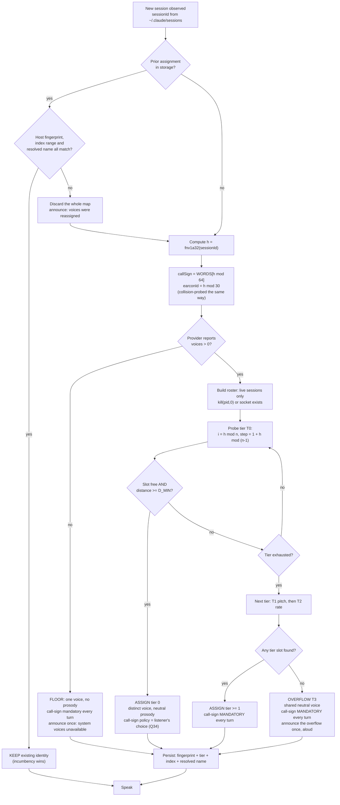

# 005 — Per-agent voice identity (M15)

**Status:** design, not implemented. **Opened** 2026-08-21. **Round** 2.
**Answers:** `docs/.discussion/000-open-questions.md` Q32, Q33, and the design half of Q31/H26.
Frames Q34 without answering it (kind **T** — the listener decides). Consumes Q27 and Q31.
**Primary input:** `docs/.research/q-round1-platform.md`.
**Gate M15:** *with two agents running, you can tell who is speaking without being told.*

> **Amended 2026-08-21 — round-3 reconciliation.** Findings from `docs/design/008-crossreview-round3.md`,
> `docs/design/007-user-stories.md` §30 and `docs/design/006-fma.md` §15b were resolved **in this
> document, in place**. Every amendment carries a dated note naming the finding that forced it.
> Ledger of what changed and what was deferred: `docs/design/009-reconciliation.md`.

> **Amended 2026-08-21 — forced by finding 4 of `docs/.research/latency-measurements.md` (section
> 1.4).** This document costed the identity earcon at **140 ms**. Measured through the shipped sink,
> **it costs p50 874 / 862 ms** — n=10 per run, two runs `[measured-here]` — a **6.2× miss**, paid
> **before the first word**, and **mandatory every turn** on the exact guaranteed floor (`V = 1`,
> everyone in overflow) this document designs for. Sections **11.1a**, **11.1d** and **13** are
> amended in place and every option that carried the 140 ms number is re-costed. The cause is not
> the tone and not the process spawn: it is the **audio device open** the sink pays for the extra
> chunk (PITFALLS **P32**), which is why the fix is M9 and not a shorter earcon.

---

## 1. The verdict, before the reasoning

| Claim | Value |
|---|---|
| Distinct identities, macOS, OS-synth | **66** recommended (22 prose voices × 3 pitch steps); 198 at the ceiling |
| Distinct identities, Windows 11 stock, OS-synth | **6** (2 voices × 3 pitch steps) — and **2 with the code we ship today** |
| Distinct identities, stock Ubuntu 24.04 desktop, OS-synth | **0–2** — 0 through the WAV path before the Linux ladder landed, 1 with `spd-say` as the announced floor |
| Distinct identities **guaranteed on all three**, voice-based | **1** |
| Distinct identities **guaranteed on all three**, including the non-speech axes | **≥ 30** (earcon) **× unbounded** (call-sign) |

**Therefore: a voice difference cannot be the load-bearing identity mechanism under R1.** The
axes that are identical on every platform are the ones *we* generate — a short synthesized
**earcon** and a spoken **call-sign** — because they do not ask the host for anything.

Five-line recommendation:

1. **Identity is a triple: `(callSign, earcon, voiceTuple)`.** The first two are portable and
   always available; the third is best-effort and platform-shaped.
2. **Design for N = 1 and degrade upward**, not N = 2. One voice is the honest floor, because
   stock Linux and a Windows box with one enabled voice both reach it.
3. **Assign deterministically from `sessionId` by tiered double-hash probing over a live roster**
   (`~/.claude/sessions/*.json`, Q27), with incumbency beating recomputation and a minimum
   perceptual-separation guard.
4. **Overflow never reuses an identity silently.** Beyond the platform's count, sessions share a
   neutral voice and their call-sign becomes mandatory on every turn, announced once.
5. **One portable rate unit: words per minute**, seeded by a formula and then *measured* per host
   from WAV durations, because the Windows scale is not comparable to the other two by arithmetic.

Two dependencies this recommendation **funds explicitly**, rather than assuming: the Windows
provider must move to `SpeakSsml` for the pitch component to exist at all (costed in 8.5 — decline
it and Windows tier 0 stays at 2), and the voice list must be cached once at activation, because
enumerating it costs **p50 487 / 472 ms** `[measured-here]` (n=6 ×2,
`docs/.research/latency-measurements.md` 1.6 — worse than P28's ~450 ms) against a ~500 ms
first-audio budget (9.1). **It is the entire budget on its own,** and `OsSynthProvider.prepare()`
calls it on darwin/win32 (`packages/providers/src/os-synth/index.ts:230-233`), so a cold `prepare()`
adds ~480 ms in front of the ~1,100 ms first-audio path unless it is warmed off the critical path.

---

## 2. Ground truth this design is built on

All rows MEASURED or DOCUMENTED in `docs/.research/q-round1-platform.md`; none are recollection.

> **Amended 2026-08-21 (round 3 reconciliation), forced by X-07.** One row of this table was
> **not** measured or documented — it was inherited. **H24 was already closed when this document
> was written**, by `6b776d4`, two commits before the commit that published this file. §16
> prerequisite 1 recorded it as *open* and called it *"M15's first task"*; `004` Panel E called the
> same non-existent gap *"the single largest gap found in the audit"*. Both are corrected. The
> lesson is the one PITFALLS **P0** already states and this round proves twice over: a `path:line`
> inherited from a research round is not evidence at HEAD. Cite a **symbol plus the line**, and
> re-derive.
>
> Two further caveats this table should have carried and did not, both from `008` §E-05/E-07:
> **Windows = 2 is DOCUMENTED, never run** — the chain is a Microsoft `GetInstalledVoices` doc page,
> a StackOverflow answer, and a `dotnet/runtime` source read, and `q-round1-platform.md`'s own
> residual **U1** says the probe needs a Windows box that nobody has used. §1's verdict table prints
> `66 / 6 / 0–2 / 1` with **no labels at all**, and a reader takes `2` for a measurement. Fold U1
> and U3 into the same Windows trip that Q43 already funds; the design does not change, the
> confidence label does.

| Fact | Consequence for M15 |
|---|---|
| macOS 26.5: 41 distinct English voices, 24 of 24 verified distinct by md5 | voice-rich; **not** the design target |
| Windows 11 stock: 2 (`Microsoft David Desktop`, `Microsoft Zira Desktop`) under Windows PowerShell 5.1, which is what we spawn (`packages/providers/src/os-synth/index.ts:247-253`, the spawn at `:251`) | the binding number |
| Stock Ubuntu 24.04.3 desktop: no `/usr/bin/espeak-ng`; only the shared library plus `speech-dispatcher` | a ladder, not a voice list |
| **Zero voice-name overlap** across the three namespaces | assignment is an **index into the host's runtime list**; a name is never portable data |
| `say -v NotAVoiceAtAll` exits 0 and writes byte-identical audio to the default voice | a wrong index is a **silent wrong-voice lie** — the P18 shape |
| `SelectVoice(name)` is a case-sensitive **substring** match | a short name can bind the wrong voice with no error |
| Rate exists everywhere; pitch and volume exist everywhere but through three different surfaces | the tuple is `(voice, pitch, rate)`, reachable unevenly |
| H24 — **CLOSED before this document was written** (`6b776d4`). `speech-service.ts:257` calls `generate(chunk.text, this.#synthesizeOptions())`, built at `:232` from `SpeechServiceDeps.voice` / `.rate` (`:57-58`); PITFALLS **P26** pins it with a reachability test | **M15's first task is the algorithm. The wire exists.** See the amendment note below |
| H25: rate was dropped on Linux — now fixed by `linuxCommand()` (`os-synth/index.ts:196`, called at `:458`) | prerequisite, closed |
| H26: `rate*175` wpm on macOS vs a −10…+10 clamp on Windows | one number does not mean one thing — see section 8 |
| Q27: `~/.claude/sessions/<pid>.json` is a live registry carrying `sessionId`, `name`, `cwd`, `pid` | the concurrent roster collision avoidance needs, **and a human-chosen name for free** |

---

## 3. The inversion: two different jobs, only one of which voices can do

The macOS-first instinct is "41 voices, give each agent one." It collapses at N = 2 because it
conflates two jobs:

| Job | Question the listener is asking | What satisfies it | Learning required |
|---|---|---|---|
| **Differentiation** | *"Is this the same speaker as a moment ago?"* | any audible difference — voice, pitch, earcon | none |
| **Identification** | *"Which agent is this — the one refactoring the normalizer, or the one on CI?"* | a learned mapping, **or** a name spoken aloud | a mapping must be learned; a name need not |

Gate M15 says *"you can tell **who** is speaking"* — that is identification. A voice difference
alone delivers differentiation for free and identification only after the listener has learned
which voice is which. On a 2-voice platform there is not even enough differentiation for a third
agent.

So the design is layered, and the layers are ordered by **portability**, not by richness:

```
Layer 0  call-sign   spoken word     unbounded cardinality   identical on all 3 platforms   identification, zero learning
Layer 1  earcon      generated PCM   ~30 distinct motifs     identical on all 3 platforms   differentiation, fast learning
Layer 2  voice       host list       41 / 2 / 0-1            three unrelated namespaces     differentiation, slow learning
Layer 3  pitch       ±semitones      x3 per voice            three unrelated surfaces       differentiation, weak
Layer 4  rate        wpm             x3 per voice            portable unit, section 8       differentiation, weakest — and it fights the accessibility setting
```

Layers 0 and 1 are the ones that actually satisfy R1. Layers 2–4 are the enhancement that makes
the identification stop *needing* to be spoken on every turn.

---

## 4. The identity tuple, and who owns the identity space

An identity is:

| Field | Type | Source | Portable? |
|---|---|---|---|
| `callSign` | one short word | derived from `sessionId`; long form from the registry `name` | yes |
| `earconId` | index into a motif table | derived from `sessionId` | yes |
| `voiceIndex` | index into the provider's ordered voice list | provider, at runtime | no — host-scoped |
| `pitchSemitones` | integer, −3 … +3 | identity tier | mapped per platform |
| `rateMultiplier` | multiplier of the listener's baseline | identity tier | mapped per platform (section 8) |

The identity space is **declared by the provider**, not hard-coded per OS. That matters because
the OS synthesizer is only the floor of the ladder; the default engine is Piper via
`sherpa-onnx-node` (HANDOFF "Settled findings"), whose voice list is *whatever we have cached* —
which is the **same list on all three platforms**. Stated plainly:

> **R1 parity for M15 is delivered by the Piper voice set, not by the OS-synth floor.** Caching
> three or four small Piper voices at first run gives macOS-class cardinality on Windows and Linux
> too. The OS-synth numbers below are the *degraded* case, and they are what the ladder must
> survive, not what the product should aim at.

Specification of the new provider surface (contract, not implementation):

```
ProviderCapabilities += {
  identity: {
    voices:  number   // distinct, verified-usable voices, after the distinctness probe
    pitch:   boolean  // can this provider apply a semitone offset at all?
    rate:    boolean  // can it apply a rate offset?
  }
}
SynthesizeOptions += { pitchSemitones?: number }   // rate and voice already exist, unreached (H24)
```

---

## 5. Distinct identities per platform — with the arithmetic

Perceptual quantisation used throughout, chosen conservatively for a listener who must recognise a
speaker in the first second without effort:

| Axis | Steps | Values | Why this many |
|---|---:|---|---|
| pitch | 3 | −3 st, 0, +3 st | 3 semitones is clearly audible in a stream; 2 is marginal, and 5+ starts sounding like a different (worse) voice |
| rate | 3 | ×0.92, ×1.00, ×1.08 | deliberately narrow: rate is the listener's **comprehension** dial, and spending it on identity degrades the agents at the edges |
| voice | host | see below | |

`identities = voices × pitchSteps × rateSteps`

| Platform · path | voices `V` | pitch `P` | rate `R` | **`V × P` (recommended)** | `V × P × R` (ceiling) | Note |
|---|---:|---:|---:|---:|---:|---|
| macOS, OS-synth, prose-quality only | 22 | 3 | 3 | **66** | 198 | 6 compact locale + 16 Eloquence |
| macOS, OS-synth, incl. novelty voices | 41 | 3 | 3 | 123 | 369 | 19 MacinTalk voices; several unintelligible for prose — do **not** count them |
| Windows 11 stock, **as shipped today** | 2 | 1 | 3 | **2** | 6 | `$s.Speak` has no pitch; `#command()` `:428` |
| Windows 11 stock, **with `SpeakSsml`** | 2 | 3 | 3 | **6** | 18 | requires switching to `SpeakSsml` + XML escaping |
| Ubuntu stock, `spd-say` floor | 1 | 1 | 1 | **1** | 1 | `spd-say` cannot write a WAV; we do not own playback there (`os-synth/index.ts:111-117`) |
| Ubuntu + `espeak-ng` installed | 13 | 3 | 3 | **39** | 117 | `m1`–`m8` + `f1`–`f5` within one language file; 104 variants × 8 en files exist but are not all distinct-in-prose |
| Windows-on-ARM | 2 | 3 | 3 | 6 | 18 | no sherpa build (P7) — OS-synth is the *only* path, so this row is the product, not the floor |
| **Any platform, Piper (default engine)** | = voices cached | 1 | 3 | = cached × 3 | | identical everywhere; this is the R1 answer |
| **Guaranteed floor, all three** | 1 | 1 | 1 | **1** | 1 | the number the design must survive |

Adding the portable layers:

`portableIdentities = earconMotifs × callSigns` = **30 × 64 = 1,920**, on every platform, at
every rung of the ladder, including the rung where there is exactly one voice and no prosody.

That is the whole argument for putting the call-sign first.

---

## 6. Perceptual distance, and why the identity list is *ordered*

The identity space is not a set, it is a **ranked list**, ordered so that taking the first `n`
entries gives the most-separated `n` identities available. This is what makes "degrade upward"
mechanical rather than aspirational: on Windows the first two entries are automatically David and
Zira (the maximum contrast the host offers), and on macOS the first 22 are 22 different voices with
prosody untouched.

Distance between two identities `a` and `b`:

| Term | Weight | Notes |
|---|---|---|
| different voice, different apparent gender | 1.00 | the strongest cue the host gives us |
| different voice, same apparent gender, different accent | 0.75 | e.g. Karen en-AU vs Samantha en-US |
| different voice, same gender, same accent | 0.60 | e.g. Flo vs Sandy |
| **same persona, different accent** | 0.25 | e.g. Shelley en-US vs Shelley en-GB — deliberately penalised; they are nearly the same voice |
| pitch | 0.12 per semitone, capped at 0.36 | so a full ±3 st shift is worth less than any voice change |
| rate | 0.05 per step, capped at 0.10 | last resort, by construction |

`D_MIN = 0.30`. Two live identities may never sit closer than this. A 3-semitone shift on the same
voice scores exactly 0.36 and is the weakest thing allowed — which is why any identity that needs
prosody to be distinct also gets a mandatory call-sign (section 7, tier rule).

Ordering algorithm: **farthest-point (maximin) traversal.** Start from the pair with maximum
distance; then repeatedly append the candidate that maximises its *minimum* distance to everything
already ranked. Deterministic given the host voice list, so rank `k` is reproducible across runs on
the same machine.

The list is then partitioned into **tiers**:

| Tier | Contents | Size | Call-sign policy |
|---|---|---:|---|
| T0 | every voice, pitch 0, rate ×1.00 | `V` | optional (Q34) |
| T1 | every voice, pitch ±3 st | `2V` | **mandatory every turn** |
| T2 | every voice, rate ×0.92 / ×1.08 | `2V` | **mandatory every turn** |
| T3 | overflow — the listener's default voice, neutral prosody | unbounded | **mandatory every turn**, plus a one-time spoken notice |

---

## 7. Q32 — deterministic assignment with collision avoidance

### 7.1 Inputs

| Input | Source | Cited |
|---|---|---|
| `sessionId` | `~/.claude/sessions/<pid>.json` | Q27, resolved |
| liveness | `process.kill(pid, 0)` or the existence of `messagingSocketPath` — **never** `updatedAt`, which is edge-written and goes stale on a crash | Q27 caveat |
| ranked identity list | provider, computed at `prepare()` and cached against a host fingerprint | section 6 |
| prior assignments | plugin storage, `identity.assignments` | section 9 |

### 7.2 The hash

`h = fnv1a32(sessionId)` — FNV-1a, 32-bit, unseeded, so two different machines and two different
worker generations compute the same number. Specified exactly rather than "a hash", because a
seeded or engine-dependent hash silently breaks the restart guarantee.

### 7.3 The algorithm

```
assign(session s, roster R, rankedList L):
  1. If s already holds a slot in the restored map AND that slot is still valid
     (host fingerprint matches, index in range, resolved name matches) -> KEEP IT. Return.
       Incumbency beats recomputation. A voice that changes under the listener is a lie.

  2. occupied = { slot of every OTHER live session in R }

  3. For tier t in T0, T1, T2:
       n = |t|;  if n == 0: continue
       i    = h mod n
       step = 1 + (h mod (n - 1))        // double hashing; visits every slot when gcd(step,n)=1
       for j in 0 .. n-1:
         cand = t[(i + j*step) mod n]
         if cand in occupied:                        continue      // hard collision
         if min distance(cand, occupied) < D_MIN:    continue      // perceptual collision
         assign cand; persist; return

  4. OVERFLOW. Assign T3: the listener's default voice, neutral prosody.
     Force callSignPolicy = 'every turn' for THIS session and for every other session
     currently in T3. Speak once, at the moment of overflow:
       "More agents than distinct voices. <CallSign> and <CallSign> will be named before each reply."
```

Two properties this buys, both load-bearing:

- **Restart-stable.** With the map persisted, step 1 returns the same identity. With the map lost,
  steps 2–3 recompute it — and because the roster is the same set and the ranked list is the same
  list, they produce the same answer. Two independent mechanisms that agree in the common case.
- **Join-stable.** A new session never displaces an incumbent, because step 2 treats every live
  slot as occupied and step 1 protects incumbents. Ordering by arrival cannot reshuffle anyone.

### 7.4 The decision flow



---

## 8. Q31 / H26 — one rate number, three incomparable scales

### 8.1 The portable unit is words per minute, not a multiplier

The listener tunes one number in the Voice Lab. That number is a **multiplier of a reference rate**,
and the reference is `RATE_REF_WPM = 175` — which is simultaneously espeak-ng's documented default
speed and the base the provider already uses on macOS (`os-synth/index.ts:188`, `ESPEAK_BASE_WPM`, used at `:212`).

`targetWpm = 175 × rate`

WPM is the right portable unit because it is a **physical** property of the output — words divided
by seconds — and therefore means the same thing on three operating systems, which no vendor's
control-value scale does.

### 8.2 The per-platform mapping, with the arithmetic

| `rate` | `targetWpm` | macOS `say -r` | Linux `espeak-ng -s` | Windows `$s.Rate` **(proposed, log)** | Windows `$s.Rate` **(today, linear)** |
|---:|---:|---:|---:|---:|---:|
| 0.50 | 88 | 88 | 88 | −6 | −5 |
| 0.75 | 131 | 131 | 131 | −3 | −2 |
| 0.90 | 158 | 158 | 158 | −1 | −1 |
| **1.00** | **175** | **175** | **175** | **0** | **0** |
| 1.15 | 201 | 201 | 201 | 1 | 1 |
| 1.25 | 219 | 219 | 219 | 2 | 3 |
| 1.50 | 263 | 263 | 263 | 4 | 5 |
| 1.75 | 306 | 306 | 306 | 5 | 8 |
| 2.00 | 350 | 350 | 350 | 6 | **10 — saturated** |
| 2.50 | 438 | 438 | 438 | 8 | 10 — saturated |
| 3.00 | 525 | 525 | 525 | 10 | 10 — saturated |

**macOS and Linux are exact.** `say -r` and `espeak-ng -s` both take words per minute directly, so
the mapping is the identity function on `targetWpm`. Nothing to calibrate.

**Windows is not.** `$s.Rate` is an integer −10…+10 with no documented wpm meaning. SAPI's rate
control is multiplicative, not additive, and the widely-cited relation is that `Rate = 10` is about
three times the default speed:

```
rate  = k ^ Rate       with  k = 3^(1/10) ≈ 1.1161
Rate  = round( 10 · ln(rate) / ln 3 )
```

Check: `rate = 1.0 → 0`. `rate = 3.0 → 10 · ln3/ln3 = 10`. `rate = 1.5 → 10 · 0.4055/1.0986 = 3.69 → 4`.

The shipped linear formula, `round((rate − 1) × 10)` (`os-synth/index.ts:366`), is wrong in both
directions: it over-shoots in the middle (1.5 → 5 instead of 4) and **saturates at rate 2.0**, so
every setting from 2.0 to 3.0 sounds identical on Windows while sounding progressively faster on
the other two. That is an R1 parity defect of the same family as H25.

### 8.3 The calibration that makes this evidence instead of arithmetic

`k = 3^(1/10)` is an **assumption**, and this project does not ship assumptions as facts (P0). It
is also directly measurable, because every OS-synth path writes a WAV whose duration we can read:

> **Calibration probe.** Synthesize a fixed 60-word passage at each platform control value
> (`$s.Rate` = −10…+10; `say -r` = 80…450 step 10; `espeak-ng -s` likewise). Read the WAV byte
> length, divide by `sampleRate × 2` for seconds, compute `wpm = 60 / seconds × 60`. Fit a monotone
> lookup table `wpm → controlValue` and invert it.

Run it **once per host**, in the background, cache it against the host fingerprint, and expose a
"recalibrate" button in the Voice Lab. The formula is only the seed used before calibration
completes. This is the same shape as the voice-distinctness probe in section 10 — and it is why
Voice Lab (M11) is a prerequisite for M15's rate claim, not merely adjacent to it.

### 8.4 Pitch, the second axis

Portable unit: **semitones**, `−3 … +3`, `0` natural.

| `pitchSemitones` | macOS `[[pbas n]]` | Windows SSML | Linux `espeak-ng -p` |
|---:|---:|---|---:|
| −3 | `[[pbas 43]]` | `<prosody pitch="-3st">` | `-p 38` |
| 0 | (omit) | (omit) | `-p 50` (default) |
| +3 | `[[pbas 49]]` | `<prosody pitch="+3st">` | `-p 62` |

Arithmetic and its label:

- **macOS** — `pbas` is documented as a fixed-point value where 60.000 is middle C, i.e. a
  MIDI-like scale where **1 unit ≈ 1 semitone**; baseline for a typical voice is ~46.
  `pbas = 46 + semitones`. **DOCUMENTED, not measured** — see Q44.
  **Hazard, MEASURED:** `[[...]]` is in-band. Normalized text containing `[[` would be executed as
  a command. Escaping `[[` becomes a required normalizer stage the moment we adopt this.
- **Windows** — SSML `<prosody pitch="+3st">` is semitones natively. **Exact.** Requires moving from
  `$s.Speak` to `$s.SpeakSsml` and XML-escaping the text; that is the change that takes Windows from
  2 identities to 6.
- **Linux** — `espeak-ng -p` is 0…99 with default 50 and **no documented semitone meaning**.
  Seed assumption: the range spans about two octaves, so 1 semitone ≈ 4.125 units,
  `p = round(50 + 4.125 × semitones)`. **ASSUMPTION — see Q45.**

### 8.5 The SSML migration is a named dependency of the tuple, not an implied one

**Stated plainly: recommending `(voice, rate, pitch)` on Windows *is* recommending that the Windows
provider move from `$s.Speak(...)` to `$s.SpeakSsml(...)`.** There is no other route.
`SpeakSsml`/`SpeakSsmlAsync` with `<prosody pitch>` is the only pitch surface `System.Speech`
exposes; the `Speak` path we ship today (`os-synth/index.ts:360-372`) cannot vary pitch at all
(DOCUMENTED, `q-round1-platform.md` "Windows"). The three platforms are not symmetric here:

| Platform | Pitch route | Is it SSML? | What changes in our code |
|---|---|---|---|
| Windows | `SpeakSsml` + `<prosody pitch="-3st">` | **yes — the only route** | wrap the utterance in SSML, XML-escape the text, change one PowerShell call |
| macOS (`say`) | in-band `[[pbas n]]` | **no** — `say` does not accept SSML | prepend `[[pbas n]]`, and **escape `[[` in normalized text** or user text becomes commands |
| macOS (`AVSpeechUtterance`) | real SSML — MEASURED, parsed `<break time="500ms"/>` | yes | only relevant if we build the Swift sidecar (P9/P10) |
| Linux | `espeak-ng -p`, or SSML via `-m` / `spd-say -x` | optional — the flag is simpler | one extra flag |

**The cost, itemised.**

| Item | Cost |
|---|---|
| Wrap text in `<speak><prosody>` for Windows | small |
| **XML-escape** `& < > " '` in the utterance, on top of the existing `''` PowerShell escaping | small, but it is a **second escaping layer over text the user reads aloud** — a bad escape is a spoken `&amp;` |
| Escape `[[` on macOS before adding `[[pbas]]` | a new normalizer stage; must be tested against real transcript text |
| Test matrix | every normalizer output now has to survive two markup layers on two platforms |
| Risk | a malformed SSML document makes `SpeakSsml` throw where `Speak` would have spoken. That converts a cosmetic failure into **silence** — the one outcome this project refuses (P22) |

**The verdict: take it, but gate it.** Adopt SSML on Windows, because 2 identities is not enough for
three agents and 6 is. Gate it on a `try { SpeakSsml } catch { Speak }` fallback that drops the
pitch and **keeps the words**, and record the drop so the identity layer knows it fell to tier 0
prosody and must therefore keep speaking the call-sign. Pitch is allowed to fail; speech is not.

If the author judges the escaping risk too high, the honest alternative is stated in section 5:
**Windows is 2 voices × a 3-step rate ladder = 6 at the ceiling, but only 2 at tier 0**, and every
third-and-later agent on Windows lives in tier 2 or overflow with a mandatory call-sign. The design
works either way; only the announcement frequency changes. What is not acceptable is claiming the
tuple without funding the migration.

Two of the three pitch mappings are assumptions. That is acceptable only because pitch is layer 3:
if a mapping is wrong, an identity is less distinct than intended, and the call-sign — which is
mandatory for every tier-≥1 identity, i.e. every identity that uses pitch — still carries the
identification. **The failure of an assumption degrades a cue, never the answer to "who is this".**

---

## 9. What survives, and what is persisted

| Boundary crossed | `callSign` | `earconId` | `voiceIndex` | `pitch` / `rate` | Mechanism |
|---|---|---|---|---|---|
| Worker restart (ORCA reaps after 5 min, P20) | survives | survives | survives | survives | persisted map, **and** deterministic recompute agreeing |
| Plugin disable → enable | survives | survives | survives | survives | same |
| A session ends and a new one starts | **new** | new | new | new | by design — `sessionId` *is* the identity |
| Machine change (settings synced) | survives | survives | **discarded** | discarded | host-fingerprint mismatch |
| Platform change | survives | survives | **discarded** | discarded | host-fingerprint mismatch |
| A voice is installed or removed | survives | survives | **recomputed, announced** | recomputed | fingerprint mismatch |
| Provider swap (Piper ↔ OS-synth) | survives | survives | recomputed | recomputed | fingerprint includes the provider id |

Persisted shape, in plugin storage:

```
identity.assignments = {
  hostFingerprint: sha256( providerId + platform + sortedVoiceNames.join('\n') ).slice(0,16),
  entries: {
    "<sessionId>": { tier, index, voiceName, pitchSemitones, rateMultiplier, earconId, callSign }
  }
}
```

Bounded to 64 entries, LRU by last-spoken — the same discipline as `MAX_REMEMBERED_IDS = 300`
(`packages/plugin/src/huddle/index.ts:80`), for the same reason (256 KB per stored value).

**Authority rule.** `hostFingerprint` is the guard; `index` is authoritative; `voiceName` is a
**checksum**. On restore, if the fingerprint matches but the name at that index no longer matches
the stored name, the store is corrupt — discard it and recompute. Never resolve by name (Windows
`SelectVoice` substring matching would bind something plausible and wrong), and never trust an
index without checking the name (macOS would substitute silently).

**Persisted as an index, never as a name.** The name travels only as the checksum.

### 9.1 The voice-list cache — enumeration costs an entire latency budget

**MEASURED:** `say -v '?'` costs 456 / 439 / 451 / 460 / 442 ms over five runs. R4.2's first-audio
budget is ~500 ms. **Enumerating the voice list once per utterance would spend the whole budget
before synthesis starts**, and `prepare()` already pays it because it calls `listVoices()`
(`prepare()` at `os-synth/index.ts:273`, which calls `listVoices()` at `:277`). Per-agent assignment consults the list constantly, so the list must
be cached — not per utterance, not per session, **once per activation**.

| Question | Answer |
|---|---|
| **Where does it live?** | In the worker, in memory, on the provider instance — beside `#warm`. Not in plugin storage: a stale list survives a reinstall and would be worse than a slow one. The *ranked list*, the *distinctness-probe results* and the *rate-calibration table* are all derived from it and are cached with it, keyed by `hostFingerprint`. |
| **When is it built?** | Once, at `prepare()`, at plugin activation. The ranked list and identity space are computed from it immediately, so assignment is pure in-memory arithmetic thereafter. |
| **What is the TTL?** | None. A timer would re-pay 450 ms for nothing in the overwhelmingly common case where the list has not changed. |
| **How is it invalidated?** | Three triggers, no polling: (a) any synthesis returning `OsSynthUnavailableError` or a checksum equal to the fallback baseline; (b) an explicit **"Rescan voices"** control in the Voice Lab and the panel; (c) worker re-fork (ORCA reaps after 5 minutes, P20) — which rebuilds it for free. |
| **The mid-session install case** | Real and expected — the fallback path *tells* the user to install more voices (11.6). It is handled by (b): the notice that says *"install better voices"* carries the **Rescan** control next to it. The user who just installed a voice is the user who will press it. Detecting it automatically would mean polling a 450 ms command forever to catch an event that happens twice a year. |
| **If the cached index no longer resolves** | This is failure mode **F2**. On rescan, recompute `hostFingerprint`; if it changed, discard the assignment map, reassign, and **announce it once**: *"Voices were reassigned after a system change."* Incumbents lose their identity here — the only place in the design where that happens — because the alternative is presenting a different voice as the same agent. |
| **The worker-restart interaction** | The cache is lost on re-fork and rebuilt at the next `prepare()`. The *assignments* survive, because they are persisted (section 9) and validated against the freshly computed fingerprint. Cache is derived state; assignments are not. |

The same rule applies to every derived table in this design: the voice list, the ranked identity
list, the distinctness-probe results (F3), and the rate-calibration table (8.3) are one cache with
one key and one invalidation path. They must never be able to disagree about which host they
describe.

---

## 10. Failure modes

Every row degrades to something **audible and named**. Never to silence, never to a wrong-voice lie.

| # | Failure | Detection (by effect) | Degradation |
|---|---|---|---|
| F1 | Voice list empty — `listVoices()` returns `[]` (stock Ubuntu before the ladder; a broken PowerShell) | `voices.length === 0` at `prepare()` | Floor: one voice, no prosody, **call-sign mandatory every turn**. Speak once: *"System voices are unavailable on this machine, so agents will be named before each reply."* Plus the actionable hint already written at `os-synth/index.ts:169` (`LINUX_INSTALL_HINT`, used at `:160`, `:169`) |
| F2 | Assigned index no longer exists — a voice was uninstalled, or one was **installed mid-session** and the cached list is stale (9.1) | host fingerprint mismatch on rescan; or a synthesis whose checksum equals the fallback baseline | Discard the map, recompute, and **say so**: *"Voices were reassigned after a system change."* Silent reassignment would present a new voice as the same agent. Rescan is user-triggered, never polled — a 450 ms poll for a twice-a-year event is not a check, it is a tax |
| F2b | `SpeakSsml` throws on malformed SSML, turning a cosmetic pitch failure into **silence** (8.5) | the PowerShell call exits non-zero, or writes a zero-length WAV | `catch → $s.Speak(plainText)`: drop the pitch, **keep the words**, and record that this session fell to tier-0 prosody so the identity layer keeps speaking its call-sign. Pitch may fail; speech may not |
| F3 | **macOS silent-fallback lie** — `say -v Bogus` exits 0 and emits the default voice's exact bytes | one-off **distinctness probe**: synthesize a 3-word phrase with each candidate and with no `-v`; any candidate whose md5 equals the no-voice baseline is **not a real voice** and is struck from the ranked list | The list shrinks; identities are recomputed on the smaller list. Never keep a voice that failed the probe |
| F3b | The probe is too slow to run at startup — 41 × ~480 ms ≈ **~20 s** `[derived]` (`say -v '?'` alone is p50 487 / 472 ms `[measured-here]`, n=6 ×2, `latency-measurements.md` 1.6) | timing | Run it **in the background**, cached against the fingerprint. Until it completes, use only the 6 compact locale voices, which are the ones the probe already confirmed |
| F4 | **Windows substring binding** — `SelectVoice('David')` matching something unintended | pass the full `VoiceInfo.Name`, then **read `$s.Voice.Name` back** and compare | Mismatch → strike that voice from the list, log a WARNING, reassign. The read-back is the whole check; without it the failure is invisible |
| F5 | **Two live sessions hold the same slot** — stale roster, two workers, a race | before speaking, re-read the roster; if two live sessions resolve to the same slot, both are in violation | Demote **both** to overflow: shared neutral voice, call-sign mandatory, announced. Two identical unnamed voices is precisely the P22 failure and must be impossible |
| F6 | The session registry does not cover the agent CLI in use (Q27's unresolved sub-question — all five observed sessions were Claude Code) | registry lookup by `sessionId` returns nothing while a transcript is being read | Roster degrades to "transcripts modified within the last N minutes"; collision avoidance degrades to hash-only; **overflow behaviour becomes the default** (everyone named). Announce the degradation once |
| F7 | **The enumerable path is not the synthesizable path** — Linux `listVoices()` returns `spd-say --list-synthesis-voices` output (`os-synth/index.ts:279`) while synthesis prefers `espeak-ng` (`LINUX_WAV_BACKENDS`, `:167`). Assigning one of those names produces the wrong voice or none | assign, synthesize the probe, compare checksums — F3's probe catches it | `listVoices()` must return only voices the **selected backend** accepts. Until it does, treat Linux as `V = 1` and rely on layers 0–1. This is a live defect, not a hypothetical |
| F8 | The overflow announcement itself becomes noise — six agents, every reply prefixed | count of T3 sessions ≥ 3 | Escalate from prefix to **grouping**: batch a session's replies and name once per batch. Also the point at which the UI should offer "download more voices" (macOS Enhanced/Premium, Windows natural voices, `apt install espeak-ng`) |
| F9 | Earcon inaudible — bad output device, gain too low, or the listener finds it grating | the listener says so; no automatic detection | Earcon is disableable. **Disabling it promotes the call-sign to mandatory**, because layer 1 was carrying differentiation |
| F10 | Rate calibration not yet complete, or wrong | compare the measured wpm of a probe utterance against `targetWpm` | Fall back to the seed formula and show the discrepancy in the Voice Lab. Never let a mis-tuned rate be the only thing separating two agents — which is why rate is tier 2, behind a mandatory call-sign |

---

## 11. The non-speech axes

### 11.1 Earcon — the sleeper, and the one that actually satisfies R1

Buzz uses a 50 ms oscillator at **880 Hz on press / 440 Hz on release**, gain 0.05, via Web Audio,
purely so a non-visual user knows the mic opened (`useHuddlePttState.ts:36-54`; buzz item 3).

The same primitive solves our parity problem, because **we generate the samples ourselves**. A tone
does not consult the host's voice registry, so its cardinality is identical on macOS, Windows and
Linux — including the Linux box with no `espeak-ng`.

> **This section is now the ONE earcon table for the whole project. Amended 2026-08-21 (round 3
> reconciliation), forced by X-03.** Three documents were minting tones from one perceptual space
> and this one allocated **all of it**: `earconId = h mod 30` used every ordered pair of the six-note
> pentatonic set. Meanwhile `003` needed at least four more (Stop confirmation §10.2, Pause, the
> 30-second paused heartbeat §8.7 rule 4, and a refusal earcon §3 R5 — where the refusal set is six
> named codes) and `004` §8 rule 5 needed four again at a **different duration** (150 ms), with a
> 300 ms A/B separator on top. Nothing reserved a band. With 30 of 30 allocated, **every control
> earcon was by construction some live agent's identity**, and a listener who had learned "rising
> G5-A5 is Cedar" would hear that exact motif as the confirmation of a Stop.
>
> This is worse than a naming clash. §11.1's own argument is that the earcon is *"the one that
> actually satisfies R1"* precisely because it is host-independent — so on the guaranteed floor
> (`V = 1`, everyone in overflow, §14.3 case A) the earcon carries **all** of the differentiation,
> and that is exactly where it collided with the control vocabulary.
>
> **One owner: `packages/core/src/earcons/`.** `003` §3 R5 / §8.7 / §10.2 and `004` §8 rule 5 now
> **cite this table** and mint nothing.

### 11.1a The reserved bands

Two axes are reserved, not one, so a collision is structurally impossible rather than merely
avoided by bookkeeping:

| | **Identity band** | **Control band** |
|---|---|---|
| **Note count** | exactly **2** | **1** or **3** — never 2 |
| **Pitch set** | pentatonic C5 D5 E5 G5 A5 C6 | **disjoint**: C4, F4, A4 (low) and E6, G6 (high) |
| **Envelope** | 60 ms per note, 20 ms gap, 5 ms raised-cosine fade | 150 ms total per earcon: one note of 150 ms, or three of 40 ms with 15 ms gaps |
| **Gain** | 0.05, matching buzz | 0.05 |
| **Total tone** | 140 ms `[derived]` (60 + 20 + 60) | 150 ms `[derived]` |
| **Total wall-clock cost on v1** | **p50 874 / 862 ms** `[measured-here]` (n=10 ×2, `docs/.research/latency-measurements.md` 1.4) — the tone is 16 % of it; the rest is the sink's audio-device open for the extra chunk | same shape: any control earcon emitted as its own chunk pays the same ~870 ms until M9 |
| **Who assigns** | `earconId = h mod 30`, probed against live sessions exactly as voices are | a fixed, named table — never hashed, because a control must sound the same every time |

**Identity cardinality after the reservation: still 30.** `008` X-03 expected this number to
shrink, and it does not — because the reservation takes its notes from **outside** the pentatonic
set rather than taking pairs from inside it, and takes its shapes from outside the two-note form.
The extra notes cost nothing: we synthesize them. So `earconMotifs × callSigns = 30 × 64 = 1,920`
stands, and it stands for a stated reason rather than by omission.

### 11.1b The control band, named

| Id | Shape | Emitted by |
|---|---|---|
| `control.stop` | one note, C4 | `003` §10.2 — **on every Stop press, including stale ones** |
| `control.pause` | one note, F4 | `003` §8.7 |
| `control.heartbeat` | one note, A4, at reduced gain | `003` §8.7 rule 4, every 30 s while paused |
| `control.refused` | three notes, descending E6 A4 C4 | `003` §3 R5 — one earcon for all six refusal codes; the *code* is spoken only when it matters |
| `control.play` | one note, E6 | `004` §8 rule 5 |
| `control.skip` | three notes, ascending C4 A4 E6 | `003` §8.7, `004` §8 rule 5 |
| `control.error` | three notes, C4 C4 C4 | `004` §8 rule 5, and the `503` / `spoke-elsewhere` paths |
| `control.compare` | one note, G6, **300 ms** — the one deliberate exception to the 150 ms rule, because it is a *separator* and needs to read as a gap | `004` §3 step 1 |

### 11.1c The test that pins it

```
for every identity motif m in 0..29 and every control earcon c:
    render(m) and render(c) as PCM
    assert md5(render(m)) != md5(render(c))          # the byte-identity check X-03 asked for
    assert noteCount(m) == 2 and noteCount(c) != 2   # the shape invariant
    assert notes(m) ⊆ IDENTITY_SET and notes(c) ∩ IDENTITY_SET == ∅   # the pitch invariant
```

The negative control, without which the above is a ritual: **construct one deliberately illegal
control earcon from two pentatonic notes and assert the test fails on it.** A pairwise-distinctness
assertion over two sets that were built to be disjoint could not have failed otherwise.

### 11.1d The acoustic spec

| Property | Value |
|---|---|
| Form | two sine notes, 60 ms each, 20 ms gap, 5 ms raised-cosine fade in and out (no clicks) |
| Gain | 0.05, matching buzz |
| Pitch set | 6 notes, pentatonic: C5 D5 E5 G5 A5 C6 — **identity only** |
| Cardinality | ordered pairs of distinct notes = 6 × 5 = **30** |
| Sample rate | the provider's, 22050 — emitted as an `AudioChunk` prepended to the utterance |
| Cost | **p50 874 / 862 ms of wall clock on v1** `[measured-here]` (n=10 ×2), of which 140 ms `[derived]` is tone — see below |

**The cost, measured. Amended 2026-08-21, forced by finding 4 of
`docs/.research/latency-measurements.md` (1.4).** This document originally costed the earcon at
*"~140 ms, once per speaker-turn"*, and §13 options D and E carried that number. A round-3 revision
then added *"plus one sink spawn (~970 ms)"* — right that a dominant term was missing, wrong about
what it was. **Both are now superseded by a measurement.**

Prepending exactly the 140 ms two-note buffer as its own `AudioChunk` through the shipped
`SubprocessSink` measures **p50 874 ms** (run 1, n=10) and **p50 862 ms** (run 2, n=10) of wall
clock `[measured-here]`, inserted **before the first word** — directly into the path R4.2 budgets at
500 ms. Three things follow, and the third is the one to carry forward:

1. **The tone is 16 % of its own cost.** Shortening the earcon, dropping a note, or trimming the
   20 ms gap changes almost nothing. The lever is not the acoustic spec.
2. **The dominant term is the audio device, not the process.** `afplay`'s fork/exec is 2.3 ms
   `[measured-here]`; the temp file is 0.33 ms; ~893 ms of an inter-chunk boundary is CoreAudio
   device open, pre-roll, post-roll and teardown (PITFALLS **P32**). The measured ~870 ms is lower
   than 140 + 970 because the tone is short and part of the device-open cost overlaps playback.
3. **Per-turn earcons are an M9-dependent feature, and M9 must hold the *device* open.** A version
   of M9 that pools player *processes* while still opening the device per chunk would leave this
   cost intact. Until then §13's options D and E are the **slowest** rows in that table, not the
   cheapest, and the table now says so in its own Costs column.

**A cheaper option the 140 ms framing hid, and which this document now recommends for v1.** The
~870 ms is the cost of the earcon being *its own chunk* — a chunk boundary is a device open. It is
**not** the cost of 140 ms of tone existing. So on v1 the earcon should be **mixed into the head of
the first speech chunk** rather than prepended as a separate `AudioChunk`: same sound, same position
before the first word, one device open instead of two, ~140 ms instead of ~870. The obstacles are
known and small — the tone must be rendered in the provider's declared `AudioFormat` (already
required by the format-mixing note below) and concatenated onto the front of the first WAV. **Until
M9, "prepend a chunk" is the expensive spelling of this feature and "concatenate into the first
chunk" is the cheap one, and nothing in the perceptual design distinguishes them.** After M9 the two
converge and the separate chunk is preferable again for scheduling reasons.

**Where the headroom is.** 2 of 10 samples in run 1 and 3 of 10 in run 2 came in at **~370 ms**
instead of ~870, and only when a previous `afplay` had exited moments earlier — i.e. when the device
was still **warm** `[measured-here]`. That is direct, independent evidence for consequence 3: about
500 ms of this cost is device state, and it is recoverable by keeping the device open rather than by
changing anything about the earcon.

A second-order consequence: the earcon is generated PCM and `AudioChunk.format` is provider-chosen
(`packages/core/src/types/index.ts:7`). A synthesized tone prepended to an `os-synth` `'wav'` stream
is a **format-mixing** case nothing in the sink handles today. The earcon module must emit in the
provider's declared format, which makes it the fourth uncoordinated extension to the provider seam
that `008` C-05 counts — and an argument for making that one change once, before M11.

Assignment: `earconId = h mod 30`, probed for collisions against live sessions exactly as voices
are. It is layer 1 because it needs a little learning ("the falling one is the CI agent"), but it
gives instant *differentiation* with none.

### 11.2 Call-sign — two levels of name

Q27 handed us something better than a UUID slice for free: the registry's `name` field, which is
human-chosen (`orca-plugin-tts-13`, `orca-5c`, `math-study-a3`). But it is too long to prefix every
turn, and `tts` is read as letters. So: **two levels.**

| Level | Form | Source | Spoken when |
|---|---|---|---|
| **Short** — the call-sign | one word, one or two syllables (~350 ms `[claimed]` — never synthesized and timed) | `WORDS[h mod 64]`, collision-probed | prefixed to a turn, per Q34's chosen policy |
| **Long** — the full name | the registry `name`, run through the normalizer | `~/.claude/sessions/<pid>.json` | on switch, on status, on request |

This replaces `sessionLabel()`'s eight-hex-character UUID slice
(`packages/plugin/src/huddle/index.ts:106`), which is the thing that prompted this milestone:
reading `111693de` aloud to a dyslexic listener is a non-answer to "who is speaking".

> **Confirmed as the project's one call-sign, 2026-08-21 (round 3 reconciliation), by X-04 and
> 007 C4.** `003` §6 independently minted a **different** call-sign — two words (*"amber falcon"*),
> an unspecified hash, at rank 4 of 5, *"used ONLY to break a collision"*, with collisions resolved
> by **appending** rather than probing. Given the same two colliding sessions, the two designs
> emitted *"orca plugin tts 13, amber falcon"* and *"Willow"* for the same session in the same audio
> stream. **This specification wins** — it states its hash exactly, states its cardinality, and
> probes — and `003` §6 has been amended to consume it as the display-name chain's disambiguator.
> There is one call-sign, it is one word, and it is `WORDS[fnv1a32(sessionId) mod 64]`.

The 64-word list is not fixed here — see Q48. Constraints on it: one or two syllables, no minimal
pairs (`Cedar`/`Cedar` variants, `Falcon`/`Talon`), no words the normalizer would mangle, and **no
word that appears in the spoken control vocabulary of
`docs/.discussion/003-panel-and-control-channel.md` §4a.3** — which is the seventeen-word list, not
the four (`stop`, `skip`, `status`, `next`) this document originally named. `003` §4a is the single
source for both the key bindings and the spoken vocabulary; this document cites it and does not
restate it, so the two can never drift apart again.

### 11.3 Where the control lives — on the agent, not in a settings pane

Buzz puts the voice picker on the **agent's own avatar** (`AgentVoiceMenu.tsx:88-145`; buzz item 7),
auto-assigns on join, and *removes* the picker rather than graying it when per-agent TTS is off.
Adopt all three:

- The identity control belongs wherever the session is represented (M13's panel), not in settings.
- Auto-assignment happens on join. Zero configuration is the default; overriding is possible.
- Off means **gone**, not disabled — a control that is present but inert is a lie about capability,
  the same family as P18's silent no-op.

### 11.4 One level indicator, not two

Buzz merges remote human speech levels and the synthesized RMS envelope into a single indicator via
`Math.max` (`useHuddleSpeakerActivity.ts:16-38,55-75`; buzz item 2). Presence is about *who is
talking*, not *what kind of thing* is talking. When M13's panel gains a speaking indicator, there
must be exactly one per participant, and a synthetic agent must render identically to a person.

### 11.5 The interrupt must not move

Buzz's Stop button occupies a pre-reserved fixed-height slot, replacing the name in place, with an
E2E test asserting byte-identical bounding boxes idle vs speaking
(`ParticipantList.tsx:328-349`, `huddle-transcription.spec.ts:717-745`; buzz item 8). Per-agent
identity adds a per-agent Stop, and it inherits this rule: **the control never moves, so it can be
hit without looking.** Pin it with a test, or it will drift the first time a call-sign of a
different length is rendered.

### 11.6 Voice *quality* is not an identity axis — it is a first-run concern

**MEASURED:** on the author's machine all 180 installed `AVSpeechSynthesisVoice` objects report
`quality == .default` — the lowest of `.default` / `.enhanced` / `.premium`. Enhanced and Premium
are free, Apple-hosted, one-time downloads the user must initiate themselves. The same shape exists
on Windows (Narrator natural voices) and on Linux (`apt install espeak-ng`, or extra
speech-dispatcher backends). We cannot install any of them, and should not try.

**Argued both ways, then decided.**

| Position | Case for | Case against |
|---|---|---|
| **Quality is an identity axis** — rank enhanced voices higher, or use tier as a distinguishing dimension | it correlates with distinctness: enhanced voices are more characterful, so they separate better; and a maximin ordering that ignores quality will sometimes rank a bad voice above a good one | quality is **not a per-agent property**. Two agents differing only in quality is "one sounds worse", not "these are two people". It has cardinality 3 and zero perceptual *identity* value. And it varies per machine, so an identity built on it does not port |
| **Quality is a first-run concern** | it is a property of the *host*, discovered once, and acted on once — exactly like the voice list itself. It changes the size and the pleasantness of the identity space without being a coordinate in it | none material — except that ignoring it entirely would leave us quietly sounding bad |

**Decision: quality enters the design in exactly two places, neither of them the tuple.**

1. **As a rank weight, not a coordinate.** The maximin ordering (section 6) sorts enhanced and
   premium voices ahead of default ones at equal distance. Better voices get used first; quality
   never *creates* an identity.
2. **As a one-time, actionable notice** on the degradation path, sitting beside the Rescan control
   from 9.1:

   > *"Your system voices are the basic tier. Higher-quality voices are a free one-time download —
   > System Settings, Accessibility, Spoken Content, Manage Voices."*

   Spoken once, never repeated, dismissible. This is the same never-fail-silently obligation as
   `LINUX_INSTALL_HINT` (`os-synth/index.ts:169`), which already does exactly this for the
   missing `espeak-ng` binary. Quietly sounding bad is a silent degradation, and R015 forbids it.

**One honest gap:** `say -v '?'` does not report quality. Reading it on macOS requires
`AVSpeechSynthesisVoice`, i.e. a compiled probe or the Swift sidecar — which we do not ship today.
So the notice is implementable now on Linux (binary present or absent) and on Windows (voice count),
and on macOS only once the sidecar exists, **or** by the weaker proxy of "no voice name outside the
known compact set". See Q51.

---

## 12. Q33 — the scarcity ladder, stated plainly

*When voices are scarce, what distinguishes the third session?*

| Rank | Mechanism | Available when | Distance | Cost |
|---:|---|---|---:|---|
| 1 | **A different voice**, gender-contrasting first | `V ≥ 2` | 1.00 | free |
| 2 | A different voice, same gender | `V ≥ 3` | 0.60–0.75 | free |
| 3 | **Pitch**, ±3 semitones on an already-used voice | pitch reachable (all three, unevenly) | 0.36 | Windows needs `SpeakSsml`; macOS needs `[[` escaping |
| 4 | **Rate**, ×0.92 / ×1.08 | everywhere | 0.10 | **fights the listener's comprehension setting** — last resort |
| 5 | **Overflow**: shared voice, mandatory call-sign | always | n/a | ~350 ms per turn `[claimed]` — plus ~870 ms `[measured-here]` if emitted as a separate chunk (§11.1d) |

Running underneath every rank, on every platform, at no marginal cost:

| Always | Mechanism | Distance |
|---|---|---|
| 0a | **Earcon** — 30 motifs, host-independent | high, after brief learning |
| 0b | **Call-sign** — unbounded, host-independent | total, zero learning |

**The answer to Q33 is therefore: pitch, then rate — but the question contains a false premise.**
Neither pitch nor rate is what tells the listener *who* the third session is. The call-sign does
that, and the ladder's real function is to reduce how often the call-sign has to be spoken.

---

## 13. Q34 — the option space, not the answer

*Is a spoken speaker-announcement still wanted once voices differ?* **Kind T. The listener decides,
in Voice Lab (P23).** The design's obligation is that every option below is reachable by changing a
setting, with no code change.

| Option | What it sounds like | Costs | Fails when |
|---|---|---|---|
| **A — Never** | voices alone carry identity | zero time cost; maximum flow | the listener has not yet learned the mapping; any tier-≥1 or overflow identity; `V = 1` |
| **B — On switch only** (today: `switchTo()`, `huddle/index.ts:244` — **and no caller invokes it**, 007 C8) | *"Now reading from orca-plugin-tts, session 111693de."* | one announcement per switch | long gaps — after five minutes of one speaker, the listener has forgotten who it was |
| **C — Call-sign prefix, every turn** | *"Cedar. The tests pass."* | ~350 ms every turn `[claimed]` — **nobody has synthesized a call-sign and timed it**, and if it is emitted as its own chunk on v1 it pays the same ~870 ms as D | tiring in a fast back-and-forth with one agent |
| **D — Earcon only** | two notes, then speech | **p50 ~870 ms on v1 macOS** `[measured-here]` (874 / 862, n=10 ×2, `latency-measurements.md` 1.4), of which 140 ms is tone — until M9 holds the audio device open (§11.1d); needs learning | a listener who has not learned it, or who has disabled it |
| **E — Earcon always, call-sign on switch** | notes every turn, name when the speaker changes | as D — **~870 ms `[measured-here]` every turn, the slowest row in this table on v1, not the cheapest** (§11.1d) — plus C's cost on switches | the long-gap case, same as B |
| **F — Adaptive** | name whenever ≥ 2 sessions have spoken in the last *N* minutes, **or** the identity is tier ≥ 1, **or** more than *M* minutes have passed | variable; no fixed cost | hardest to predict — the listener cannot anticipate whether a name is coming |

Two rules are **not** options, because they are correctness rather than taste:

1. Any identity in tier ≥ 1 or overflow is **named every turn**, regardless of the setting. Those
   identities are, by construction, near the perceptual floor.

   > **Amended 2026-08-21, forced by finding 4 of `docs/.research/latency-measurements.md`.** This
   > rule is unchanged as *policy* and its *implementation* is now constrained. On the guaranteed
   > floor — `V = 1`, every session in overflow (§14.3 case A) — this rule makes a per-turn identity
   > marker mandatory, and a per-turn marker emitted as its own `AudioChunk` costs **~870 ms
   > `[measured-here]`** in front of every reply. That is 1.7× R4.2's entire 500 ms budget, paid
   > exactly where the budget is measured, on exactly the configuration the rule exists for.
   > **The rule therefore now carries an implementation constraint, not an escape hatch:** on v1 the
   > mandatory marker must be **mixed into the first speech chunk** (§11.1d), never prepended as a
   > separate chunk. A per-turn *prepended* earcon is an M9-dependent feature and must not ship as a
   > default before M9 holds the audio device open. If neither is available, prefer the spoken
   > call-sign inside the same chunk over a separate tone chunk — it is speech the provider is
   > already synthesizing, so it costs its own duration and nothing else.
2. A **switch** is always audible in some form. P22's lesson is that the worst experience is not
   knowing whose words these are, and that failure distressed the listener enough to be recorded as
   a pitfall.

Voice Lab must be able to play the same two-agent exchange under each of A–F, back to back, so the
choice is made by hearing rather than by argument. That is an obligation on `004`, recorded there in
its "What this document does not decide" table under Q34.

**One thing this table does not cost, and nobody did.** `008` X-05 stacked the preambles that three
documents each prepend *"regardless of the setting"* — this document's earcon (§11.1) and mandatory
call-sign (§13 rule 1), `003` §6's identity re-spoken after ~30 s of silence, and `002`'s omission
announcements — at **~2.7 s of preamble in front of a 1.0 s reply** on the guaranteed floor, where
every session is overflow and naming is mandatory. **Amended 2026-08-21:** that ~2.7 s was
`[claimed]`, not measured — three of its four terms were estimates and the fourth was a third-party
figure — and three documents nonetheless called it *"measured"*. One term is now real: the earcon is
**~870 ms `[measured-here]`**, against the 140 ms the arithmetic used. The total survives roughly
intact only because X-05 had separately added a ~970 ms spawn term that the measurement folds into
the same ~870 ms. What changes is the *shape* of the problem: the preamble's dominant cost is
**device-open time per extra chunk**, so it is removed by M9 and by chunk-merging (§11.1d), and
**not** by shortening any wording — which is what an utterance-preamble budget would otherwise be
tempted to do first. Three "regardless" rules in three
documents compose into something nobody chose. **This is not resolved here.** It needs an
utterance-preamble budget owned by whichever module finally assembles the utterance, with the
percentage set by the listener; it is recorded as `Q61` in `docs/.discussion/000-open-questions.md`
rather than left implicit.

---

## 14. Worked example — three concurrent sessions, on each of three platforms

Three sessions, sorted lexicographically by `sessionId` (the deterministic assignment order):

| # | `sessionId` | `fnv1a32` | registry `name` |
|---|---|---:|---|
| S1 | `111693de-4a4c-4d3e-9f21-0b7c2f8a51d0` | 1771308794 | `orca-plugin-tts-13` |
| S2 | `7c2e9b04-8f13-49aa-b6d5-3e1f0c4a9d77` | 2061652489 | `orca-5c` |
| S3 | `a4f80c15-2d6e-4b71-8c93-5a20e7f6b118` | 376497713 | `math-study-a3` |

Portable layers first — identical on all three platforms, computed before any voice list is
consulted:

| | `h mod 64` → call-sign | `h mod 30` → earcon |
|---|---|---|
| S1 | 58 → `WORDS[58]` (say: **"Willow"**) | 14 → E5 then C5 (falling) |
| S2 | 9 → `WORDS[9]` (say: **"Cedar"**) | 19 → G5 then A5 (rising) |
| S3 | 49 → `WORDS[49]` (say: **"Sparrow"**) | 23 → C5 then G5 (rising, wide) |

*(The 64-word list is not yet fixed — Q48. The indices are real; the words stand in for it.)*

### 14.1 macOS — `V = 22`, `M(T0) = 22`

Ranked T0 list, maximin-ordered (abridged): `0 Samantha en-US · 1 Daniel en-GB · 2 Karen en-AU ·
3 Rishi en-IN · 4 Moira en-IE · 5 Tessa en-ZA · 6 Grandpa en-US · 7 Flo en-US · 8 Rocko en-US ·
9 Shelley en-US · … · 17 Shelley en-GB · … · 21 Grandma en-GB`

| Step | Session | Arithmetic | Result |
|---|---|---|---|
| 1 | S1 | `1771308794 mod 22 = 2` → rank 2 free | **Karen (en-AU)**, pitch 0, rate ×1.00 |
| 2 | S2 | `2061652489 mod 22 = 17` → rank 17 free, distance to Karen = 0.75 ≥ 0.30 | **Shelley (en-GB)**, pitch 0 |
| 3 | S3 | `376497713 mod 22 = 9` → rank 9 free, **but** Shelley en-US vs Shelley en-GB scores **0.25 < D_MIN 0.30** — same persona, different accent | **rejected**, probe on |
| 3b | S3 | `step = 1 + (376497713 mod 21) = 12`; next candidate `(9 + 12) mod 22 = 21` → free, min distance 0.60 | **Grandma (en-GB)**, pitch 0 |

**What the listener hears.** Three clearly different people, all tier 0, all at the listener's own
rate, no prosody tricks. The call-sign is optional here (Q34) because voice alone differentiates.

```
[E5 C5]  "The normalizer tests pass."                   <- Karen, Australian
[G5 A5]  "I opened a pull request against upstream."     <- Shelley, British
[C5 G5]  "The integral converges."                       <- Grandma, British
```

If the listener chooses option C, each is prefixed: *"Willow. The normalizer tests pass."*

### 14.2 Windows 11 stock — `V = 2`, `M(T0) = 2`, `M(T1) = 4`

Ranked T0: `0 Microsoft David Desktop (M) · 1 Microsoft Zira Desktop (F)` — the maximum contrast
the host offers, and the maximin ordering picks it automatically.
Ranked T1 (pitch): `0 (Zira, +3st) · 1 (David, −3st) · 2 (Zira, −3st) · 3 (David, +3st)`

| Step | Session | Arithmetic | Result |
|---|---|---|---|
| 1 | S1 | `1771308794 mod 2 = 0` → free | **David**, pitch 0 — **tier 0** |
| 2 | S2 | `2061652489 mod 2 = 1` → free | **Zira**, pitch 0 — **tier 0** |
| 3 | S3 | `376497713 mod 2 = 1` → occupied; probe `step = 1 + (h mod 1) = 1`; `(1+1) mod 2 = 0` → occupied. **T0 exhausted.** | fall to T1 |
| 3b | S3 | `376497713 mod 4 = 1` → T1 rank 1 free; distance to David@0 is pitch-only = 0.36 ≥ 0.30 | **David, −3 semitones** via `SpeakSsml <prosody pitch="-3st">` — **tier 1** |

**Tier 1 forces the call-sign on every turn.** What the listener hears:

```
[E5 C5]  "The normalizer tests pass."                             <- David, natural
[G5 A5]  "I opened a pull request against upstream."               <- Zira, natural
[C5 G5]  "Sparrow. The integral converges."                        <- David, three semitones lower, NAMED
```

Honest note: David-at-−3st against David-at-0 is the weakest distinction the whole system will
produce. It scores exactly at the floor. That is why the name is not optional there — and why the
Windows path should not stop at `SpeakSsml`; the real fix is the Piper voice set (section 4).

**With the code we ship today** (`$s.Speak`, no SSML, no pitch), T1 does not exist. S3 goes
straight to overflow: David at natural pitch, shared with S1, call-sign mandatory for both, and a
one-time spoken notice — *"More agents than distinct voices. Willow and Sparrow will be named before
each reply."*

### 14.3 Ubuntu 24.04 stock — `V = 1` on the floor, `V = 13` with `espeak-ng`

**Case A — stock desktop, `spd-say` floor.** `/usr/bin/espeak-ng` is not installed
(`os-synth/index.ts:100-140`; the `spd-say` bullet at `:111-117`). `spd-say` makes sound but cannot write a WAV, so we do not own playback
and cannot vary pitch or rate reliably. `V = 1`, no prosody. Every session lands in overflow.

```
once, at startup:  "Only the system speech service is available, so agents will be named."
[E5 C5]  "Willow. The normalizer tests pass."
[G5 A5]  "Cedar. I opened a pull request against upstream."
[C5 G5]  "Sparrow. The integral converges."
```

Three agents, one voice, and the listener can still tell exactly who is speaking — because the
earcon and the name never depended on the host. **This is the row that proves the design satisfies
R1.** Compare the naive design: three identical voices, indistinguishable, gate M15 failed.

> **One honest gap in this row, recorded 2026-08-21 (round 3 reconciliation), from `006` §15b X3.**
> The earcon above is generated PCM handed to a sink — and on this exact rung **we do not own
> playback**: `#speakDirect()` gives the text to speech-dispatcher and yields nothing
> (`os-synth/index.ts:400-405`, `#speakDirect()` at `:491`). So the *voice* comes from the daemon and the *earcon* would have to
> come from somewhere else, and no document says from where. The delivery mechanism for an earcon on
> the `spd-say` floor is **unspecified**, and it is unspecified in the one case this section calls
> the proof of R1. It is not fatal — the **call-sign** is spoken by the daemon along with everything
> else, and the call-sign alone satisfies the gate here — but the row should be read as *"the
> call-sign proves R1, and the earcon on this rung is an open mechanism"*, not as *"both work"*.
> Same shape as X-10 on the Voice Lab side, and it wants the same answer: a capability read, not an
> assumption.

**Case B — `sudo apt install espeak-ng`.** `V = 13` — the eight male and five female variants within
one English language file, maximin-ordered so male and female alternate:
`0 f1 · 1 m1 · 2 f2 · 3 m2 · 4 f3 · 5 m3 · 6 f4 · 7 m4 · 8 f5 · 9 m5 · 10 m6 · 11 m7 · 12 m8`.

| Session | Arithmetic | Result |
|---|---|---|
| S1 | `1771308794 mod 13 = 8` → rank 8 free | `en-US+f5`, tier 0 |
| S2 | `2061652489 mod 13 = 0` → rank 0 free | `en-US+f1`, tier 0 |
| S3 | `376497713 mod 13 = 7` → rank 7 free | `en-US+m4`, tier 0 |

All three tier 0, all distinct. Behaviour matches macOS: three different voices, call-sign optional.
Note that S1 and S2 are both female espeak variants — distance 0.60, comfortably above `D_MIN`, but
audibly closer than macOS's accent-separated set. That is a real quality difference between rows,
and it is the argument for Case C.

**Case C — the default engine, Piper.** The identity space is the cached voice set, identical on all
three platforms. macOS's row and Windows's row converge. This is where M15 should land, and the
OS-synth rows above are the ladder beneath it.

### 14.4 The same three sessions, side by side

| | macOS (OS-synth) | Windows stock (+SSML) | Ubuntu stock (floor) | Any platform (Piper) |
|---|---|---|---|---|
| S1 Willow | Karen en-AU, tier 0 | David, tier 0 | shared voice, overflow | cached voice A, tier 0 |
| S2 Cedar | Shelley en-GB, tier 0 | Zira, tier 0 | shared voice, overflow | cached voice B, tier 0 |
| S3 Sparrow | Grandma en-GB, tier 0 | David −3 st, **tier 1** | shared voice, overflow | cached voice C, tier 0 |
| Call-sign spoken | listener's choice (Q34) | **mandatory for S3** | **mandatory for all** | listener's choice |
| Earcon | 3 distinct motifs | 3 distinct motifs | 3 distinct motifs | 3 distinct motifs |
| **Gate M15 met?** | yes | yes | **yes** | yes |

---

## 15. Gate M15 — how it is verified, by effect

The gate is *"with two agents running, you can tell who is speaking without being told."* A check
that could not have failed is not a check, so:

| Test | What would prove us wrong |
|---|---|
| **Blind listening test.** Two live sessions, replies interleaved, listener names the speaker for ten consecutive utterances without looking at a screen. | fewer than 10/10. The listener is the instrument; there is no unit test for this |
| **Distinctness by checksum.** Synthesize the same sentence under every assigned identity; all md5s must differ. | any two identical checksums — the exact probe that caught the macOS silent-fallback lie |
| **Restart stability.** Record the assignment map, kill the worker, force a re-fork, re-read. | any session whose identity changed |
| **Join stability.** Assign to two sessions, start a third, re-read the first two. | either incumbent's identity moving |
| **Overflow honesty.** Force `V = 1`; run three sessions. | any reply spoken without a name, or any two sessions sounding alike unnamed |
| **Earcon–control disjointness** (§11.1c) | any identity motif whose bytes equal a control earcon's, or either set violating the note-count / pitch-set invariant |
| **The negative control.** Run the same blind test with per-agent identity **disabled**. | scoring well anyway — which would mean the test measures something else |

The last row is the one that makes the rest evidence rather than ritual.

### 15.1 M15 cannot pass its own gate without M16 — stated plainly

> **Added 2026-08-21 (round 3 reconciliation), forced by 007 C5.** Q50 named this and left it open.
> It is **not** a minor open question; it is a **precondition**, and leaving it open means M15 could
> be scheduled, built, and then found ungateable.

The gate is *"with two agents running, you can tell who is speaking without being told."* But huddle
**locks onto exactly one session and stays there** (`HuddleController#locked`,
`packages/plugin/src/huddle/index.ts:113`) — and that lock **is the P22 fix**. It is not an accident
to be removed; it is the remedy for *"another session's replies hijacked the audio."*

So: **if only one session ever speaks, per-agent identity distinguishes nothing, and there is no
listening test that can pass.** Two resolutions exist, and one of them must be chosen before M15 is
scheduled:

| Resolution | What M15 becomes | Cost |
|---|---|---|
| **A — M15 depends on M16.** The lock becomes a *followed set*; M16's presence work is what makes more than one session audible. | the full design above, gateable as written | **M15 is scheduled after M16, not before it.** The roadmap currently has them the other way round |
| **B — identity exists only for switch announcements.** The lock stays single. Identity distinguishes *"who am I now following"* across an explicit switch, not two concurrent speakers. | §13 options C–F collapse to option B (on switch only); the earcon and call-sign still carry the switch; tiers ≥ 1 rarely arise | cheap, and it makes the M15 gate's own wording wrong — it would have to be rewritten as *"after a switch, you can tell who you are now hearing"* |

**Recommendation: A, and say so on the roadmap.** B is coherent and cheap, but it spends the whole
identity design on an event that happens a few times an hour, and the listener's own complaint —
*"three agents are talking to me"* — is about concurrency. **What is not acceptable is scheduling
M15 before M16 and discovering at the gate that the gate cannot be run.** If the author prefers B,
gate M15 must be reworded in the same change.

Either way, **the P22 lock is never simply deleted.** A followed *set* is still an explicit,
listener-chosen set; it is not a return to "whatever transcript was touched last."

---

## 16. Prerequisites

| # | Prerequisite | Why M15 cannot ship without it | State |
|---|---|---|---|
| 1 | **H24 — the wire.** | **CLOSED** by `6b776d4`: `speech-service.ts:257` passes `this.#synthesizeOptions()`. Pinned by P26's reachability test. This row was recorded as *open* against code that already had it | **done** |
| 2 | `SynthesizeOptions.pitchSemitones` and the `identity` capability block | section 4 | open |
| 3 | **F7** — Linux `listVoices()` must return voices the selected backend accepts | otherwise every Linux assignment is a wrong-voice lie | open, live defect |
| 4 | **Windows `SpeakSsml` migration** + XML escaping + a `catch → Speak` fallback that drops pitch and keeps the words | takes Windows from 2 identities to 6. **Costed in 8.5. This is a funded dependency of the tuple, not an implied one** — decline it and Windows tier 0 stays at 2 | open |
| 4b | macOS `[[` escaping in the normalizer, before any `[[pbas]]` is emitted | in-band commands mean user text containing `[[` would execute (MEASURED) | open |
| 5 | Voice-distinctness probe, cached against the host fingerprint | F3 — otherwise macOS assigns voices that are all the same voice | open |
| 5b | **Voice-list cache** — built once at `prepare()`, invalidated by rescan, never polled | `say -v '?'` costs **p50 487 / 472 ms** `[measured-here]` (n=6 ×2, `latency-measurements.md` 1.6), against a ~500 ms first-audio budget (9.1) | open |
| 6 | Rate calibration table (section 8.3) | otherwise one rate number means three things | open; needs M11 |
| 7 | Roster from `~/.claude/sessions/*.json` replacing the newest-transcript heuristic | Q27; also fixes P22 properly and answers Q28 | open |
| 9 | **M16's followed set** — more than one session must be able to speak, or gate M15 cannot be run at all (§15.1, 007 C5) | the gate says *"with two agents running"*; the lock says one. **This is a scheduling dependency: M15 after M16** | open, **blocking the gate** |
| 10 | **`switchTo()` must have a caller.** `huddle/index.ts:244` implements P22's *"announce switches aloud"* — sets the lock, notifies, speaks *"Now reading from {label}."* — and **nothing anywhere invokes it** (007 C8). No `follow` command in the manifest, no palette entry, no event path | every identity announcement this document designs rides on a switch that cannot be triggered. P26's shape exactly. Wire it to a `follow` command with a reachability test, or delete it — an unreachable implementation reads to the next agent as a shipped feature | open, **live defect** |
| 8 | H25 — Linux rate | closed by `linuxCommand()` (`os-synth/index.ts:196`) | **done** |

---

## 17. New open questions

To append to `docs/.discussion/000-open-questions.md`.

| # | Kind | Question |
|---|---|---|
| Q43 | E | **Windows `$s.Rate` → wpm calibration.** Is the scale `3^(Rate/10)`? Probe: synthesize a fixed 60-word passage at `$s.Rate` = −10…+10, read each WAV's duration from its byte length, compute wpm, fit. Requires a Windows box. Until answered, section 8.2's log formula is an assumption. |
| Q44 | E | **macOS `[[pbas n]]` units.** Is 1 unit exactly 1 semitone, and what is the per-voice baseline? Probe: synthesize a sustained vowel at `pbas` 40/46/52, estimate F0 by autocorrelation, check the ratios against `2^(1/12)`. Runnable on this machine. |
| Q45 | E | **espeak-ng `-p 0..99` → semitones.** Same F0 probe at `-p` 30/50/70. Requires a Linux box with the binary. |
| Q46 | E | **Does `~/.claude/sessions/` register non-Claude agent CLIs?** Q27 left this open; M15 now depends on it for the roster (F6). Probe: start a Codex / Grok / omp session through ORCA and re-run `ls ~/.claude/sessions/*.json`. |
| Q47 | D | **Earcon cadence.** Before every utterance, every turn, or only on speaker change? **Re-costed 2026-08-21:** a *separate* earcon chunk is **~870 ms `[measured-here]`** × every chunk, not 140 ms — prohibitive per utterance in a streaming reply, and the reason §11.1d now recommends mixing the tone into the first speech chunk on v1. Only-on-change still loses the cue mid-turn. |
| Q48 | T→D | **The 64-word call-sign list.** Which words (design: the constraints in 11.2), and may the listener rename an agent's call-sign (design), and which words feel right (taste, Voice Lab)? |
| Q49 | D | **Does M15's parity claim require caching 3–4 Piper voices at first run** rather than one? That is the difference between "parity by design doc" and "parity you can hear on Windows". Bears on first-run download size and on M9. |
| Q50 | D | **Per-agent identity vs. the single-session lock (P22).** — **ANSWERED 2026-08-21 in §15.1**: it is a precondition, not a question. Recommendation A — the lock becomes a listener-chosen *followed set*, M16 delivers it, and **M15 is scheduled after M16**. The alternative (identity for switch announcements only) is coherent but requires rewording gate M15 in the same change. Left in the table because the author, not an agent, chooses between A and B. |
| Q51 | E | **Can voice *quality tier* be read on macOS without a Swift sidecar?** `say -v '?'` does not report it; only `AVSpeechSynthesisVoice.quality` does (MEASURED: all 180 voices on the author's machine are `.default`). If it cannot, 11.6's one-time "install better voices" notice is implementable on Linux and Windows now and on macOS only via the sidecar or a weak name-set proxy. Probe: check whether any preinstalled macOS CLI exposes the attribute. |
| Q52 | D | **Is the Windows `SpeakSsml` migration worth its escaping risk?** 8.5 recommends taking it (2 identities → 6) behind a `catch → Speak` fallback. Declining is coherent: Windows tier 0 stays at 2 and every third agent is named every turn. The author decides how much second-layer escaping over spoken text they are willing to fund. |

---

## 18. Where this leaves the ledger

| Bar (from `docs/design/000-round-ledger.md`) | Cleared? |
|---|---|
| Changes a decision | yes — identity is not "a voice per agent"; it is call-sign first, voice last |
| Adds or changes a flow | yes — assignment flow (section 7.4), overflow announcement, switch announcement |
| Adds a failure mode | yes — F1–F10, of which F2b, F3, F4, F5, F7 have distinct causes not previously listed |
| Opens or resolves a question | yes — Q32, Q33 resolved; Q31/H26 design half resolved; Q34 framed; Q43–Q52 opened |
| Invalidates a v1 decision | yes — `sessionLabel()`'s eight-hex-character UUID slice (`huddle/index.ts:106`), and the linear Windows rate formula (`os-synth/index.ts:366`) |
