# 006 — Failure Mode Analysis

> **Status:** written 2026-08-21. Covers the system as it is (`packages/`, v1, 145 tests green) and
> the four designs that are not yet built (`002`, `003`, `004`, `005`).
> **Every claim about our code carries `path:line` into this repo.** Every claim about ORCA carries
> `file:line` into `/Users/m5air/source/orca` at `87097551f8` (PITFALLS P0). Where a claim is about
> a design rather than code, it cites the design document and section.
>
> This document does not soften a finding because a design doc is proud of itself. Four of the
> designs reviewed here are good; three of them contain a failure the design names and then
> proceeds past, and those are called out by name.

---

## 0. How severity is ranked here, and why it is not the usual ranking

This is assistive technology for a listener who is dyslexic and voice-first. **The audio stream is
the entire interface.** A log they cannot read, a desktop notification they do not look at, and a
panel that is not on screen are all the same thing: nothing. Severity is therefore set by *what the
audio stream does*, not by what the process does — which inverts the normal ranking, because a
process crash that produces a spoken error outranks a `catch {}` that produces perfect uptime and
no sound.

| | Name | Definition | Why it sits here |
|---|---|---|---|
| **S1** | **Captured or misattributed** | The listener is spoken at with no interrupt they can actually reach, **or** is told (or allowed to assume) that these are agent X's words when they are agent Y's. | These remove the two things the listener has no other way to obtain: control and provenance. P22 produced both at once and the user's word was *"helpless"*. |
| **S2** | **Unannounced silence or unannounced loss** | Speech stops, or content is dropped, and **nothing in the audio stream says so**. Indistinguishable from "the agent has not answered yet". | This is the enemy. P18 and P25 were both exactly this. A listener cannot debug what never announced itself. |
| **S3** | **Announced loss or announced degradation** | Content is lost, latency blows out, or the engine degrades — **and the listener is told, in the audio**. | Recoverable. The listener knows to go and look. This is where every S2 should be driven to. |
| **S4** | **Audible defect** | Speech happens and is comprehensible, but wrong-sounding, wrong-paced, or wrong-voiced. | Costs comprehension, not trust. |
| **S5** | **Cosmetic or developer-facing** | Audible but harmless, or invisible to the listener entirely. | Recorded so it is not re-derived. |

**The two sentences that justify the ranking.** For a listener who cannot see a log and cannot
re-read, a failure's severity is set by what the audio stream does, so an exception that reaches a
spoken sentence is S3 while the *identical* exception swallowed into a log is S2. And a loud crash
ranks *below* a confident success that reads the wrong session's words, because the crash leaves the
listener's model of what is happening intact while the misattribution corrupts it.

**Applied to this document's own detections.** Every row's Detection column had to answer *what
result would have proved it wrong*. Where nothing would have, the row says **UNDETECTABLE** and
names the instrument that would change that. An undetectable failure is a finding, not a gap.

---

## 1. Transcript tailing and session selection

`packages/plugin/src/huddle/index.ts`. This is the component P22 was about, and it is still the
component with the most S1 rows.

| ID | Failure mode | Cause | What the listener experiences | Detection | Degradation | Sev | Already happened? |
|---|---|---|---|---|---|---|---|
| TT1 | The projects root cannot be read | `try { dirs = await readdir(root) } catch { return null }` — `huddle/index.ts:130`. `#ensureWatching` then returns at `:134` with no log and no notify | They pressed `Mod+Shift+H`, heard *"Huddle mode on."*, and then **nothing, ever**. No error, no timeout, no second chance. The plugin is indistinguishable from a plugin that was never installed | **UNDETECTABLE.** The catch is bare and the null return at `:134` is silent. Instrument: separate `ENOENT` (no agent has ever run here) from `EACCES`/anything else, and speak the difference | none today | **S2** | same shape as P25 |
| TT2 | A transcript becomes unreadable mid-session | `try { raw = await readFile(file,'utf8') } catch { return [] }` — `huddle/index.ts:241`. `#speakNew` returns at `:174` on an empty result | Replies simply stop arriving. The agent is visibly working in the terminal and the voice has gone quiet | **UNDETECTABLE.** "unreadable" and "no new replies" are the same `[]` | none | **S2** | P25 shape |
| TT3 | The last JSONL line is half-written when we read it | `decodeClaudeLine` — `huddle/decoders.ts:31` `catch { return null }`. The 250 ms debounce (`:43`) does not guarantee the writer finished a line | The final reply of a turn is never spoken. If no further write touches the file, `fs.watch` never fires again and it is lost permanently | **UNDETECTABLE.** A dropped line is indistinguishable from a user turn or tool traffic. Instrument: count `JSON.parse` failures per read; if the **last** line of the file failed, re-read after a delay before concluding there is nothing new | none | **S2** | this is the race P20 is about, surviving P20's fix |
| TT4 | An assistant record carries no `uuid` | `id = typeof rec['uuid'] === 'string' ? … : \`${Date.now()}-${parts.length}\`` — `decoders.ts:55`. The fallback id **changes on every read**, so dedup never matches | The same paragraph is read aloud again, and again, every time the transcript file is touched. Speech they did not ask for and that keeps coming back | Fires today only as user annoyance. Instrument: read an unchanged file twice and assert the id set is identical — a check that would fail today for any uuid-less record | none | **S1** | P20's failure, through a side door P20 did not close |
| TT5 | Two agents active in one worktree | `#newestTranscript` warns at `:228-234`, but `#warnedAmbiguous` (`:230`) **latches true for the worker's lifetime**, and `notify` routes to `host.notify` → a **desktop notification** (`main.ts:106`), not speech | The first ambiguity produces a notification they do not see. Every ambiguity after that produces nothing at all. The audio silently follows whichever agent last touched a file | Detectable in principle (the condition is computed) — but the report goes to a channel this user does not use, and only once | none audible | **S1** | **P22 fault 1** |
| TT6 | Locking onto a session is never announced | `#ensureWatching:135-138` sets `#locked` and calls `this.#deps.log(...)`. `switchTo` (`:116-120`) *does* announce — and **`switchTo` has no caller and no registered command** (verified: zero non-test references) | They never learn whose words they are about to hear until they press status. The P22 remedy *"announce switches aloud"* exists as unreachable code | The dead wire is detectable by grep and is not tested — P26's exact shape | none | **S1** | **P22** |
| TT7 | There is no way to switch sessions | `read-aloud.unfollow` (`main.ts:218`) clears `#locked`; the next `agent.status.changed` re-picks "most recently modified" at `:133`. `switchTo` is unreachable (TT6) | They unfollow the wrong session and it silently re-attaches to whatever is busiest — possibly the same one | none | none | **S1** | **P22 fault 1** |
| TT8 | `worktreeId` arrives null | ORCA's schema declares it nullable — `orca/src/shared/plugins/plugin-events.ts:28-33`. `worktreePathFrom` returns null (`adapter/index.ts:124-128`); `#newestTranscript(null)` sets `slug = null`, `matched = []`, and therefore **`search = dirs`** — every project directory on the machine (`huddle/index.ts:208-212`) | An agent in a completely unrelated project starts reading its replies at them | **UNDETECTABLE.** The fallback to "all directories" is deliberate-looking code with no signal | none | **S1** | **P22 fault 1**, reachable again |
| TT9 | Project-directory slug matching is a suffix test | `dirs.filter((d) => d === slug \|\| d.endsWith(slug) \|\| slug.endsWith(d))` — `huddle/index.ts:211`. Any directory whose name is a suffix of the slug matches | A neighbouring repo's session is treated as this worktree's and is followed | **UNDETECTABLE** | none | **S1** | P22 class |
| TT10 | The worker is reaped mid-reply | ORCA reaps an idle worker at `PLUGIN_WORKER_IDLE_REAP_MS = 5 * 60_000` — `orca/src/shared/plugins/plugin-host-protocol.ts:112`. `#watcher`, `#locked`, `#primed` are all worker memory. On re-fork the file is primed again (`:145-149`), marking **everything now on disk** as already spoken | The reply that arrived during the reap window is never read. The next reply is read normally, so nothing seems wrong — a hole in the middle of the conversation | **UNDETECTABLE.** Priming is the intended behaviour; it cannot tell a backlog from a missed reply. Instrument: persist the highest-seen record index per file, not just the id set, so priming can distinguish "never seen" from "seen and spoken" | none | **S2** | new; the reap is the mechanism P20 named and no fix accounts for it here |
| TT11 | Persisting spoken ids fails | `#persistSpoken` → `store.set` → `adapter/index.ts:76` `catch { /* non-fatal */ }` | Nothing, until the next reap — after which already-spoken replies are eligible again on any file that has not been re-primed (e.g. via `lastReply`) | **UNDETECTABLE** | none | **S2** | **P20** |
| TT12 | The final flush lands more than 20 s after `done` | `WATCH_WINDOW_MS = 20_000` — `huddle/index.ts:42`; `#stopWatching` fires at `:160` | A long turn's final message is never spoken and the session goes quiet | **UNDETECTABLE** | none | **S2** | P20 class |
| TT13 | `fs.watch` dies | `watch(file, cb)` at `:151` registers **no `'error'` listener**. A rename-and-replace write pattern, or an inode change, silently kills the watch | The voice stops for this session and never resumes. Toggling huddle off and on is the only recovery, and nothing suggests it | **UNDETECTABLE.** Instrument: `watcher.on('error')`, plus a periodic `stat` compared to last-seen mtime — an indicator that *can* move | none | **S2** | new |
| TT14 | Storage read fails on restore | `restore()` — `:80-83` — reads through `adapter/index.ts:68-73`, whose catch returns `undefined`. `=== true` is then false | Huddle was on yesterday; today it is off and **nothing says so**. They will discover it by waiting for speech that never comes | **UNDETECTABLE.** ORCA names nine distinct failure codes on this surface (`orca/src/shared/plugins/plugin-panel-bridge.ts:53-62`) and we discard all of them | none | **S2** | **P18** shape |
| TT15 | Unobserved rejections on the huddle path | `void this.#deps.store?.set(...)` `:88`; `void this.#deps.speech.stop()` `:94`; `void this.#ensureWatching(...)` `:110`; `void this.#speakNew(file)` `:167` | A rejection anywhere in these chains produces no sound and no log | **UNDETECTABLE** | none | **S2** | P18 shape |

---

## 2. The decoder

`packages/plugin/src/huddle/decoders.ts`.

| ID | Failure mode | Cause | What the listener experiences | Detection | Degradation | Sev | Already happened? |
|---|---|---|---|---|---|---|---|
| DC1 | **A non-Claude agent produces total silence** | `#readReplies` calls `decodeClaudeLine` unconditionally — `huddle/index.ts:258`. `decoderFor` (`decoders.ts:73`), `decodeGenericLine` (`:60`) and `UNSUPPORTED_AGENTS` (`:13`) are exported and have **zero non-test callers** (verified by grep across `packages/`). A Codex/Grok/omp record fails `rec['type'] !== 'assistant'` and every line decodes to null | Huddle is on, the agent is replying, and the plugin is completely mute. And `packages/plugin/panel.html` states *"supports Claude, Codex, Grok and omp"* — so the one written surface they could check says the feature works | **UNDETECTABLE at runtime.** Detectable statically: three exports, no callers. This is P26 exactly — a wire that was built, tested at both ends, and never connected | none | **S2** | **P26**'s shape, on a new wire |
| DC2 | An agent on the unsupported list is used | `UNSUPPORTED_AGENTS` is never consulted, so the honest sentence it exists to enable ("huddle cannot read this agent") is never spoken | Same as DC1 — silence | **UNDETECTABLE** | none | **S2** | P26 |
| DC3 | A new content-block type appears | `if (type === 'text' && …) parts.push(...)` — `:50`. Anything not literally `'text'` is dropped. A rename (`output_text`) or a new speakable type is silently discarded | Every reply becomes empty, and empty replies produce silence at `speech-service.ts:136-139` | **UNDETECTABLE.** Instrument: count blocks seen by type and warn when an unrecognised type carries a `text` field | none | **S2** | P18 class (a host shape change that degrades to nothing) |
| DC4 | Sidechain replies are dropped | `if (rec['isSidechain'] === true) return null` — `:34` | Subagent output is never spoken. Probably correct — but it is an unannounced editorial policy, and a session that delegates everything is a session that says nothing | detectable, not detected | none | **S3** | new |

---

## 3. The normalizer — the fifteen transforms

`packages/core/src/normalizer/index.ts`. Stage numbering in this file's own comments disagrees with
`docs/architecture.md` and `000-open-questions.md`; `docs/.research/q-round1-codebase.md` "Stage
inventory" settles it at **fifteen**. The Voice Lab is going to render stage intermediates, so the
disagreement becomes a UI that contradicts itself (NM14).

| ID | Failure mode | Cause | What the listener experiences | Detection | Degradation | Sev | Already happened? |
|---|---|---|---|---|---|---|---|
| NM1 | **A whole reply normalizes to nothing** | `return s.length <= 1 ? '' : s` — `:112`. Reached by a reply that is only a fenced block with `codeBlocks:'drop'`, only emoji, only a check mark, or only punctuation. `speech-service.ts:242-245` then logs `'nothing speakable in that text'` and returns | Absolute silence, identical to "the agent has not replied yet" | **UNDETECTABLE by the listener.** The condition *is* computed at `speech-service.ts:136` — it goes to a log. This is the single most reachable S2 in the codebase | log only | **S2** | **P18/P25** shape, on the main huddle path |
| NM2 | An unterminated fence swallows the rest of the reply | `stripFencedCode` `:122-144`: once `inFence` is true, every remaining line is dropped and `void announced` at `:142` does nothing with the fact | They hear the prose up to the fence, then *"Here, a code block is omitted."*, then the reply ends. They are told about a **code block**, not about the missing half of the answer | detectable (`inFence` is still true at the end of the loop) and not detected | announces the wrong thing | **S2** | design 002 flags this as must-fix |
| NM3 | Emoji and dingbats vanish with no announcement | `stripEmoji` `:467-475`. The range `0x2600–0x27BF` includes `✓`, `✗`, `✅`, `❌` | A reply whose answer is *"✅"* becomes NM1 — total silence. A reply of *"✓ done"* becomes *"done"* and the confirmation glyph is gone | detectable, not detected | none | **S2** | H18; the same class as the code-block lead-in, given the opposite treatment |
| NM4 | Two different links are spoken identically | `linkPhrase` `:187-192` keeps the host and discards the path | `github.com/stablyai/orca/issues/15637` and `…/pull/15640` are both *"a link to github dot com"*. They are told a link existed and cannot tell which | none | announced but ambiguous | **S3** | H2 |
| NM5 | A markdown link's destination vanishes **silently** | `expandMarkdownLinks` `:169-184` runs before `stripUrls` `:99` and emits only the label | `[the PR](https://…/15640)` → *"the PR"*. A bare URL is announced; a markdown link is not. Same loss, opposite treatment | none | none | **S2** | H2's sibling, not previously recorded |
| NM6 | Windows-style paths are read raw | `speakFilePaths` requires `tok.includes('/')` — `:369` | `packages\core\index.ts` is handed to the engine unchanged and read as backslashes and letters | none | none | **S4** | new; an R1 parity defect |
| NM7 | Deep paths are read in full | no depth limit — `:381` | *"in folder packages core src normalizer"* — five nouns before the point | none | none | **S4** | H7, HANDOFF open decision |
| NM8 | **A wide table becomes an unstoppable monologue** | `tablesToRows` `:317-323` pairs **every** value with its header on **every** row | A 6-column, 12-row table becomes ~72 *"header, value"* pairs — well over a minute of speech. They can press skip (`Mod+Shift+K`) — except the hotkey is inert while a terminal has focus (see AD8), which is where they are | detectable (row count × column count is known before speaking) and not detected | none | **S1** | H9; the "too quick… not obvious what I am hearing" lesson, over-corrected |
| NM9 | A wrapped table row splits the table | `tablesToRows` resets `headers = null; inTable = false` on any line not starting with `\|` — `:299-303` | *"Table."* is announced again mid-table, with the continuation row misread as a header | none | none | **S4** | new |
| NM10 | A trailing-hash heading keeps its hashes | `headingsToPauses` `:233-242` strips only the leading run | `## Results ##` → *"Results ##."* — the engine reads or mangles two number signs | none | none | **S4** | new |
| NM11 | `normalize()` throws | `speech-service.ts:141` calls it **outside** the try at `:151-159`. The rejection propagates to `#drain`, which was launched as `void this.#drain()` (`:92`) | The current utterance dies mid-queue with no sound. The queue recovers on the *next* `speak()`, so the hole looks like a skipped reply | **UNDETECTABLE.** No rejection handler exists on that chain | none | **S2** | P18 shape |
| NM12 | One flag gates two behaviours | `if (doNumbers) { s = expandUnits(s); s = expandNumbers(s) }` — `:107`. `expandNumbers:false` also disables unit expansion | Turning off number-to-words silently re-breaks *"52 ms"*, the exact thing the listener asked to have fixed | none | none | **S4** | H16, "a bug in the option shape" |
| NM14 | **An agent reply containing `[[` executes as a speech command on macOS** | `say` takes in-band `[[...]]` embedded speech commands, and `normalize()` never escapes them (all fifteen stages, `:81-103`). `#command` passes the text straight through — `os-synth/index.ts:344` `args.push(text)`. MEASURED by `q-round1-platform.md` and restated as design 004's Q45 | A reply quoting `[[rate 500]]`, `[[pbas 20]]` or `[[slnc 5000]]` — perfectly ordinary content when discussing speech synthesis, which is what this project is about — silently changes the voice, the pitch, or inserts five seconds of silence. The listener has no way to attribute it to the text | **UNDETECTABLE.** Instrument: escape `[[` in the normalizer, and pin it with a fixture. This becomes *mandatory* the moment 005's `[[pbas n]]` pitch mapping lands, because then our own control tokens and the agent's text share one namespace | none | **S1** | new; MEASURED as reachable today |
| NM15 | Free-text phrase templates will reach the synthesizer unescaped | design 004 section 6 rows 2, 6, 12, 17, 18, 41, 42 are listener-editable text that becomes speech. On Windows the text is interpolated into a PowerShell `-Command` string escaped only for `'` (`os-synth/index.ts:290,299`); on macOS it inherits NM14 | A phrase they typed silently changes the voice, or fails to synthesize at all | 004's Q45 asks where the escaping contract lives and does not answer it | none specified | **S2** | 004 Q45 |
| NM13 | Stage count is stated three different ways in the repo | `docs/architecture.md:96` says 11; `000-open-questions.md` Q23 says 12; the in-file banners at `:477` and `:618` are misnumbered; the truth is 15 | Not audible — but the Voice Lab renders stage intermediates (004 section 4), so the tuning UI will disagree with itself and with the docs | trivially detectable | — | **S5** | q-round1-codebase "Stage inventory" |

---

## 4. The chunker

`packages/core/src/chunker/index.ts`.

| ID | Failure mode | Cause | What the listener experiences | Detection | Degradation | Sev | Already happened? |
|---|---|---|---|---|---|---|---|
| CK1 | A long sentence is cut **mid-word** | no boundary fits within `maxUnits`, so `#findCut` falls to `lastFitting` with `kind: 'scalar'` — `:174-175` | *"…the configuration para"* — ~970 ms of silence — *"meter is set in…"* | **The instrument exists and nothing reads it.** `Chunk.boundary` is computed (`:21-25`) and `SpeechService` (`:146`) consumes only `.text`. Reading `boundary === 'scalar'` and announcing a hard cut would fire today | none | **S4** | new; a discarded signal |
| CK2 | Chunk size is the pacing control and is unreachable | `DEFAULT_MAX_UNITS = 200` — `:53`. Combined with the ~970 ms per-chunk process gap (`plugin/src/sinks/subprocess-sink.ts:8-10`), chunk size *is* how fast the reply feels | A twelve-sentence reply pays eleven inter-chunk gaps ≈ 10 s of silence distributed through it. It sounds like the plugin keeps almost stopping | measurable; nothing measures it | documented, unfixed until M9 | **S4** | H19 |
| CK3 | The unit counter defaults to characters | `this.#countUnits = opts.countUnits ?? ((t) => t.length)` — `:65` | A token-budget engine silently gets a character budget; chunks are the wrong size for the engine and prosody suffers | **UNDETECTABLE.** A caller that forgets `countUnits` gets a plausible number | none | **S4** | P26 shape |
| CK4 | `no` is in the abbreviation table | `ABBREVIATIONS` `:46-51` includes `'no'` | *"The answer is no. Next question"* never breaks after *"no."*, so the two run together | none | none | **S5** | new |
| CK5 | `isolateFirstSentence` was unreachable until recently | fixed by the commit that added the wire (`speech-service.ts:142-144`) — recorded because the *shape* is the recurring defect, not the field | — | — | — | **S5** | **P26** |

---

## 5. The playback queue and the speech service

`packages/core/src/queue/index.ts`, `packages/plugin/src/speech-service.ts`,
`packages/plugin/src/sinks/subprocess-sink.ts`.

| ID | Failure mode | Cause | What the listener experiences | Detection | Degradation | Sev | Already happened? |
|---|---|---|---|---|---|---|---|
| PQ1 | **The overflow notice goes to a channel the listener cannot use** | `onDropped` → `host.notify('Read Aloud', 'Skipped N older replies…')` — `main.ts:100-106` → `orca.host.call('notifications.show')` — `adapter/index.ts:60-66`. A desktop notification | Replies vanish from the queue and the listener is never told. P22 fault 3's fix exists and is wired to the one channel this user does not have | the condition is detected; the report is undeliverable | notification only | **S2** | **P22 fault 3**, fixed into the wrong channel |
| PQ2 | The overflow notice under-reports | the 500 ms coalescing timer (`main.ts:51-54`) captures `n` from the **last** overflow, not a running total | Three overflows of 2, 3 and 1 are reported as *"Skipped 1"* | none | none | **S3** | new |
| PQ3 | **Asking what is happening destroys what is happening** | `read-aloud.status` speaks with `'replace'` — `main.ts:177` — and `speak(text,'replace')` clears `#pending` outright at `speech-service.ts:79` | They are disoriented, press `Mod+Shift+U`, are told *"3 more waiting"*, and **the act of asking deleted those three**. `onDropped` does not fire, because this is a clear, not an overflow. Nothing announces the loss | **UNDETECTABLE.** The clear at `:79` is unconditional and unreported | none | **S1** | new; the control built to answer P22 recreates P22 |
| PQ4 | Any announcement destroys the backlog | same mechanism as PQ3, at `main.ts:121` (huddle toggle) and `main.ts:148` (unfollow) | Toggling huddle off silently discards every queued reply | **UNDETECTABLE** | none | **S1** | H38 records the mode choice; the consequence was not recorded |
| PQ5 | The clipboard hotkey destroys the huddle backlog | `speak(text)` defaults to `'replace'` — `speech-service.ts:77`; `main.ts:84` passes no mode | *"Read my clipboard"* silently deletes every queued agent reply | **UNDETECTABLE** | none | **S1** | P21 fixed the mode; it did not make the destruction audible |
| PQ6 | **A `stop()` racing a `speak()` wedges the queue** | `stop()` clears `#pending` and awaits `bargeIn()` without awaiting the drain. If `speak()` runs while the old `#drain` loop is still inside `await #speakOne`, it sets `#cancelled = false` (`:91`) and calls `#drain()`, which returns immediately because `#draining` is still true (`:103`). The old loop then breaks on `#cancelled`… which is now false, so it shifts the *new* item — **unless** the ordering is reversed, in which case the loop exits and `#draining` is cleared in `finally` (`:116`) with the new item still in `#pending` and no drain running | They press Stop, then trigger speech, and nothing happens. Pressing again works | **UNDETECTABLE.** There is no invariant check that `#pending.length > 0 ⇒ #draining` | none | **S2** | new |
| PQ7 | Three different reasons to abandon a chunk are one silent return | `if (this.#cancelled \|\| this.#skip \|\| generation !== this.#playback.generation) return` — `:150` | User-initiated skip (fine) is indistinguishable from a generation race (not fine); both produce silence mid-reply | **UNDETECTABLE** | none | **S2** | P18 shape |
| PQ8 | `isSpeaking` lies on the Linux floor | `isSpeaking` reads `sink.isPlaying` (`:104`), but on the `spd-say` rung the provider yields **no audio** (`os-synth/index.ts:279-284`) and the sink is never touched | The clipboard hotkey's "second press stops" (`main.ts:126`) sees `isSpeaking === false` and **starts a second utterance instead of stopping**. Two voices, and the stop control has become a start control | **UNDETECTABLE.** Instrument: on the floor, set a synthetic playing flag for the duration of `spd-say --wait` | none | **S1** | P25 introduced the floor; this consequence was not traced |
| PQ9 | `queued` undercounts | `get queued()` returns `#pending.length` (`:107`), which excludes the chunks remaining in the in-flight utterance | *"1 more waiting"* precedes four more minutes of the current reply | none | none | **S5** | new |
| PQ10 | **A player that fails is treated as a player that worked** | `child.on('close', () => { …; resolve(true) })` — `subprocess-sink.ts:80` — resolves `true` **regardless of exit code**. `#play` then returns without trying the next player in the ladder (`:82`) | On Linux, `aplay` exits non-zero on an unsupported format and the ladder never reaches `paplay` or `ffplay`. Silence, with a "successful" playback | **UNDETECTABLE, and it is a textbook presence-not-effect failure**: process spawned is being read as audio played. Instrument: `resolve(code === 0)` | none | **S2** | new |
| PQ11 | No player exists for the platform | `PLAYERS[this.#platform] ?? []` — `:57` — yields an empty list; the loop does not run; `#log` at `:57` | Total silence, logged | log only | log only | **S2** | P25 class |
| PQ12 | Temp files leak | `rm(...).catch(() => undefined)` — `:59` | nothing | none | none | **S5** | — |

---

## 6. The provider seam and each provider

`packages/core/src/types/index.ts`, `packages/providers/src/registry.ts`,
`packages/providers/src/os-synth/index.ts`.

| ID | Failure mode | Cause | What the listener experiences | Detection | Degradation | Sev | Already happened? |
|---|---|---|---|---|---|---|---|
| PV1 | **The plugin announces itself ready and is permanently mute — on macOS and Windows** | `prepare()` on darwin/win32 calls `listVoices()` (`:36`), which **catches everything and returns `[]` without throwing** (`:36-41`). So `#warm = true` and `prepare()` resolves. `ProviderRegistry.resolve()` reports `rung: 'preferred'` with **no reason** (`registry.ts:36-39`), `main.ts:57` logs *"engine ready"*, and every later `generate()` fails into the log-only catch at `speech-service.ts:155-159`. The real cause is written to `unavailableReason` (`os-synth/index.ts:233`) whose doc comment says *"Read by the host so the reason reaches a notification instead of dying in a catch block"* — and which has **zero non-test readers** (verified by grep) | The plugin reports itself healthy, the status command says *"Nothing is being read"*, and no sound is ever produced. Every diagnostic they can reach says everything is fine | **UNDETECTABLE.** `prepare()` succeeding is treated as evidence the engine works; nothing synthesizes a byte to check. Instrument: make `listVoices()`'s failure throw out of `prepare()`, **and** read `unavailableReason` in `main.ts` | none | **S2** | **P25 and P18 fused**, on the two platforms P25 did not cover |
| PV2 | A 60-second synthesis hang produces nothing | `if (err instanceof OsSynthTimeoutError) return` — `:293`, and again at `:368`. `DEFAULT_SPAWN_TIMEOUT_MS = 60_000` (`:38`) | They wait a full minute, hear nothing, and are told nothing. The next reply may then speak normally | **UNDETECTABLE.** The comment at `:293` says *"no audio, but never a hang"* — which is true, and the audio budget was spent on preventing the wrong failure | none | **S2** | new |
| PV3 | A zero-byte or unreadable WAV | `const data = await readFile(wav).catch(() => null); if (data === null \|\| data.length === 0) return` — `:297-298`. Two distinct causes, one silent return | Silence for that chunk; the reply continues from the next chunk, so a sentence is missing from the middle | **UNDETECTABLE** | none | **S2** | new |
| PV4 | **Barge-in on the Linux floor can fail entirely silently** | `try { spawn('spd-say', ['--cancel'], …).on('error', () => {}) } catch { }` — `:204-206`. P25 states plainly that killing our client does **not** stop the speech-dispatcher daemon | They press Stop and the voice keeps talking to the end of the utterance. There is no second interrupt to reach for | **UNDETECTABLE.** Both the error event and the throw are swallowed. Instrument: check `spd-say --cancel`'s exit code and, on failure, say so | none | **S1** | P22's *"cannot stop it"*, on the floor P25 introduced |
| PV5 | The enumerable path is not the synthesizable path | Linux `listVoices()` reads `spd-say --list-synthesis-voices` (`:255`) while synthesis prefers `espeak-ng` (`:279`, `LINUX_WAV_BACKENDS` `:110`) | A voice they chose does nothing, or produces a different voice | 005 F7 specifies the checksum probe; nothing implements it | none | **S4** (→ **S1** once M15 makes voice mean identity) | 005 F7 calls it *"a live defect, not a hypothetical"* |
| PV6 | macOS accepts a bogus voice and uses the default | `say -v Bogus` exits 0 and emits the default voice's bytes (005 F3, measured) | The voice setting appears to work and does nothing | 005 F3's distinctness probe would catch it; not built | none | **S4** (→ **S1** under M15) | 005 F3 |
| PV7 | Windows `SelectVoice` binds by substring | `$s.SelectVoice('<name>')` — `:318` — with no read-back | A plausible but wrong voice, silently | 005 F4's read-back would catch it; not built | none | **S4** (→ **S1** under M15) | 005 F4 |
| PV8 | A long clipboard read fails on Windows only | `#command` for win32 interpolates the whole text into a single `-Command` string (`:319-326`). `DEFAULT_MAX_CHARS = 20_000` (`clipboard.ts:63`). Windows caps a command line at 32,767 characters, and the surrounding script plus escaping pushes a 20 k paste against it | Reading a long document works on macOS and Linux and is silent on Windows, at the same input | **UNDETECTABLE.** The spawn failure lands in `speech-service.ts:155`'s log-only catch | none | **S2** | new; an R1 parity defect |
| PV14 | **The Windows rate scale saturates at 2.0 while the other two keep going** | `rate = Math.max(-10, Math.min(10, Math.round((opts.rate - 1) * 10)))` — `os-synth/index.ts:366`. `$s.Rate` is an integer −10…+10 whose relationship to words-per-minute is undocumented; design 005 section 8.2 derives it as roughly `3^(Rate/10)` and shows the linear form over-shoots in the middle (1.5 → 5 instead of 4) and **clamps everything from 2.0 upward to the same value** | A listener who sets speed to 2.5× gets 2.5× on macOS and Linux and 2.0× on Windows, with no indication the setting stopped working | **UNDETECTABLE.** 005 section 8.3 specifies the calibration probe (synthesize a fixed 60-word passage, derive wpm from WAV byte length) — not built | none | **S4**, and an R1 parity defect of H25's family | 005 section 8.2 |
| PV9 | `cancel()` cannot reach a probe in flight | `#capture` (`:373-395`) does **not** assign `this.#child`; only `#synthesizeToFile` does (`:347`). A cancel during `listVoices()` or a `--version` probe kills nothing | Stop appears to do nothing during startup | none | none | **S4** | new |
| PV10 | An abort listener is added per utterance and never removed | `opts.signal?.addEventListener('abort', …, { once: true })` — `:355` | nothing audible | none | none | **S5** | new |
| PV11 | Declared capabilities are constants, not measurements | `CAPABILITIES.sampleRate = 22050` — `:40-48` — is asserted for all three platforms, including the `spd-say` rung which produces **no bytes at all** | Not audible today. The Voice Lab (004 section 2) plans to branch on `chunk.format` and trust the declared rate | contract test `T041d` checks only that the fields are *present and typed* (`contract.ts:75-84`) — a check that could not have failed on the value | — | **S4** | new |
| PV12 | A requested provider id that does not exist degrades without a reason | `if (p === undefined) { rung = 'fallback'; continue }` — `registry.ts:46` — sets the rung and leaves `#lastFailure` null. `resolve()` returning `null` (`:46`) collapses "nothing registered", "every prepare threw" and "unknown id" | *"no speech engine is available on this system"* (`main.ts:36`) with no cause | detectable, not distinguished | announced but uninformative | **S3** | new |
| PV13 | **The degradation ladder has one rung** | `main.ts:21-25` registers exactly one provider. `rung` can therefore never be `'floor'` or `'unavailable'`; those `DegradationRung` values (`core/src/types/index.ts:71`) are unreachable | If the OS synthesizer fails there is nothing below it. The "ladder" the constitution requires exists inside `OsSynthProvider` **on Linux only** (`:216-238`) | statically obvious, untested | — | **S3** | new |

---

## 7. The degradation ladder

| ID | Failure mode | Cause | What the listener experiences | Detection | Degradation | Sev | Already happened? |
|---|---|---|---|---|---|---|---|
| DL1 | The floor announcement is not spoken | `#resolveLinuxBackend` `:222-230` notifies once per provider instance via `#notify` → `main.ts:25` → `host.notify` → desktop notification | An Ubuntu user on the `spd-say` floor is never told their speech is going through speech-dispatcher, that quality is limited, or that `apt install espeak-ng` fixes it — even though `LINUX_INSTALL_HINT` (`:112-115`) contains all of it | detected; undeliverable to this listener | notification only | **S2** | **P25** solved the silence and routed the explanation to a channel the listener does not use |
| DL2 | Degradation cannot be announced at the floor of the ladder | if there is no engine, there is no voice to announce that there is no engine | Silence, plus a desktop notification (`main.ts:41`) | — | notification is genuinely the only channel | **S3** | **This is a real, permanent bound, not a defect.** It belongs in section 12 |
| DL3 | Recovery is never noticed | `engineError` (`main.ts:80`) is set once and never cleared; `registry.resolve()` runs once at activation (`:80`) | They install `espeak-ng`, restart nothing, and the plugin stays mute until ORCA happens to reap the worker (5 min, `orca/src/shared/plugins/plugin-host-protocol.ts:112`). Nothing tells them a re-fork is what is needed | **UNDETECTABLE.** Instrument: retry `resolve()` on the next command after a failure, and say *"trying again"* | `withSpeech` repeats the stale reason (`main.ts:116-122`) | **S3** | new |
| DL4 | Provider swap is unimplemented but assumed | 005 section 9 lists *"Provider swap (Piper ↔ OS-synth)"* as a boundary the identity map must survive. No swap path exists in source | — | — | — | **S5** | design assumption ahead of code |

---

## 8. The ORCA adapter and the manifest

`packages/plugin/src/adapter/index.ts`, `packages/plugin/orca-plugin.json`,
`packages/plugin/src/main.ts`.

| ID | Failure mode | Cause | What the listener experiences | Detection | Degradation | Sev | Already happened? |
|---|---|---|---|---|---|---|---|
| AD1 | **The announcement system's own success is never checked** | `notifications.show` returns `{ delivered: boolean }` — `orca/src/shared/plugins/plugin-host-api.ts:143-152`. `adapter/index.ts:63-65` discards the resolved value and catches only a *rejection*. A call that resolves `delivered: false` is treated as delivered | Every degradation notice in the plugin terminates here. When delivery fails — notifications muted, focus-assist, permission revoked — the listener gets nothing and the plugin believes it told them | **UNDETECTABLE, and it is presence-not-effect at the root of the entire "never fail silently" story.** Instrument: read `delivered`; when false, speak instead | none | **S2** | **P18** shape |
| AD2 | Six storage failures collapse to `undefined` | `catch { return undefined }` — `adapter/index.ts:72`. ORCA distinguishes `capability_denied`, `consent_required`, `rate_limited`, `unavailable`, `action_failed` and more (`orca/src/shared/plugins/plugin-panel-bridge.ts:53-62`) | Huddle silently reverts to off (TT14); spoken-id dedup silently resets (TT11) | **UNDETECTABLE** | none | **S2** | **P18** — *"any adapter we write must surface `errorCode` rather than collapse it to a boolean, or we recreate P18"* (q-round1-orca-api S6) |
| AD3 | The log itself is best-effort | `try { orca.log(m) } catch { }` — `adapter/index.ts:53` | Every "log only" degradation in this document can degrade further, to nothing at all | **UNDETECTABLE** | none | **S2** | new |
| AD4 | Event subscription failure is log-only | `catch (err) { log(...) }` — `adapter/index.ts:82-84` | If `events.on` throws, huddle never receives a status change: no speech, ever, and huddle reports itself on | log only | log only | **S2** | **P18** |
| AD5 | Event payload narrowing drops silently | `asAgentStatus` returns null when `paneKey`/`state` are not strings — `adapter/index.ts:110`; `main.ts:219` returns | An ORCA schema change makes every event a no-op and the plugin goes permanently quiet | **UNDETECTABLE.** Instrument: count rejected payloads and warn on the first | none | **S2** | **P18** |
| AD6 | **The P18 registration guard has drifted from the manifest** | `if (n < 4) host.log('WARNING only n/4 …')` — `main.ts:168`. The manifest declares **seven** commands (`packages/plugin/orca-plugin.json` `contributes.commands`) | Registering 4, 5 or 6 of 7 passes the guard with no warning. The guard written to catch P18 is now much harder to fail than it looks | `scripts/smoke-activate.mjs` is the real check (it drives the built artifact against every manifest-declared command). The in-process guard is a ritual unless it reads the manifest | — | **S3** | **P18**'s own remedy, decayed |
| AD7 | `speak-last-reply` has no chord | seven commands, six keybindings (`orca-plugin.json` `contributes.keybindings`) | Reachable only from the command palette, which costs reading — the thing this project exists to avoid | trivially detectable | — | **S3** | new |
| AD8 | **Every control in the manifest is inert while a terminal has focus** | `orca/src/renderer/src/app-shell/use-global-keybindings.ts:216-236` runs plugin lookup only `if (context === 'app')`, and `app-command-handlers.ts:67-71` sets `context = 'terminal'` for anything inside `xterm-helper-textarea`. Plugin contributions carry no `allowInTerminal` (`orca/src/renderer/src/lib/plugin-command-keybindings.ts:19-35`) | Stop, skip, unfollow and status all do nothing in exactly the situation where they are needed — while watching an agent work in a terminal. Pressing the chord produces no sound and no error | detectable only upstream; a plugin cannot query the host's keybindings (**P19**) | none | **S1** | **P22**'s *"feel helpless"*; upstream orca#15642 |
| AD9 | Dev rebuilds do not reload the worker | `orca/src/shared/plugins/plugin-worker-spawn-spec.ts` computes `manifestRevision = JSON.stringify(manifest)` and **nothing hashes `main.mjs`**; `scripts/build.mjs` does not bump `version` | Not listener-facing. A developer debugs stale code for an hour | detectable by effect (P6 gives the probe) | — | **S5** | **P6**, whose recorded fix is still not in `scripts/build.mjs` |
| AD10 | `receivedAt` is parsed and unused | `adapter/index.ts:115`; the watch window anchors on local `Date.now()` via `setTimeout` (`huddle/index.ts:160`) | Host/worker clock skew shifts the 20 s window | — | — | **S5** | q-round1-orca-api S4 |
| AD11 | `settings:own` is requested and unused | `orca-plugin.json` `capabilities`. Per Q35 it renders nothing and is a second KV file; no code calls `settings.get`/`settings.set` | The consent dialog asks the user to grant something for no reason | statically detectable | — | **S3** | Q35 |

---

## 9. The panel

`packages/plugin/panel.html`. The panel is a static card, and it is honest about being one — it
says outright that ORCA has no host→panel channel (orca#15638) and that speech is the real
indicator. That is the correct design given F1–F3. Its failure modes are therefore about **what it
says**, not what it computes.

| ID | Failure mode | Cause | What the listener experiences | Detection | Degradation | Sev | Already happened? |
|---|---|---|---|---|---|---|---|
| PN1 | The panel makes a false capability claim | *"Huddle mode reads agent transcripts and supports Claude, Codex, Grok and omp only"* — contradicted by DC1, where only `decodeClaudeLine` is ever called | The one written surface a sighted helper would consult confirms a feature that does not exist, so the silence is diagnosed as a bug elsewhere | statically detectable; not pinned by a test | none | **S3** | new |
| PN2 | The panel omits the two controls that answer P22 | it documents `Mod+Shift+U/S/X/H` and not **skip (`Mod+Shift+K`)** or **unfollow (`Mod+Shift+L`)** | The remedies for *"confusing what it is even reading"* are undocumented in the only place they are written down | statically detectable; `manifest.test.ts` does not cross-check the panel | none | **S3** | **P22**'s remedy, undocumented |
| PN3 | The panel cannot show state, by construction | F3: `orca/src/shared/plugins/plugin-panel-bridge.ts:38-44` — the bridge carries host actions only; there is no panel→worker or worker→panel message | Anything the panel showed would be a guess. The current copy says so, which is right | — | honest text | **S5** | orca#15638 |
| PN4 | The panel can be demoted to errored without our knowing | watchdog pings every 10 s, 5 s pong deadline — `orca/src/shared/plugins/plugin-panel-bridge.ts:35-36` | Today: nothing (the panel is static and answers). The moment it renders anything expensive, it can be marked errored while still working | detectable upstream, invisible to us | none | **S4** | q-round1-orca-api S5 |

---

## 10. The proposed `orca-tts control` TUI and its socket (design 003)

003 is the strongest of the four designs and it names its own largest risk — Q46, whether the socket
can survive ORCA's worker reap. It then specifies every latency number as if that risk were
resolved. The rows below are the ones the design does **not** already answer.

| ID | Failure mode | Cause | What the listener experiences | Detection | Degradation | Sev | Already happened? |
|---|---|---|---|---|---|---|---|
| CT1 | **The socket has no specified path, permissions, or scoping** | 003 section 2 option D says "one kept-open unix socket" and never names the file. **P27** established that parallel ORCA dev builds share one `userData` profile, so two workers in two worktrees plausibly resolve the same socket path | Pressing Stop in worktree A silences worktree B. Both panels report success. The failure fails **in the direction of looking correct**, which is P27's exact signature | **UNDETECTABLE as specified.** Instrument: derive the path from the worktree realpath, and have the worker announce which worktree it is serving on connect | none specified | **S1** | **P27** shape |
| CT2 | **The Stop path has no end-to-end effect check at runtime** | `terminal.sendText` returns `{ accepted: boolean }` (`orca/src/shared/plugins/plugin-host-api.ts:134-141`), which 003 itself labels *"transport only, NOT effect"*. Behind it: a PTY write, a foreground reader, a socket, a worker. Each hop has a latency budget; **none has a receipt** | They press Stop, the button acknowledges, and the voice continues. The one control that must never lie has four layers that can each lie independently | the design's CI test measures samples-out and would catch it **in CI**. At runtime: **UNDETECTABLE.** Instrument: the worker confirms a Stop *in the audio stream* — a short earcon at the moment of barge-in — so the receipt is delivered where the listener is | none | **S1** | new |
| CT3 | The command envelope can land on a shell | `terminal.sendText` writes to the PTY (`orca-runtime.ts:18559-18614` per 003). If the TUI has exited, been suspended, or was never started, the JSON envelope is typed at a shell prompt with `enter: true` | Their repo's shell executes a line of JSON. Harmless as a syntax error; not harmless as a pattern | **UNDETECTABLE.** Instrument: the TUI writes a sentinel line to the PTY on start and the panel refuses to send until it has been observed | none specified | **S3** | new (security-adjacent) |
| CT4 | Two size caps on one path, only one is designed against | `terminal.sendText` accepts **1..4096 chars** (`plugin-host-api.ts:45-51`); 003 section 8.2 sizes messages against the panel bridge's **64 KB** and caps a cursor schedule at 400 words | A long envelope or a schedule is silently refused or truncated | detectable (the call fails) if the result is read | — | **S3** | new |
| CT5 | The absolute staleness guard trusts clocks that the design refuses to trust | R3 refuses any command older than 5 000 ms by `at` — while R2 explicitly refuses clock-based staleness because `updatedAt` already lied to us (Q27 caveat) | On a machine with clock drift, **every** command is refused as `expired` and Stop never lands. The refusal is named and spoken — so they hear an explanation while the voice they wanted stopped keeps talking | the code is named, so detectable **if surfaced** | announced | **S1** | new |
| CT6 | Refusals are spoken into the audio the listener is silencing | R5: *"every refusal is audible"*. R4 exempts stale `stop` only | They press Stop twice in frustration; the second press is refused and the refusal **adds** speech | — | announced, wrongly | **S3** | new |
| CT7 | The generation counter has no persistence rule | mute is stated to survive a re-fork via plugin storage (003 section 7); `gen`, the idempotency id ring, the replay buffer and pause state have no persistence rule. ORCA reaps at 5 min (`plugin-host-protocol.ts:112`) | After a re-fork `gen` restarts, so a **pre-fork** Stop compares as newer and is accepted against a **new** utterance — the "stale Stop silences a reply you wanted" bug that `gen` exists to prevent | **UNDETECTABLE** | none | **S1** | the exact failure R2 was written against |
| CT8 | Two control panes in one worktree is undefined | section 5 names `no_control_pane` and has no `two_control_panes` sibling | Two dashboards, possibly two readers of one PTY, commands landing in one or neither | none | none | **S3** | new |
| CT9 | The dashboard has two sources of truth and one indicator that never moves | the TUI *"renders the dashboard from the worker's state file"* and *"forwards commands over a kept-open unix socket"*. Which is authoritative when they disagree is unspecified, and the footer `control: connected` is not tied to any probe | A dashboard that says connected while the socket is dead. **An indicator that never changes is a broken indicator** — the constitution's own rule, violated by the design's own dashboard | — | none | **S1** | new |
| CT10 | The panel's control-pane probe cannot fail in the way it claims | the indicator is derived from `workspace.readContext`, which returns **opaque terminal ids only** — `orca/src/shared/plugins/plugin-host-api.ts:124-141`, `terminals: z.array(z.object({ id: z.string() }).strict())`. It can prove *a terminal exists*; it cannot prove one is running `orca-tts control` | *"control pane: found"* while no control pane exists | **this is a check that could not have failed.** Instrument: CT3's sentinel | none | **S2** | new |
| CT11 | **The pause heartbeat dies with the thing it monitors** | 003 section 8.7 specifies a soft earcon every 30 s while paused, and calls it *"the entire difference between 'I paused it' and 'it died'"*. It is a worker timer, and ORCA reaps an idle worker at 5 minutes (`plugin-host-protocol.ts:112`). A paused worker **is** idle | They pause, the earcon stops, and the signal that means *"still alive"* and the signal that means *"the worker was reaped"* are the same absence | **UNDETECTABLE.** Instrument: the heartbeat must come from the control pane (a live foreground process) driven by a socket keepalive, not from the worker | none | **S1** | new |
| CT12 | **All four designs number their new questions from Q43 and none has been filed** | 002 opens Q43–Q48, 003 opens Q43–Q50, 004 opens Q43–Q50, 005 opens Q43–Q52 — all proposing to `000-open-questions.md`, all meaning different things. 002's Q43 is the sendText-target join; 003's is control-pane onboarding; 004's is where pause length lives; 005's is Windows rate calibration | not audible — but the question ledger is the artifact a fresh agent trusts completely, and a silent collision there is worse than a bug in the product | trivially detectable by grepping the ledger for existing Q numbers before writing | — | **S5** | **P12**, and **P24**'s lesson about memory-file corruption |

---

## 11. The proposed Voice Lab (design 004)

004 is careful and mostly right — browser playback is correct, and the negative control in T113
(mutate `pathDepthN`, assert the comparison fails) is exactly the discipline this project needs.
These are the rows it does not cover.

| ID | Failure mode | Cause | What the listener experiences | Detection | Degradation | Sev | Already happened? |
|---|---|---|---|---|---|---|---|
| VL1 | **The lab tunes a normalizer that is not the one that ships** | `packages/core/dist/` is tracked and two normalizer commits stale; `dist/normalizer/index.js:304-305` still emits the old path wording and has no `extensionStyle` at all (q-round1-codebase, adversarial note 4). `scripts/voice-lab.mjs` is a plain `.mjs`; if module resolution reaches `dist/`, every value they tune is settled against different code | They spend an afternoon settling how a path should sound, press **Save to plugin**, and the plugin sounds different. Nothing anywhere reports a mismatch, and **T113 stays green** because both sides read the same settings file | **the design names the hazard and nothing enforces it.** Instrument: the lab prints the resolved module path and a hash of `normalize`'s source, and the round-trip test asserts the lab and the plugin resolved the same file | none | **S1** | new; the stale `dist/` is already on disk |
| VL2 | Pacing is tuned against a floor that does not exist | the lab schedules decoded buffers back-to-back on one `AudioContext`, removing the ~970 ms per-chunk gap that the shipped sink has (`plugin/src/sinks/subprocess-sink.ts:8-10`). Mitigation `pace.simulateChunkGapMs` defaults to **0** | Everything sounds better in the lab than in the plugin, so the values chosen are the wrong values for the product | the control exists; the **default** is the wrong world | announced in the design, not in the UI | **S3** | design 004 states the consequence |
| VL3 | The lab accepts a format the shipped sink cannot play | 004 requires *"branch on `chunk.format`, do not assume WAV"*. `SubprocessSink` writes `chunk.${format === 'wav' ? 'wav' : 'bin'}` and hands it to `afplay` (`sinks/subprocess-sink.ts:54`) | A setting they validate by ear in the lab is silent in the plugin | **UNDETECTABLE** across the two surfaces | none | **S3** | new |
| VL4 | The settings file is written non-atomically | *"the lab writes exactly that path when the listener presses Save to plugin"*. No atomicity is specified. The plugin reads on activate **and on change** (T121) | The change watcher fires mid-write, `parse()` per-field-falls-back (T123), and the plugin quietly runs on defaults for the fields that failed | T123 returns the list of rejected fields; **whether anyone speaks it is unspecified** | per-field silent default | **S2** | ORCA's own model cache solves this with `.partial` + atomic rename (`orca/src/main/speech/model-cache-path.ts:84-104`, cited in **P8**) |
| VL5 | The lab's `POST /speak` is an unauthenticated local synth endpoint | it spawns `say` / `powershell -Command` with caller-supplied text. Loopback binding is specified; a token or origin check is not. On Windows the text is interpolated into a `-Command` string (`os-synth/index.ts:290-297`) | not audible — a security property | — | — | **S3** | new |
| VL6 | A settings file from another machine names a voice that cannot exist | provenance carries `platform` and `voiceListHash`, and **P28** establishes that the three platforms share **no voice name**. What the plugin does on mismatch is unspecified | They sync settings, and the voice silently reverts to the provider default with no explanation | the field to check exists; the behaviour does not | unspecified | **S2** | **P28** |
| VL8 | **The lab announces a synthesis failure by synthesizing** | 004 section 2: *"`POST /speak` returns `503` with the provider's error text, and the page **says so aloud and in text**"*, restated at section 8 rule 5 | When synthesis is genuinely broken — which is the case the 503 exists for — the spoken explanation cannot be produced either. The listener gets a dead Play button, which is the exact outcome the rule was written to prevent | the circularity is not addressed anywhere in 004. Instrument: ship a small pre-rendered WAV for engine-failure announcements, so the one message that must survive a dead engine does not depend on it | text only, in a lab whose accessibility case is that it is usable by ear | **S2** | new |
| VL9 | The audio cache key omits half the identity | 004 section 2 keys decoded buffers on `hash(chunkText + voice + rate)`. Section 6 then adds `voice.pitch` (row 30) and `voice.volume` (row 31), and 005 adds `pitchSemitones` to `SynthesizeOptions` | Two identities that differ **only** in pitch — which is exactly 005's tier T1 — return each other's cached audio. The listener A/B-compares two pitches and hears the same one twice, then settles a decision on it | **UNDETECTABLE.** The cache hit is indistinguishable from a correct render | none | **S1** | new |
| VL10 | No port, no shutdown, no already-running check | 004 section 1 specifies the bind host (`127.0.0.1`, T111a) and **never a port**. There is no port-conflict path, no stop procedure, and no "a lab is already running" detection | A second `pnpm voice-lab` either fails opaquely or binds elsewhere; the listener tunes in one browser tab against a server that is not the one they think | — | none specified | **S3** | new |
| VL11 | **The settings schema persists a voice NAME, which design 005 and P28 both forbid** | 004 section 7's export carries `"synthesize": { "voice": "Samantha", "rate": 1.0 }`. 005 section 9 states *"Persisted as an index, never as a name. The name travels only as the checksum"*, and **P28** establishes the three platforms share no voice name and that macOS accepts a bogus name, exits 0, and substitutes the default | A settings file written on macOS names a voice that cannot exist on Windows or Linux. On macOS itself, a renamed or removed voice binds silently to the default and the listener is never told the voice they chose is not the voice they hear | **the two designs disagree at the schema level and nothing reconciles them.** Instrument: 005's authority rule — index authoritative, name as checksum — applied to 004's schema | none; the mismatch is silent by construction | **S1** | **P28**; 005 section 9 vs 004 section 7 |
| VL7 | The oracle is written by the thing it audits | `expected[]` is written by the lab from what it just spoke. If VL1 holds, the oracle is wrong in the same direction and the test agrees | — | **the negative control proves the comparison works, not that the source is right.** Instrument: commit at least one `expected` pair by hand | — | **S3** | design 004 names the round trip, not this |

---

## 12. Settings load and migration

| ID | Failure mode | Cause | What the listener experiences | Detection | Degradation | Sev | Already happened? |
|---|---|---|---|---|---|---|---|
| ST1 | A rejected field silently becomes a default | T123's per-field fallback is the right shape; its failure mode is the recurring one — the listener hears the default, not their choice | The setting they changed "did not take", with no way to tell whether they mis-set it or the plugin rejected it | the rejected list is computed. **It must reach the audio stream or it is a log** | unspecified | **S2** | **P26** class |
| ST2 | No migration path is specified for `schemaVersion` | 004 section 7 pins `schemaVersion: 1` and says nothing about 2 | A newer lab writes a file an older plugin per-field-rejects — i.e. ST1, across the whole file | none | none | **S2** | new |
| ST3 | Settings survive a plugin rollback | the file lives at `~/.orca/read-aloud/settings.json`, outside ORCA's per-plugin data dir (`orca/src/main/plugins/plugin-host-service-bindings.ts:79-82`) and outside the content-hash-verified install tree. ORCA has a rollback UI (`PluginRollbackDialog`) | Rolling the plugin back to fix a problem leaves the settings that caused it in place | none | none | **S3** | new |
| ST4 | A field that cannot be walked from UI to consumer is not a setting | **P26**'s lesson, restated as a standing failure mode for every field M12 freezes | The two settings users ask for first were unsettable in the shipped plugin and nothing was red | reachability tests exist for voice/rate/`isolateFirstSentence` (`speech-service.test.ts`) and for nothing else | — | **S2** | **P26** |

---

## 13. Per-agent identity assignment (design 005)

005 already carries F1–F10 and they are good — F3's checksum probe and F4's read-back are exactly
"verify by effect". The rows below are what F1–F10 do not cover.

| ID | Failure mode | Cause | What the listener experiences | Detection | Degradation | Sev | Already happened? |
|---|---|---|---|---|---|---|---|
| ID1 | The identity key is not available on the speaking path | identity is keyed on `sessionId` from `~/.claude/sessions/<pid>.json` (Q27). Today huddle correlates by worktree path and mtime (`huddle/index.ts:203-237`) and never reads that registry; `sessionId` reaches the event only if orca#15640 lands (`adapter/index.ts:22`) | Not yet audible. Built as designed on today's code, every utterance would be assigned an identity keyed on something the queue does not carry | statically obvious | — | **S3** | design assumption ahead of code |
| ID2 | A voice changes because a **different** agent started | F5 demotes **both** colliding sessions to overflow. Section 7.3 step 1 states *"a voice that changes under the listener is a lie"* | Agent A has spoken in one voice for an hour; agent C starts, and A's voice changes. It is announced, so they are not deceived — but the design's two rules contradict each other | detected by the design | announced | **S3** | 005's own F5 vs 7.3 |
| ID3 | **The earcon and the words play on two different clocks** | the earcon is an `AudioChunk` prepended at the provider's sample rate (11.1) and goes through **our sink**. On the Linux `spd-say` floor the provider yields **no audio** and the daemon owns playback (`os-synth/index.ts:310-315`) | The identity tone and the speech overlap, or arrive in the wrong order. The floor — the case the earcon exists to serve, because it is the platform with `V = 1` — is the case it breaks | **UNDETECTABLE.** Instrument: on the floor, play the earcon and **await its completion** before handing text to `spd-say --wait` | none | **S4** | new |
| ID4 | **A parsing change discards every identity and explains it confidently** | `hostFingerprint = sha256(providerId + platform + sortedVoiceNames)`. On macOS the names come from splitting `say -v ?` on runs of 2+ spaces (`os-synth/index.ts:245`). A voice name containing two spaces, a locale change, or an OS format change silently changes the fingerprint | Every agent's voice changes at once, and the listener is told *"Voices were reassigned after a system change"* — a confident explanation that is **false**. They will go looking for a system change that did not happen | **UNDETECTABLE.** Instrument: fingerprint the *count and order* separately from the names, so a parse change and a real change are distinguishable | announced, wrongly | **S1** | new |
| ID5 | The distinctness probe competes with first audio | F3's probe is 41 × ~450 ms ≈ 18 s of `say` spawns; `prepare()` already pays ~450 ms for `say -v ?` (measured, `q-round1-platform.md`) against R4.2's ~500 ms first-audio budget. `OsSynthProvider` has **one** `#child` slot (`:137`) | The first reply after activation is late, or its cancel targets the probe's process instead of its own | measurable | F3b defers the probe; the `#child` contention is not addressed | **S4** | new |
| ID6 | Restart stability holds only when the roster is unchanged | 7.3 claims *"two independent mechanisms that agree in the common case"*. Recompute depends on step 2's `occupied` set, which depends on who is live **at that moment**. LRU eviction at 64 entries makes this reachable | An agent they know by voice comes back with a different voice, and — because recompute "succeeded" — nothing announces it | **UNDETECTABLE.** Instrument: announce on any recompute that produced a different answer than the discarded map | none | **S1** | new |
| ID7 | Call-sign collisions are roster-dependent | `WORDS[h mod 64]`, 64 words: at 8 concurrent sessions the birthday bound gives ~39 % chance of at least one raw collision. Probing resolves it — against the live roster, so the same session gets different call-signs in different roster states | Same as ID6, at the name layer: the agent they call *"Cedar"* is called something else tomorrow | **UNDETECTABLE** | none | **S1** | new |
| ID9 | **The host fingerprint does not cover the inputs that decide the index** | `hostFingerprint = sha256(providerId + platform + sortedVoiceNames)` (005 section 9). But the **ranked** list — which is what `index` indexes into — is derived by maximin ordering from the voice list **plus** the distinctness-probe results (F3) **plus** quality weighting (section 11.6). A probe outcome that changes at a constant name-set re-ranks the list and **moves every index under a matching fingerprint** | Every agent's voice shifts by one position. The fingerprint matched, so no reassignment is announced. Only entries whose stored `voiceName` happens to have moved are caught by the checksum; the rest are silently wrong | **partially undetectable.** Instrument: fold the probe results and the quality tier into the fingerprint, so the guard covers everything the index depends on | none for the uncaught entries | **S1** | new |
| ID10 | The probe step is undefined at a tier size of one | `step = 1 + (h mod (n - 1))` (005 section 7.3). At `n = 1` this is `h mod 0`. And the design's own comment concedes it *"visits every slot when gcd(step,n)=1"* — so at composite `n` the probe can terminate having skipped free slots | At `V = 1` — the stock-Ubuntu floor, which the design explicitly targets — assignment throws or falls through to overflow for the wrong reason. At composite `n`, an agent is demoted to a named tier while a distinct voice sat unused | statically detectable, not stated | — | **S3** | new |
| ID11 | Call-sign cardinality is 64 and the design calls it unbounded | `WORDS[h mod 64]` (section 11.2) against *"unbounded (call-sign)"* (sections 3 and 5, where `30 × 64 = 1,920` is computed). The persisted map is also bounded to 64 entries | Past 64 concurrent sessions the behaviour is unspecified; before that, ID7's roster-dependent probing already applies | statically detectable | none specified | **S3** | new |
| ID12 | The earcon budget has zero headroom | 60 ms + 20 ms gap + 60 ms = **exactly 140 ms**, which is the stated cost — before the 5 ms raised-cosine fades and any scheduling | The identity cue eats a measurable slice of the ~500 ms first-audio budget (R4.2), per speaker turn | measurable | Q47 asks the cadence question and does not settle it | **S4** | new |
| ID8 | Voice names persisted anywhere become lies | **P28**: macOS, Windows and espeak-ng share no voice name; guaranteed-on-all-three is **1** | — | 005 handles this correctly (index authoritative, name as checksum). Recorded so it is not undone | — | **S5** | **P28**, correctly designed for |

---

## 14. The spoken-channel extractor (design 002)

002's load-bearing rule — *the absence-case must be the identity function* — is correct and is the
right thing to pin with a test. Every row below is about the **presence** case, which is where the
danger actually is.

| ID | Failure mode | Cause | What the listener experiences | Detection | Degradation | Sev | Already happened? |
|---|---|---|---|---|---|---|---|
| SX1 | **A nested or quoted ```speak fence is read as the agent's spoken channel** | the extractor scans raw reply text for a ```` ```speak ```` fence. Nesting is not addressed. This repository's own README will contain the convention as an example, and any agent explaining the feature will emit one | They hear a documentation example read aloud **as if it were the answer**, and under `spoken-only` policy the actual answer is discarded | **UNDETECTABLE.** Instrument: only honour a `speak` fence at nesting depth zero, and only as the last block; announce and ignore any other | none specified | **S1** | new |
| SX2 | An empty marker silently discards the whole reply | under `spoken-only`, the marker replaces the prose. An empty, whitespace-only or immediately-closed fence extracts to `''`, which then hits NM1 at `speech-service.ts:136` | A 900-word reply produces **nothing**. 002 requires the omission be announced (*"the listener hears that it did"*) — but the empty-marker case is not distinguished from the absent-marker case | **UNDETECTABLE.** Instrument: an extracted-but-empty marker is a distinct outcome and must be announced as one | none specified | **S2** | new |
| SX3 | An unterminated ```speak fence loses the rest of the reply | today `stripFencedCode` swallows the remainder (`normalizer/index.ts:122-144`). 002 requires *"extracted to end-of-message and announced as truncated, never dropped"* | Everything after the malformed fence is gone | detectable; not built | none yet | **S2** | 002 names it |
| SX4 | Adopting the convention makes the product **worse** until one fix lands | with `codeBlocks: 'announce'` (the default, `normalizer/index.ts:92`), a ```` ```speak ```` block today produces *"Here, a code block is omitted."* | Every reply that adopts the convention gains an announcement about a code block that was the point of the reply | detectable; 002 names it at its "immediate correctness fix" | none yet | **S3** | 002 names it |
| SX5 | The marker is unproven outside Claude JSONL | Q2 proved byte-for-byte survival for **Claude** only; Q46 is open. And DC1 shows non-Claude transcripts are not decoded at all today | On those agents the enhancement silently does nothing — on top of already producing silence | **UNDETECTABLE** | none | **S2** | Q46 open |
| SX6 | A marker in a tool result is invisible | `decodeClaudeLine` filters `tool_use`/`tool_result` (`decoders.ts:49`) before the extractor sees anything | An agent that emits its spoken summary from a tool is silently ignored | **UNDETECTABLE** | none | **S3** | new |
| SX7 | A counter that only ever reads zero is indistinguishable from a counter that is not wired | 002 specifies *"spoken channel used in N of M replies"* and states 0 is a real reading | — | **this is the constitution's broken-indicator rule.** Instrument: a committed fixture reply that makes the counter read 1, asserted in CI | — | **S3** | new |

---

## 15. Cross-component cascades

Single failures are the easy half. **P22 was a cascade of three separate faults**, not a bug. These
are the pairs and triples where the interaction is worse than the parts.

### C1 — A session ends while its utterance is queued and the identity cache is rebuilding

`#pending` entries carry `{ text, label }` — **a display string, not a session id**
(`speech-service.ts:154`). Sequence: session S's reply is queued with `label = sessionLabel(fileS)`.
S exits, and its `~/.claude/sessions/<pid>.json` is removed (Q27 verified the removal is real). A
rescan is triggered — a voice was installed, or the worker was re-forked — and 005 section 9's
authority rule recomputes `hostFingerprint`, discards the assignment map, reassigns, and announces
*"Voices were reassigned after a system change."* Meanwhile `#drain` shifts S's utterance and speaks
it **in whatever voice the new map now hands out** — quite possibly the voice a different, still-live
agent has been using for an hour.

**Nothing detects this**, because the queue entry has no field that could be checked: no session id,
no identity generation. The listener hears a dead agent's words in a live agent's voice, immediately
after being told that voices were reassigned — so the misattribution arrives wearing an explanation.

**Fix:** queue entries carry `{ sessionId, identityGeneration }`. Refuse to speak an entry whose
identity generation is stale; announce the refusal rather than guessing a voice.

### C2 — Stop arrives during a provider swap

Today no runtime swap exists — `registry.resolve()` runs once (`main.ts:80`) — but 005 section 9
requires one (the fingerprint includes `providerId`, and Piper ↔ OS-synth is listed as a boundary
identities must survive). When it lands: `PlaybackQueue` captured `deps.provider.cancel` by closure
at construction (`speech-service.ts:99`). A Stop after a swap cancels the **new** provider while the
**old** provider's `#child` is still running `say` and the old sink still holds a player process.

On the Linux floor it is strictly worse: `cancel()` issues `spd-say --cancel` only when
`this.#linuxBackend === 'spd-say'` **on the instance being cancelled** (`os-synth/index.ts:204`).
The wrong instance means the daemon is never told, and P25 is explicit that killing our client does
not stop the daemon.

**Fix:** Stop is a process-level operation that reaches every provider instance ever constructed,
not a method on the current one. Keep a registry of live synthesis handles and cancel all of them.

### C3 — The settings file is mid-write during a reload

The lab writes `~/.orca/read-aloud/settings.json` non-atomically (VL4) while the plugin watches it
for change (T121). The watcher fires on the first write event — mid-truncate. `parse()` per-field
falls back (T123). The listener is at that moment in the lab pressing Play, so **the lab speaks with
their settings and the plugin speaks with defaults**, and neither says so. Because the lab's
`expected[]` was written from the lab's own render (VL7), T113 stays green through all of it.

**Fix:** `.partial` + atomic rename — the pattern ORCA already uses for its own model cache
(`orca/src/main/speech/model-cache-path.ts:84-104`, cited in **P8**) — and debounce the plugin's
reload past the rename. Then speak the rejected-field list (ST1).

### C4 — The worker reap reconstitutes all three of P22's faults

This is the highest-value cascade in the document, because **none of P22's fixes account for the
mechanism that undoes them.**

ORCA reaps an idle worker at 5 minutes
(`orca/src/shared/plugins/plugin-host-protocol.ts:112`). `#locked`, `#primed`, `#warnedAmbiguous`
and the in-memory `#spoken` are all worker memory (`huddle/index.ts:64-73`). On re-fork:

1. `restore()` reads `huddle.enabled` through `adapter/index.ts:68-73`, whose catch returns
   `undefined`. If storage was unavailable for any of six reasons, **huddle comes back off and
   nothing says so** (TT14).
2. If it comes back on, the next `agent.status.changed` re-picks *the most recently modified
   transcript* (`:133`) — which, after five idle minutes, is very likely a **different** session
   than the one they were following. **P22 fault 1.**
3. `#warnedAmbiguous` is false again, so the ambiguity notice fires — as a desktop notification
   (TT5). **P22 fault 1's remedy, delivered nowhere.**
4. Priming marks that new session's entire history as spoken (`:145-149`), so the reply they were
   actually waiting for on the *original* session becomes unreachable — silently. **TT10.**
5. If a burst then overflows the 8-deep queue, the drop notice also goes to a desktop notification.
   **P22 fault 3.**

**Fix:** persist `#locked` and the per-file primed high-water mark, not just the id set; make the
ambiguity and drop notices *spoken*; and re-announce the followed session on every activation.

### C5 — Asking what is happening destroys what is happening

Fully described at PQ3. Restated here because it is a cascade of a *control* and a *mode*: the
status command exists to answer P22's *"what is it even reading"*, and it is wired to `'replace'`
(`main.ts:188`), which clears `#pending` at `speech-service.ts:65` with no `onDropped` call. The
answer to the question deletes the subject of the question, and nothing announces the deletion.

### C6 — Skip plus the Linux floor produces two voices

`skip()` bumps the generation (`speech-service.ts:71-74` → `queue/index.ts:41-46`). On the
`spd-say` rung the provider pushed no audio, so there is nothing for the generation bump to
invalidate, and the daemon is mid-utterance with no cancel reaching it (PV4). `#drain` immediately
starts the next utterance through the same daemon. `isSpeaking` is false throughout (PQ8), so every
guard in `main.ts` sees an idle system.

**The listener presses skip and gets two overlapping voices, with the stop control now behaving as a
start control.** This is P22's helplessness reproduced on the platform P25 was written to rescue.

### C7 — The control TUI's socket, the reap, and three indicators that all report healthy

Stack CT2, CT7, CT9 and CT11 and the result is four independent presence-not-effect checks in
series: `{accepted: true}` from `terminal.sendText` (transport only), `control: connected` in the
TUI footer (not tied to a probe), *"control pane: found"* in the panel (proves only that *a*
terminal exists — CT10), and the pause heartbeat (which stops for the same reason the socket died).
After a reap, all four report healthy and Stop does nothing.

**Fix:** exactly one of these must be an effect check, and it must be in the audio stream — a short
earcon emitted by the worker at the instant of barge-in. If the listener hears the earcon, Stop
landed; if not, it did not. That is the only receipt delivered to the channel they are actually in.

### C8 — The Voice Lab and the plugin share the speech-dispatcher daemon

On Linux both processes drive the same daemon. The lab's `spd-say --wait` and the plugin's barge-in
`spd-say --cancel` (`os-synth/index.ts:138`) are **daemon-global**: the plugin's Stop silences the
lab's playback and vice versa. Neither knows the other exists. The listener tuning by ear gets
audio that cuts out for reasons that are not in the lab.

### C9 — A transcript rewrite outruns per-file priming

`#primed` guards only the **first** attach to a file (`:145`). A tool that rewrites the transcript —
compaction, `--resume`, log rotation — changes record uuids. `#speakNew` re-reads the whole file
(`:172`) and speaks every id not in the bounded 300-entry set (`MAX_REMEMBERED_IDS`, `:40`).
**A compaction can therefore re-read an entire session aloud**, which is P22 fault 2 in a form
per-file priming does not cover.

---

## 15b. Where the four designs contradict each other

Cascades between *documents* are as real as cascades between components, and cheaper to fix now than
after both are built.

| # | The disagreement | Who is right | Consequence if unreconciled |
|---|---|---|---|
| X1 | **004 section 7 persists `"voice": "Samantha"` — a name. 005 section 9 states *"Persisted as an index, never as a name"*, and P28 agrees** | 005 and P28. macOS accepts a bogus name and exits 0 (F3); Windows binds by substring (F4); the three platforms share no member | VL11 — a settings file that names a voice which cannot exist, binding silently to the default. **This is the single most consequential contradiction of the four** |
| X2 | **H25 (Linux drops `rate`): 004 section 6 calls it a live bug to be fixed; 005 section 16 row 8 calls it done** | 005. `linuxCommand` passes `-s` at `os-synth/index.ts:175` | Whichever milestone reads the wrong document either re-fixes it or leaves the wrong thing on its prerequisite list |
| X3 | **005 section 14.3's stock-Ubuntu worked example plays earcons on the `spd-say` floor**, where the provider yields no audio and the daemon owns playback (`os-synth/index.ts:279-284`, per **P25**) | neither, yet. The mechanism is unspecified | ID3 — the `N = 1` case the earcon exists to serve is the case its delivery path does not cover, and section 14.3 is *"the row that proves the design satisfies R1"* |
| X4 | **004's audio cache is keyed on `hash(chunkText + voice + rate)`** while 004 section 6 adds pitch and volume and 005 adds `pitchSemitones` | the key is incomplete | VL9 — two pitch tiers return each other's audio and a listener settles a taste decision on a cache hit |
| X5 | **All four documents open new questions starting at Q43** | none of them; the ledger is the arbiter and has not been updated | CT12 — P12's collision, in the one file a fresh agent trusts without checking |
| X6 | **004 requires "import from source, not `dist/`" as an instruction to a human, with no mechanical enforcement** — and `packages/core/dist/` is still tracked and stale | the hazard is real and unenforced | VL1 — an afternoon of tuning applied to code that does not ship, with a green round-trip test |

---

## 16. The silent-failure audit

Every place in current source where an error is caught, defaulted, or collapsed and **not surfaced
to the listener**. This is the highest-value section in the document, because P18 and P25 were both
exactly this shape, and because buzz's named-rejection-reasons design exists so that *"why did it
not speak"* is always answerable.

Three categories, ordered by how badly they hide: **swallowed** (nothing at all), **log-only**
(invisible to a listener who cannot read a log), **collapsed** (several distinct causes reduced to
one indistinguishable value).

| # | `path:line` | Shape | What is lost | Reachable how |
|---|---|---|---|---|
| 1 | `plugin/src/huddle/index.ts:206` | swallowed | the projects root is unreadable → `null` → silent return at `:134` | no agent has ever run; permissions; a non-default `~/.claude` |
| 2 | `plugin/src/huddle/index.ts:217` | swallowed | a project directory is skipped | permissions |
| 3 | `plugin/src/huddle/index.ts:221` | swallowed | a transcript is skipped from the candidate list | a file deleted between `readdir` and `stat` |
| 4 | `plugin/src/huddle/index.ts:241` | swallowed | an unreadable transcript is indistinguishable from an empty one | file locked, deleted, permissions |
| 5 | `plugin/src/huddle/index.ts:134` | collapsed | six causes for "no file" → one silent `return` | all of 1–3, plus "no `.jsonl` anywhere" |
| 6 | `plugin/src/huddle/index.ts:153-155` | log-only | `fs.watch` could not be established | too many watchers; the file vanished |
| 7 | `plugin/src/huddle/index.ts:151` | swallowed | `fs.watch` **error events are not subscribed at all** | rename-replace writes; inode change |
| 8 | `plugin/src/huddle/index.ts:174` | collapsed | "nothing new" and "the file failed to decode" are the same early return | TT3 |
| 9 | `plugin/src/huddle/index.ts:88` | unobserved | `void store.set(HUDDLE_STATE_KEY, …)` | storage denied |
| 10 | `plugin/src/huddle/index.ts:94` | unobserved | `void speech.stop()` | sink failure |
| 11 | `plugin/src/huddle/index.ts:110` | unobserved | `void this.#ensureWatching(...)` — the entire tailing path is launched unobserved | any of 1–7 |
| 12 | `plugin/src/huddle/index.ts:167` | unobserved | `void this.#speakNew(file)` inside a `setTimeout` | any decode/persist failure |
| 13 | `plugin/src/huddle/index.ts:230` | latched | the two-agents warning fires **once per worker lifetime**, then never again | two agents, twice |
| 14 | `plugin/src/huddle/decoders.ts:31` | swallowed | a malformed JSONL line, including a half-flushed final line | the P20 race |
| 15 | `plugin/src/huddle/decoders.ts:55` | defaulted | a missing `uuid` becomes a **time-based id that changes every read**, defeating dedup | any record without `uuid` |
| 16 | `plugin/src/huddle/decoders.ts:64-70` | swallowed | `decodeGenericLine`'s own `catch { return null }`, on a function nothing calls | — |
| 17 | `plugin/src/adapter/index.ts:53` | swallowed | **the log call itself**, so every log-only row above can degrade to nothing | host log unavailable |
| 18 | `plugin/src/adapter/index.ts:63-65` | **discarded result** | `notifications.show` returns `{ delivered }` and it is never read; only a rejection is caught | notifications muted, focus assist, permission revoked |
| 19 | `plugin/src/adapter/index.ts:72` | collapsed | six-plus ORCA error codes → `undefined`, indistinguishable from "key not set" | consent, capability, rate limit, host error |
| 20 | `plugin/src/adapter/index.ts:76` | swallowed | a failed `storage.set` | same |
| 21 | `plugin/src/adapter/index.ts:82-84` | log-only | `events.on` threw → no events, ever | host API change |
| 22 | `plugin/src/adapter/index.ts:93-96` | log-only | a command handler threw; `{ ok: false }` goes back to the host and nowhere audible | any command failure |
| 23 | `plugin/src/adapter/index.ts:110` | collapsed | a payload that fails narrowing is dropped with no count and no warning | ORCA schema change |
| 24 | `plugin/src/main.ts:60-63` | **log-only, and it is the failure path** | engine resolution *threw* → logged, **not** notified — while the engine-resolution *success-with-degradation* path at `:59` **is** notified. The worst case is the quietest | `prepare()` throwing outside the registry's own catch |
| 25 | `plugin/src/main.ts:111-113` | unobserved | `void huddle.restore().then(...)` with **no `.catch`** | storage rejection |
| 26 | `plugin/src/main.ts:121` | conditional | `if (speech !== null)` — toggling huddle before the engine resolves produces **no spoken confirmation**, only a notification at `:117` | the first ~500 ms after activation |
| 27 | `plugin/src/main.ts:148` | conditional | `speech?.speak(...)` — same for unfollow | same |
| 28 | `plugin/src/main.ts:168` | **guard drift** | `n < 4` against a manifest declaring **seven** commands: 4–6 registrations pass silently | any partial host-API mismatch |
| 29 | `plugin/src/speech-service.ts:80` | unobserved | `void this.#playback.bargeIn()` inside `speak()` | sink stop failure |
| 30 | `plugin/src/speech-service.ts:92` | unobserved | `void this.#drain()` — a `normalize()` or `Chunker` throw rejects here with no handler | NM11 |
| 31 | `plugin/src/speech-service.ts:136-139` | **log-only** | *"nothing speakable in that text"* — the most reachable total-silence path in the product | a reply that is only code, only a diagram, only emoji, only a check mark |
| 32 | `plugin/src/speech-service.ts:150` | collapsed | cancelled / skipped / superseded → one silent `return` mid-chunk-list | any barge-in race |
| 33 | `plugin/src/speech-service.ts:155-159` | **log-only** | synthesis failed **mid-reply**: the listener hears sentence one, then the rest of the reply is gone and the *next* queued reply starts | PV1, PV2, PV8, any spawn failure |
| 34 | `plugin/src/sinks/subprocess-sink.ts:59` | swallowed | temp-dir cleanup | — |
| 35 | `plugin/src/sinks/subprocess-sink.ts:80` | **wrong success** | `close` resolves `true` **regardless of exit code**, so a failed player ends the ladder | `aplay` on an unsupported format |
| 36 | `plugin/src/sinks/subprocess-sink.ts:85` | log-only | no audio player exists on this platform | headless Linux; an unknown `process.platform` |
| 37 | `plugin/src/clipboard.ts:79` | collapsed | timeout / not-installed / non-zero exit → one `continue`; only the final aggregate error names the list | any clipboard helper failure |
| 38 | `plugin/src/main.ts:86-88` | collapsed | every non-`ClipboardUnavailableError` → *"could not read the clipboard"* | timeouts |
| 39 | `providers/src/os-synth/index.ts:205` | **swallowed twice** | `spd-say --cancel` failure — both the `'error'` event and the surrounding `catch` — so **barge-in on the Linux floor can fail with no trace** | daemon restart; PATH change |
| 40 | `providers/src/os-synth/index.ts:255` | swallowed | `.catch(() => '')` on the Linux voice list | spd-say absent |
| 41 | `providers/src/os-synth/index.ts:263-268` | **the P25 catch, relocated** | every `listVoices()` failure → `[]`, and `prepare()` on darwin/win32 **succeeds anyway** (`:232-238`). The reason is written to `unavailableReason` and **no caller reads it** | a broken `say`, a broken PowerShell, an sandboxed spawn |
| 42 | `providers/src/os-synth/index.ts:293` | swallowed | `OsSynthTimeoutError` → `return`. A 60-second hang produces no audio and no word | a wedged synthesizer |
| 43 | `providers/src/os-synth/index.ts:297-298` | collapsed | unreadable WAV and zero-byte WAV → one silent `return` | disk full; a synthesizer that exits 0 without writing |
| 44 | `providers/src/os-synth/index.ts:368` | swallowed | the same timeout swallow on the `spd-say` floor path | as 42 |
| 45 | `providers/src/registry.ts:41` | collapsed | an unknown provider id demotes the rung **without recording a reason** | a stale settings file naming a removed provider |
| 46 | `providers/src/registry.ts:54` | collapsed | "nothing registered" / "everything threw" / "unknown id" → one `null` | all of the above |
| 47 | `core/src/normalizer/index.ts:112` | defaulted | a whole reply becomes `''` with no distinction from "there was nothing to say" | feeds 31 |
| 48 | `core/src/normalizer/index.ts:141-142` | dropped | an unclosed fence swallows the rest of the reply; `void announced` discards the fact | a truncated or malformed reply |
| 49 | `core/src/normalizer/index.ts:155` | dropped | an unclosed inline backtick | — |
| 50 | `core/src/normalizer/index.ts:467-475` | dropped | emoji, dingbats, **and check marks** deleted with no announcement | any reply using `✓` or `✅` |
| 51 | `core/src/normalizer/index.ts:169-184` | dropped | a markdown link's destination, silently — while a bare URL is announced | every markdown link |
| 52 | `core/src/chunker/index.ts:98` | dropped | `if (text.length === 0) break` ends the drain silently | — |
| 53 | `core/src/chunker/index.ts:174-175` | **computed and discarded** | `boundary: 'scalar'` marks a mid-word cut, and `speech-service.ts:146` reads only `.text` | any sentence longer than `maxUnits` |
| 54 | `providers/src/os-synth/index.ts:184` · `:187` · `registry.ts:20` | **dead read paths** | `unavailableReason` and `linuxBackend` have **no non-test readers**; `lastFailure` is read once (`main.ts:82`) and only on the `null` branch | P26's shape |
| 55 | `plugin/src/huddle/decoders.ts:13,60,73` | **dead wires** | `UNSUPPORTED_AGENTS`, `decodeGenericLine`, `decoderFor` — three exports, zero non-test callers, and a panel that claims the feature works | any non-Claude agent |

**Count: 55 sites.** 23 swallow outright, 11 are log-only, 15 collapse distinct causes into one
indistinguishable value, 4 are unobserved promise chains, and 2 are values computed correctly and
then discarded.

**The pattern, stated once.** The plugin has a real "never fail silently" discipline and it
terminates, almost everywhere, in one of two places: `host.log` — which the listener cannot read and
which is itself wrapped in `catch {}` (site 17) — or `host.notify` — whose delivery receipt is
discarded (site 18). **The constitution's rule is that every omission is announced in the audio
stream.** Counting the sites above, the number that reach the audio stream is **zero**. Every
announcement in this system is currently made to somebody else.

---

## 17. Fault tree — the listener hears nothing

```mermaid
flowchart TD
  ROOT["THE LISTENER HEARS NOTHING"]

  ROOT --> A["No text ever reached the pipeline"]
  ROOT --> B["Text reached it and normalized to nothing"]
  ROOT --> C["Audio was requested and never produced"]
  ROOT --> D["Audio was produced and never played"]
  ROOT --> E["The trigger never fired"]

  A --> A1["Projects root unreadable<br/>huddle:206 · swallowed"]
  A --> A2["Transcript unreadable<br/>huddle:241 · swallowed"]
  A --> A3["Non-Claude agent:<br/>decodeClaudeLine used unconditionally<br/>huddle:245 · DC1"]
  A --> A4["Half-written JSONL line dropped<br/>decoders:31 · TT3"]
  A --> A5["fs.watch died, no error listener<br/>huddle:151 · TT13"]
  A --> A6["Reap primed the reply away<br/>huddle:145-149 · TT10"]
  A --> A7["Flush landed after WATCH_WINDOW_MS<br/>huddle:42 · TT12"]

  B --> B1["Reply was only code / diagram / emoji<br/>normalizer:112 -> speech-service:136<br/>log-only · NM1"]
  B --> B2["Unclosed fence swallowed the remainder<br/>normalizer:141 · NM2"]
  B --> B3["Empty ```speak marker under spoken-only<br/>design 002 · SX2"]

  C --> C1["prepare() succeeded on a broken engine<br/>os-synth:263-268 + registry:49<br/>PLUGIN REPORTS READY · PV1"]
  C --> C2["Synthesis threw<br/>speech-service:155 · log-only"]
  C --> C3["60 s timeout swallowed<br/>os-synth:293 · PV2"]
  C --> C4["Zero-byte or unreadable WAV<br/>os-synth:297 · PV3"]
  C --> C5["Windows command line over 32 767 chars<br/>os-synth:319 · PV8"]
  C --> C6["normalize/Chunker threw into void #drain<br/>speech-service:92 · NM11"]

  D --> D1["No audio player on this platform<br/>subprocess-sink:85 · log-only"]
  D --> D2["Player failed but close resolved true<br/>subprocess-sink:80 · PQ10"]
  D --> D3["Queue wedged by a stop/speak race<br/>speech-service:103 · PQ6"]
  D --> D4["Utterance cleared by an announcement<br/>speech-service:79 · PQ3/PQ4/PQ5"]
  D --> D5["Overflow dropped it; notice went to<br/>a desktop notification · main:53 · PQ1"]

  E --> E1["Hotkey inert in terminal focus<br/>orca use-global-keybindings.ts:216-236 · AD8"]
  E --> E2["Huddle silently restored to OFF<br/>adapter:72 -> huddle:80 · TT14"]
  E --> E3["events.on threw, log-only<br/>adapter:82 · AD4"]
  E --> E4["Payload failed narrowing, dropped<br/>adapter:110 · AD5"]
  E --> E5["Control pane socket dead after reap<br/>design 003 Q46 · CT2/CT7"]

  classDef sil fill:#7a1f1f,stroke:#d05555,color:#fff
  classDef hap fill:#5a3a12,stroke:#c9922e,color:#fff
  class B1,C1,C3,D2,D5,E2 sil
  class A3,A6,E1 hap
```



Every leaf marked dark red is **S2 and undetectable today**. Note the shape of the tree: five
independent subtrees, and **not one of them has a leaf that announces itself in the audio stream.**

---

## 18. Fault tree — the listener hears the wrong thing

```mermaid
flowchart TD
  ROOT["THE LISTENER HEARS THE WRONG THING"]

  ROOT --> W["Wrong SOURCE — someone else's words"]
  ROOT --> V["Wrong VOICE — right words, wrong identity"]
  ROOT --> X["Wrong CONTENT — right source, mangled"]
  ROOT --> Y["Unstoppable — right words, no way out"]

  W --> W1["worktreeId null -> search ALL projects<br/>huddle:208-212 · TT8"]
  W --> W2["Suffix slug match picks a neighbour repo<br/>huddle:211 · TT9"]
  W --> W3["Two agents, one worktree; warning latched<br/>huddle:228-230 · TT5"]
  W --> W4["Lock-on never announced; switchTo unreachable<br/>huddle:116-138 · TT6/TT7"]
  W --> W5["Reap re-picks the busiest transcript<br/>huddle:133 + reap at 5 min · C4"]
  W --> W6["uuid-less record re-spoken every read<br/>decoders:55 · TT4"]
  W --> W7["Compaction rewrites uuids -> whole session replayed<br/>huddle:172 · C9"]
  W --> W8["Nested ```speak read as the answer<br/>design 002 · SX1"]

  V --> V1["Identity map discarded by a parse change,<br/>announced as a system change<br/>design 005 · ID4"]
  V --> V2["Recompute disagrees with the discarded map<br/>design 005 7.3 · ID6"]
  V --> V3["Call-sign is roster-dependent<br/>design 005 11.2 · ID7"]
  V --> V4["macOS accepts a bogus voice, exits 0<br/>005 F3 · PV6"]
  V --> V5["Windows SelectVoice substring binding<br/>005 F4 · PV7"]
  V --> V6["Linux enumerates spd-say, synthesizes espeak<br/>os-synth:255 vs :279 · PV5"]
  V --> V7["Dead session's utterance spoken in a live voice<br/>speech-service:47 has no sessionId · C1"]

  X --> X1["Lab tuned against stale dist/<br/>design 004 · VL1"]
  X --> X2["Two different links spoken identically<br/>normalizer:187 · NM4"]
  X --> X3["Markdown link destination dropped silently<br/>normalizer:169 · NM5"]
  X --> X4["Mid-word chunk cut; boundary discarded<br/>chunker:174 · CK1"]
  X --> X5["Wrapped table row re-announced as a header<br/>normalizer:299 · NM9"]
  X --> X6["Settings silently fell back per field<br/>design 004 T123 · ST1"]

  Y --> Y1["Hotkeys dead in terminal focus<br/>orca use-global-keybindings.ts:216-236 · AD8"]
  Y --> Y2["spd-say --cancel failure swallowed twice<br/>os-synth:205 · PV4"]
  Y --> Y3["isSpeaking false on the Linux floor:<br/>stop becomes start<br/>speech-service:62 · PQ8"]
  Y --> Y4["Skip yields two overlapping voices<br/>C6"]
  Y --> Y5["Wide table = 70+ header/value pairs<br/>normalizer:317 · NM8"]
  Y --> Y6["Stop socket dead; four indicators say healthy<br/>design 003 · C7"]
  Y --> Y7["Stale gen accepted after a re-fork<br/>design 003 R2 · CT7"]

  classDef p22 fill:#7a1f1f,stroke:#d05555,color:#fff
  classDef new fill:#1f4a5a,stroke:#4aa3c0,color:#fff
  class W1,W2,W3,W4,W5,Y1 p22
  class V1,V7,Y6,Y7,X1 new

  P22["PITFALLS P22 — 'really confusing<br/>what it is even reading… feel helpless'"]
  W1 -.-> P22
  W3 -.-> P22
  W4 -.-> P22
  W5 -.-> P22
  Y1 -.-> P22
```



Dark red leaves are paths back to **P22**, the failure the project has already lived through. Five
of them are still open. Blue leaves are failures the four unbuilt designs would **introduce**.

---

## 19. What we cannot detect at all today, ranked

The honest list. Ranked by how bad the undetected failure is for this listener, not by how hard the
instrument is to build.

| # | What is undetectable | Why it is undetectable | What it would cost to detect | If it happens |
|---|---|---|---|---|
| **1** | **That the plugin is mute** | "audio reached the device" is never asserted anywhere. `SubprocessSink#play` treats process `close` as success regardless of exit code (`subprocess-sink.ts:80`), and `isPlaying` flips false in the same handler. **"The plugin is broken" and "the plugin is idle" are the same observable state on all three platforms** | `resolve(code === 0)`, plus a listener-requestable self-test that synthesizes a fresh phrase end-to-end and reports its byte count aloud — not a stored WAV, which would pass while synthesis is dead | Total silence, forever, with every diagnostic reporting healthy. This is PV1 + PQ10 and it is the worst state the system can be in |
| **2** | **Whether the listener was told anything** | `notifications.show` returns `{ delivered }` (`orca/src/shared/plugins/plugin-host-api.ts:143-152`) and `adapter/index.ts:63` discards it. **Every** "never fail silently" path in the plugin terminates in this call or in a log | read `delivered`; when false, speak instead. One conditional | Every announcement in this document is delivered to nobody, and the plugin believes it spoke |
| **3** | **Whose words are being spoken** | the queue entry is `{ text, label }` (`speech-service.ts:154`) — a formatted display string, not a session id. Once the label is built there is nothing left to re-verify against | carry `sessionId` on the entry; re-resolve the label at speak time; refuse and announce on a mismatch | C1: a dead agent's words in a live agent's voice, with an explanation that makes it sound intentional |
| **4** | **Whether a control fired** | plugin keybindings are inert in terminal focus (`orca/src/renderer/src/app-shell/use-global-keybindings.ts:216-236`) and a plugin cannot query host keybindings (**P19**). A dead chord and a working chord are the same absence of sound | every control emits a short earcon *before* doing its work, so pressing anything always produces a sound | AD8 — P22's *"feel helpless"*, indefinitely |
| **5** | **Whether the words spoken are the words that were written** | no source→spoken offset map exists. 003 section 8.4 scopes one and calls it *"larger than the display work it enables"*. Any normalizer defect that **changes meaning** rather than dropping content is invisible | the offset map, plus a corpus test asserting every input token appears in the output **or** in an announcement | The listener is confidently told something the agent did not say, and cannot check it |
| **6** | **Whether a non-Claude session is being served at all** | `decodeClaudeLine` is called unconditionally (`huddle/index.ts:258`); the three exports that would fix it have no callers; `panel.html` says the feature works | call `decoderFor`, or detect the agent kind and announce *"huddle cannot read this agent's transcript"* | DC1: silence, plus written documentation that says silence is impossible |
| **7** | **Whether a transcript is still being watched** | `fs.watch` errors are not subscribed (`huddle/index.ts:151`), and there is no liveness check on the watch | `watcher.on('error')`, plus a periodic `stat` compared to last-seen mtime — an indicator that *can* move | TT13: one session goes permanently quiet while others work |
| **8** | **Whether the settings in force are the settings chosen** | **P26** is the recorded instance (voice, rate and `isolateFirstSentence` were unreachable and nothing was red) and the fix was one wire. Nothing structural prevents the next one | a runtime `effectiveSettings()` that the status command speaks; and per-field reachability tests on every field M12 freezes | ST1/ST4: the listener tunes and nothing changes, repeatedly, with no way to tell why |
| **9** | **Whether the voice being used is the voice asked for** | macOS `say -v Bogus` exits 0 and emits the default (005 F3); Windows `SelectVoice` binds by substring (005 F4); Linux enumerates one namespace and synthesizes in another (005 F7) | 005's checksum probe and Windows read-back — **both specified, neither built** | Once M15 makes voice mean identity, this becomes misattribution rather than a cosmetic defect |
| **10** | **Whether the Linux floor is speaking** | on the `spd-say` rung the provider yields no bytes, the sink is untouched, and `isSpeaking` is false throughout (`speech-service.ts:103`) | treat `spd-say --wait`'s exit as the playback signal and set a synthetic playing flag | PQ8/C6: stop becomes start, skip produces two voices |
| **11** | **Whether a Stop landed** (design 003) | four indicators in series and none of them is an effect check: `{accepted:true}`, the TUI footer, the panel's control-pane probe, the pause heartbeat | one worker-emitted earcon at the instant of barge-in | CT2/C7: the one control that must never lie, lying with four confirmations |
| **12** | **Whether the Voice Lab and the plugin are running the same code** (design 004) | `packages/core/dist/` is tracked and stale, and module resolution is not asserted anywhere | the lab prints its resolved module path and a hash of `normalize`'s source; the round-trip test asserts both sides resolved the same file | VL1: an afternoon of tuning applied to code that does not ship, with a green test |

---

## 20. Counts, and the three to fix first

**By severity, across all fourteen components (built and proposed):**

| Severity | Count |
|---|---|
| **S1** — captured or misattributed | **28** |
| **S2** — unannounced silence or loss | **43** |
| **S3** — announced loss or degradation | **29** |
| **S4** — audible defect | **18** |
| **S5** — cosmetic or developer-facing | **12** |
| **Total** | **130** |

Four rows are dual-ranked (`PV5`, `PV6`, `PV7`, `PV11`): they are **S4** today and become **S1**
the moment M15 makes the voice carry the speaker's identity. They are counted once, at today's
severity. Six further rows in section 15b are cross-document contradictions rather than failure
modes and are not counted here.

Of these, **23 cite a PITFALLS entry** — they are failures this project has already lived through,
in a form the recorded fix does not cover. **P22 alone is reachable again by six distinct paths**
(TT5, TT6, TT7, TT8, TT9, C4).

**Silent-failure sites in current source: 55.** 23 swallow, 11 are log-only, 15 collapse distinct
causes, 4 are unobserved promise chains, 2 are values computed and discarded.

**And the number of those 55 that terminate in the audio stream — the channel this listener actually
has — is zero.**

### The three to fix first

**1. `os-synth/index.ts:263-268` + `registry.ts:43` + `main.ts:36` — the plugin can report itself
ready and be permanently mute on macOS and Windows.** `prepare()` calls `listVoices()`, which
catches everything and returns `[]` without throwing, so `#warm` is set, the registry reports
`rung: 'preferred'` with no reason, and the plugin logs *"engine ready"*. The real cause is written
to `unavailableReason` — whose own doc comment says it exists *"so the reason reaches a notification
instead of dying in a catch block"* — and **no caller reads it**. This is P25 and P18 fused, on the
two platforms P25 did not cover, and it is the only finding here where every diagnostic the listener
can reach actively confirms that nothing is wrong.
*Fix:* throw out of `prepare()` when the probe fails; read `unavailableReason` in `main.ts`.
*Verify by effect:* rename `say` on the PATH, activate, and assert the plugin announces the failure
— not that `prepare()` rejected.

**2. Route every announcement into the audio stream.** Today the queue-overflow notice
(`main.ts:49-55`), the two-agents ambiguity notice (`huddle/index.ts:231`), the Linux-floor
degradation notice (`os-synth/index.ts:226-229`) and the engine-failure notice (`main.ts:57`) all
terminate in `notifications.show`, whose `{ delivered }` result is discarded (`adapter/index.ts:63`).
**P22 fault 3's fix, P25's fix and the whole "never fail silently" principle are wired to a channel
this user does not have.** In the same change: stop letting `read-aloud.status`, the huddle toggle,
`unfollow` and the clipboard hotkey silently clear `#pending` with `'replace'`
(`speech-service.ts:79`) — asking what is happening must not delete what is happening (PQ3, C5).
*Verify by effect:* fill the queue to overflow with the desktop-notification path disabled, and
assert a spoken sentence naming the count — not that `onDropped` was called.

**3. `huddle/index.ts:245` — huddle silently serves nothing to every non-Claude agent, while the
panel says it works.** `decodeClaudeLine` is called unconditionally; `decoderFor`,
`decodeGenericLine` and `UNSUPPORTED_AGENTS` have zero non-test callers. This is P26's shape on a
new wire, and it is the cheapest of the three to fix.
*Verify by effect:* a Codex transcript fixture through the real `HuddleController`, asserting either
speech or a spoken *"huddle cannot read this agent's transcript"* — and a control case proving the
assertion fails when the decoder is wrong.

**Close behind, and cheaper than any of the three:** `NM14` — an agent reply containing `[[` is
executed as an in-band macOS speech command today (`os-synth/index.ts:312` hands the normalized text
straight to `say`, and none of the fifteen normalizer stages escapes it). One escape and one fixture
closes it, and it becomes *mandatory* the moment 005's `[[pbas n]]` pitch mapping lands, because at
that point our own control tokens and the agent's prose share a single namespace.

---

## 21. What this document does not cover

Stated so the gaps are not mistaken for clean bills of health.

- **The resident service (M9)** does not exist yet and has no design document; the ~970 ms
  inter-chunk gap and every latency figure here assume the current subprocess sink.
- **Windows and Linux findings are reasoned from source and from `q-round1-platform.md`'s
  DOCUMENTED tier**, not measured on those machines. PV8 (the 32,767-character command line) and
  PQ10 (`aplay` exit codes) both need a real box. The probes are named in the rows.
- **The sherpa-onnx / Piper provider** is not written, so PV1's failure shape has not been checked
  against a provider whose `prepare()` genuinely loads a model.
- **No fault tree is drawn for "the listener hears it too late"**, because there is currently no
  latency instrumentation to hang one on. 003's Stop budget (p50 ≤ 120 ms, p99 ≤ 250 ms) is the
  only latency target in the project with a stated verification method, and it is not built.

---

## 22. Seam contracts

> **Added 2026-08-21, round 9 (`docs/design/018-review-round9.md`), forced by round-8 finding
> **R8-01**.** Sections 1-14 of this document are organised one per COMPONENT; section 15's nine
> cascades are all about TIMING, the same data arriving in the wrong order. Between them they
> enumerate 130 failure modes and **missed three live defects**, every one of which lived at a
> **seam** — two modules each owning a predicate for the same concept, each predicate correct for
> its own module's job, and nothing anywhere comparing the two.
>
> A per-component analysis structurally cannot see that class, because the defect is not in any
> rule; it is in the space between two rules, and a document with one section per component has no
> page on which that space appears. **This section is that page.**
>
> **The rule for this section, which is what makes it different from the 130 rows above: a row is
> only closed when a TEST FEEDS THE UPSTREAM COMPONENT'S REAL OUTPUT TO THE DOWNSTREAM ONE, and
> that test has been seen RED.** Two components that each pass their own unit tests is the
> condition that produced every defect this section exists to catch. The mutation log is `018`
> section 4; the reproduction command is on every row.

### 22.1 The general form

The three defects that survived seven rounds, and the fourth found while writing this section, are
one shape:

> **A cross-component contract expressed in a form that carries no meaning of its own — a character
> count, a punctuation class, a positional integer, a bare argv string — can only be validated by
> comparing it against another copy of itself. That is the one check incapable of detecting an
> error the copies share.**

### 22.2 The seam inventory

**Every adjacent pair in the audio path, including the ones that came back empty.** A row that was
asked and yielded nothing is recorded as such, so the next reader knows it was asked rather than
skipped — which is the difference between a clean bill of health and an unexamined gap.

| # | Seam | Contract | Row | Status |
|---|---|---|---|---|
| 1 | host text → `normalize()` | — | — | **asked, empty.** `normalize()` is total over strings: every stage is a fold over characters or lines, none throws, and `''` in gives `''` out. There is nothing the host can emit that it cannot accept. **NM11** ("`normalize()` throws") remains a row about the *caller's* missing try, not about this seam. |
| 2 | `normalize()` → `Chunker` | output is either empty or speakable | **SC-1** | **OPEN** — R8-07 |
| 2 | `normalize()` → `Chunker` | the chunker returns exactly what it was given | **SC-4** | **closed** |
| 2 | `normalize()` → `Chunker` | streaming equals batch on real normalizer output | **SC-5** | **closed** |
| 2 | `normalize()` → the listener | a written number is heard as that number | **SC-6** | **partly OPEN** — R8-20, R8-21 |
| 3 | `Chunker` → `TtsProvider.generate()` | every chunk carries a speakable glyph | **SC-2** | **OPEN** — R8-08 |
| 4 | `Chunker` → the engine's **argument vector** | no chunk can be parsed as an option | **SC-3** | **OPEN** — R8-04 |
| 5 | `generate()` → `PlaybackQueue.push` | no zero-byte or unreadable chunk is yielded | — | **covered elsewhere.** `OsSynthEmptyOutputError` (site 43) plus `os-synth.test.ts`; the queue's generation tagging is `queue.test.ts`. No new row. |
| 6 | `PlaybackQueue` → `PlaybackSink` | the sink handles every format a provider may declare | **SC-9** | **OPEN** — R9-05, R9-06 |
| 7 | `PlaybackSink` → the audio **device** | — | — | **asked, unclosable today.** Whether a sample left the DAC is not observable from userland without a loopback capture device — the same limit `bench-latency.mjs` and `m11-gate.md` section 1 both record. `bytesPlayed` + player exit code is the closest available proxy and is what `selfTest()` uses. Recorded as a **known instrument gap**, not a clean row. |
| 8 | settings file → `NormalizeOptions` / `ChunkerOptions` / `SynthesizeOptions` | every option key is reachable, and a tuned file changes what the component PRODUCES | — | **covered elsewhere, and correctly.** `packages/core/src/settings/reachability.test.ts` T124 (c) already asserts by effect that "a tuned file changes what the NORMALIZER PRODUCES, not merely what the options object holds". That is a seam test in everything but name. No new row. |
| 9 | Voice Lab control map → normalizer **stages** | a ladder row names the transform that row ran | **SC-7** | **closed** |
| 9 | Voice Lab control map → normalizer **stages** | a control moves the stage it claims, and not a different one | **SC-8** | **partly OPEN** — NM12 |
| 11 | `normalize()` → the **engine's own number reader** | above the million ceiling WE stop deciding and THE ENGINE decides, per platform | **SC-10** | **partly OPEN** — R8-22 |
| 10 | `SpeechService` outcome → the announcement channel | every outcome that is a LOSS gets a sentence; every outcome that is a CONTROL does not | **SC-11** | **closed, round 10.** Was *"asked, reasoned, NOT tested"* and labelled the weakest row in this section; it is now tested. |
| 12 | **ORCA's transcript writer** → `decoders.ts` | every record and block type is handled DELIBERATELY, and an unrecognised one is distinguishable from a filtered one | **SC-12** | **partly OPEN** — R10-01 |
| 13 | the normalizer **source** → `stageFns()`'s data-URL compile | the file must stay importable as a standalone module, i.e. **no relative or bare imports** | **SC-13** | **closed, round 10** — and it had already been violated once |
| 12 | **ORCA's transcript writer** → `huddle` | a rewritten transcript is recognised from the record that says so, not inferred from file length | **SC-12b** | **OPEN** — R10-02 |

### 22.3 The rows

Each row states the contract, where the test lives, what proved it can fail, and — for an open row
— why it is marked open rather than fixed.

| Row | Contract, in the form *"what X may emit that Y cannot accept"* | Test | Proved red by |
|---|---|---|---|
| **SC-1** | `normalize()` may emit a non-empty string with **no speakable glyph** (`".!!!???"`), which the provider spends a full synthesis round trip on and the speech service never counts as a loss | `packages/core/src/seams/seam-contracts.test.ts` | removing `.fails` → `punctuation only: ".!!!???"` |
| **SC-2** | the `Chunker` may mint a chunk with **no speakable glyph** (`"#!"`, `"!"`), because `!` and `?` end a sentence unconditionally while `.` gets six context tests | same file | removing `.fails` → `shebang chunk 0: "#!"` |
| **SC-3** | the `Chunker` may mint a chunk **beginning with `-`** (a markdown horizontal rule), which macOS `say` parses as an option and rejects, losing the whole reply | same file | removing `.fails` → `horizontal rule first chunk 0: "--- Heading. "` |
| **SC-4** | — (**closed**) the chunker's `join('') === input` invariant, checked against real normalizer output rather than hand-written strings | same file | mutation **M1b**, `#drain` slices one character short |
| **SC-5** | — (**closed**) streaming must equal batch, checked one character at a time over real normalizer output | same file | mutation **M2**, `#complete()` forced true |
| **SC-6** | `expandUnits` + `expandNumbers` may deliver a **different number than was written**: leading zeros dropped (`007` → "seven"), sign inaudible (`-42 ms` → "-forty two milliseconds") | same file | mutation **M3** for the closed half; removing `.fails` for the two open rows |
| **SC-7** | — (**closed**) a ladder row's NAME must be the transform that row ran, checked by an independently-authored name-to-callable map reproducing each stage's recorded text | `scripts/seam-stage-identity.test.mjs` | mutation **M4**, two `STAGES` names swapped |
| **SC-8** | a control may **claim a stage it does not govern**: `num.expandIntegers` declares stage 14 and the single `expandNumbers` flag also turns off stage 13, silently re-breaking "52 ms" — **NM12 rediscovered as a control-map defect** | same file | mutation **M6**, `path.style` re-pointed at stage 10 |
| **SC-9** | a provider may declare a format the sink silently collapses to `chunk.bin` — and the sink then reports `bytesPlayed` for audio nobody heard | `packages/plugin/src/seams/sink-format.test.ts` | removing `.fails` → `pcm-s16le` |
| **SC-10** | `normalize()` may emit a bare numeral **at or above 1,000,000**, whose spoken form is then the downstream ENGINE's decision — a decision that differs per platform and that core cannot see. Two numbers straddling the ceiling in one sentence are read in two systems in one breath | `packages/core/src/seams/seam-contracts.test.ts` | mutations **M7** (ceiling lowered to 100,000) and **M8** (last digit dropped in transit); removing `.fails` for the open row |
| **SC-11** | — (**closed, round 10**) a LOSS must reach the audio stream and a CONTROL must not; the defect this seam had (site 32) was that both arrived at one indistinguishable early `return` | `packages/plugin/src/seams/announcement-seam.test.ts` | mutations **M11b** (`stop()` speaks after clearing) and **M12** (losses no longer noted) |
| **SC-12** | ORCA may emit a content block whose type the decoder does not name; it is skipped by the same `continue` as a deliberately-filtered one, so *"we chose not to speak this"* and *"we did not recognise this"* are one observable. **Latent** — 0 unknown block types in 6,022 assistant records `[measured-here]` | `packages/plugin/src/seams/transcript-seam.test.ts` | mutation **M10** (decoder accepts every record type); removing `.fails` for the open row |
| **SC-12b** | ORCA writes `{"type":"system","subtype":"compact_boundary"}` at a compaction; huddle infers the same event from *"the file got shorter"* and never reads `subtype`. The ground truth is in the file and a strictly weaker proxy is used instead | same file | removing `.fails` → the boundary record decodes to the same `null` as tool traffic |
| **SC-13** | one relative import in `normalizer/index.ts` makes `stageFns()`'s `data:` URL module fail to resolve it, so `assertLoadedModuleIsOnDiskSource()` throws and **the Voice Lab refuses to start on every fixture**. The contract was carried in a prose comment — *"DEPENDENCY-FREE … imports nothing"* — with no instrument | `scripts/seam-stage-identity.test.mjs` | it went red on a real violation during round 10; the probe carries its own control (a known-bad specifier that must fail to resolve) |

### 22.4 Two conventions these tests follow, and why

1. **The downstream requirement is RESTATED in the test, never imported** (P36, P33). A seam test
   that imported the provider's own guard would compare that guard against itself and could not
   fail. Duplication is the mechanism, not the cost.

2. **A currently-violated contract is marked `it.fails`, not deleted or softened.** Such a row is
   green today *because* the contract is broken, and goes **red the moment someone fixes it** — at
   which point the marker comes off. That keeps a known-open seam defect visible in every suite run
   instead of living only in a document nobody re-reads. Every one names its finding id.

### 22.4b The ceiling row, and why it is the section's clearest example

`expandNumbers` expands 0..999,999 to words and, at or above 1,000,000, hands the raw numeral to the
engine on the belief that *"the engine handles them better"* (`normalizer/index.ts:768`
`[live tree]`; the ceiling is from M2, `0f9335f`). Read as a component decision that is a tuning
choice. **Read as a seam decision it is something else: below the ceiling WE decide what the
listener hears, and at or above it THE ENGINE decides — a different engine per platform, which core
cannot see.**

That belief is `[measured-here]` on macOS `say` — `1234567` and its spelled-out words render to
byte-identical audio, against a control that differs — and `[claimed]` on espeak-ng and Windows
SAPI. **If espeak-ng spelled seven separate digits, the ceiling would be a Linux-only defect hiding
behind a macOS-only probe**, which is `006`'s own recurring shape.

**The row therefore splits, and the split is the point:**

| Half | Question | Where it lives |
|---|---|---|
| core | is the ceiling where it is claimed, is it the ONLY discontinuity, and does the numeral cross **byte for byte** | **SC-10**, `packages/core/src/seams/seam-contracts.test.ts` |
| platform | does *this* engine read `1234567` as a quantity or as seven digits | `scripts/ci/number-ceiling-probe.mjs` (J25), on each OS leg, rendering to files only (P31), with a control that must differ |

The byte-for-byte half matters more than it looks: the entire argument for handing the numeral over
is that the engine is the better reader, **which is only true if the numeral arrives as it was
written.** A digit dropped in transit turns *"let the engine read it"* into *"let the engine read
something else"*, and nothing would announce the difference. Mutation **M8** is that check.

### 22.4c The ORCA-facing seams, and the census that had never been taken

Rows 12 and 12b are the first on the **other** side of the plugin, and that side has a property none
of rows 1-11 has: **the upstream is someone else's code, it changes without telling us, and our
handling of anything unrecognised is silence.**

Before writing either row the format was **measured**, because `006` had only ever reasoned about
it. 60 newest transcripts on the author's own machine, 32,525 records, `[measured-here]`
(`019-review-round10.md` section 3; counts only, no content read):

| | |
|---|---|
| distinct record `type` values in real transcripts | **18** |
| record types `decoders.ts` names | **1** (`assistant`) |
| record types the committed fixtures model | **2** of 18 |
| most common record type | `attachment`, 12,435 — never mentioned anywhere in this repo |
| assistant records | 6,596 |
| assistant records carrying any speakable text | **738 — 11.2 %** |
| content-block types inside assistant records | **3**, all of them named by the decoder |
| unknown block types encountered | **0** |
| non-assistant record types carrying assistant prose | **0** |

**The decoder's whitelist is therefore CORRECT today, and that is the most useful thing this census
says.** The last three rows are what make R10-01 *latent* rather than live, and they are recorded
here so a future reader is not sent hunting for a defect that is not yet reachable.

**A constraint any fix to R10-01 must respect.** The line that silently drops unknown block types —
`if (type === 'text' && typeof block['text'] === 'string')` — is *also* the real guard behind
constitution principle VIII. `scripts/mutation-check.mjs` records this precisely: the mutant
`thinking-continue-only` is marked **`equivalent: true`**, because removing the thinking `continue`
alone leaks nothing while that allowlist stands. So the allowlist is simultaneously the strongest
guard in the decoder and the mechanism of R10-01. **Making unknown types announceable must not turn
the allowlist into a blocklist**, or principle VIII loses its actual defence and keeps only its
decorative one.

### 22.5 What this section still does not cover

- **Seam 7 has no instrument** and cannot get one from userland. Named above rather than left blank.
- **~~Seam 10 is reasoned, not tested.~~ CLOSED in round 10** by SC-11
  (`packages/plugin/src/seams/announcement-seam.test.ts`). It was the one row here produced by the
  method this section exists to replace, and it is no longer.
- **The transcript TAILER (`006` section 1) and the ADAPTER (section 8) have no seam rows.** Round
  10 reached the decoder only. They are the two remaining ORCA-facing seams and they are untouched.
- **Windows and Linux are reasoned from source.** SC-3's requirement is measured on macOS only; the
  Linux and Windows halves of that same claim are `[claimed]`. The probes are one line each and
  need a real box. **SC-10 has the same split and is the further along of the two**: its platform
  half has a probe written and CI-wired (J25) rather than merely named.
- **The seams into ORCA** — transcript tailing, the decoder, the adapter — are sections 1, 2 and 8
  and were not re-derived here. They are a second inventory, and this one was scoped to the audio
  path.
