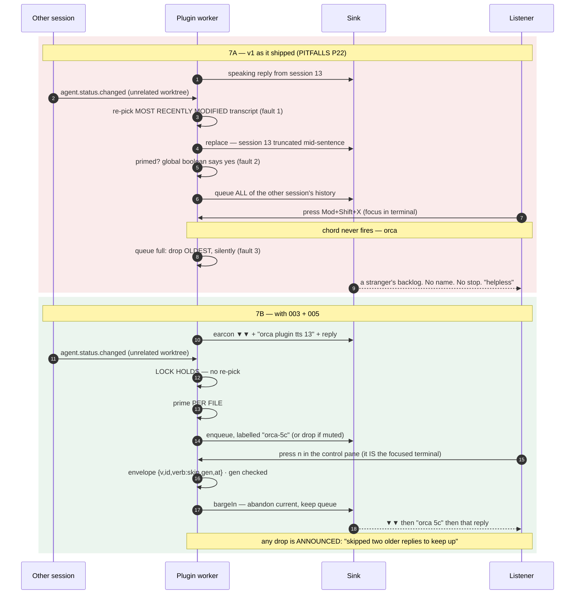
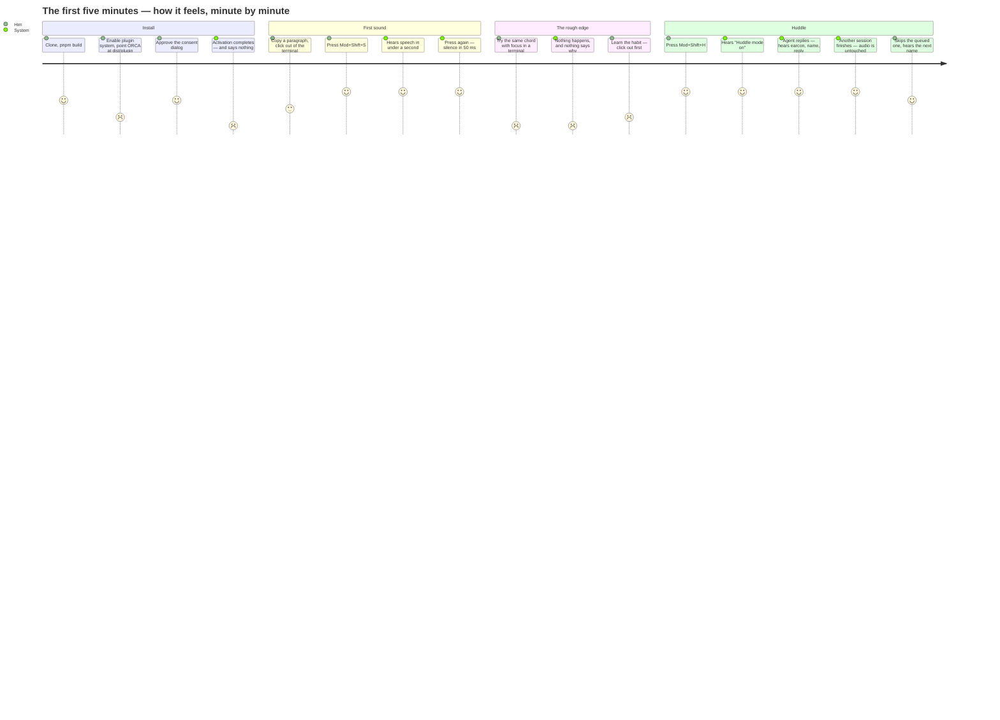

# 007 — User stories and flows

> **Status:** design input, written 2026-08-21. **Round** 2.
> **Reads as settled:** `HANDOFF.md`, `PITFALLS.md` P18–P28, `docs/.discussion/002-agent-spoken-channel.md`,
> `docs/.discussion/003-panel-and-control-channel.md`, `docs/design/004-voice-lab.md`,
> `docs/design/005-agent-identity.md`, `docs/TASKS.md`.
> **Produces:** 24 stories, a keyboard map, a first-five-minutes walkthrough, a list of
> anti-requirements, and — in section 30 — **eight contradictions between the designs**, which are
> the most valuable thing in this file.

---

## 0. How to read this document

**Who the user is.** One person. He is dyslexic and voice-first: he listens to agent replies rather
than reading them, because dyslexic adults match controls on *listening* comprehension while lagging
on reading (`HANDOFF.md` "THE MOST IMPORTANT THING TO KNOW"). He runs several agents at once, in
several worktrees. He wrote this plugin. He does not need a terminal explained. What he cannot do is
read a wall of text quickly, and what he will not tolerate is audio he did not ask for and cannot
stop — his own word for that state was **"helpless"** (P22).

**The honesty rule for every flow below.** A step that ends *"and he checks the log"* is a broken
step. He is not looking at a log; he is listening. Every flow ends in something he can **hear**, or
in a control he can reach **without looking**.

**Build state markers.** Where a story depends on something that does not exist yet, the step
carries a marker, so this document doubles as a gap list:

| Marker | Meaning |
|---|---|
| `[shipped]` | works today in v1, verified by a human on 2026-08-21 |
| `[M11]` … `[M17]` | designed, scheduled in `docs/TASKS.md` PHASE 2, not built |
| `[not built]` | no milestone owns it, or the milestone that owns it does not mention it |
| `[dead wire]` | the code exists and no caller can reach it — the P26 shape |
| `[contradiction]` | two design documents disagree; see section 30 |

**Audible vocabulary used throughout.** Earcons are two sine notes, 60 ms each, 20 ms apart
(`005` section 11.1). This document writes them as their motif so the flows stay concrete:

| Earcon | Notes | Means |
|---|---|---|
| ▲▲ rising | G5 → A5 | started · resumed · accepted |
| ▼▼ falling | E5 → C5 | stopped · skipped · ended |
| ▲▼ up-down | C5 → G5 → C5 | a switch of speaker |
| ● soft single | A5, low gain | paused heartbeat, every 30 s |
| ✖ dissonant | C5 + C♯5 | refused, degraded, error |

---

# PART ONE — THE STORIES

---

## US-01 — "I want to install this and hear it say something."

**Why he wants it.** He built a synthesizer that has never made a sound on the machine he is sitting
at. Until the first word comes out, everything else in this document is theory.

**The flow.**

1. He clones, `pnpm install`, `pnpm build`. `[shipped]`
2. In ORCA: **Settings → Plugins**, enables the plugin system (it is **off by default** —
   `HANDOFF.md` "Settled findings"), then **Development → Add**, and pastes the absolute path to
   **`dist/plugin`** — not `packages/plugin`, which contains workspace symlinks that escape the
   plugin root and make ORCA report the whole plugin **Invalid** with no indication which file
   (P17). `[shipped]`
3. ORCA shows the consent dialog listing four capabilities — `events:subscribe`, `storage`,
   `settings:own`, `notifications:show` — and the six declared chords. He approves.
4. **SYSTEM:** the worker activates, registers seven commands, resolves the provider in the
   background, and logs `read-aloud: ready (7 commands)`. **He hears nothing.** `[shipped]`
5. He clicks the ORCA sidebar (outside any terminal — see US-05) and presses `Mod+Shift+S`.
6. **SYSTEM:** clipboard is read, normalized, chunked, synthesized, played.

**What he hears.**

| Step | Heard |
|---|---|
| 4 | **nothing at all** — this is the defect, see below |
| 6 | whatever was on his clipboard, in the platform default voice |

**Step 4 is the story's finding.** Activation is silent. A plugin that has activated correctly and a
plugin that failed to register a single command sound *identical* — which is exactly the P18 shape,
where a wrong host API name degraded silently to success. The worker already logs a WARNING when
fewer than four commands register (`packages/plugin/src/main.ts`), but the log is unreachable to a
listener.

**Required:** activation ends with **one** spoken sentence, once per install, never on re-fork:
*"Read Aloud is ready. Seven controls. Press command shift S to read your clipboard."* `[not built]`

**When it goes wrong.**

- **He points ORCA at `packages/plugin`.** ORCA reports `Invalid`, `v0.0.0`, *"The plugin manifest
  or installed files are invalid"* — and does not say which file (P17). Nothing speaks, because
  nothing activated. **The only recovery is reading a dialog**, which is the one thing this project
  exists to avoid; the README's install section is therefore load-bearing accessibility text, not
  documentation.
- **He edits `main.ts` and rebuilds without bumping the version.** The worker is not re-forked and
  he debugs stale code (P6). `scripts/dev.mjs` bumps the manifest version on every build to force
  the re-fork; **Gate M5 is exactly this story** — change a string, run the script, hear the *new*
  string. `[shipped]`

**Done when.** From a clean ORCA profile on a second machine, install → first audible word, with no
step that requires reading an error dialog. (This is **Gate M8**, and T086/T087 are still open, so
the story is not done today.)

---

## US-02 — "I installed it on my Linux box and it made no sound and said nothing."

**Why he wants it.** This is P25, and it is the worst failure the project has had: on stock Ubuntu
24.04 the plugin produced **no sound at all, with no error he could see**, because `listVoices()`
returned `[]` from a bare `catch` and `generate()` threw into another one. Silence is
indistinguishable from "not installed", from "muted", and from "crashed".

**The flow, as it must now behave.**

1. He installs on a stock Ubuntu 24.04 desktop and presses `Mod+Shift+S`.
2. **SYSTEM:** the provider walks the Linux ladder. `/usr/bin/espeak-ng` is absent — the image ships
   `libespeak-ng1` and `espeak-ng-data`, because speech-dispatcher's backend links them, but not the
   CLI, which lives in its own package (P25). `spd-say` **is** present.
3. **SYSTEM:** falls to the `spd-say` rung, where speech-dispatcher owns playback — a deliberate,
   announced exception to "providers never play", taken because silence is worse for assistive tech.
   `[shipped]`
4. **SYSTEM speaks, through that floor rung:** *"Read Aloud is using the system speech service.
   Quality and interruption are limited. Install one with: sudo apt install espeak-ng."* `[shipped]`
5. Then it reads his clipboard.

**What he hears at each step.** Step 4 is the entire story. Before P25 was fixed, steps 2–5 were
silence. The degradation notice is not a nicety — it is the difference between a working product and
an apparently-dead one.

**When it goes wrong.**

- **Neither `espeak-ng` nor `spd-say` exists** (a headless box, a container, a GitHub Actions
  runner — `actions/runner-images` has zero references to `espeak`, `speech`, `alsa` or
  `pulseaudio`, P16). `LinuxSpeechUnavailableError` names every rung it tried and carries the install
  hint. **But there is no synthesizer to speak the message with**, so it can only arrive as an ORCA
  notification — the one place in this document where the answer is not audible, and it is
  unavoidable. `[shipped]`
- **The Linux voice list lies.** `listVoices()` returns `spd-say --list-synthesis-voices` output
  while synthesis prefers `espeak-ng`; assigning one of those names produces the wrong voice or none
  (`005` F7 — *a live defect, not a hypothetical*). `[not built]`
- **Barge-in does not stop it.** On the `spd-say` rung, killing our client does not stop the daemon;
  Stop must also send `spd-say --cancel` (P25). If that is missed, **Stop is a button that does
  nothing** on the exact platform where the user is already least served.

**Done when.** On a stock Ubuntu desktop with no `espeak-ng`, a first press produces *either* speech
*or* a spoken/notified named reason within two seconds. Never silence. Verified by effect: run the
probe from P25 (`command -v espeak-ng espeak spd-say`) before and after.

---

## US-03 — "Everything sounds like 2005 and nobody told me I could fix it."

**Why he wants it.** MEASURED: all 180 installed `AVSpeechSynthesisVoice` objects on his machine
report `quality == .default` — the lowest tier (`005` section 11.6). Enhanced and Premium voices are
free, Apple-hosted, one-time downloads he must initiate himself. The same shape exists on Windows
(Narrator natural voices) and Linux (`apt install espeak-ng`). **Quietly sounding bad is a silent
degradation**, and the project's own rule forbids those.

**The flow.**

1. He turns on huddle and listens to a reply.
2. **SYSTEM** notices, once, that no installed voice is above the basic tier.
3. **SYSTEM speaks, once, never repeated, dismissible:** *"Your system voices are the basic tier.
   Higher-quality voices are a free one-time download — System Settings, Accessibility, Spoken
   Content, Manage Voices."* `[M15]`
4. He installs three Premium voices.
5. He presses **Rescan voices** — in the Voice Lab and in the panel, sitting *next to* the notice
   that told him to install them, because the user who just installed a voice is the user who will
   press it. `[M15]`
6. **SYSTEM:** recomputes the host fingerprint. It changed. The assignment map is discarded, and
   the system says so: *"Voices were reassigned after a system change."* `[M15]`

**What he hears.** Step 3 once. Step 6 once. Nothing else — the voice list is **never polled**, because
`say -v '?'` costs ~450 ms MEASURED against a ~500 ms first-audio budget, and a 450 ms poll for a
twice-a-year event is a tax, not a check (`005` section 9.1, P28).

**When it goes wrong.**

- **macOS cannot report quality without a sidecar.** `say -v '?'` does not expose it; only
  `AVSpeechSynthesisVoice.quality` does. So on macOS this notice is implementable only via the Swift
  sidecar, or by the weaker proxy of "no voice name outside the known compact set" (`005` Q51).
  **On the author's own platform, the story he most needs is the one hardest to build.** `[not built]`
- **He picks a voice that does not exist.** `say -v NotAVoiceAtAll` exits 0 and writes byte-identical
  audio to the default voice — a silent wrong-voice lie, the P18 shape. The lab must verify by
  effect: synthesize a two-word probe under the chosen voice and under the platform default and
  compare the bytes; identical bytes → *"that voice did not take; the system substituted its
  default."* `[M11]`

**Done when.** On a machine whose voices are all basic tier, the notice is spoken exactly once per
install, and pressing Rescan after an install produces an audible reassignment sentence.

---

## US-04 — "I want to hear what is highlighted without reading it."

**Why he wants it.** The original feature and the reason the project exists. He selects a paragraph
and would rather hear it than read it.

**The flow.**

1. He copies the text he wants (⌘C), because **ORCA's plugin API cannot deliver the selection** —
   verified, not merely undiscovered, and raised upstream as the `selection:read` capability
   (T102). The honest substitute is the clipboard. `[shipped]`
2. He clicks outside any terminal, then presses `Mod+Shift+S`.
3. **SYSTEM:** reads the clipboard per OS (`pbpaste` / `Get-Clipboard` / `wl-paste`→`xclip`→`xsel`),
   normalizes it through 16 stages, chunks it — first chunk is the earliest sentence end, so audio
   starts before the rest is synthesized — and plays.
4. He presses `Mod+Shift+S` again. **SYSTEM:** stops within a measured 50 ms (Gate M6). `[shipped]`

**What he hears.**

| Situation | Heard |
|---|---|
| ordinary text | the text, first sentence within ~500 ms on a warm engine |
| empty clipboard | *"the clipboard is empty"* — a spoken notice, never silence `[shipped]` |
| 50,000-character clipboard | truncated at 20,000 chars, and **it says so** `[shipped]` |
| a fenced code block in the text | *" . Here, a code block is omitted. "* — its own sentence, so the engine pauses either side of it `[shipped]` |
| a URL | *"a link to github dot com"* — the destination, not silence. Before this fix, URLs vanished with no warning (`HANDOFF.md` "What listening taught us") |
| `packages/core/src/normalizer/index.ts` | *"file named index, typescript, in folder packages core src normalizer"* — name first, kind last, folder announced. Before this fix paths "made no sense whatsoever" |

**When it goes wrong.**

- **Focus is in a terminal.** Nothing happens at all, silently. See US-05 — this is the single most
  important unhappy path in the document.
- **`say` is cold.** `say ""` — empty string, zero synthesis — costs a measured 414 ms median (P10).
  That is 8× the entire Piper synthesis time and eats most of the R4.2 budget before a sound is made.
- **The second press does not stop it.** `speak()` is single-flight and a second press stops
  (`isSpeaking → stop()`). If that ever regresses, he presses again, and **a control that must be
  pressed twice teaches him the control is unreliable** — which is the helplessness of P22 (`003`
  Q13, reason 1).

**Done when.** On each OS, the hotkey speaks the clipboard and a second press silences it within a
**measured** 50 ms — measured elapsed, not exit code.

---

## US-05 — "I pressed Stop and nothing happened, and nothing told me nothing happened."

**Why he wants it.** He spends his entire day with focus in an agent terminal. **A plugin hotkey is
dead in exactly the situation where Stop is needed.** This is not a bug in the plugin: plugin chords
are dispatched only when the keybinding context is `app`, and the context is `'terminal'` whenever
the xterm textarea holds focus (`003` F6, upstream stablyai/orca#15642). Built-in ORCA actions get a
policy escape hatch and an `allowInTerminal` flag; **plugin commands reach neither.**

**The broken flow, today.**

1. Huddle is reading a long reply he does not want.
2. Focus is in his agent's terminal, where he was typing.
3. He presses `Mod+Shift+X`.
4. **SYSTEM: nothing.** No refusal, no earcon, no notification. The reply keeps playing.
5. He presses it again, harder. Still nothing.
6. He starts looking for the mouse — which is the moment the assistive property is lost.

**What he hears at step 4: nothing, which is the defect.** A dead control that says nothing is worse
than no control, because it consumes the seconds during which he still believed he had one.

**The flow as designed.** Four physically distinct routes converge on **one** worker entry point,
`control.stop({generation})`, so there is one implementation, one generation counter, one
confirmation (`003` section 2):

| # | Route | Survives terminal focus | Press → silence |
|---|---|---|---|
| 1 | keypress `s` in the control pane — it *is* the focused terminal | **yes** | ~20–60 ms |
| 2 | panel **STOP** button (mouse — a click has no keyboard-focus problem) | **yes** | ~40–120 ms |
| 3 | plugin hotkey `Mod+Shift+X` | **no** | ~20–50 ms *when it fires at all* |
| 4 | command palette entry, or `orca-tts stop` in any shell | yes | seconds |

Routes 1 and 2 are `[M13]`. Route 3 is `[shipped]` and must **never** be documented as *the* way to
stop. Route 4's palette half is `[shipped]` (ORCA lists plugin commands in `cmd-j`), the CLI half is
`[M13]`.

**When it goes wrong.**

- **The control pane is not open in this worktree.** There is no `terminal.create` among the thirteen
  host methods, so he must open it by hand, and `terminal.sendText` refuses a terminal outside the
  **focused** worktree — so it is one control pane *per worktree* (`003` Q43, Q44). The panel must
  render this as a **named** state with the remedy attached — *"no control pane in this worktree —
  open a terminal here and run `orca-tts control`"* — with the buttons **disabled**, never hidden and
  never enabled-but-inert. A button that lies is P18 reproduced in a UI (`003` section 5).
- **A stale Stop silences the wrong reply.** He stops utterance 7; the message arrives 900 ms late;
  utterance 8 has begun; the system silences a reply he wanted. Refused as `stale_generation` by
  comparing generations, not clocks (`003` section 3, R2/R4).
- **The panel says `accepted: true` and nothing stops.** `{accepted}` is *transport*, not effect.
  Treating it as success is P18 exactly. The confirmation he actually gets is the **silence itself
  plus ▼▼**, in the audio channel, because the panel is read-blind.

**Done when.** A harness starts a 30-second utterance, presses Stop at a known wall-clock instant,
and asserts the sink produced **no samples** after `press + 250 ms`. A test that only asserts
`accepted: true` could not have failed and is therefore not a check.

---

## US-06 — "I want agent replies read to me as they land."

**Why he wants it.** This is the feature he actually asked for. He is not going to read the reply.

**The flow.**

1. He presses `Mod+Shift+H` (outside terminal focus).
2. **SYSTEM speaks:** *"Huddle mode on."* — spoken, not just notified, because speech is the one
   status channel that always works for him. `[shipped]`
3. **SYSTEM:** marks everything already on disk as heard, per file. Enabling huddle **never reads
   history**. `[shipped]`
4. His agent finishes a turn. `agent.status.changed` fires on the working→done edge.
5. **SYSTEM does not speak on the edge.** The agent CLI flushes its final message to the transcript
   JSONL *after* that event, so reading "the newest reply on disk" at `done` gets the **previous**
   turn — consistently one behind (P20). Instead the event starts an `fs.watch` with a 250 ms
   debounce, held open 20 s past the event. `[shipped]`
6. The reply appears on disk. **SYSTEM** decodes it, **filters thinking blocks at the raw JSONL
   level** — before ORCA's decoder flattens them into text blocks, or huddle speaks the model's
   chain of thought aloud — normalizes, and queues it with its session label. `[shipped]`
7. **He hears:** *"Now reading from orca plugin tts, session 111693de."* then the reply.

**What he hears — and the problem in step 7.** `111693de` is eight hex characters read aloud to a
dyslexic listener: no syllable structure, no meaning, no error correction. Mishear one character and
he has learned nothing, and it is unstable across sessions in the same project so it never becomes
familiar (`003` Q28, `004` row 40, `005` section 11.2). The replacement chain is
registry `name` → branch → displayName → call-sign, and **never, under any circumstance, hex**.
`[M13]` / `[M15]` — and see `[contradiction]` C4.

**When it goes wrong.**

- **Two agents in one worktree.** The event carries no session id (upstream #15639; PR #15640
  projects one). Correlation is a heuristic on the worktree path plus most-recently-modified
  transcript. When two transcripts are touched within 2 s the system **degrades loudly**:
  *"two agents are active in this worktree, so huddle cannot tell which one replied. Speaking the
  most recent."* `[shipped]`
- **The worker is reaped.** ORCA reaps an idle worker after 5 minutes. Huddle's on/off state and its
  spoken-id set are persisted (bounded to 300) and restored on activate; without that, huddle
  silently turns itself off and already-spoken replies look new again (P20). `[shipped]`
- **A reply arrives mid-utterance.** It **queues**; it does not cut the previous one off. `speak()`
  takes a mode: hotkey `replace`, huddle `queue` (P21). `[shipped]`

**Done when.** A fixture containing both thinking and reply blocks speaks **only** the reply, and a
real agent turn is spoken end to end with no thinking text audible. (Gate M7, green.)

---

## US-07 — "Another session cut mine off, and then read me its entire history." (THE P22 STORY)

**Why he wants it.** His own words, reported live:

> *"the message you just sent was cut off by another session's reply… it read many of its replies
> and not a single one… this is really confusing what it is even reading."*

and, in the same session:

> *"a way to control something and not feel helpless and suffer hearing random stuff."*

This is the story the panel design (`003`) and the identity design (`005`) exist to fix. Both flows
are written below, deliberately adjacent, because the comparison is the clearest argument either
document has.

### 7A — The old flow, as it actually happened

1. Huddle is reading a reply from the session he is working in.
2. An **unrelated** agent, in a different worktree, finishes a turn.
3. **SYSTEM:** `agent.status.changed` fires. Huddle re-picks *the most recently modified transcript
   anywhere* — fault 1.
4. **SYSTEM:** his reply is **cut off mid-sentence**.
5. **SYSTEM:** backlog priming is a single global boolean, so the new file looks "already primed" —
   fault 2 — and every reply in its history counts as fresh.
6. **SYSTEM:** reads out that session's **entire backlog**, in order, without stopping.
7. He presses the only control he has. Focus is in a terminal; the chord does not fire (US-05).
8. Meanwhile the queue overflows and **silently drops the oldest utterance** — fault 3 — which is
   the reply he was actually waiting for. He is never told.

**What he hears:** his own reply truncated, then a stranger's history, in a voice that never says
whose words these are, with no working interrupt and no announcement that anything was lost. He
described the state as **helpless**.

### 7B — The new flow, same events

1. Huddle is reading a reply from `orca plugin tts 13`, which it is **locked** to. Identity was
   spoken at the start of the turn — earcon ▼▼ (that session's motif), then *"orca plugin tts 13"*
   — and is **not** repeated on every chunk, because prefixing every chunk turns identity into noise
   (`003` section 6). `[M13]`
2. The unrelated agent finishes a turn.
3. **SYSTEM:** the lock holds. Huddle stays on session 13. It does **not** re-pick the newest
   transcript. `[shipped]` — this half of the P22 fix is in v1.
4. **SYSTEM:** the other session's reply is queued **labelled with its own session**, or dropped if
   that session is muted. `[M13]` for the label surface; per-session mute is `[M16]`.
5. The control pane shows, in fixed-height regions that never reflow:
   `NOW READING  plugin-tts-13`, a live per-word cursor, `QUEUE 1 waiting · orca-5c`, and the
   pre-reserved **STOP** slot on the same line it is always on. `[M13]`
6. He does not want the queued item. He presses **`n`** in the control pane — the pane *is* the
   focused terminal, so there is no keybinding problem at all.
7. **SYSTEM:** ▼▼, then the next item's session name.
8. If the queue had overflowed, **SYSTEM says so**: *"skipped two older replies to keep up"* —
   buzz's rule (truncate and append *"... message truncated"* **in the audio**) generalized: every
   omission is announced in the audio stream, because the listener cannot see a log.

**What he hears in 7B, in order:** ▼▼ · "orca plugin tts 13" · the reply · (nothing from the other
session unless he asked for it) · ▼▼ on his skip · the next speaker's name.

**The old-versus-new sequence.**



**When it goes wrong, even in 7B.**

- **A muted session accumulates a silent queue.** This is P22 with a new name: unmute after ten
  minutes and he is buried in stale replies he cannot stop. Mute must be a **speech filter, not a
  delivery filter** — dropped from the speech queue, retained in the replay buffer, count announced,
  **never auto-played on unmute** (`003` Q30).
- **Pause has the same shape.** After 120 s paused, the queued backlog moves to replay and the system
  says so once; resume announces *"resuming; two replies waiting"* before it speaks (`003` 8.7).
- **He cannot choose which session to follow.** See US-08 — this is a live gap.

**Done when.** With two sessions running in different worktrees, a reply from the unfollowed one is
audibly labelled or audibly absent, never spoken over the followed one; and a forced queue overflow
produces a spoken sentence naming how many replies were dropped.

---

## US-08 — "I want to follow that other session instead." `[dead wire]`

**Why he wants it.** Locking onto one session fixed P22's first fault, but locking with no way to
choose replaces "it follows the wrong one" with "it follows the first one that spoke and I cannot
move it".

**The flow he needs.**

1. He hears session 13 speaking; he wants `orca-5c`.
2. He presses a **follow** control and picks from a roster of live sessions.
3. **SYSTEM:** ▲▼ (switch motif), then *"Now reading from orca 5c."*
4. Subsequent replies come from that session only.

**What is actually shipped.** `HuddleController#switchTo(file)` exists, sets the lock, notifies, and
speaks *"Now reading from {label}."* — **and no caller anywhere invokes it.** Grep confirms exactly
three hits: the source declaration and its two build artifacts. There is **no `follow` command in
the manifest**, only `read-aloud.unfollow`.

**So the only way to change session today is:** press `Mod+Shift+L` to unfollow, then wait, and let
huddle re-lock onto whichever transcript is modified next. He cannot choose; he can only re-roll.

**This is the P26 shape exactly** — a feature implemented, defensible-looking, with nothing
connecting it to a caller. P26's rule applies verbatim: for anything a user is meant to reach, test
**reachability end to end** from the outermost object a caller constructs. `switchTo` has never been
walked from a keypress to an effect.

**When it goes wrong.**

- **He unfollows and no session speaks again for ten minutes.** Huddle is on, following nothing, and
  **silent** — indistinguishable from crashed. `[not built]` — the same defect as a pause with no
  heartbeat (`003` 8.7 rule 4).
- **`follow` names a session that has died.** Refused as `session_gone`, **announced aloud** —
  liveness must come from `kill(pid,0)` or the messaging socket, **never** from `updatedAt`, which
  is edge-written and goes stale on a crash (`003` F5, `005` 7.1).

**Done when.** A `follow` verb exists in the envelope, is reachable from the control pane, the
palette and the panel, and a switch is always audible in some form. (`005` section 13 makes this a
correctness rule, not a preference: *"a switch is always audible."*)

---

## US-09 — "Stop. Now."

**Why he wants it.** *"Reading something you didn't ask for and can't stop is worse than silence"*
(P22). Every autonomous speech path needs an interrupt reachable in **one keystroke**.

**The flow.**

1. Something is being read that he does not want.
2. He presses `s` in the control pane, **or** clicks STOP in the panel, **or** presses
   `Mod+Shift+X` if focus happens to be in `app` context.
3. **SYSTEM:** checks the envelope — duplicate `id`? ignore. `gen` older than current? refuse
   `stale_generation`. Older than 5,000 ms by `at`? refuse `expired`.
4. **SYSTEM:** captures the cursor offset **before** bumping the generation, or the offset dies with
   the utterance (`003` 8.6 — one line, easy to get wrong, invisible until someone asks "where did
   it stop?").
5. **SYSTEM:** bumps the generation, clears the pending queue, cancels **in-flight synthesis**, and
   flushes buffered audio. Barge-in is not "kill the player" — without cancelling synthesis the
   synthesizer keeps producing speech for text he already interrupted.
6. **He hears silence, then ▼▼.**

**Latency, as a hard budget.** p50 ≤ 120 ms · p99 ≤ 250 ms · **above 400 ms fails CI** (`003` Q13).
The number is perceptual: past roughly 250–300 ms people stop attributing the silence to their own
press and press again, and a Stop that has to be pressed twice teaches him the control is
unreliable. Two consequences that are not negotiable:

- **The barge-in must interrupt mid-chunk.** A Stop implemented as "check the flag between chunks"
  is up to **2,000 ms** — eight times over budget, and *variable*, so it feels random.
- **Stop is a push, not a poll.** The panel poll floor is `10,000 / 30 = 333 ms`, and one slot per
  window belongs to the watchdog, so worst case is ≈ **495 ms** before the cancel-and-drain even
  starts. Double the budget. This stays true even after `storage.get` becomes panel-callable.

**When it goes wrong.**

- **On the Linux `spd-say` rung, killing our client does not stop the daemon.** Stop must also send
  `spd-say --cancel` (P25). Otherwise Stop is a control that visibly does nothing on the platform
  already worst served.
- **He presses Stop three times in a row, nervously.** Idempotent by `id`; the worker keeps the last
  64 and a repeat is acknowledged and otherwise ignored (`003` R1).
- **He wants to know what he missed.** With a recorded offset: *"stopped four words into the second
  sentence — press R to replay from there."* **A control you are afraid to press is a control you do
  not have**, so this materially improves the thing P22 was about. `[M13a]`

**Done when.** The latency harness above passes on all three OSes, and the confirmation earcon is
asserted **on the sink**, not on a log line.

---

## US-10 — "This is the wrong reply. Move on."

**Why he wants it.** Stop is total; skip is surgical. When three replies are queued and the current
one is useless, stopping throws away the two he wanted.

**The flow.**

1. Current utterance is wrong. He presses `n` in the control pane (or `Mod+Shift+K`, focus
   permitting). `[shipped]` for the chord; `[M13]` for the pane.
2. **SYSTEM:** bumps the generation, **keeps the queue**, abandons the current utterance.
3. **He hears:** ▼▼, then the next item's **session name**, then that reply.

**Skip versus stop versus pause versus mute, stated once:**

| Control | Generation | Queue | Current utterance | Audible confirmation |
|---|---|---|---|---|
| Stop | bumped | **cleared** | abandoned | silence, then ▼▼ |
| Skip | bumped | **kept** | abandoned, next begins | the next item's session name |
| Pause | **unchanged** | kept, still growing | **held, position kept** | ● then silence |
| Mute (per session) | unchanged | that session's items dropped | finishes | count announced |

**When it goes wrong.**

- **A stale skip skips the wrong utterance.** Refused as `stale_generation`; **never** skip the
  current item on a stale press — that is the exact "wrong utterance" bug (`003` R4).
- **He skips the last item.** He hears ▼▼ and then nothing — indistinguishable from a crash. The
  system must say *"nothing else waiting"* rather than going quiet. `[not built]`

**Done when.** A property test generates interleavings of `speak → skip → speak` with the skip
delayed 0–2,000 ms and asserts **no utterance whose generation is newer than the skip's `gen` is
ever abandoned**.

---

## US-11 — "Wait. Let me think about that sentence." `[M13]`

**Why he wants it.** *"Reading something you didn't ask for and can't stop"* is answered by Stop.
*"Wait, let me think about that"* is answered by **nothing we ship today**. Stop loses the position;
pause keeps it. All three platforms have a real pause — macOS `pauseSpeaking(at: .word)` (finish the
current word, then pause), Windows `Pause()`/`Resume()`, Linux SSIP `PAUSE`.

**The flow.**

1. Mid-reply, he presses **Space** in the control pane (`p` is an alias, for terminals that swallow
   Space).
2. **SYSTEM:** finishes the current **word**, then holds. The generation is **not** bumped — that is
   precisely what distinguishes pause from stop.
3. **He hears:** ● then silence.
4. Every 30 s: **●**. *"A pause with no heartbeat is indistinguishable from a crash"* — to a listener
   who is not looking, **paused** and **dead** are the same experience.
5. At 120 s: **SYSTEM speaks once:** *"paused two minutes; six replies moved to replay."*
6. He presses Space again. **SYSTEM:** *"resuming; two replies waiting"* — **announces before it
   speaks**, and never floods.

**When it goes wrong.**

- **The provider cannot pause.** `cancel()` today is `SIGKILL` on the child: a hard stop with no
  position. The provider interface must grow `pause()`/`resume()`, and any provider that cannot
  honour them must **refuse by name** (`pause_unsupported`) rather than silently mapping pause onto
  stop. **Silently mapping pause onto stop is P18 with a friendlier label** (`003` 8.7, Q50).
- **Pause is a level, not an edge.** Never stale; `resume` when not paused is a no-op.
- **The transport key means something else in the Voice Lab.** See `[contradiction]` C1.

**Done when.** A test asserts (a) a paused worker emits a heartbeat earcon within 35 s, **asserted on
the sink**; (b) resume after a 130-second pause speaks the announcement and **not** the backlog.

---

## US-12 — "Say that again." `[not built]`

**Why he wants it.** He was half-listening. A reply went past. On a screen he would scroll back; in
audio there is nothing to scroll.

**The flow.**

1. He presses `R` in the control pane; `↑` `↓` choose among the last 20.
2. **SYSTEM:** speaks the item's session name, then replays it from the buffer.
3. From a stop, `R` replays **from the recorded cursor offset**, not from the beginning — which is
   what makes Stop cheap to press. `[M13a]`

**What is there today.** `read-aloud.speak-last-reply` re-reads the newest reply from disk. That is
not replay: it cannot reach the reply before it, it cannot reach a muted session's reply, and it
re-reads whatever is newest *now*, which after a switch may not be what he heard.

**When it goes wrong.**

- **The buffer is empty after a worker re-fork.** ORCA reaps an idle worker after 5 minutes. The
  last-20 buffer must live in plugin storage like the spoken-id set, or replay is a control that
  works only when he did not need it (P20).
- **A muted session's replies must be in the buffer**, or mute becomes a delivery filter and text is
  genuinely lost (`003` Q30, rule 2).

**Done when.** After muting a session for ten minutes, `R` can reach a reply that was never spoken,
and the buffer survives a forced worker re-fork.

---

## US-13 — "Not from that one. I am not working there right now." `[M16]`

**Why he wants it.** Three sessions run; one is a long CI-watching agent that says something every
forty seconds. He does not want it silenced forever — he wants it out of his ear for the next hour.

**The flow.**

1. He presses `m` in the control pane while `orca-5c` is highlighted, or clicks `[ mute ]` beside its
   row in the panel.
2. **SYSTEM:** the current utterance **finishes** — mute is not an interrupt. Subsequent replies from
   that session are **never enqueued for speech**, but **are** appended to the last-20 replay buffer
   with their session label.
3. The control pane shows *"2 skipped while muted"*, continuously.
4. He unmutes an hour later. **SYSTEM speaks one sentence:** *"three replies were skipped while
   muted; press R to replay"* — and then **goes quiet. It never auto-plays the backlog.**

**Why not queue silently.** Queueing is P22's third fault with a new name: a muted session
accumulating a silent queue is a loaded gun. The usual objection — that text is lost — is false: the
replies are on disk in the transcript, and the buffer holds them. **Mute is a speech filter, not a
delivery filter.**

**When it goes wrong.**

- **Mute does not survive a worker re-fork.** It must live in plugin storage, like huddle's enabled
  flag, or a five-minute idle reap unmutes the agent he silenced (P20).
- **Mute is treated as an edge.** It is a level: a repeated mute is a no-op, last write wins.

**Done when.** Muting a live session, waiting past the 5-minute reap, and observing that its replies
are still not spoken — and that the skipped count is announced on unmute.

---

## US-14 — "Stop following anything. I need quiet."

**Why he wants it.** Sometimes the right answer is not stop and not mute, but "leave me alone until I
ask again".

**The flow.**

1. He presses `Mod+Shift+L`.
2. **SYSTEM:** clears the lock, stops watching, notifies *"No longer following any session"*, and
   **speaks** *"Stopped following that session."* `[shipped]`
3. Huddle stays **on**. It goes quiet until a session speaks again — at which point it re-locks onto
   whichever transcript is newest.

**The trap in step 3, and it is his own trap.** *Unfollow* and *huddle off* sound identical from the
listener's chair: both produce silence. The difference only appears later, when unfollow
spontaneously starts speaking again from a session he did not choose. `Mod+Shift+U` (status) is the
only way to tell them apart, and it requires a hotkey that does not fire in terminal focus.

**Required:** while huddle is on and following nothing, the system must be distinguishable from
silence — the same argument as the paused heartbeat. `[not built]`

**When it goes wrong.**

- **He meant to turn huddle off.** He presses `Mod+Shift+L`, gets silence, walks away, and forty
  minutes later an agent reply speaks into an empty room. Nothing is broken; nothing was wrong; and
  the system did the thing he did not expect. That is the "audio I did not ask for" failure arriving
  through a control he *did* press.

**Done when.** `Mod+Shift+U` distinguishes *huddle off* from *huddle on, following nothing* in one
spoken sentence — which it does today: *"Huddle mode is on."* with no *"Following …"* clause. It is
correct and it is too subtle; the absence of a clause is not audible as an absence.

---

## US-15 — "Paths sound wrong and I want to fix it myself, by ear, now." `[M11]`

**Why he wants it.** His own words, and the reason M11 is first and alone:

> *"I want to refine it myself manually through some kind of a configuration normalization UI with
> real tests I can hear over and over again."*

Six rounds of "does this sound better?" over chat did not converge, each costing a rebuild, a
refresh, a reply and a listen; feedback arrived after the context was gone (P23). **Do not tune
defaults by ear over chat. Ship the mechanism and let the listener choose the values.**

**The flow — a full session, from complaint to shipped setting.**

1. `pnpm voice-lab`. A Node server binds `127.0.0.1` and serves one self-contained page, importing
   the **TypeScript source** of `normalize()` and the real `OsSynthProvider` — **not**
   `packages/core/dist/`, which is tracked and two normalizer commits stale, and would tune a
   normalizer that is not the one that ships.
2. He picks fixture `paths.md` and presses **Space**.
3. **SYSTEM:** normalize → chunk → synthesize on the server; base64 WAV chunks returned; the browser
   decodes once and schedules them back-to-back on one `AudioContext`. **He hears:**
   *"see file named index, typescript, in folder packages core src normalizer, now."*
4. He hears the problem: *"in folder packages core src normalizer"* is four folders of flat word
   list, and by the third he has lost the first.
5. `↓` `↓` to **How much of the folder**, then `→`.
6. **SYSTEM speaks, in the voice being tuned:** *"path depth, last two folders."* — control name,
   then value, nothing else, debounced 250 ms in `replace` mode so dragging a slider does not queue
   thirty confirmations (the P21 lesson).
7. **Space.** Cache hit on the unchanged prefix; new synthesis only for what changed. **He hears:**
   *"see file named index, typescript, in folder src normalizer, now."*
8. Unsure whether it is better, he presses **`C`**. **SYSTEM:** plays A, a 300 ms earcon, then B —
   showing only "first" and "second", never which is which.
9. On stop, **SYSTEM speaks:** *"first was your current set; second was path depth, last two
   folders."* — the **single differing control** is named, not the whole set.
10. He presses **`2`**. That set becomes current.
11. **`S`** snapshots it. **Save to plugin** writes `~/.orca/read-aloud/settings.json`, which is the
    file the plugin reads — the export format **is** the settings format, because Q35 resolved
    negative: ORCA's settings capability renders nothing at all, so there is no host settings form to
    target. M11 and M12 fuse at the schema.
12. He goes back to ORCA, and huddle reads the next reply with two-folder paths.

**What he hears at each step.** Steps 3, 6, 7, 8, 9 are all audio. **He never has to read the diff to
operate the lab** — the diff is a confirmation for the times he *is* looking, not the interface.

**When it goes wrong.**

- **`POST /speak` throws, or the platform has no synthesizer.** `503` with the provider's error text,
  and the page **says so aloud and in text**. Never a silent dead Play button.
- **He picks a voice the system silently substitutes.** The byte-comparison probe from US-03 catches
  it: *"that voice did not take; the system substituted its default."*
- **He tunes pacing against a floor that does not exist.** The lab does not reproduce v1's ~970 ms
  inter-chunk gap, so `pace.simulateChunkGapMs` exists with presets `0` (M9 target) and `970` (v1
  macOS, measured) so he can hear either world. Whether simulating a defect we intend to delete
  encourages tuning against it is open (`004` Q44).
- **The round-trip test passes for the wrong reason.** T113 must include the negative control:
  mutate one field (`pathDepthN`) and assert the comparison now **fails**. A round-trip test that
  cannot fail is a check that both sides read the same file.
- **The exported file does not reach the code.** P26: `SynthesizeOptions.voice` and `.rate` were
  declared, implemented on all three platforms, provider-tested — and **no caller could reach them**,
  because `SpeechService` called `provider.generate(chunk.text)` with no options at all. The two
  settings every user asks for first were unsettable in the shipped plugin, and nothing was red.
  T124 must iterate the **whole four-section schema**, not `NormalizeOptions` alone, or the assertion
  is green today while rate, voice and chunk size stay unreachable.

**Done when — this is Gate M11 as a story.** He changes a control and hears the difference in **under
two seconds**, without touching ORCA. What would prove the design wrong: a fixture that takes longer
than two seconds from keypress to audio on his machine. The status bar must show cold versus warm
elapsed ms — an indicator that never changes is a broken indicator, and this one must show the cold
path being slower than the warm one, or it is not measuring anything.

---

## US-16 — "The agent described its own diagram in one sentence, and that is what I heard." `[M14]`

**Why he wants it.** Huddle speaks the **whole** reply, which is correct when the reply is prose and
wrong when it is an artifact: an ASCII diagram is spoken as box-drawing characters, a table cell by
cell, a stack trace as punctuation.

**The flow — the cooperating agent.**

1. The agent has been told the convention (via a snippet **he** pasted into his own `CLAUDE.md` — we
   document it, we **never write to it**; writing to a user's agent config from a plugin is the exact
   hazard ORCA's consent model exists to prevent). It ends its reply with:

   ````
   ```speak
   The worker talks to the resident service over loopback. Two boxes, one arrow.
   ```
   ````
2. **SYSTEM:** `fs.watch` fires, the reply is decoded, `extractSpeak(text)` returns the block.
3. **SYSTEM:** applies his policy — `spoken-only` · `spoken-then-prose` · `prose-only` ·
   `agent-decides`. **He owns the policy; the agent may only express a preference.**
4. **He hears:** *"The worker talks to the resident service. Two boxes, one arrow."* **The diagram is
   never spoken.**
5. If the marker replaced 900 words of prose, **he is told that it did.** Every omission is announced
   in the audio stream.

**When it goes wrong.**

- **The fence is announced as a code block.** Today, `stripFencedCode` with the default `'announce'`
  policy would substitute *" . Here, a code block is omitted. "* — so **an agent emitting a
  ```speak block into ORCA today would be met with the disqualifying failure mode arriving through
  the front door.** The `speak` info string must be stripped **silently and unconditionally**,
  independent of the `codeBlocks` policy. This is a correctness fix owed regardless of M14.
- **The fence is opened and never closed.** Today `stripFencedCode` swallows the remainder and
  announces a code block — he loses the rest of the reply. Must extract to end-of-message and be
  announced as **truncated**, never dropped.
- **`agent-decides` with an unknown annotation.** Degrades to `also` (supplement), never to
  `replace`, because supplementing can only add information and replacing can remove it.
- **The sighted reader sees the fence.** We do not own the renderer and cannot hide it. The
  mitigation is a convention property: **one short block, at the very end, two sentences maximum** —
  a trailing two-line fence is a footnote; an opening one is an interruption.

**Done when.** T143's fixture — a reply with an ASCII diagram plus a one-line description — is spoken
as the description. And the counter reads *"spoken channel used in 1 of 1 replies"*.

---

## US-17 — "The agent has never heard of this plugin, and it still sounded fine." `[M14]`

**Why he wants it.** **This is the common case, and it will stay the common case.** Adoption
requires: the plugin system enabled · the plugin installed and consented · the six-line snippet found
and pasted · in scope for this repo · and the agent actually following it, as one instruction among
hundreds with no tool call to anchor it and no error if ignored. Steps three to five have no
enforcement anywhere. **Assume the cooperation rate is near zero.**

**The flow — the non-cooperating agent.**

1. The agent replies with prose plus an ASCII diagram. No marker.
2. **SYSTEM:** `extractSpeak(text)` → NOT FOUND → **identity function.** No error, no sigil, no
   silence.
3. **SYSTEM:** the structural classifier runs over the whole reply — prose kept, artifacts skipped.
4. **He hears:** the prose, then a **named** announcement of what was skipped: *"Here, a diagram is
   omitted."* — not a generic placeholder.
5. Identical to today, minus the box-drawing characters.

**The load-bearing rule, and it is the most important sentence in `002`:**

> The extractor's absence-case must be the **identity function**, and its presence-case must be the
> only behaviour change. Nothing about the marker path may alter what happens to a reply that does
> not contain a marker. Pin it with a test: for a corpus of real replies containing no marker,
> `speakableOf(reply)` is byte-identical before and after M14 ships.

**The consequence for the roadmap.** `docs/TASKS.md` "Phase M14" lists T140a (marker) **first** and
T140d (heuristic) **last**. `002`'s conclusion is the reverse: **Option D is the product and Option A
is the enhancement.** Gate M14 must be satisfiable by the heuristic **alone** — a gate that only
passes with a cooperating agent is a gate we cannot hold. See `[contradiction]` C6.

**When it goes wrong.**

- **The classifier misjudges and skips something he wanted.** Acceptable only because **every skip is
  announced**. A heuristic cannot know intent; announcing is what makes being wrong survivable.
- **A sigil variant is proposed instead of a fence.** Disqualified outright: a partially-emitted or
  mis-copied sigil is **read aloud verbatim**, and an option whose non-cooperation mode is a spoken
  sigil is not a candidate.
- **He asks the agent for a recap over `terminal.sendText`.** Listener-invoked only, never automatic,
  never at session start — and refused rather than guessed if the target cannot be proven: the
  focused worktree's terminals carry **`id` and nothing else**, with no join to a session id. Buzz's
  #6298 is exactly this: one wrong interpolated identifier, every spoken reply silently posted to the
  wrong channel, no error anywhere. Four checks apply, and check 4 — *verify by effect: our own text
  must appear as a new user turn in the transcript we are watching* — is the one that would have
  caught it. `[M14, gated on Q43/Q44]`

**Done when.** The counter *"spoken channel used in N of M replies this session"* is wired and
visible. **It will read 0 for a long time, and 0 is a real reading** — which is exactly what makes it
a working indicator rather than a decorative one.

---

## US-18 — "It died mid-sentence and told me so." `[M9]`

**Why he wants it.** A synthesizer that stops mid-word and says nothing is indistinguishable from a
pause, from a stop he does not remember pressing, and from ORCA crashing.

**The flow.**

1. Huddle is reading. The resident service is killed (OOM, crash, a `pkill` he ran himself).
2. **SYSTEM:** detects the failure at the current chunk boundary.
3. **He hears:** ✖, then *"Speech engine unavailable. Falling back to the system voice."*
4. **SYSTEM:** re-synthesizes from the **failed chunk**, not from the start of the reply, and not
   from the next one — restarting reads him words he already heard; skipping loses words he never
   did.
5. Playback resumes in the fallback voice. **The rung change is audible**, because the voice itself
   changed, and it was named.
6. When the service recovers: *"Speech engine recovered."* — because an unannounced return to the
   good voice is a second unexplained voice change.

**What he hears.** Step 3 and step 6 are one short sentence each. The mid-reply voice change is
itself information, which is why naming it matters more than hiding it.

**When it goes wrong.**

- **It fails silently.** T096's gate is *kill the service mid-utterance → falls back to OS synth, no
  user-visible failure* — and "no user-visible failure" must not be read as "no announcement". R015
  forbids a silent degradation; `HANDOFF.md` records that the whole class of "degrade quietly" bugs
  is what listening caught and testing did not.
- **The fallback is also the slow path.** `say ""` costs 414 ms before it makes a sound, so the gap
  between "the engine died" and "the fallback speaks" is real and audible. That gap must be filled by
  the ✖ earcon, or it reads as a crash.
- **Every suppression path returns a bare `null`.** The decoder returns `null` for six different
  reasons with no distinction. Silence means "nothing to say", "filtered", "muted", "rate-limited",
  "engine down", or "crashed" — and he cannot tell them apart. **Every suppression path must return a
  named reason.** A boolean where a reason belongs converts a diagnosable fault into a mystery (P18).

**Done when.** T096 is green **and** the harness asserts the ✖ earcon and the spoken rung name on the
**sink**, not on a log line.

---

## US-19 — "Why is nothing speaking yet?" `[M9]`

**Why he wants it.** First run with Piper means an 81 MB model download. Between pressing the hotkey
and the first word there is a long, unexplained silence — and the silence is the same silence as
"broken".

**The flow.**

1. First run after M9. He presses `Mod+Shift+S`.
2. **SYSTEM:** the neural model is not cached. It **does not wait.** It speaks immediately through
   the OS synthesizer — the never-fails fallback and the **first-run bridge** — so he hears his text
   now, in a worse voice.
3. **SYSTEM:** meanwhile, downloads in the background.
4. **Periodic spoken ticker**, sparse: *"Downloading the neural voice, thirty percent."* buzz spends
   a model-readiness ticker on exactly this question, and *we currently answer it with silence*.
5. On completion: *"Neural voice ready."* Subsequent utterances use it.

**What he hears.** His text, immediately, in the fallback voice — **not** a progress bar he would have
to look at. The two-process rule exists for this: neural model load is seconds, and a hotkey must not
pay it per press.

**When it goes wrong.**

- **The download dies on Windows.** Node's `zlib` has no bzip2 and sherpa ships models as
  `.tar.bz2`; `tar` with bz2 support is not guaranteed on Windows (P14). Pure-JS `unbzip2-stream`
  into `tar-stream` is the fix — 397 entries / 81 MB in 4.7 s, no native build.
- **The model loads and then refuses.** Bare Piper `.onnx` files from Hugging Face serve over HTTP
  200 and look like a clean download path, but sherpa's release tarballs embed extra ONNX metadata
  *and* a `tokens.txt` the HF files do not carry: `'sample_rate' does not exist in the metadata`
  (P15).
- **His username is `Björn`.** sherpa-onnx cannot load models from non-ASCII Windows paths. ORCA's
  own STT hit this and relocates the cache under an ASCII shared root with `.partial` + atomic
  rename; mirror that logic **and its regression test** (P8). This is the exact bug that quietly
  breaks cross-platform parity.
- **Windows on ARM.** No sherpa build on npm — but the GitHub release **does** carry
  `win-arm64` (P13/P7). Source from GitHub releases, not npm, or Windows-on-ARM falls back to SAPI
  forever and the UI must say why.

**Done when.** On a cold cache, first audio arrives in the fallback voice within the same budget as a
warm run, and the transition to the neural voice is announced.

---

## US-20 — "Three agents are talking to me and I can tell them apart." `[M15]`

**Why he wants it.** He runs several agents at once, in several worktrees. Gate M15 is *"with two
agents running, you can tell who is speaking without being told."*

**The flow.** Three live sessions: `orca-plugin-tts-13`, `orca-5c`, `math-study-a3`. Identity is a
triple `(callSign, earcon, voiceTuple)` assigned deterministically from `fnv1a32(sessionId)` by tiered
double-hash probing over a **live** roster, with **incumbency beating recomputation** — a voice that
changes under him is a lie.

**On macOS (22 prose-quality voices), what he hears:**

```
▼▼   "The normalizer tests pass."                     <- Karen, Australian
▲▲   "I opened a pull request against upstream."       <- Shelley, British
▲▼   "The integral converges."                         <- Grandma, British
```

Three clearly different people, all tier 0, all at his own rate, no prosody tricks. The call-sign is
**optional** here because voice alone differentiates.

**On stock Ubuntu with no `espeak-ng` — one voice, no prosody — what he hears:**

```
once, at startup:  "Only the system speech service is available, so agents will be named."
▼▼   "Willow. The normalizer tests pass."
▲▲   "Cedar. I opened a pull request against upstream."
▲▼   "Sparrow. The integral converges."
```

**Three agents, one voice, and he can still tell exactly who is speaking — because the earcon and the
name never depended on the host.** That row is the whole argument of `005`: guaranteed-on-all-three
voice count is **1**, so *design for N = 1 and degrade upward*. Portable identities are
30 earcon motifs × 64 call-signs = **1,920**, on every platform, at every rung.

**When it goes wrong.**

- **Two live sessions hold the same slot** (stale roster, two workers, a race). **Demote both** to
  overflow: shared neutral voice, call-sign mandatory, announced. Two identical unnamed voices is
  precisely the P22 failure and must be impossible (`005` F5).
- **More agents than voices.** Overflow **never reuses an identity silently**: they share a neutral
  voice, their call-sign becomes mandatory on every turn, and it is announced once: *"More agents
  than distinct voices. Willow and Sparrow will be named before each reply."*
- **He disables the earcon because he finds it grating.** Disabling it **promotes the call-sign to
  mandatory**, because layer 1 was carrying differentiation (`005` F9).
- **The identity mechanism has nothing to identify.** Huddle follows exactly **one** session
  (`#locked`). Per-agent voices are only useful if it follows more than one. `005` Q50 names this
  and does not resolve it — see `[contradiction]` C5.

**Done when — and the last row is what makes the rest evidence rather than ritual.** Blind listening
test: two live sessions, replies interleaved, he names the speaker for **ten consecutive utterances
without looking at a screen**; fewer than 10/10 fails. Plus the **negative control**: run the same
blind test with per-agent identity **disabled**, and scoring well anyway means the test measures
something else.

---

## US-21 — "That session just ended and it was mid-sentence." `[M16]`

**Why he wants it.** He closes a worktree, or an agent crashes, while its reply is being read. The
audio is now describing a session that does not exist.

**The flow.**

1. Session `orca-5c` is speaking. He closes its terminal / the process dies.
2. **SYSTEM:** liveness is re-checked from `kill(pid,0)` or the messaging socket — **never** from
   `updatedAt`, which is edge-written and goes stale on exactly this event.
3. **SYSTEM:** finishes the current **chunk** (cutting mid-word for an event he did not cause is
   itself disorienting), then: ▼▼ and *"orca 5c ended."*
4. **SYSTEM:** drops that session's queued items, says how many, removes it from the roster, and
   releases the lock if it held it.
5. **He hears:** *"orca 5c ended. Two queued replies dropped."* Then quiet — **not** an automatic
   re-lock onto whatever transcript is newest, which would be P22's fault 1 wearing a different hat.

**When it goes wrong.**

- **The lock points at a dead session and nothing says so.** Huddle sits watching a file nobody
  writes: silent, indefinitely, indistinguishable from working. This is today's behaviour if a
  followed session dies. `[not built]`
- **`worktreeId` is null on the event.** It is nullable on `agent.status.changed`, so a status change
  can arrive with no worktree and **the roster must survive it** (`003` Q29).
- **The session registry does not cover the agent CLI in use.** All five observed sessions were
  Claude Code; whether Codex/Grok/omp register at all is open (`005` F6, Q46). Degradation: roster
  falls back to "transcripts modified within the last N minutes", collision avoidance degrades to
  hash-only, **overflow behaviour becomes the default** (everyone named) — announced once.

**Done when.** T164: presence reflects reality after a session ends mid-utterance, and the end is
audible within one chunk.

---

## US-22 — "Something was dropped and I want to know it was dropped."

**Why he wants it.** P22's third fault: queue overflow dropped the **oldest** utterance silently —
the reply he was actually waiting for — with no signal. Losing a reply is survivable. Losing one
without being told is not.

**The flow.**

1. A fast agent produces replies faster than they can be read.
2. **SYSTEM:** the queue keeps the newest and drops the oldest, so a fast agent can never block.
3. **SYSTEM:** coalesces the notice (a burst must not produce a burst of notices) and, after 500 ms,
   **speaks**: *"Skipped two older replies to keep up."* `[shipped as a notification; must also
   speak]`

**The gap today.** `onDropped` **logs and notifies**. It does not speak. That hook is the seam
(`packages/plugin/src/speech-service.ts`) and `003` section 9, adoption 3 is explicit: **it must also
speak**, because the listener's only guaranteed channel is the audio and *anything not in the audio
did not happen, from their point of view*.

**When it goes wrong.**

- **The queue cap disagrees with itself.** `main.ts` ships `maxQueued: 8` while
  `DEFAULT_MAX_QUEUED = 20`, and `003` section 8.7 reasons about the pause backlog assuming 20. See
  `[contradiction]` C3.
- **The overflow policy is wrong for his case.** `drop-oldest` is right for a live conversation and
  wrong for a batch he stepped away from. Exposed as `queue.overflowPolicy` in the lab; the default
  is his.

**Done when.** A forced overflow produces a spoken sentence, asserted on the sink, naming the count.

---

## US-23 — "What is it even reading right now?"

**Why he wants it.** His words, verbatim, from the P22 session. It is one of the two named failures
that `003` exists to answer: **observability** — he cannot see the queue.

**The flow today.**

1. He presses `Mod+Shift+U`.
2. **SYSTEM speaks:** *"Huddle mode is on. Following orca plugin tts, session 111693de. Now reading
   the normalizer now announces the file name first. Two more waiting."* `[shipped]`

**What is wrong with it, in his ear.** The session label ends in eight hex characters (US-06). The
"now reading" clause is the raw text prefix, which in a long reply is a fragment with no context. And
the hotkey does not fire in terminal focus, which is where he is when he asks.

**The flow as designed.** The **dashboard is the control-pane TUI**, not the plugin panel, because
a plugin panel is **write-capable and read-blind**: its one read method returns a branch name, a
display name, and a list of **opaque terminal ids — not even terminal titles**. Storage is refused
from a panel; there is no host→panel push; there is no worker→panel message. So the panel shows a
fixed control strip and says honestly that it cannot see, while the TUI — our own process, our own
screen, no bridge, no budget, no polling latency — shows, in priority order:

1. **Now reading** — session identity, the text, a live **per-word cursor**, elapsed / estimated.
2. **Queue** — depth, each item labelled with **its own** session, because P22 was the audio silently
   changing owner.
3. **Stop** — in a pre-reserved fixed-height slot, with **pause** and **skip** beside it, never
   inside it.
4. **Engine and degradation rung**, and *why* if degraded.
5. **Roster** — every live session, marked followed / muted / running.
6. **Last 20** — replayable.

Both wireframes are already drawn: `003` section 4, "ASCII wireframe — the control pane TUI" (fixed
80×24, every region fixed height so nothing reflows under his eye) and "the plugin panel, as it can
actually be built today". **Do not redraw them.**

**When it goes wrong.**

- **The panel shows a frozen last-known value.** Forbidden. It shows `not connected` **permanently
  and truthfully**, because an indicator that never changes is a broken indicator — and here that
  property is satisfied by construction rather than by discipline.
- **The panel cursor lies.** At 1 Hz polling and 2.5–3.0 words/s the panel would have to **predict**
  two to three words forward; ±1 word is the best case. For a status readout that is fine; **for a
  reading aid it is disqualifying** — an untrusted cursor is worse than no cursor, because now there
  are two things to reconcile instead of one. So: **exact per-word in the TUI, chunk-level and
  labelled approximate in the panel.** Never interpolate.
- **A per-word push starves Stop.** One speaking session at 2.5 words/s consumes **26 of 29** bridge
  slots per window; at 3.0 words/s it is refused outright. The disqualifier is not the waste — it is
  that **telemetry would compete with the interrupt**. Batch as one schedule per utterance, capped at
  400 words.

**Done when — Gate M13.** While a reply is being read, the panel names the session and the queue
depth, and a click stops it.

---

## US-24 — "I want the word cursor, because I am also looking at the screen." `[M13a]`

**Why he wants it.** He is dyslexic, not blind. When he *is* looking, a cursor moving word by word
over the spoken text is the mechanism every serious reading-assistive tool uses, and it converts the
panel from a status readout into a **reading aid**. It is plausibly the most useful thing a display
can do for him, and it is a larger prize than anything else in `003` section 4.

**The flow.**

1. A reply is being read in the control pane.
2. **SYSTEM:** the engine reports a word boundary as each word **begins** — MEASURED on macOS with a
   compiled Swift probe: nine words in, nine `willSpeakRangeOfSpeechString` callbacks out, each
   carrying the exact `NSRange`, running **headless** via `write(_:toBufferCallback:)`, 55,050 PCM
   frames, no audio device.
3. **SYSTEM:** the TUI highlights that word: `the ▐folder▌,`.
4. He stops mid-reply. **SYSTEM** captures the cursor **before** the generation bump and can say:
   *"stopped four words into the second sentence — press R to replay from there."*

**Why it is not M13, stated as three dependencies.**

1. **An engine that reports boundaries at all.** Our default is Piper via `sherpa-onnx-node` and
   **nobody has checked** whether it surfaces anything word-level (`003` Q49). If the answer is no,
   the cursor exists only on the OS-native fallback — appearing and vanishing as the engine
   degrades — and **an assistive feature that is sometimes there is worse than one that never is**,
   because he cannot build a habit on it.
2. **A streaming sidecar.** On macOS this is free: the boundary API and the P9/P10 escape are *the
   same call*. The sidecar we already need for streaming audio is what unlocks the cursor. One
   milestone, not two.
3. **Normalizer offset provenance.** A word boundary is an offset into **the string handed to the
   synthesizer** — the *normalized* string, not the reply. `packages/core/src/normalizer/` becomes
   *"in folder packages core src normalizer"*: a different length at a different offset. A cursor
   over the written reply therefore needs a source→spoken offset map composed across all 16 stages,
   which is **larger than the display work it enables**.

**M13's obligation is exactly two things, and both are approximately free at design time:** ship the
status object with `sourceMap: null` and `cursor: null` **present**, so every consumer renders *"no
cursor available on this engine"* today — a named, honest state — and lights up without a rewrite;
and make the control-pane socket carry incremental boundary events, not only whole-state snapshots.
`004` pays the matching premium in the lab: every word span carries `data-start` / `data-end`, so a
cursor is a class on a span rather than a re-render. **Cost today: two attributes. Cost if omitted:
rebuilding the pane.**

**Done when.** The status model ships with nullable-and-present cursor fields, and a consumer written
against it renders the named "no cursor on this engine" state — proving the later change is display,
not rebuild.

---

# PART TWO — CROSS-CUTTING

---

## 25. The keyboard map

**The one thing to read in this table is the third column.** ORCA dispatches plugin chords only when
the keybinding context is `app`, and the context is `'terminal'` whenever the xterm textarea holds
focus (`003` F6; upstream stablyai/orca#15642). Built-in ORCA actions get a policy escape hatch and
an `allowInTerminal` flag; **plugin commands reach neither.** A hotkey documented as "the way to
stop" would therefore silently do nothing at the moment it is needed most — which is P18's shape,
and the fourth consecutive failure caused by a plugin being unable to see the host's state.

### 25.1 Plugin chords (ORCA global) — **none survive terminal focus**

| Key | Command | Where it works | Survives terminal focus | State |
|---|---|---|---|---|
| `Mod+Shift+S` | speak clipboard (press again to stop) | ORCA, app focus only | **NO** | `[shipped]` |
| `Mod+Shift+X` | stop speaking | ORCA, app focus only | **NO** | `[shipped]` |
| `Mod+Shift+H` | toggle huddle mode | ORCA, app focus only | **NO** | `[shipped]` |
| `Mod+Shift+U` | say status | ORCA, app focus only | **NO** | `[shipped]` |
| `Mod+Shift+K` | skip this reply | ORCA, app focus only | **NO** | `[shipped]` |
| `Mod+Shift+L` | stop following this session | ORCA, app focus only | **NO** | `[shipped]` |
| `Mod+Shift+P` | pause / resume | ORCA, app focus only | **NO** | `[M13]`, **not in the manifest** |
| — | speak last agent reply | palette only — no chord declared | n/a | `[shipped]` |

Chords must be chosen from ORCA's free set and pinned by a test, because a plugin cannot query the
host's keybindings and there is no conflict check at install time: ORCA's defaults already claim 22
`Mod+Shift+*` chords, and a collision shows *"⌘⇧I conflicts with Show Ports"* and the command never
fires (P19). Free at ORCA `0f26ff4a` / v1.4.185: `C H K L P Q S U W X Y`. We use `S X H U K L`; `P`
is free and reserved for pause. **Re-extract when bumping the supported ORCA version.**

### 25.2 Control-pane TUI keys — **all survive terminal focus, because the pane *is* the terminal**

| Key | Does | Survives terminal focus | State |
|---|---|---|---|
| `s` | **STOP** — the fastest route we have, ~20–60 ms | **YES** | `[M13]` |
| `Space` | pause / resume (`p` alias, for terminals that swallow Space) | **YES** | `[M13]` |
| `n` | skip | **YES** | `[M13]` |
| `m` | mute the highlighted session | **YES** | `[M13]` / `[M16]` |
| `f` | follow the highlighted session | **YES** | `[M13]` — and see US-08 |
| `u` | unfollow | **YES** | `[M13]` |
| `R` | replay · `↑` `↓` choose among the last 20 | **YES** | `[M13]` |
| `?` | help | **YES** | `[M13]` |

### 25.3 Voice Lab keys — a browser page, ORCA is not involved `[M11]`

| Key | Does |
|---|---|
| `↑` `↓` | previous / next control (skips collapsed panels) |
| `←` `→` | change the focused control's value by one step |
| `Space` | **Play the fixture** |
| `.` | **Stop** · `,` **pause / resume** |
| `Tab` | next panel · `M` reveal that panel's More tier |
| `C` | Compare A/B · `1` `2` keep first / keep second |
| `E` | Explain — the 16-stage ladder |
| `S` | snapshot · `R` restore |
| `?` | speak the focused control's one-line description |
| `Esc` | close whatever opened; focus never moves as a side effect |

### 25.4 Routes that always work

| Route | Survives terminal focus | Cost |
|---|---|---|
| Panel **STOP** button (mouse — a click has no keyboard-focus problem) | **YES** | ~40–120 ms `[M13]` |
| ORCA command palette (`cmd-j`; its open chord is a built-in action, active in terminal context under the default `orca-first` policy) | **YES** | open → type → **read a filtered list** → Enter: several seconds, **and it costs reading** `[shipped]` |
| `orca-tts stop` in any shell | **YES** | seconds, and it costs spelling `[M13]` |

**The rule that follows from this table.** The README's warning must stay where it is — as a
first-class section with a ⚠, not a footnote — and no document, README, panel tooltip or spoken help
text may describe a plugin chord as *the* way to stop. `[shipped]` in the README today, and it is
correct.

---

## 26. The first five minutes

Written as continuous prose, because it is what he would follow while listening.

You clone the repo, run `pnpm install` and `pnpm build`, and open ORCA's plugin settings. The plugin
system is off by default, so you turn it on, choose **Development → Add**, and paste the path to
`dist/plugin` — the built artifact, three files, not the source folder, because ORCA resolves
realpaths and one workspace symlink pointing outside the folder invalidates the whole plugin with a
message that does not say which file. ORCA shows you what the plugin is asking for: events, storage,
its own settings, notifications. You approve.

Nothing speaks. That is the first thing that should change: this is a text-to-speech plugin, and the
moment it becomes able to talk is the moment it should say so, once — *"Read Aloud is ready. Seven
controls. Press command shift S to read your clipboard."*

You copy a paragraph, click the ORCA sidebar so focus leaves the terminal, and press `Mod+Shift+S`.
Within about half a second you hear it. Not the markdown — the *speech*: the code block in the middle
becomes *"Here, a code block is omitted"* in its own sentence, so there is a pause either side of it
and the omission does not feel abrupt; the link becomes *"a link to github dot com"* rather than
vanishing; the file path becomes *"file named index, typescript, in folder packages core src
normalizer"* — the name first, the kind last, the folder announced. Each of those is a fix that came
from a person listening, and none of them would have been caught by reading the output or by any
test we would have thought to write.

You press `Mod+Shift+S` again and it stops inside fifty milliseconds. Then you try the same thing
with your cursor in an agent terminal, and nothing happens at all. Nothing happens *silently* —
which is the single roughest edge in the product, and it is ORCA's behaviour rather than ours: plugin
chords are dispatched only in app focus, deliberately, so a plugin cannot steal Ctrl+C from your
shell. So the first habit you build is: click out of the terminal, then press. The second habit,
once the control pane exists, is better: keep one `orca-tts control` pane open per worktree, and stop
with a single `s` in the pane that already has focus.

Now the real feature. You press `Mod+Shift+H` and hear *"Huddle mode on."* Nothing else happens — it
does not read your history; everything already on disk is marked as heard, so only what arrives next
is spoken. You go back to your agent and ask it something. It thinks, it types, it finishes. A moment
later — not on the "done" event, which fires before the text is actually on disk, but when the
transcript file changes — you hear two notes and then *"orca plugin tts 13"*, and then the reply
itself, in sentences, starting before the whole thing has finished synthesizing. The thinking blocks
are not read, because they are filtered at the raw record level before anything flattens them into
text.

While that is playing, your other agent in another worktree finishes a turn. Nothing happens to your
audio. Huddle is locked to the session it started with and stays there; the other reply waits its
turn, labelled with its own name. If more arrive than can be read, the oldest are dropped — and you
are told: *"skipped two older replies to keep up."* If you do not want the current one, you skip it,
and the next thing you hear is whose words are coming next.

That is five minutes. What is missing from it is honest to name: the "ready" sentence at the start,
the control pane that makes Stop reliable, and a session name that is a name rather than eight hex
characters.



**If this walkthrough is not pleasant, the product is not done.** Today it is pleasant with two
scars: the silent activation, and the silent dead hotkey.

---

## 27. What he should never have to do

The anti-requirements. Each one is a failure the project has actually produced, not a hypothetical.

1. **Never read a log to find out why it went silent.** Silence is ambiguous — it means "nothing to
   say", "filtered", "muted", "rate-limited", "engine down", or "crashed", and he cannot tell those
   apart. Every suppression path returns a **named** reason, and the reasons that matter to him are
   **spoken**. A boolean where a reason belongs converts a diagnosable fault into a mystery (P18).
   *Violations today: activation is silent (US-01); a followed session that dies is silent (US-21);
   huddle-on-following-nothing is silent (US-14).*

2. **Never guess which session is speaking.** A switch is always audible in some form, and identity
   is spoken on transitions — on a switch, on the first utterance of a turn, and after a silence
   longer than ~30 s. **Never on every chunk**, because that turns identity into noise, and noise is
   what gets tuned out precisely when it matters. And **never as hex.**

3. **Never press a control twice because the first press seemed not to work.** Past roughly
   250–300 ms he stops attributing the effect to his own action. A Stop that has to be pressed twice
   teaches him the control is unreliable, which *is* the helplessness of P22. Hence: p99 ≤ 250 ms,
   >400 ms fails CI; mid-chunk interruption, not between-chunk polling; a pre-reserved fixed-height
   Stop slot that is **byte-identical idle versus speaking**, pinned by a test — because a control
   that moves must be *looked at* before it can be pressed, and the one moment he needs it is the
   moment it has moved.

4. **Never lose a reply without being told it was lost.** Queue overflow, mute skips, truncation,
   heuristic omissions, degradation to a fallback engine, a refused command, a session switch — all
   spoken, briefly, with an earcon where a sentence would take longer than the event it describes.
   **The listener's only guaranteed channel is the audio; anything not in the audio did not happen,
   from his point of view.**

5. **Never hear audio he did not ask for and cannot stop.** Mute drops rather than queues; unmute
   announces a count and **never auto-plays**; pause moves its backlog to replay after 120 s;
   enabling huddle never reads history; a plugin never writes to his `CLAUDE.md`; and no unasked-for
   user turn is injected into his agent's terminal — that is the plugin equivalent of unsolicited
   audio.

6. **Never be shown a control that does nothing.** Disabled with the **named reason and the remedy**,
   never hidden (indistinguishable from "this plugin has no controls") and never enabled-but-inert
   (a button that lies — P18 reproduced in a UI).

7. **Never be shown an indicator that cannot change.** A permanently-red signal carries no
   information and camouflages the real failure when it comes. The read-blind panel says
   `not connected` **truthfully**, not a frozen last-known value; the "spoken channel used in N of M"
   counter is allowed to read 0, because **0 is a real reading**.

8. **Never tune by ear over a conversation.** Six rounds of "does this sound better?", each costing a
   rebuild, a refresh, a reply and a listen, did not converge (P23). Ship the mechanism; let the
   listener choose the values; give him a control and a replay button, not a dialogue.

9. **Never lose ten minutes of ear-tuning to a reload.** Autosave in the lab is not a feature, it is
   the same lesson in miniature.

10. **Never be told a voice was applied when it was not.** `say -v NotAVoiceAtAll` exits 0 and writes
    byte-identical audio to the default; `SelectVoice` is a case-sensitive **substring** match on
    Windows. Verify by effect — compare bytes, read the voice name back — or the failure is
    invisible.

---

## 28. Coverage map — stories against milestones

| Milestone | Stories | Gate, as a story |
|---|---|---|
| M6 speak selection `[shipped]` | US-04, US-05 | hotkey speaks the clipboard; second press silences in a measured 50 ms |
| M7 huddle `[shipped]` | US-06, US-07(A+B), US-22 | a real turn spoken, no thinking text audible |
| M8 publish | US-01 | install from the public repo on a **second machine** and hear a reply |
| M9 service + Piper | US-18, US-19 | first audio < 500 ms warm; kill mid-utterance falls back |
| M11 Voice Lab | US-15, and the defaults behind US-03, US-06, US-20 | change a control, hear the difference in **under two seconds** |
| M12 settings | US-15 (steps 11–12) | a value exported from the lab produces byte-identical spoken text in ORCA |
| M13 panel + control channel | US-05, US-09, US-10, US-11, US-12, US-23 | the panel names the session and the queue depth, and a click stops it |
| M13a word cursor | US-24 | the status model ships nullable-and-present |
| M14 agent spoken channel | US-16, US-17 | the motivating fixture is spoken as one sentence — **satisfiable by the heuristic alone** |
| M15 per-agent identity | US-03, US-20 | with two agents running, you can tell who is speaking without being told |
| M16 presence | US-13, US-21 | the panel shows who is in the room, and you can mute one |
| **No milestone owns it** | US-08 (`follow`), US-12 (replay buffer), US-14 (following-nothing heartbeat), US-01 (the "ready" sentence), US-21 (dead-lock detection) | — |

**Five gaps with no owner** is the most actionable output of this document after section 30.

---

## 29. Where the stories contradict `docs/TASKS.md`

Not disagreements between designs — those are section 30 — but places where a story cannot be
satisfied by the task list as written.

| # | Story | The task list says | The story needs |
|---|---|---|---|
| 1 | US-08 | M13 T132 lists *stop, skip, unfollow, replay item N* | **`follow` is missing from every task in the file**, while `switchTo()` exists in the code unreachable. Without `follow`, the P22 lock is a lock he cannot move. |
| 2 | US-11 | Pause appears only as M7 T077 *"mute / pause / skip controls in the panel"* | `003` 8.7 makes pause a **first-class control with its own provider verbs**, a 120 s backlog rule and a 30 s heartbeat. T077 does not fund any of that. |
| 3 | US-22 | T130–T134 | `onDropped` **must speak**, not only notify. No task says so. |
| 4 | US-01 | — | No task owns the one-sentence activation confirmation. |
| 5 | US-17 | M14 lists T140a marker **first**, T140d heuristic **last** | `002`'s conclusion is the reverse; and **Gate M14 must be split** so the heuristic alone satisfies "the diagram is never spoken". |

---

## 30. Contradictions between the designs — the findings

These are the loudest thing in this document. Each is a real disagreement between two documents that
are both currently treated as settled, or between a design and the shipped code.

### C1 — The same keys mean different things in the two places he will use them most

`003` section 8.7 assigns the control-pane TUI: **`s` = stop**, **`Space` = pause/resume**,
`n` = skip. `004` section 8 assigns the Voice Lab: **`Space` = Play**, **`.` = stop**,
**`,` = pause/resume**.

So for the same person, on the same machine, in the same hour: `Space` means *pause* in the control
pane and *play* in the lab; *stop* is `s` in one and `.` in the other. This is precisely the muscle
memory problem that `003` section 9 adoption 1 and `005` section 11.5 both take seriously enough to
pin with a test — *"a control that moves must be looked at before it can be pressed"* — arriving
through the keyboard instead of through pixels. **Recommendation: settle one transport vocabulary
across both surfaces before either ships.** The lab ships first (M11), so the lab's choice will
become the habit by default, and `003` was written without knowing it.

### C2 — The manifest does not declare the capability the whole control channel depends on

`003` recommends the panel Stop button reach the worker via `terminal.sendText`, and section 5
names `capability_denied` / `consent_required` for **`terminal:send`** as a panel state. The shipped
manifest declares four capabilities and **`terminal:send` is not among them**: `events:subscribe`,
`storage`, `settings:own`, `notifications:show`.

Two consequences nobody has written down. First, **route 2 of the four Stop routes cannot work until
the manifest grows a capability.** Second, adding a capability changes the consent fingerprint, so
every existing install must **re-consent** — a first-run step that appears in no story and no task,
and one that arrives as a dialog he has to read. **Recommendation: add `terminal:send` to the M13
task list explicitly, with the re-consent step written as part of the user flow.**

### C3 — The queue cap has three different values in three places

`packages/plugin/src/main.ts` ships `maxQueued: 8`. `speech-service.ts` declares
`DEFAULT_MAX_QUEUED = 20`. `003` section 8.7 reasons about the pause backlog on the premise that
*"the normal cap still applies while paused: 20 queued"*. `004` row 36 spots the first two
disagreeing and exposes the value as a control — but exposing a number as a control does not settle
which number the **design** assumed. **Recommendation: pick one, and make `003`'s pause arithmetic
cite it rather than restate it.**

### C4 — Identity: `003` says the call-sign is a tie-breaker; `005` says it is the primary layer

`003` section 6 gives a fallback chain — registry `name` → branch → displayName → **call-sign used
ONLY to break a collision** → never hex. `005` section 3 makes the call-sign **layer 0**: the
portable, unbounded, zero-learning identification mechanism, mandatory for every tier ≥ 1 identity
and on every platform where voices are scarce — with the registry `name` demoted to the "long form",
spoken on switch and on request.

These produce audibly different products. Under `003` he usually hears *"orca plugin tts 13"*; under
`005` he usually hears *"Willow"*. Both cannot be the default. `005` is the later document and its
argument is stronger (P28's *guaranteed-on-all-three is 1*), but `003` is what M13 will implement
first. **Recommendation: `003` section 6 should be amended to defer to `005` layer 0, and the choice
between them belongs in Voice Lab as Q34's option space — where `005` section 13 already puts it.**

### C5 — Per-agent voices are useless while huddle follows exactly one session

`005` gate M15 is *"with two agents running, you can tell who is speaking"*. But huddle locks onto
**one** session (`#locked`) and stays there — which is the P22 fix. If only one session ever speaks,
per-agent voices distinguish nothing. `005` Q50 names this exactly — *"does M15 also change the lock
into a followed set, and is that a separate milestone?"* — and leaves it open.

**This is not a minor open question; it is a precondition.** M15 cannot pass its own gate without
either M16's followed-set or a deliberate decision that identity exists only for *switch*
announcements. **Recommendation: resolve Q50 before M15 is scheduled, and if the answer is
"followed set", say plainly that M15 depends on M16 rather than the reverse.**

### C6 — The M14 task order inverts the M14 design's conclusion

`docs/TASKS.md` Phase M14 lists **T140a marker first**, T140d heuristic last. `002`'s conclusion is
explicit and reversed: *"Option D is the product and Option A is the enhancement — not the other way
round, which is how the roadmap currently reads."* Plus: **Gate M14 as written is ambiguous about
which option satisfies it**, and a gate that only passes with a cooperating agent is a gate we cannot
hold, since the expected cooperation rate is near zero. **Recommendation: reorder the tasks and split
the gate into two halves — D makes the diagram not-spoken; A makes the description spoken.**

### C7 — The Voice Lab still offers the hex the other two designs forbid

`004` row 39 offers `announce.sessionLabel` with `path-tail-3-plus-hash` among its values, and
row 40 offers `announce.sessionLabelHashChars` as a **0–8 slider defaulting to 8**. `003` section 6
says *"never, under any circumstance, hex"*, and `005` section 11.2 calls the eight-hex-character
slice *"a non-answer to who is speaking"* and the reason M15 exists.

`004` row 40 is honest that this is not cosmetic — but a lab that ships a slider for a value two
designs forbid invites the listener to select it. **Recommendation: keep the slider (0 is a useful
setting), remove `path-tail-3-plus-hash` from the option list, and make 0 the default.**

### C8 — `switchTo()` is a dead wire, and it is the P22 fix that never landed

P22's remedy list includes *"announce switches aloud"*. `HuddleController#switchTo()` implements
exactly that — sets the lock, notifies, speaks *"Now reading from {label}."* — and **no caller
anywhere invokes it**. There is no `follow` command in the manifest, no palette entry, no event path.
Grep returns three hits: the declaration and two build artifacts.

This is P26's shape precisely: *"a defensible-looking layer between two correct pieces, where the
failure is that nothing connects them."* P26's rule was written for settings and applies verbatim
here — for anything a user is meant to reach, test **reachability end to end**, from the outermost
object a caller constructs to the innermost consumer. **Recommendation: either wire `switchTo` to a
`follow` command with a reachability test, or delete it — because an unreachable implementation
reads, to the next agent, as a shipped feature.**

---

## 31. What would prove this document wrong

Written because a document that could not be wrong is not evidence either.

| Claim here | What would refute it |
|---|---|
| Plugin chords are dead in terminal focus | a policy or manifest field that lets a plugin command set `allowInTerminal` — re-check when bumping the supported ORCA version (T184) |
| The panel is read-blind | orca#15643 landing (`storage.get` panel-callable) or #15638 (host→panel push); at which point US-23's panel half changes shape, and `003`'s polling arithmetic becomes load-bearing |
| A per-word cursor is post-M13 | `sherpa-onnx-node` turning out to expose word-level progress (Q49) **and** the offset map being cheaper than estimated |
| Agent cooperation is near zero | the "N of M" counter reading non-zero in month two — which is precisely why it must be wired even though it will read 0 |
| The call-sign beats the registry name | the blind listening test of `005` section 15 scoring 10/10 with names and worse with call-signs |
| Stop is fast enough at p99 ≤ 250 ms | him pressing Stop twice in a recorded session — the behavioural tell that the budget is wrong |
