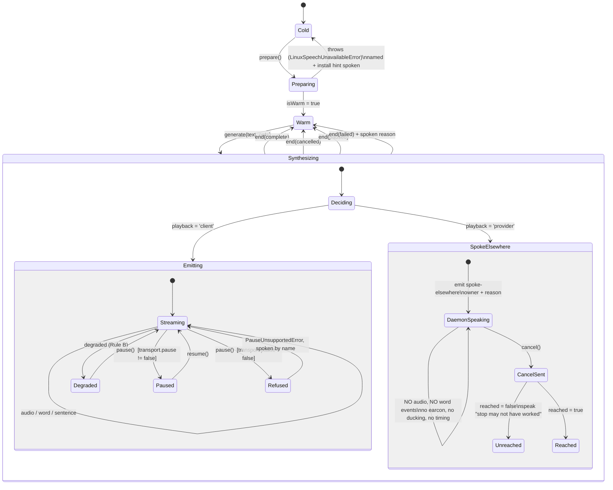
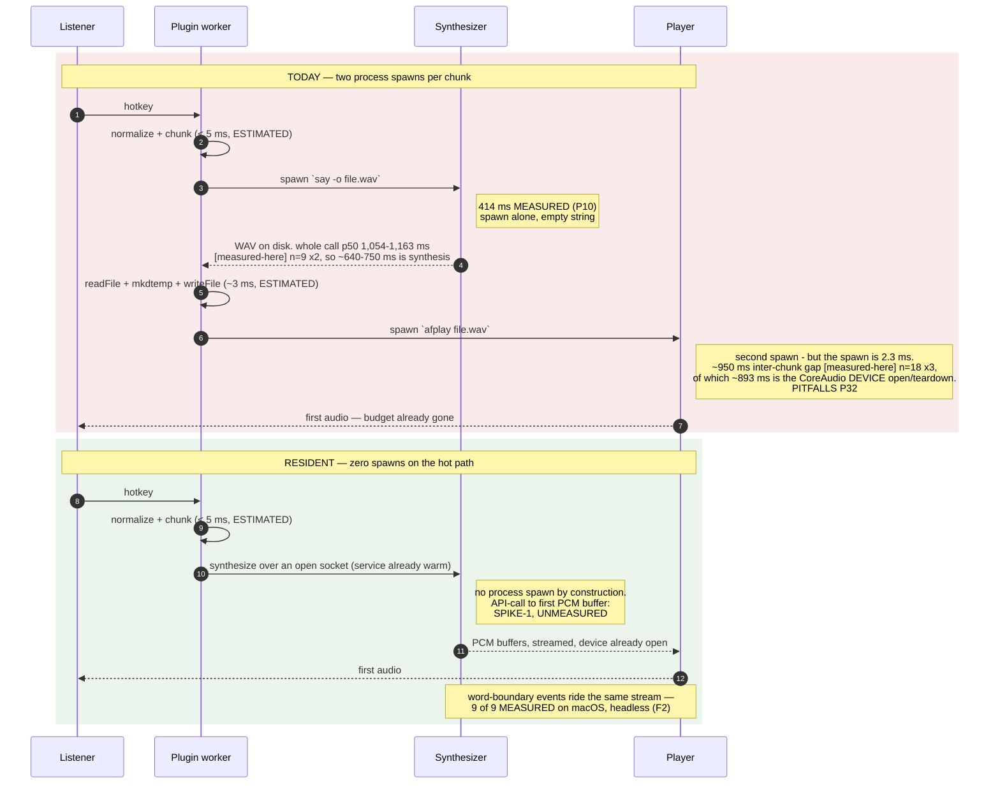

# 010 — Provider seam v2, and the resident speech service (M9)

**Status:** design. **Written:** 2026-08-21.
**Work order:** `docs/design/008-crossreview-round3.md` finding **C-05**, scheduled by
`docs/design/009-reconciliation.md` section 3 (*"C-05 in particular deserves scheduling"*).
**Author had no session context.** Every claim about our own code cites `path:line` **verified at
`32b929a`**, not copied from another document. Every number carries **MEASURED**, **DOCUMENTED** or
**ESTIMATED** (finding E-05; constitution R006).

**What this document decides.** Two things, and they turn out to be one thing.

1. **The seam changes once.** Four extensions to `TtsProvider` are already queued — 005's `identity`
   and `pitchSemitones`, 003's `pause()`/`resume()`, 004's `chunk.format` branch, and the earcon's
   synthesized PCM. Part 1 specifies them as a single contract, plus the two the platform research
   found and nobody scheduled: word-boundary events and SSML.
2. **M9 is mis-scoped.** M9 reads *"resident service **+ Piper**"* (`docs/TASKS.md:202`), on the
   premise that only a neural engine meets R4.2's 500 ms. The measurement says otherwise: the budget
   is missed by **process spawn**, not by synthesis. Part 2 argues that a resident **OS-synthesizer**
   service meets the budget on its own, which makes the resident architecture justified independently
   of Piper — and makes Piper a quality decision rather than a latency one.

Part 3 is the migration, rung by rung, with what each intermediate state sounds like.

**What this document does not do.** It does not restate 003, 004 or 005. Where it changes one of
them, it says so in the row and the amendment belongs in that document, not here. It writes no
implementation code; the TypeScript below is contract, and is expected to be copied.

---

## 0. The three facts this document is built on

| # | Fact | Label | Source, verified |
|---|---|---|---|
| F1 | `say ""` — empty string, zero synthesis — costs **414 ms min / 418 ms median over 5 runs** on macOS | **MEASURED** | `PITFALLS.md` P10 |
| F2 | `AVSpeechSynthesizer.write(_:toBufferCallback:)` produced **55,050 PCM frames and 9 of 9 word-boundary callbacks, headless, with no process spawn and no audio device** | **MEASURED** (compiled Swift probe) | `docs/.research/q-round1-platform.md` "Unused capabilities" item 1 |
| F3 | Piper amy-low synthesizes one sentence in **52–65 ms** | **MEASURED** `[measured-here]` | `PITFALLS.md` P11 |
| **F4** | **A real sentence through `OsSynthProvider.generate()` costs p50 1,163 / 1,054 ms**, p95 1,244 / 1,084, min 900, n=9 per run, two runs | **`[measured-here]`** | `docs/.research/latency-measurements.md` 1.3 |
| **F5** | **The inter-chunk gap is p50 950 / 937 / 897 ms**, n=18 per run, three runs — and **~893 ms of it (99.7 %) is CoreAudio device open/pre-roll/post-roll/teardown**, not the 2.3 ms process spawn | **`[measured-here]`** | `docs/.research/latency-measurements.md` 1.1, PITFALLS **P32** |

Put F1 and F3 side by side: **the spawn is 8× the synthesis** *on a neural engine*. That comparison
was the whole argument of Part 2.

> **Amended 2026-08-21 — forced by findings 1 and 3 of `docs/.research/latency-measurements.md`,
> which add F4 and F5 above. Two of this document's load-bearing claims are wrong, and one of its
> recommendations is withdrawn. Read this before section 8.**
>
> 1. **The `~970 ms` gap is real and is now `[measured-here]` on our own sink — but the mechanism
>    this document attributed it to is wrong.** It is not "a second process spawn". Player fork/exec
>    is **2.3 ms**; the temp-file round trip is **0.33 ms**; ~893 ms is the **audio device** (F5).
>    Everywhere below that reads *"a second spawn"* should be read as *"a second audio-device open"*.
>    The consequence for M9 is concrete: **a resident sink that pools player processes while still
>    opening the device per chunk delivers ~2 ms of the ~950.** M9's success condition is *the device
>    stays open across chunks*, and the test for it is a gap-to-audio ratio, not a spawn count.
> 2. **"The engine was never the problem" is false on the `say` rung** (F4). `say ""` is 414 ms of
>    spawn, but a *real sentence* end to end is **1,054–1,163 ms**, so roughly **640–750 ms
>    `[derived]` is synthesis**, which is **more than the whole R4.2 budget on its own** and ~12×
>    Piper. Section 8's conclusion that *"the engine choice is independent"* of residency is
>    **withdrawn** — see the amendment in 8.2.
>
> **SPIKE-2 (section 8.2) is now DONE**: `pnpm bench:latency`, `docs/.research/latency-measurements.md`.
> It is the probe that produced F4 and F5 and the reason this note exists.

---

# PART 1 — THE SEAM, CHANGED ONCE

## 1. What the seam is today

`packages/core/src/types/index.ts` at `32b929a`, in full:

| Type | Lines | Shape |
|---|---|---|
| `AudioChunk` | `:3-10` | `data`, `format: string`, `sampleRate`, `channels` — format is a bare string, undocumented set |
| `ProviderCapabilities` | `:12-24` | `streaming`, `offline`, `needsApiKey`, `needsModelDownload`, `licence`, `cloning`, `sampleRate` |
| `SynthesizeOptions` | `:26-31` | `voice?`, `rate?`, `signal?` |
| `TtsProvider` | `:39-56` | `prepare()`, `isWarm`, `generate()`, `cancel()`, `listVoices()` |
| `PlaybackSink` | `:58-63` | `enqueue()`, `stop()`, `isPlaying` |
| `DegradationRung` | `:71` | `'preferred' \| 'fallback' \| 'floor' \| 'unavailable'` |

Four properties of that shape are the reason four documents each need to widen it:

- **`sampleRate` is a capability constant, not a per-utterance fact.** `OsSynthProvider` declares
  `22050` for all three platforms (`packages/providers/src/os-synth/index.ts:40-48`) including the
  `spd-say` rung, which produces no bytes at all. FMA PV11 records this; contract test `T041d`
  (`packages/providers/src/contract.ts:75-84`) asserts the field is *present and typed* and could not
  have failed on its value.
- **`cancel()` is the only transport verb** (`types/index.ts:53`), and on the OS-synth provider it is
  `SIGKILL` (`os-synth/index.ts:240`) plus, on the Linux floor, a best-effort `spd-say --cancel`
  (`:243-245`). There is no position to resume from, because nothing records one.
- **`generate()` yields audio or nothing** (`types/index.ts:48`). The Linux floor takes the "nothing"
  branch (`os-synth/index.ts:318-323`, `#speakDirect()` at `:407-414`) and the caller cannot tell that
  from an empty synthesis, a timeout return (`:332`), or a zero-byte WAV (`:337`). Four different
  outcomes, one indistinguishable `return`.
- **A caller discovers capabilities by failure.** There is no `supports()`. `opts.rate` is honoured on
  macOS (`:354`) and Windows (`:360`) and, until it was fixed, was silently dropped on Linux — the H25
  parity bug, now closed at `:191`. The class of bug is open even though that instance is closed.

## 2. The six extensions, and where each comes from

| # | Extension | Requested by | Lands with | Platform evidence |
|---|---|---|---|---|
| 1 | Per-utterance identity: voice, **rate as wpm**, pitch in semitones | `005` sections 4, 8.2, 8.4 | M15 | rate everywhere; pitch on all three by three different surfaces (`q-round1-platform.md` Q33) |
| 2 | `pause()` / `resume()`, distinct from `cancel()` | `003` section 8.7 (`:1283-1296`) | M13 | macOS `pauseSpeaking(at: .word)`, Windows `Pause()`/`Resume()`, Linux SSIP `PAUSE`/`RESUME` — **DOCUMENTED**, item 2 |
| 3 | Audio-format variance, including synthesized earcon PCM | `004` section 2 (`:102`), `005` section 11.1d (`:623-627`) | M11 | our own three rungs already differ; the earcon is generated PCM at a rate the provider did not choose |
| 4 | **`spoke-elsewhere` as a first-class outcome** | `008` X-10, resolved in `009` section 1 | **already shipped, unmodelled** | `PITFALLS.md` P25; `os-synth/index.ts:318-323` |
| 5 | **Word-boundary events** | nobody — found by the platform probe, unscheduled | M13's cursor, and precise resume | **MEASURED on macOS** (F2); Windows `SpeakProgress` and Linux SSIP index marks **DOCUMENTED** |
| 6 | **SSML, or its absence, as a capability** | nobody — found by the platform probe, unscheduled | M15 (it is the only route to pitch on Windows) | available on all three, used on none (`q-round1-platform.md` item 3) |

Extensions 5 and 6 are the reason this document exists rather than a three-line diff. If the seam is
widened for the four that were asked for and not for the two that were found, it changes a fifth and
a sixth time — which is exactly the failure C-05 names, with a different four.

## 3. Two rules the shape must satisfy

**Rule A — ask, do not discover.** A caller must be able to ask what a provider supports before
requesting it. The descriptor is the answer; a thrown error is not.

**Rule B — every absence is audible and named.** A capability a provider lacks degrades to something
the listener **hears**, described **by name**. Never to silence; never to a wrong-value lie.

Rule B is P30 applied to the seam. P30's finding was that 55 silent-failure sites all announced
correctly to a channel a dyslexic, voice-first listener does not read. So the destination for a
degradation on this seam is `SpeechService.announce()` — the audio stream — and the desktop
notification is the supplement, exactly as `packages/plugin/src/speech-service.ts:126` already does
for queue losses.

"A wrong-value lie" is not hypothetical. **MEASURED** on macOS 26.5: `say -v NotAVoiceAtAll` exits
`0`, writes a full-length WAV, and substitutes the default voice — three different `-v` arguments
produced byte-identical output, md5 `caba1118…` (`q-round1-platform.md`, macOS silent-fallback
hazard). **DOCUMENTED** on Windows: `SelectVoice(name)` is a case-sensitive **substring** match, so a
short id binds to the wrong voice with no error (Microsoft's own `SelectVoice` page). Our provider
emits both verbatim (`os-synth/index.ts:353`, `:361`) and reads back neither. Under Rule B, a
provider that cannot verify what it applied must **declare that it cannot**, not report success.

## 4. `TtsProvider` v2 — the contract

```ts
/* ── Formats ─────────────────────────────────────────────────────────────── */

/** The set is closed and named. `format: string` (v1) let each provider invent one. */
export type AudioCodec = 'pcm-s16le' | 'pcm-f32le' | 'wav' | 'opus' | 'mp3'

export interface AudioFormat {
  readonly codec: AudioCodec
  readonly sampleRate: number
  readonly channels: number
}

export interface AudioChunk {
  readonly data: Uint8Array
  /** Per chunk, not per provider. A provider MAY change format between utterances. */
  readonly format: AudioFormat
  /** Monotonic within one utterance; lets a sink order and a cursor seek. */
  readonly sequence: number
}

/* ── Prosody, in portable units ──────────────────────────────────────────── */

/**
 * Words per minute, NOT a multiplier.
 *
 * H26: `rate * 175` wpm on macOS, `espeak-ng -s` wpm on Linux, and an integer -10..+10 on Windows
 * whose relationship to wpm is undocumented, are three incomparable scales. 005 section 8.1 chooses
 * wpm because it is a PHYSICAL property of the output — words over seconds — and therefore means the
 * same thing on three operating systems, which no vendor control value does.
 *
 * The caller states `targetWpm`. The provider maps it. `RateSupport.calibration` says whether that
 * map is exact or a seed, and the map is MEASURED PER HOST (005 section 8.3), never derived.
 */
export interface ProsodyRequest {
  /** Opaque to the provider; resolved through `resolveVoice()`, never a persisted name (P28). */
  readonly voice?: VoiceRef
  readonly targetWpm?: number
  /** -3..+3, 0 natural. Semitones because all three platforms can express them (005 section 8.4). */
  readonly pitchSemitones?: number
  /** 0..1. Present because Windows and Linux expose it for free and we use it on neither. */
  readonly volume?: number
}

/** P28: persist an index or a seed into the host's runtime list, never a name. */
export type VoiceRef =
  | { readonly by: 'index'; readonly index: number }
  | { readonly by: 'id'; readonly id: string }        // provider-scoped, not portable
  | { readonly by: 'seed'; readonly seed: number }    // stable per session, resolved per host

/* ── Capability descriptor — Rule A ──────────────────────────────────────── */

export type PauseGranularity = 'word' | 'immediate' | false
export type SsmlSupport = 'native' | 'in-band' | 'none'
export type VoiceVerification = 'read-back' | 'checksum' | 'none'

export interface RateSupport {
  readonly minWpm: number
  readonly maxWpm: number
  /**
   * 'exact'     — the host takes wpm directly (macOS `say -r`, `espeak-ng -s`).
   * 'calibrated'— a measured per-host lookup table exists and is loaded.
   * 'seeded'    — only the seed formula is available; the value is an ASSUMPTION and must be
   *               labelled as such wherever it is shown (Windows before 005 section 8.3 runs).
   */
  readonly calibration: 'exact' | 'calibrated' | 'seeded'
}

export interface ProviderCapabilities {
  // ── unchanged from v1 ──
  readonly streaming: boolean
  readonly offline: boolean
  readonly needsApiKey: boolean
  readonly needsModelDownload: number
  readonly licence: string
  readonly cloning: boolean

  // ── replaces the v1 `sampleRate` constant ──
  /** Every format this provider may emit. First is the default. NEVER empty — see `playback`. */
  readonly formats: readonly AudioFormat[]

  // ── extension 4: who owns the speaker ──
  /**
   * 'client'   — the provider emits bytes and never plays (R021). Every rung but one.
   * 'provider' — the provider speaks through something we do not own, and yields NO bytes.
   *              `formats` is `[]`. This is the `spd-say` rung. See section 5.
   */
  readonly playback: 'client' | 'provider'

  // ── extension 2: transport ──
  readonly transport: {
    /** `false` means pause is genuinely unavailable — refuse by name, never map onto cancel. */
    readonly pause: PauseGranularity
    readonly resume: boolean
    /**
     * 'two-sided'   — cancel stops synthesis AND anything already producing sound (R014).
     * 'client-only' — cancel stops OUR process; sound we do not own may continue. The
     *                 `spd-say` rung: killing our client does not stop the daemon (P25).
     */
    readonly cancel: 'two-sided' | 'client-only'
  }

  // ── extension 5: events ──
  readonly events: {
    /** Word-boundary callbacks with source-string offsets. MEASURED available on macOS (F2). */
    readonly word: boolean
    readonly sentence: boolean
    /** Timestamps relative to the utterance's own audio, not to wall clock. */
    readonly timedToAudio: boolean
  }

  // ── extension 1: prosody ──
  readonly prosody: {
    readonly voice: 'list' | 'single' | 'none'
    readonly voiceVerification: VoiceVerification
    readonly rate: RateSupport | false
    readonly pitchSemitones: { readonly min: number; readonly max: number } | false
    readonly volume: boolean
  }

  // ── extension 6: SSML ──
  /**
   * 'native'  — the engine parses SSML (Windows `SpeakSsml`; macOS `AVSpeechUtterance(ssmlRepresentation:)`).
   * 'in-band' — no SSML, but a bracket syntax exists (`say`'s `[[...]]`). DANGEROUS: it is the same
   *             channel as the user's prose. `neutralizeInBandCommands` (os-synth/index.ts:82-84)
   *             exists precisely because of this, and anything WE emit must be added AFTER it.
   * 'none'    — pauses and emphasis must be faked with punctuation, as the normalizer does today.
   */
  readonly ssml: SsmlSupport
}

/* ── The event stream — extensions 3, 4, 5 ───────────────────────────────── */

export type SpeechEvent =
  | { readonly type: 'audio'; readonly chunk: AudioChunk }
  /** Extension 5. Offsets index the string handed to `generate()`, after normalization. */
  | { readonly type: 'word'; readonly charStart: number; readonly charEnd: number
      readonly audioOffsetMs?: number }
  | { readonly type: 'sentence'; readonly charStart: number; readonly charEnd: number }
  /**
   * Extension 4. Emitted ONCE, FIRST, INSTEAD of any `audio`. The utterance is being spoken by
   * something we do not own. See section 5 for what the queue must do differently.
   */
  | { readonly type: 'spoke-elsewhere'; readonly owner: string; readonly reason: string
      readonly cancel: () => Promise<{ readonly reached: boolean }> }
  /** Rule B. A request was honoured differently, or not at all. `spoken` goes to the audio stream. */
  | { readonly type: 'degraded'; readonly capability: keyof ProviderCapabilities | 'voice' | 'rate'
      | 'pitchSemitones' | 'volume' | 'pause'
      readonly requested: unknown; readonly applied: unknown; readonly spoken: string }
  | { readonly type: 'end'; readonly reason: 'complete' | 'cancelled' | 'paused' | 'failed'
      readonly error?: Error }

/* ── The provider ────────────────────────────────────────────────────────── */

export interface TtsProvider {
  readonly id: string
  readonly displayName: string
  readonly capabilities: ProviderCapabilities

  prepare(): Promise<void>
  readonly isWarm: boolean

  /**
   * v1's `generate()` yielded `AudioChunk`. v2 yields `SpeechEvent`, because four of the six
   * extensions are things that are not audio.
   *
   * A provider MUST end the stream with exactly one `end` event, including on cancel. v1's four
   * indistinguishable `return`s (os-synth/index.ts:332, :337, :312, :322) become four distinct,
   * nameable ends.
   */
  generate(text: string, opts?: SynthesizeOptions): AsyncIterable<SpeechEvent>

  /** R014, two-sided. Resolves once nothing is still producing sound THAT WE CAN REACH. */
  cancel(): Promise<void>

  /**
   * Extension 2. Distinct from cancel: position is retained and `resume()` continues from it.
   * A provider whose `capabilities.transport.pause` is `false` MUST throw `PauseUnsupportedError`
   * and MUST NOT map pause onto cancel (003 section 8.7). Silently degrading pause to stop is P18.
   */
  pause(): Promise<void>
  resume(): Promise<void>

  /** Voices as the host currently reports them. Cache it: `say -v '?'` is p50 487/472 ms
   *  [measured-here] (n=6 x2, docs/.research/latency-measurements.md 1.6). */
  listVoices(): Promise<readonly VoiceDescriptor[]>

  /** Rule A, for the request rather than the provider: can THIS utterance be served as asked? */
  supports(req: ProsodyRequest): SupportReport
}

export interface VoiceDescriptor {
  readonly id: string
  readonly index: number
  readonly displayName: string
  readonly locale?: string
  /** macOS `.default`/`.enhanced`/`.premium`; absent elsewhere. Drives the "you can improve this" hint. */
  readonly quality?: 'default' | 'enhanced' | 'premium'
}

export interface SupportReport {
  readonly ok: boolean
  /** One entry per field that will NOT be honoured as asked, each with the sentence to speak. */
  readonly degradations: readonly {
    readonly capability: string; readonly requested: unknown
    readonly applied: unknown; readonly spoken: string
  }[]
}

export interface SynthesizeOptions extends ProsodyRequest {
  readonly signal?: AbortSignal
  /** Extension 1. Carried through so the provider can log/announce whose words these are. */
  readonly identity?: { readonly sessionId: string; readonly callSign: string }
  /** Extension 6. Ignored unless `capabilities.ssml === 'native'`; never silently. */
  readonly ssml?: string
}

export class PauseUnsupportedError extends Error {
  readonly code = 'pause_unsupported' as const
}
```

### 4.1 What each of the four queued extensions became

| Requested as | Became | Why not as asked |
|---|---|---|
| `ProviderCapabilities += { identity: { voices, pitch, rate } }` (005 section 4) | `capabilities.prosody`, plus `voiceVerification` | "identity" is a consumer's word. The seam owns *axes*; 005 owns which axes make an identity. Adding `voiceVerification` is forced by the macOS silent-fallback measurement — 005's tier system is a lie without it |
| `SynthesizeOptions += { pitchSemitones? }` (005 section 4) | `ProsodyRequest.pitchSemitones`, alongside `targetWpm` and `volume` | pitch alone would have left `rate` as a multiplier, which H26 says is not one unit. Fixing the unit is the same change |
| `pause()` / `resume()` with `pause_unsupported` (003 section 8.7) | as asked, plus `transport.pause: 'word' \| 'immediate' \| false` | macOS's `pauseSpeaking(at: .word)` is a *better* pause than immediate, and a caller wants to know which it gets before offering it |
| *"branch on `chunk.format`"* (004 section 2) | `AudioFormat` as a closed record on every chunk, and `formats[]` on the provider | a bare `format: string` gives the lab nothing to branch *on*. The closed set is what makes the branch exhaustive |

### 4.2 What the earcon needs, and gets

005 section 11.1d records the second-order problem: the earcon is generated PCM, `AudioChunk.format`
is provider-chosen, and mixing them is *"a format-mixing case nothing in the sink handles today"*.

Under v2 the earcon module is not a special case. It emits an `AudioChunk` with its own
`AudioFormat`, the sink sees a format change between chunks like any other, and the resident sink
(Part 2) resamples once at the device boundary. The rule the seam adds: **`AudioFormat` is per
chunk, so a producer never has to match a consumer's rate.** That deletes the coupling rather than
solving it.

**The earcon's real cost is still M9-dependent and this document does not change that.**
**Amended 2026-08-21, forced by finding 4 of `docs/.research/latency-measurements.md` (1.4):** 005
section 11.1d used to price the earcon at 140 ms of tone `[ARITHMETIC]` plus one sink spawn. It has
now been measured end to end through the shipped sink at **p50 874 / 862 ms**, n=10 per run, two
runs `[measured-here]` — 6.2× the 140 ms, and the dominant term is the **audio device open** the
extra chunk pays for, not the process. Under today's `SubprocessSink` every chunk is `mkdtemp` →
`writeFile` → `spawn` → `rm` (`subprocess-sink.ts:52-61`) **and then a device open**, so a prepended
earcon is a whole extra device cycle. Part 2 is what makes per-turn earcons affordable — provided
the resident sink holds the **device**, not a pool of players. 005 §11.1d also now names a v1
mitigation this document should support at the seam: **mix the tone into the head of the first
speech chunk** rather than emitting it as its own chunk. That is only expressible if `AudioFormat`
is per chunk and the earcon can be rendered in the provider's declared format — which is exactly
what the v2 seam above already requires, so it costs nothing extra to allow.

## 5. The `spoke-elsewhere` outcome

### 5.1 Why it is an outcome and not an exception

On a stock Ubuntu 24.04.3 desktop there is no `/usr/bin/espeak-ng` — the image ships the shared
library and `speech-dispatcher`, not the CLI (**DOCUMENTED**, the official image manifest, P25). The
floor is therefore `spd-say --wait`, which **cannot write a WAV** — verified against upstream
`brailcom/speechd`: `src/clients/say/options.c` has no file-output option (`-w` is `--wait`), and
`src/modules/module_utils.c` `module_audio_init` opens only oss/alsa/nas/libao/pulse, so no capture
path exists. The daemon speaks; we get nothing. Our code takes that branch at
`os-synth/index.ts:318-323` and returns from `#speakDirect()` (`:407-414`) having yielded zero chunks.

This is a **deliberate, announced violation of R5.2/R021** taken because silence is worse for
assistive technology, and it is already declared three times (`os-synth/index.ts:110-117`, P25, 005
section 5). What has never existed is a *type* for it. Today the caller sees an empty iterator, which
is byte-identical to a timeout, an empty string, a zero-byte WAV, and a cancel.

### 5.2 Three things behave differently on this rung

**1. Cancel is one-sided.** `capabilities.transport.cancel` is `'client-only'`. Killing our child
does not stop the daemon (P25), so `cancel()` must additionally reach it — we do spawn `spd-say
--cancel` at `os-synth/index.ts:243-245`, but inside `try { … } catch { }` with an `.on('error', ()
=> {})`, so **both failure paths are swallowed**. That is FMA **PV4**, severity **S1**: the listener
presses Stop, the voice keeps talking, and there is no second interrupt to reach for. v2's
`cancel(): Promise<{ reached: boolean }>` on the `spoke-elsewhere` event is the fix — `reached:
false` is a fact the queue can announce.

**2. The queue needs a different rung.** A provider that owns its own playback cannot be
mixed, ducked, faded, or interleaved with an earcon, and its "audio" cannot be measured. Concretely,
on this rung:

| Feature | On a `playback: 'client'` provider | On `spoke-elsewhere` |
|---|---|---|
| Earcon before the utterance | prepend an `AudioChunk` | **no mechanism exists** — 005 section 11's own note says so, and names no source |
| Barge-in latency | our sink's `kill`-to-exit, **~3 ms `[measured-here]`** on the shipped `afplay` (p50 3.5 / 2.9 ms, n=10 ×2; P9's 0.9–1.5 ms was `ffplay`). **Kill-to-exit is not audio-stop: device drain is `[claimed]`** | round-trip to the daemon, `reached` unknown |
| Voice Lab compare / replay / per-stage play / timing readout | work | **disabled, with the reason attached** (009 section 1, X-10) |
| M11's two-second gate | satisfiable | **not satisfiable on this rung**, stated plainly |
| Ducking for a phone call (B-04) | possible once the sink is resident | impossible — we do not hold the stream |

**3. The identity design degrades to exactly one portable axis.** 005's triple is
`(callSign, earcon, voiceTuple)`. On this rung the earcon has no delivery mechanism and the voice
comes from the daemon, so **the spoken call-sign is the whole of identity**. 005 section 14 already
says this; the seam now makes it discoverable in advance rather than at synthesis time.

### 5.3 The state machine



The `end` event is the point of the diagram: **every path out of `Synthesizing` is named.** Today
four of them are the same bare `return`.

## 6. Rule B in practice — the degradation table

Every row is a capability some provider lacks. Each degrades to something audible, named once per
session (never per utterance — an announcement that interrupts is itself a harm, P30), and never to
a wrong-value lie.

| Capability absent | Provider that lacks it | Degrades to | Spoken, once |
|---|---|---|---|
| `prosody.pitchSemitones` | macOS `say` CLI (no `-p` flag; only in-band `[[pbas]]` — **MEASURED**), Windows `Speak` (no `Pitch` property — **DOCUMENTED**) | identity falls back to call-sign + earcon, which are portable by construction | *"Voice pitch is not available on this system, so agents are told apart by name."* |
| `prosody.rate.calibration = 'exact'` | Windows: `$s.Rate` is `-10..+10` with no documented wpm meaning | the seed formula, **shown as an assumption**, and the Voice Lab offers "recalibrate" | *"Speed on Windows is estimated until you calibrate it."* |
| `prosody.voiceVerification` | macOS `say` (exits 0 on a bogus voice — **MEASURED**), Windows `SelectVoice` (substring match — **DOCUMENTED**) | the provider reports `'none'`; the identity layer refuses to count voice as a distinguishing axis | *"This system cannot confirm which voice it used, so voices are not used to tell agents apart."* |
| `transport.pause` | today: every provider — `cancel()` is `SIGKILL` (`os-synth/index.ts:240`) | `PauseUnsupportedError`, refusal earcon, **no cancel** | *"Pause is not available with the system voice. Stop, then read again."* |
| `events.word` | Windows and Linux until their sidecars land; the `spd-say` rung permanently | the M13 cursor drops to sentence granularity **and says so in the header** | *"Word tracking is not available here."* |
| `playback: 'client'` | the `spd-say` rung | section 5.2's whole table | already spoken at detection (`os-synth/index.ts:265-268`) — but see the note below |
| `ssml` | `say` (`'in-band'`, dangerous), espeak-ng CLI, `spd-say` | punctuation-faked pauses, as the normalizer does today | nothing — this one is inaudible and correctly so |

**The note.** That existing floor announcement is real and it is delivered to the wrong address. It
goes `#notify` → `main.ts` → `host.notify` → a desktop notification (FMA **DL1**, severity **S2**):
*"an Ubuntu user on the `spd-say` floor is never told… even though `LINUX_INSTALL_HINT` contains all
of it."* Under P30 and Rule B, every sentence in this table terminates at
`SpeechService.announce()`. The notification is the supplement.

**The rule that makes the table testable.** For each row: disable the notification path entirely,
force the capability absent, and assert the **spoken sentence** — the text the provider was actually
handed — not that a callback fired. `packages/plugin/src/speech-service.test.ts` already does exactly
this for queue losses ("losses and degradations reach the audio stream", P30); the contract suite
copies the shape.

## 7. What the contract suite must add

`packages/providers/src/contract.ts` today has six tests: one chunk (`:29`), empty input (`:39`),
cancel within `CANCEL_BUDGET_MS = 50` (`:12`, `:47`), capabilities typed (`:75`), `prepare()`
idempotent (`:86`), voices listable (`:94`). Test `T041d` is the one FMA PV11 calls a check that
could not have failed.

| New test | Asserts | Negative control |
|---|---|---|
| **T041f** every stream ends with exactly one `end`, on complete, cancel and throw | the four indistinguishable returns are gone | a provider that returns without an `end` fails |
| **T041g** declared `formats` match emitted chunks | PV11: `sampleRate: 22050` asserted for a rung that emits nothing | mutate one declared field; the test must go red |
| **T041h** `playback: 'provider'` ⇒ `formats` is `[]` **and** exactly one `spoke-elsewhere`, zero `audio` | the floor is modelled, not stumbled into | a provider declaring `'provider'` that yields audio fails |
| **T041i** `transport.pause: false` ⇒ `pause()` throws `PauseUnsupportedError` **and the sink produced no samples fewer** | pause never silently becomes cancel | a provider mapping pause→cancel fails |
| **T041j** `supports()` predicts `generate()` — request every unsupported axis, assert the same degradations arrive as events | Rule A agrees with reality | a provider that under-reports fails |
| **T041k** every `degraded.spoken` is non-empty and reaches the audio stream with `log` and `notify` both disabled | Rule B / P30 | a provider announcing only via `notify` fails |
| **T041l** `voiceVerification: 'none'` ⇒ requesting an unknown voice yields a `degraded`, never a silent substitution | the macOS md5-identical lie | request a *known* voice and assert **no** `degraded` — the control that proves the probe can fail |

`CANCEL_BUDGET_MS` stays 50 for `playback: 'client'`. For `'provider'` the budget is a round trip to
a daemon we do not own; the test asserts `reached` is *reported*, not that it is `true`.

---

# PART 2 — THE RESIDENT SERVICE

## 8. The budget is missed by spawn *and*, on the `say` rung, by synthesis too

> **Heading amended 2026-08-21, forced by finding 3 of `docs/.research/latency-measurements.md`.**
> It read *"The budget is missed by spawn, not by synthesis"*. On the neural rung that is still the
> right sentence. On the `say` fallback rung it is false: synthesis alone is 640–750 ms `[derived]`
> on top of the 414 ms spawn (F4). Both terms exceed the budget independently.

R4.2: **first audio under ~500 ms** on the default local backend.

Here is today's macOS path from keypress to sound, with every segment labelled. Only two of the six
are measurements, and that is the honest state of this project's most load-bearing latency claim.

| # | Segment | Cost | Label |
|---|---|---|---|
| 1 | normalize (15 stages) + chunk, pure functions, no I/O | < 5 ms | **ESTIMATED** |
| 2 | `mkdtemp` for the synthesis temp dir (`os-synth/index.ts:326`) | ~1 ms | **ESTIMATED** |
| 3 | **`spawn('say', …)` — process start, before one phoneme** | **414 ms min / 418 ms median, 5 runs** | **MEASURED** (P10) |
| 4 | actual synthesis of a real sentence, on top of segment 3 | **~640–750 ms** — segments 2–5 together measure p50 1,054–1,163 ms (F4) and segment 3 is 414 of it | **`[derived]`** from `[measured-here]` |
| 5 | `readFile` the WAV back, `rm` the dir (`:336`, `:340`) | ~2 ms | **ESTIMATED** `[claimed]` |
| 6 | sink: `mkdtemp` + `writeFile` + **`spawn('afplay', …)`** (`subprocess-sink.ts:52-61`, `:75`) | **~950 ms**, of which the spawn is 2.3 ms and the temp file 0.33 ms — **the rest is the audio device open** (F5) | **`[measured-here]`** |

> **Amended 2026-08-21, forced by findings 1 and 3 of `docs/.research/latency-measurements.md`.**
> Rows 4 and 6 were `UNMEASURED`; both are now measured, and both are worse than this section
> assumed. Row 6's label was also the wrong *kind* of cost — a device open, not a spawn.

**Segment 3 alone is 83 % of the 500 ms budget, and it is empty-string spawn — zero synthesis. But
segment 4 is larger still**: ~640–750 ms of actual `say` synthesis, on its own more than the whole
budget. Together, segments 1–5 measure **p50 1,054–1,163 ms before a single sample is played**
(F4). Segment 6 adds ~950 ms of device cycle on top.

Compare F3: Piper synthesizes a whole sentence in 52–65 ms `[measured-here]`. So the engine was
**not** the problem *for Piper*, and **is** a problem — the largest single one — for `say`.

> **Recommendation withdrawn and replaced, 2026-08-21.** This section used to conclude: *"If the
> 500 ms is lost to spawn, then the thing that buys the budget back is **residency**, and the engine
> choice is independent."* **That is now falsified for the OS-synth rung.** With playback cost set to
> zero, `generate()` alone is **2.1× the entire R4.2 budget** (F4). Residency cannot buy back time
> the engine is spending.
>
> **Replacement:** *residency is necessary and not sufficient. R4.2 is reachable on the neural rung
> and is unreachable on the OS-synth rung by any amount of residency or playback work.* Two
> consequences:
>
> 1. **`docs/TASKS.md:202`'s scoping of M9 as *"Resident service + Piper"* was right and this
>    document was wrong to try to decouple them.** The coupling is not a packaging convenience; it is
>    what the arithmetic requires. The two halves may still land as separate rungs (section 12), but
>    the **budget gate** (`docs/TASKS.md:217`) can only be met on the rung that has both.
> 2. **R4.2's own wording is *"on the default local backend"*, and the default is Piper.** Every
>    document that scores R4.2 must say **which backend it is scoring**; STATE.md's audit row did
>    not, and read as though the 500 ms applied to the `say` path. It has been corrected.

### 8.1 First audio: today versus resident



The red path's cost is dominated by two boxes that contain **no synthesis at all**. The green path
deletes both by construction — not by being faster, but by not doing them.

### 8.2 Verdict: does a resident OS-synth meet 500 ms without a neural engine?

**Yes on macOS, very probably; and the claim is one probe away from being settled.**

The evidence, honestly separated:

- **What is measured.** `AVSpeechSynthesizer.write(_:toBufferCallback:)` ran **headless**, produced
  **55,050 PCM frames**, delivered **9 of 9 word-boundary callbacks with exact `NSRange`s**, and
  touched **no audio device and no process spawn** (F2). Both of P10's blockers — the 414 ms spawn
  and the unseekable-`/dev/stdout` problem — are absent from that call by construction. This is the
  single most under-used measurement in the project: it was filed under "unused capabilities" when it
  is an architecture finding.
- **What is not measured.** *Time from the `write()` call to the first buffer callback, in a warm
  resident process.* Nobody has run it. The probe printed a frame total, not a latency.
- **Why the estimate was thought favourable — and why that reasoning is now dead. Amended
  2026-08-21, forced by finding 3 of `docs/.research/latency-measurements.md`.** This bullet argued:
  *"the macOS compact voices are the same engine `say` drives, and `say`'s 414 ms is spawn, not
  synthesis. A neural engine synthesizes a whole sentence in 52–65 ms (F3); a compact concatenative
  voice is not plausibly an order of magnitude slower."* **The premise is measured false.** `say`'s
  synthesis of a real sentence is ~640–750 ms `[derived]` on top of the spawn (F4) — which *is* an
  order of magnitude slower than Piper, roughly 12×. The favourable prior is withdrawn.
- **What survives, and it is narrower.** The remaining case for a low first-buffer is **streaming,
  not engine speed**: `say -o file.wav` returns only when the whole WAV is written, whereas
  `write(_:toBufferCallback:)` delivers buffers as they are produced, so first-buffer could still be
  a small fraction of 640–750 ms. **Nobody has measured it.** The estimate is therefore restated
  honestly as **`[claimed]` first-buffer: unknown, plausibly 100–400 ms**, replacing the
  ESTIMATED 30–120 ms, which rested on the falsified premise.
- **What this does to SPIKE-1.** Its falsifier — *"a median above 350 ms on any platform"* — was
  written as an unlikely outcome. On the measured evidence it is now a **live** outcome, and the
  probe moves from confirmatory to decisive. Run it **before** any resident-synth work is scheduled,
  and treat a fail as routing straight to Piper rather than as a setback.

> **SPIKE-1 — the probe that settles it.** Extend the existing Swift probe: warm the synthesizer,
> then for 20 utterances record `t0` at the `write()` call and `t1` at the **first**
> `toBufferCallback` invocation with a non-empty buffer. Report min/median/p95. Run the same shape on
> Windows (`SetOutputToAudioStream` → first `Read`) and Linux (SSIP `SPEAK` → first `index-mark` or
> first byte, noting that the Linux answer is *audio we never see*). **Pass condition:** median
> first-buffer ≤ 150 ms on each OS, which leaves ≥ 350 ms for everything else.
> **What would prove this document wrong:** a median above 350 ms on any platform. Then residency
> alone does not buy the budget, and the neural engine is back on the critical path.
> **Updated 2026-08-21:** on F4 this outcome is now the one to plan for, not the exception.

Run SPIKE-1 **before** T090. It is the difference between "M9 builds the thing that makes latency
acceptable" and "M9 swaps the engine" — and finding 3 has already shifted the odds towards the
second.

> **SPIKE-2 — DONE, 2026-08-21.** `pnpm bench:latency` (`scripts/bench-latency.mjs`), reported in
> `docs/.research/latency-measurements.md`. Result: **gap p50 950 / 937 / 897 ms, n=18 per run over
> three runs `[measured-here]`** — so the `~970 ms` transferred, to within 2–8 %. **And the mechanism
> was wrong**: the spawn is 2.3 ms and the device is ~893 ms (F5, PITFALLS **P32**). Every downstream
> site has been relabelled, including 004 row 34, which shipped the number as *"(v1 macOS,
> measured)"* when it was a third-party `speak11` changelog figure whose label had been dropped in
> transit. **Still not measured, and named here so it is not mistaken for done:** darwin only —
> `bench-latency.mjs` reports NOT-RUN for the player probes on win32, and needs `paplay` on Linux.
> **And the device-side probes are audible** — `afplay` has no device-selection flag and stock macOS
> ships no null sink, so re-taking them interrupts whoever is at the machine (PITFALLS P31,
> `latency-measurements.md` 1.0).

### 8.3 What residency buys beyond first audio

| Bought | Because | Currently blocked at |
|---|---|---|
| The inter-chunk gap collapses — **~950 ms `[measured-here]` recovered per chunk boundary, ~99.7 % of it device time** (F5) | one device stays open across chunks instead of a device open per chunk. **This row is the whole of M9's latency value, and it is conditional on the word *device*: a resident sink that pools player processes and still opens the device per chunk recovers ~2 ms** (PITFALLS P32) | `subprocess-sink.ts:52-61` |
| Per-turn earcons become affordable — **~870 ms `[measured-here]` recovered per turn** | prepending a 140 ms chunk stops costing a whole device cycle | 005 section 11.1d, re-costed 2026-08-21 from 140 ms to **p50 874 / 862 ms measured**, n=10 ×2 |
| Ducking for a phone call becomes possible | a spawned player participates in no audio session policy: it cannot request ducking, cannot be ducked, cannot yield | FMA **B-04**, which calls this *"structural, not an oversight to patch later"* |
| Word cursor, and precise resume after barge-in | the events ride the same in-process stream as the audio | F2 |
| Two-sided cancel is real everywhere but the floor | we hold both the synthesizer and the device | `os-synth/index.ts:240` is `SIGKILL` on a child that has already written its WAV |

Four of those five are things other designs already assume and none of them can have today.

## 9. R1's cost: three sidecars, not one

R1 is non-negotiable: identical features on macOS, Linux and Windows, out of the box. A resident
speech service is not one program. It is three, because the three platforms expose streaming
synthesis through three unrelated APIs. **Costed here rather than hidden**, per R016.

| Platform | The API | Label | What it takes | Gets us |
|---|---|---|---|---|
| **macOS** | `AVSpeechSynthesizer.write(_:toBufferCallback:)`, `pauseSpeaking(at: .word)`, `continueSpeaking()`, `willSpeakRangeOfSpeechString` | **MEASURED** headless | a **compiled Swift/ObjC binary**. There is no way to reach AVFoundation from Node without one, and P9 already concluded *"plan for a bundled Swift audio sidecar"* | PCM, word boundaries, word-granular pause, no spawn — all from one API |
| **Windows** | `SetOutputToAudioStream(Stream, SpeechAudioFormatInfo)`, `SpeakProgress`, `Pause()`/`Resume()` | **DOCUMENTED** | **no compiled binary required** — a long-lived PowerShell/.NET host process reading commands on stdin. Our current `SetOutputToWaveFile` (`os-synth/index.ts:367`) throws the streaming sink away for a temp file | PCM, word progress, real pause/resume |
| **Linux** | speech-dispatcher **SSIP** over its socket | **DOCUMENTED** | **no compiled binary required** — a socket client in Node | `PAUSE`/`RESUME` and index marks. **No audio, ever** — see below |

**The honest asymmetry.** "Three sidecars" is right about the *implementations* and wrong about the
*cost*, and the difference is worth the paragraph:

- **Exactly one needs to be a compiled, signed, arch-matrixed artifact: macOS.** `say` cannot be made
  resident — each utterance is a spawn, that is the whole of P10.
- **Windows needs a resident *process*, not a compiled one.** Keeping one PowerShell alive amortizes
  the `Add-Type -AssemblyName System.Speech` cost we currently pay per utterance — the cost that
  forced `DEFAULT_SPAWN_TIMEOUT_MS = 60_000` (`os-synth/index.ts:38`). **Caveats, stated:** execution
  policy, and the .NET Framework vs .NET 10 split that decides whether OneCore voices are visible at
  all (`q-round1-platform.md` Q31, residual **U2**, unrun).
- **Linux is a socket client, and it cannot be a synthesis service at all.** SSIP's full verb list is
  `set/history/stop/cancel/pause/resume/sound_icon/char/key/list/get/help/block/speak/quit`
  (`speechd` `src/server/parse.c:98-110`) — **no audio-retrieval verb**; `SET` has no audio-output
  parameter (`:424-680`); and the last theoretical capture route is closed at
  `src/audio/libao.c:75`, which calls `ao_open_live()` and cannot open a file driver. So **the Linux
  resident service is a `spoke-elsewhere` provider with pause/resume and index marks** — better
  transport, still no bytes. Section 5's rung is the permanent Linux answer *unless* `espeak-ng` is
  installed, in which case Linux gets a real streaming path via the library.

**What R1 therefore costs M9:**

| Cost | Detail |
|---|---|
| Arch matrix for the one compiled artifact | darwin-arm64 + darwin-x64. Windows-on-ARM is already a declared parity gap for the neural path (P7, P13) and is **unaffected** here — SAPI is present on every Windows arch, which is a quiet argument for the OS-synth service being the *portable* one |
| Distribution | P5: a plugin is **never built at install time** — `git clone --depth 1` + a recursive copy, no `npm install`, no compile ever. So the Swift binary either ships in the plugin tree or downloads at runtime |
| Size | P4: **2,000 files / 50 MB** hard caps. A Swift sidecar is ~1–3 MB **ESTIMATED**, so it fits — unlike a neural voice model, which does not (P4 says so explicitly). This is a real advantage of the OS-synth service over Piper: **no download, no first-run bridge, no model manager** |
| CI (R4) | three OSes already run. But `actions/runner-images` has **zero** references to `espeak`, `speech`, `alsa` or `pulseaudio` (P16), so the Linux sidecar cannot be exercised for *audio* headlessly — it can be exercised for *protocol*. Residual **U7** is unrun |
| Code signing / notarization | macOS only, and it is a real cost nobody has scoped. **Open question, section 12** |
| Maintenance | three languages: Swift, PowerShell/.NET, TypeScript. Three sets of platform-specific bugs, one shared protocol test suite |

**Against M9 as scoped**, this is not obviously more expensive. M9 as written already needs
`sherpa-onnx-node`, a model manager with resumable download and checksums, the non-ASCII Windows path
workaround and its regression test (`T092a`–`T092d`, `docs/TASKS.md:207-210`; P8), and a first-run
bridge while a model downloads. The OS-synth service trades **one compiled sidecar** for **the entire
model-distribution problem**. The sidecar is cheaper.

## 10. Piper's place, once latency is architecture

Piper does not go away, and it should not.

**Quality is an accessibility property here, not a luxury.** The listener spends hours a day with
this voice. `HANDOFF.md` says so plainly, and P16 says the OS-native tier is not one tier at all:
macOS reaches decent Apple voices; Windows third-party apps are fenced to SAPI 5 `*Desktop`
(Zira/David) — Microsoft's own WinRT docs say *"Only Microsoft-signed voices installed on the system
can be used"*, and the maintainer of the 911★ project built to break that fence calls his own work
*"more like a hack… can stop working at any time"*; Linux out of the box is espeak-ng formant
synthesis, when the binary is even present. And on this machine **all 180 installed macOS voices are
`quality == .default`** (compact) — **MEASURED** — with enhanced and premium being optional
downloads we cannot perform for the user.

So the shape is:

| | Resident OS-synth | Piper in the resident service |
|---|---|---|
| First audio | meets budget by deleting spawn (SPIKE-1) | 52–65 ms/sentence **MEASURED** (F3), also warm |
| Voice quality | two-tier and platform-dependent (P16) | one good voice, **identical on all three platforms** |
| Download | **none** | a model, outside the 50 MB plugin tree (P4) |
| Windows-on-ARM | works (SAPI) | **no sherpa build on npm**; the GitHub release does carry `win-arm64` (P13) |
| R1 parity of *sound* | fails — three different-sounding tiers | passes — the same voice everywhere |
| Per-agent voices (M15) | N = 1 guaranteed across platforms (P28) | as many as we ship models for |

**The sequencing this changes.** M9 currently reads "resident service + Piper" as one deliverable
gated on 500 ms. Split it:

- **M9a — the resident service with the OS synthesizer.** Gated on SPIKE-1 and on first audio under
  500 ms per OS. Ships the architecture, the seam v2 implementation, the sink, and the transport.
  **No download, no model manager, no first-run bridge.**
- **M9b — Piper as an engine inside it.** Gated on *quality*, on the model manager, and on P8's
  non-ASCII Windows path. Latency is already solved; T097 becomes a regression guard rather than the
  gate.

That ordering means the R4.2 budget is met by a milestone that ships no models, and the model work
lands behind a service that already exists. If SPIKE-1 comes back above 350 ms, the two merge back
into today's M9 and nothing is lost but the ordering.

## 11. Process model

### 11.1 How it starts

**Lazily, on the first `prepare()`, not at plugin activation.** The two-process rule exists because a
neural model load takes seconds and a hotkey must not pay it per press — but a *service* that starts
at activation pays a startup cost for every ORCA launch, whether or not anything is ever spoken. The
resolution: `prepare()` starts the service and returns when it answers `/health`; the first speak
after activation may pay the start, and `isWarm` (`types/index.ts:46`) already exists to say so.

The bridge while it starts is the **existing subprocess provider**, which is exactly what it is for:
*"the never-fails fallback and the first-run bridge while a model downloads, never the low-latency
path"* (P10).

### 11.2 How it is addressed

**Per-worktree, never global.** P27 is unambiguous: parallel ORCA dev builds share one `userData`
profile, so `orca <cmd>` silently addresses whichever instance started last, and *"never create a
global `/usr/local/bin/orca-dev` — it binds to whichever checkout installed it last."* Applying that
here:

- Address: a unix socket (macOS/Linux) or a named pipe (Windows) whose path is derived from the
  **plugin data directory in use**, not from a fixed `/tmp` name.
- On start, write `{ pid, procStart, protocolVersion, socketPath }` to a lock file beside it.
- Liveness is `kill(pid, 0)` **and** `procStart` matches — FMA **B-02**: pids are recycled, the
  registry file survives a crash, and `kill(pid,0)` alone reports a stale entry as alive. The field
  is already in the data and no design uses it.
- **`kill(pid, 0)`, `/tmp/…` sockets and unix-socket semantics all have undeclared Windows
  behaviour** — that is finding **C-03**, still open. Named pipes and a Windows liveness check are
  part of M9a's brief, not a detail.

### 11.3 What happens when it dies mid-utterance

`T096` already exists (`docs/TASKS.md:214`): *"kill the service mid-utterance → falls back to OS
synth, no user-visible failure."* Under P30 that gate is **wrong as worded**. "No user-visible
failure" is precisely the discipline that produced 55 silent-failure sites announcing into a channel
the listener does not read.

The behaviour it should assert:

1. The client notices (socket close, or a read timeout).
2. It restarts the service **once**, with backoff, and does not retry a second time inside one
   utterance.
3. It re-speaks **from the last completed sentence boundary** — the word-boundary events (extension
   5) are what makes this possible; without them the only options are "discard" and "restart the
   whole reply".
4. It **says so**: *"The speech service restarted. Continuing from the last sentence."* — through
   `SpeechService.announce()`, at `next` urgency so it does not interrupt (P30), never `now`.
5. If the restart fails, it falls back to the subprocess provider and announces the rung change by
   name — degrade loudly, R015.

**Verify by effect:** kill the service mid-utterance with `log` and `notify` both disabled, and
assert the **spoken sentence** naming the restart. Negative control: do not kill it, and assert no
such sentence.

### 11.4 How it is versioned against the plugin

The plugin and the service are separate artifacts with separate update paths, and a plugin update is
a `git clone --depth 1` + copy (P5) that cannot rebuild anything.

- The service reports `protocolVersion` in `/health`, and the client refuses a mismatch.
- **A refusal is announced by name and falls back to the subprocess rung** — not a silent downgrade,
  and not a crash. P18's lesson is that a defensive fallback is correct for a *transient* failure and
  actively harmful for a *wrong name*: a version mismatch is the second kind.
- The socket path includes the protocol version, so an old service and a new plugin do not meet at
  all rather than meeting and misunderstanding each other.
- **Verify by effect:** start a service with a deliberately wrong `protocolVersion` and assert the
  spoken sentence plus the rung change. An indicator that never changes is a broken indicator.

### 11.5 What it costs while idle

Cross-review **B-03** found **no CPU, wakeup or battery figure anywhere in this project**, against
constitution Principle VI, *"Never Degrade the Host"*. This document does not get to add a resident
process without answering it, so:

| State | What runs | Target | Label |
|---|---|---|---|
| Speaking | synthesis + one open audio device | — | — |
| Queue empty, service warm | the process, an idle socket listener, **no timer, no poll, and the audio device CLOSED** | **0 wakeups/sec** | **DESIGN TARGET** — the design constraint, not a measurement |
| Idle > `IDLE_RELEASE_MS` (default 60 s) | audio device released; engine handle retained | — | — |
| Idle > `IDLE_EXIT_MS` (default 15 min, **5 min on battery**) | process exits; next `prepare()` restarts it | **0** | — |
| Never | a heartbeat that wakes the audio device on a schedule | — | — |

That last row is deliberate. 003 section 8.7 rule 4 proposes a **paused heartbeat earcon every 30
seconds, indefinitely**, and B-03 names the consequence: *"on battery, the 30-second heartbeat alone
prevents the audio hardware from ever entering its idle state"* — on a machine whose owner may have
paused it and walked away. B-03's own proposed resolution is exponential back-off (30 s, 60 s, 120 s,
then stop and say so once). **That back-off is a requirement on the resident service, and this
document adopts it**: the service never schedules a wake on its own; anything periodic is requested
by a caller, is bounded, and terminates with a spoken sentence.

**Verify by effect** — and this is the check nobody in this project has ever run: `powermetrics`
(macOS) sampled with the service warm and the queue empty for 60 s, versus with the plugin disabled.
Watch a **named value move**: wakeups/sec and package idle residency. An after-only reading proves
nothing.

---

# PART 3 — MIGRATION

## 12. Four rungs, each shippable, each honest about where it is

The constraint: no flag day, and every intermediate state is a state a real listener lives in for
days. So each rung must be shippable, and must **sound** like what it is.

### Rung 0 — today

Subprocess synth (`os-synth/index.ts`), subprocess sink (`subprocess-sink.ts`), one process spawn per
chunk on each side. **Sounds like:** first audio **between 1,112 ms and 2,017 ms** `[measured-here]`
(bracket, n=10 ×2, `latency-measurements.md` 1.2), 2.2–4.0× over budget; a **~950 ms** gap between
sentences `[measured-here]`; Stop is fast to *exit* (`kill`-to-exit ~3 ms on `afplay`
`[measured-here]`, n=10 ×2; P9's 0.9–1.5 ms was `ffplay`) **but that is the process dying, not the
audio stopping — drain is unmeasured `[claimed]`**; and pause does not exist.

### Rung 1 — the seam changes, nothing else does

Land `TtsProvider` v2 (Part 1) with `OsSynthProvider` as its only implementation. Every new
capability is declared **absent** and refuses by name:

```ts
transport: { pause: false, resume: false, cancel: 'two-sided' }   // 'client-only' on the spd-say rung
events:    { word: false, sentence: false, timedToAudio: false }
prosody:   { voice: 'list', voiceVerification: 'none', rate: {...calibration: 'exact'|'seeded'},
             pitchSemitones: false, volume: false }
ssml:      'in-band'   // macOS; 'none' on the espeak-ng and spd-say rungs
```

**Sounds like:** unchanged, with two exceptions, both improvements. The `spd-say` rung now *tells the
listener out loud* what the notification has been telling the desktop (FMA DL1). And the Linux floor
announcement moves to the audio stream.

**Why this rung first, alone:** it is a pure-refactor commit with no latency change, so if anything
regresses, the cause is unambiguous. It also unblocks 004, 003 and 005 simultaneously, which is the
entire point of C-05.

**Ships when:** the contract suite's new tests (section 7) are green on all three OSes.

### Rung 2 — resident sink, subprocess synth

Replace `SubprocessSink` with a sink that holds one output device open. Synthesis still spawns.

**Sounds like:** the gap between sentences collapses. First audio is **unchanged** — segment 3 is
still 414 ms. Per-turn earcons become affordable for the first time, so 005's options D and E stop
being the slowest rows in their own table.

**Ships when:** SPIKE-2 has measured the before-gap, and the same probe measures the after-gap. Watch
a named value move; do not ship an after-only reading.

**Honest label for this rung:** *"sentences run together properly now; it still takes a moment to
start."* That is what the listener should be told if they ask.

### Rung 3 — resident synth, one platform at a time

This is where R1 bites, and the answer is not obvious. R1 says features ship on all three or not at
all. Is "first audio in 120 ms instead of 500" a feature? (The 120 ms is `[claimed]` — it rests on
SPIKE-1, which has not run, and whose favourable prior was withdrawn in 8.2. Measured today, first
audio is 1,112–2,017 ms `[measured-here]`.)

**Ruling: it is audible, so it is treated as one — but the code ships as it lands, off by default.**
Concretely:

- Each platform's resident engine merges as it passes SPIKE-1, **behind an explicit rung selection**,
  not as the default.
- The default flips **only when all three pass**, in one commit.
- Between those two points the Voice Lab (M11) can select the resident rung and **the plugin says
  which rung it is on when asked** — 003's status command already answers *"what is it reading"*, and
  the rung belongs in that answer.
- The README states the gap plainly rather than shipping a macOS-only speed win silently, which is
  exactly the *"but macOS `say` is pretty good"* argument P16 forbids.

**Sounds like, on a platform that has landed and is opted in:** first audio is fast; pause works and
resumes at a word boundary; the M13 cursor tracks words. **On a platform that has not:** identical to
rung 2, and `supports()` says so before anything is requested, rather than after it fails.

### Rung 4 — Piper inside the resident service

**Amended 2026-08-21, forced by finding 3 of `docs/.research/latency-measurements.md`.** This rung
was described as *"gated on quality and on the model manager rather than on latency"*. **That is
withdrawn.** `OsSynthProvider.generate()` measures p50 1,054–1,163 ms `[measured-here]` for one
sentence (F4) against Piper's 52–65 ms — so rung 4 is **the only rung on which the R4.2 gate can be
met**, and it is a latency rung first and a quality rung second. An engine swap behind a seam that
already exists, still gated on the model manager.

**Sounds like:** **first audio inside the budget for the first time**, a better voice, and the same
voice on all three platforms — which is also the first time R1 is satisfied for *sound* and not only
for *features*.

### 12.1 The rung ladder, and what each one costs

| Rung | Synth | Sink | First audio | Inter-chunk gap | pause | word cursor | Ships independently |
|---|---|---|---|---|---|---|---|
| 0 — today | spawn | **device open/chunk** | **1,112–2,017 ms** `[measured-here]` (bracket) | **~950 ms** `[measured-here]` (p50 950/937/897, n=18 ×3) | no | no | — |
| 1 — seam v2 | spawn | spawn/chunk | unchanged | unchanged | refused **by name** | no | yes |
| 2 — resident sink | spawn | resident **device** | unchanged — still ~1,054–1,163 ms of `say` synthesis `[measured-here]` | collapses **only if the device stays open**, not merely the process (P32) | refused by name | no | yes |
| 3 — resident synth | resident | resident | **SPIKE-1**, `[claimed]` unknown — the 30–120 ms estimate is withdrawn (8.2) | none | **word-granular** on macOS | yes | per platform, off by default |
| 4 — Piper | resident | resident | 52–65 ms/sentence `[measured-here]` (P11) — **the only rung the R4.2 gate can be met on** | none | yes | yes | yes |

**Rungs 1 and 2 are the honest deliverable of this document.** Rung 3 is gated on a probe nobody has
run. Rung 4 is a quality decision that this document deliberately declines to make.

---

## 13. What would prove this document wrong

| Claim | What would refute it |
|---|---|
| A resident OS-synth meets the 500 ms budget without a neural engine | SPIKE-1 returning a median first-buffer above 350 ms on any platform |
| The budget is missed by spawn, not synthesis | isolating segment 4 and finding real synthesis costs more than ~80 ms for one sentence |
| The seam changes once | a fifth or sixth extension arriving that section 2's six do not cover |
| Only one platform needs a compiled sidecar | a resident PowerShell host that cannot stream PCM on stdout, or whose execution policy blocks it on a stock Windows 11 |
| `spoke-elsewhere` is the permanent Linux floor | a capture path in speech-dispatcher we have not found — three were checked and closed at source (`parse.c:98-110`, `:424-680`, `libao.c:75`) |
| Rung 2 collapses the inter-chunk gap | SPIKE-2 measuring a before-gap that is not dominated by the sink spawn |
| Idle cost is zero | `powermetrics` showing wakeups with the queue empty and the service warm |

## 14. New open questions

To append to `docs/.discussion/000-open-questions.md`, numbered from **Q62** (Q60 and Q61 were taken
by `009` section 4; Q43–Q52 are document-ambiguous and must be cited document-qualified).

| # | Kind | Question | Cheapest reversible option |
|---|---|---|---|
| **Q62** | E | **SPIKE-1.** Warm-process first-buffer latency on each OS. The single number M9's whole scoping rests on, and it has never been run. | If it fails on one platform only, that platform stays on rung 2 and says so — the rung ladder already accommodates it |
| **Q63** | E | Can a **long-lived PowerShell process** stream PCM on stdout via `SetOutputToAudioStream`, under a stock Windows 11 execution policy, without a compiled binary? Decides whether R1 costs one sidecar or two. | Fall back to a compiled .NET sidecar — more cost, no design change |
| **Q64** | D | **macOS code signing and notarization for the sidecar.** Nobody has scoped it. A plugin is copied, never built (P5), so an unsigned binary in a copied tree may be quarantined. | Ship rung 2 (resident sink, no sidecar) as the durable floor and treat rung 3 as opt-in until this is answered |
| **Q65** | D | Is a **latency difference** an R1 parity violation, or only a feature difference? Section 12's rung 3 rules "audible, so treated as one". The author may disagree, and it changes the release shape. | The rung ladder holds either way; only the default-flip commit moves |
| **Q66** | E | **Idle cost.** `powermetrics` with the service warm and the queue empty, versus the plugin disabled. B-03 found no such figure anywhere in the project. | If it is not ~zero, `IDLE_EXIT_MS` drops until it is |

## 15. Citations verified for this document

Every `path:line` here was read at **`32b929a`** with `packages/` clean, not copied from another
document — 009 records that a previous correction table was itself 16 lines stale.

**One stale citation found, in two places.** The Windows rate formula
`Math.round((opts.rate - 1) * 10)` is at **`packages/providers/src/os-synth/index.ts:360`**, not
`:366`. `docs/design/005-agent-identity.md` section 8.2 and `docs/design/006-fma.md` PV14 both cite
`:366`, which now lands on `$s.Rate = ${rate}`. The finding itself — the linear formula over-shoots
in the middle and saturates from `rate` 2.0 upward — is unchanged and correct. Not fixed here; this
document changes no file but itself.

Also confirmed at `32b929a` and used above: `types/index.ts:3-10, 12-24, 26-31, 39-56, 46, 48, 53,
58-63, 71` · `os-synth/index.ts:38, 40-48, 82-84, 110-117, 167, 181-188, 191, 226, 240, 243-245,
265-268, 310-342, 318-323, 326, 332, 336-337, 340, 352-354, 358-369, 367, 407-414` ·
`subprocess-sink.ts:8-10, 52-61, 67, 75` · `contract.ts:12, 29, 39, 47, 75-84, 86, 94` ·
`registry.ts:36-52` · `speech-service.ts:126, 257` · `docs/TASKS.md:202, 204, 207-210, 214-215, 217`.
