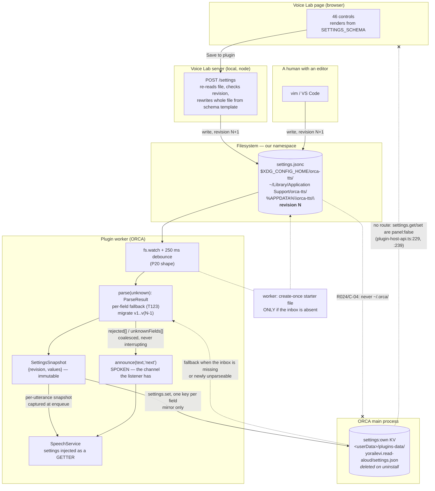

# 011 — Settings: where they live, what shape they are, how they migrate

**Status:** design. **Written:** 2026-08-21. **Phase:** M12 (T120–T124).
**Work order:** `docs/design/008-crossreview-round3.md` findings **X-06**, **X-08**, **C-04**;
carried forward as unresolved by `docs/design/009-reconciliation.md` section 3.
**Supersedes:** `docs/design/004-voice-lab.md` section 7's *location* sentence
(`~/.orca/read-aloud/settings.json`) and its *`schemaVersion: 1`, no migration* stance. The rest of
004 section 7 — the four consumer sections, `provenance`, `expected[]`, T113's round-trip with its
negative control — stands and is consumed here.

**Commits used for every citation below.** `orca-plugin-tts` at **`32b929a`**; ORCA at
**`87097551f8e98a21c3afa7d457f66d6fd1f94038`**. Every `file:line` in this document was read at those
two commits during this session, not inherited from an earlier document (E-01 is the reason that
sentence is here).

> **Two corrections to inherited facts, made while verifying.**
> 1. `docs/.research/q-round1-orca-api.md` Q35 Evidence 3 quotes the settings binding as
>    `set: (itemKey, value)`. It is **three** parameters —
>    `set: (key, itemKey, value)` (`src/main/plugins/plugin-host-service-bindings.ts:80-82`), where
>    `key` is the qualified plugin key. The verdict is unaffected; the signature is not.
> 2. The brief says the normalizer has five fields and names the fifth "the newly added ordered-list
>    field". Verified: **five**, `codeBlocks` `:24`, `pathStyle` `:31`, `extensionStyle` `:36`,
>    `expandNumbers` `:38`, `orderedLists` `:51` (`packages/core/src/normalizer/index.ts:22-52`).
>    Note `:36`, not `:37` — 004 section 7's own pointer to `22-52` is right, the field list is right,
>    and this document pins the per-field lines because T124 walks them.
>    The brief also says 004 specifies 43 controls; the document says **46**
>    (`docs/design/004-voice-lab.md:28`, `:236`, `:736`). This design is written against 46.

---

## 1. Where settings live

### 1.1 What the four candidate homes can actually do

| Home | Who can write | Who can read | Survives uninstall | User can find / back up | Evidence |
|---|---|---|---|---|---|
| ORCA `settings:own` KV — `<userData>/plugins-data/yorailevi.read-aloud/settings.json` | **the worker only**, via `settings.set` | the worker only, via `settings.get` | **no** | barely | `plugin-host-api.ts:224-241`; `plugin-host-service-bindings.ts:79-83`; `plugin-storage-store.ts:28-37`; `plugin-discovery.ts:72`; deleted by `plugin-install.ts:282` |
| ORCA `storage` KV — same directory, `storage.json` | the worker only | the worker only | no | barely | `plugin-host-service-bindings.ts:66-73` |
| `~/.orca/read-aloud/settings.json` (004's choice) | anyone | anyone | yes | yes | — |
| Our own namespace under the OS config dir | anyone | anyone | yes | yes | — |

Four facts decide it, and each is a `file:line`, not a preference:

1. **The lab cannot write the sanctioned home.** `settings.get` and `settings.set` are both
   `panel: false` (`src/shared/plugins/plugin-host-api.ts:229`, `:239`), and the store is a
   main-process class reached only through the worker's host call
   (`src/main/plugins/plugin-host-method-bindings.ts:156-161`). The Voice Lab is a browser page plus
   a local server — neither is a plugin worker, so neither has a route into that file. This is the
   fact that makes X-06 hard: the sanctioned home has **no UI-side writer**, and the UI-side writer
   has **no sanctioned home**.
2. **The sanctioned home is destroyed on uninstall.** `removeInstalledPlugin` removes the plugin's
   data directory as well as its install directory (`src/main/plugins/plugin-install.ts:274-283`),
   and the behaviour is pinned by a test that asserts `storage.json` is unreadable afterwards
   (`src/main/plugins/plugin-install.test.ts:516-531`). A listener who reinstalls to fix something
   loses every hour of tuning. That alone disqualifies it as the *only* home.
3. **It also silently resets on corruption.** `PluginKvStore.read()` swallows a parse error and
   returns `{}` (`src/main/plugins/plugin-storage-store.ts:39-55`, the `catch` at `:51-53` with the
   comment *"Corrupt files reset to empty rather than wedging the plugin"*). From the plugin's side
   that is indistinguishable from "never configured" — the exact FMA-section-20 shape.
4. **It is not a file a human is invited into.** Every write goes through `writeSecureFile`, which
   creates the directory `0o700` and the file `0o600` and re-`chmod`s on each hardening pass
   (`src/shared/secure-file.ts:106`, `:115`, `:210`). It is JSON with no comments, under
   `<userData>`, which on a dev build is a *different directory per worktree* (PITFALLS **P27**).

And `~/.orca/` is refused outright: **C-04** stands. R062 requires a stated reason for a write under
the user's home and 004 gives none; R024 (*"Only read the user's transcripts and configuration; never
write to them"*) makes writing into the host's own config namespace the wrong instinct even for a
file we own. We are a guest there.

### 1.2 The decision — an inbox we own, a cache ORCA owns, one direction

```
Voice Lab (browser) ──POST──▶ lab server ──writes──▶  INBOX      (ours, JSONC, human-readable)
                                                        │
                                     worker fs.watch ───┘
                                                        │ validate + migrate
                                                        ▼
                                                     settings.set  ──▶  ORCA KV  (last-known-good)
                                                        │
                                                        ▼
                                             SettingsSnapshot in memory  ──▶ consumers
```

**The inbox — the source of truth for tuning.** One file, in **our** namespace, never ORCA's:

| Platform | Path |
|---|---|
| Linux / BSD | `${XDG_CONFIG_HOME:-~/.config}/orca-tts/settings.jsonc` |
| macOS | `~/Library/Application Support/orca-tts/settings.jsonc` |
| Windows | `%APPDATA%\orca-tts\settings.jsonc` |
| any | `$ORCA_TTS_CONFIG_DIR/settings.jsonc` when set — the escape hatch for a dev worktree that wants isolated tuning (P27's shape, applied to us) |

**The stated reason R062 asks for**, recorded here so it is not re-derived: *this file exists because
ORCA renders no settings UI for plugins (Q35, upstream stablyai/orca#15655), the only writable
sanctioned store is unreachable from the tuning UI and is deleted on uninstall, and the listener must
be able to find, read, hand-edit and back up their own tuning.* It is created in a directory named
for this plugin, it contains nothing but this plugin's settings, and nothing outside that directory
is ever written.

**The ORCA KV — last-known-good, not source of truth.** After a successful load the worker mirrors
the resolved values into `settings:own` via `settings.set`, one key per field. It earns its place by
doing exactly one job: when the inbox is missing, unreadable, or newly-invalid, the worker falls back
to the KV mirror rather than to bare defaults, so a listener whose config file got deleted still
hears the voice they tuned. It also means we genuinely use the capability we already declare
(`packages/plugin/orca-plugin.json:108`) rather than declaring one we never call.

**Who writes what — no file has two writers in steady state.**

| Writer | Writes | Never writes |
|---|---|---|
| Voice Lab server | the inbox (whole-file rewrite from the schema template) | the KV, `storage`, anything under `~/.orca/` |
| A human with an editor | the inbox | — |
| The worker | the KV mirror; **the inbox only if it does not exist** (create-once starter file, section 6) | an existing inbox — never rewrites, never reformats, never strips a comment |
| The worker's `storage` | *session state* — spoken-reply ids, huddle on/off | tuning |

**What happens when both write.** They cannot write the same file, so the only real collision is
lab-Save versus human-edit on the inbox, and it is resolved by `revision` (section 2): a write whose
`revision` is not greater than the one the worker last promoted is refused as `stale_revision` and
**spoken once**, so a listener editing in `vim` while the lab is open is told which one won instead of
silently losing an hour. The lab re-reads the file before every Save and refuses to Save over a
`revision` it did not last see.

**Precedence at load**, per field, highest first: **inbox** → **KV mirror** → **schema default**.
Per field, not per file: one unparseable line does not demote the other 45 controls.

**The split that keeps this honest: tuning versus state.** Tuning is what the listener chose by ear
and must survive an uninstall; state is what the running plugin remembers between reaps. Tuning goes
in the inbox. State stays in `storage` (`packages/plugin/src/adapter/index.ts:68-77`, already wired,
already used by huddle at `packages/plugin/src/main.ts:163`). This is why the worker never needs to
write tuning values: **nothing inside the plugin changes a tuning value.** In M12 the plugin's
controls change *state* only. If M13 or M15 ever adds an in-plugin control that changes tuning, it
writes the inbox and bumps `revision` like any other writer — and that is the point at which this
document must be re-opened, not before.

---

## 2. The write path and its ordering

### 2.1 The envelope

Every settings file carries the ordering fields **X-06** found missing:

```jsonc
{
  "kind": "orca-tts-settings",
  "schemaVersion": 2,
  "revision": 17,                       // monotonic, per file. The ordering primitive.
  "writtenAt": "2026-08-21T14:02:11Z",  // human diagnostics only. NEVER compared for ordering.
  "writtenBy": "voice-lab/0.2.0",       // or "hand", or "read-aloud/0.4.1" for the starter file
  "provenance": { … },                  // unchanged from 004 section 7
  "settings":  { … },                   // section 3
  "expected":  [ … ]                    // unchanged from 004 section 7; T113's oracle
}
```

`revision` is an integer the writer increments. `writtenAt` is deliberately **not** the ordering key:
clocks go backwards, files get copied between machines, and a timestamp comparison would silently do
the wrong thing on exactly the machine that matters least often.

### 2.2 Ordering against Stop — by not competing with it

003's `gen` orders control verbs against a *playback generation*
(`packages/core/src/queue/index.ts:41-46` bumps it on barge-in; the counter and its accessor are
at `packages/core/src/queue/index.ts:16`, `:23`, and `begin()` is at `:27-30`; a
superseded chunk is refused at `:34` and again at `:55`). X-06's worry is that a settings write
landing during playback cannot be ordered against a Stop.

**The resolution is to make the race impossible rather than to arbitrate it.** A settings promotion:

- **never bumps the playback generation**, and
- **never touches `#pending`** — applying settings must not destroy what is queued. That is C5 and
  PITFALLS **P30** in one sentence: *destroying what is queued is the fault this class of message
  exists to report.*

Instead, loading produces an immutable **`SettingsSnapshot { revision, values }`**, and every
utterance is enqueued **carrying a reference to the snapshot current at enqueue time**. Playback
reads the item's own snapshot. A Stop is therefore always ordered correctly with respect to a
settings write, because a settings write is not a playback-queue operation at all: Stop bumps the
generation and every queued item dies regardless of which snapshot it held.

A promotion whose `revision <= currentSnapshot.revision` is refused with the named code
`stale_revision`. It is logged, and it is spoken **only** when the refusal was a human's edit losing
to the lab (section 4.3's channel rule) — a duplicate promotion of the same revision by the watcher's
debounce is not news.

**Verify by effect.** Enqueue three utterances, promote a new snapshot between the first and the
second, then Stop during the first. Assert: the sink received zero chunks after the Stop, `#pending`
is empty, and the *promotion itself* did not empty it — the control case is the same sequence without
the Stop, where all three utterances still play and items 2 and 3 use the new snapshot. A test that
only asserts "Stop stopped it" would pass with the queue-clearing bug present.

### 2.3 When each control takes effect — three classes, and where each is read

The read-point in current source **is** the answer; these are not policy choices so much as
observations that must be made deliberate.

| Class | Meaning | Read-point today |
|---|---|---|
| **`utterance`** | takes effect on the next utterance; the one playing finishes as tuned | `speech-service.ts:239` (`normalize(text, …)`), `:246-252` (chunker constructed per utterance) |
| **`immediate`** | takes effect on the next queue operation, i.e. within milliseconds | `speech-service.ts:155` (`maxQueued` read on each enqueue) |
| **`session`** | takes effect on the next `activate()`; the plugin says so aloud when one changes | provider resolution in `main.ts:95-106` |

**One required change to source falls out of this.** `#synthesizeOptions()` is called **inside the
per-chunk loop** (`packages/plugin/src/speech-service.ts:257`, calling `:232-237`). With a mutable
snapshot behind it, a voice change would land *between chunk three and chunk four of one utterance* —
a sentence that changes speaker mid-word. `synthesize.*` must be read **once per utterance**, into a
local, at the top of `#speakOne`. This is a settings-design constraint on M12's implementation and it
belongs in T121's acceptance, not discovered later.

**A second constraint: `SpeechServiceDeps` is `readonly` and captured in the constructor**
(`speech-service.ts:34-72`, `:95-101`). Nothing today can change a setting after construction. T121
must replace the frozen fields with a single injected `settings: () => SettingsSnapshot`, or the
plugin's only way to apply a settings change is to rebuild the service — which would drop the queue
and re-pay provider warm-up. Say it now: **settings are injected as a getter, not as values.**

**And a live T122 violation to delete:** `maxQueued: 8` is hardcoded at
`packages/plugin/src/main.ts:99`, while `SpeechService`'s own fallback is `20`
(`speech-service.ts:74`, read at `:155`). Two different "defaults" for one control, neither from a
schema. T122 exists for this.

### 2.4 Mid-utterance policy, and the one part that is taste

| Question | Answer | Kind |
|---|---|---|
| Does a settings change interrupt the utterance being spoken? | **No.** Never. An interruption the listener did not ask for is itself a harm (P30). | correctness |
| Does it apply to items already queued behind it? | **Default no** — each item keeps its enqueue-time snapshot. | **taste** — option `apply.toQueued: false \| true`, `provisional` |
| Does it apply to the next utterance? | **Yes**, for `utterance`- and `immediate`-class fields. | correctness |
| Does a `session`-class change apply now? | No — and the plugin **says so aloud, once**: *"That takes effect the next time ORCA starts."* Silence here is the failure this project keeps re-learning. | correctness |

`apply.toQueued` is genuinely undecidable from a desk. A listener who has just heard a path mangled
wants the fix to reach the four replies already queued; a listener mid-way through a long answer wants
consistency. Default `false` because it is the conservative one, marked `provisional`, settled by ear.

---

## 3. The schema

### 3.1 Shape: one flat, dotted-key record with a descriptor per field

```ts
// packages/core/src/settings/schema.ts  — T120. The only place a default is ever written.

export const SCHEMA_VERSION = 2 as const

export type Owner =
  | 'normalize'   // -> NormalizeOptions   (packages/core/src/normalizer/index.ts:22-52)
  | 'chunk'       // -> ChunkerOptions     (packages/core/src/chunker/index.ts:27-34)
  | 'synthesize'  // -> SynthesizeOptions  (packages/core/src/types/index.ts:26-31)
  | 'queue'       // -> SpeechService queue+announce  (speech-service.ts:34-72)
  | 'announce'    // -> spoken wording: huddle labels, switch, status
  | 'session'     // -> HuddleController: follow, caps, labels
  | 'input'       // -> clipboard / hotkey path
  | 'apply'       // -> this document: how a settings change lands
  | 'lab'         // -> the Voice Lab only. The plugin never reads these.

export type Effect = 'utterance' | 'immediate' | 'session' | 'lab-only'

export interface FieldDescriptor<T = unknown> {
  readonly id: string             // dotted, unique, stable forever: 'normalize.pathStyle'
  readonly owner: Owner
  readonly panel: string          // which Voice Lab panel renders it — presentation, not ownership
  readonly label: string          // spoken and written. One short noun phrase.
  readonly help: string           // one sentence. Becomes the generated comment (section 6).
  readonly kind: 'enum' | 'bool' | 'int' | 'float' | 'string' | 'template'
  readonly values?: readonly T[]  // enum
  readonly range?: { min: number; max: number; step: number }
  readonly default: T
  /** TASTE. The default is a placeholder nobody has settled by ear. See section 5. */
  readonly provisional: boolean
  /** Why this default. Required when `provisional` is false — a settled default has a reason. */
  readonly rationale?: string
  readonly effect: Effect
  /** Engine-dependent (004's `EP`): does not transfer across platform or provider. */
  readonly enginePersonal: boolean
  /**
   * The exact property this value becomes, on the exact object the consumer receives.
   * `null` means DESIGNED BUT NOT WIRED — the control renders, the schema carries it, and
   * T124 excludes it from the reachability assertion while counting it in the gap report.
   */
  readonly wire: string | null    // e.g. 'NormalizeOptions.pathStyle'
  readonly since: number          // schemaVersion in which this id first appeared
  readonly deprecated?: { since: number; replacedBy?: string; note: string }
}

export const SETTINGS_SCHEMA: Readonly<Record<string, FieldDescriptor>> = { … }
```

**Flat dotted keys, not nested objects** — for three reasons, in descending weight:

1. **The sanctioned mirror is flat.** `settings.set` takes `{ key, value }`
   (`src/shared/plugins/plugin-host-api.ts:234-241`) into a flat `Record`
   (`plugin-storage-store.ts:57-93`). A flat file maps 1:1 into the KV with no path walker, and each
   field is written independently, so one bad field cannot corrupt the mirror. Headroom is ample:
   1,024 keys, 256 KB per value, 5 MB total (`src/shared/plugins/plugin-host-api.ts:68-70`) against
   our ~50 fields.
2. **Per-field fallback (T123) becomes a `for` over keys**, not a recursive walk that has to decide
   what "partially valid subtree" means.
3. **T124 becomes a set comparison** rather than a tree diff.

The generated file still *reads* grouped, because the writer emits banner comments in schema order
(section 6). Grouping is presentation; ownership is the `owner` field.

### 3.2 Grouped by owner — the table X-06 and the brief both ask for

Control ids are 004 section 6's, at `docs/design/004-voice-lab.md:236-400`.

| Owner | Fields (004's rows) | Consumer, with `file:line` | Write path | Takes effect |
|---|---|---|---|---|
| `normalize` | rows 1–27 → **5 wired**: `codeBlocks` `pathStyle` `extensionStyle` `expandNumbers` `orderedLists`; the other ~17 are `wire: null` today | `normalize(text, opts)` — `packages/core/src/normalizer/index.ts:22-52`, called at `speech-service.ts:239` | inbox → worker → snapshot | **utterance** |
| `chunk` | 32, 33 (`maxUnits`, `isolateFirstSentence`); `countUnits` is a function, **not settable** | `ChunkerOptions` — `packages/core/src/chunker/index.ts:27-34`, constructed at `speech-service.ts:246-252` | same | **utterance** |
| `synthesize` | 28, 29 wired (`voice`, `rate`); 30, 31 (`pitch`, `volume`) `wire: null` — no field exists; `signal` is runtime, not settable | `SynthesizeOptions` — declared at `packages/core/src/types/index.ts:26-31`, built and handed to the provider in the per-chunk loop at `packages/plugin/src/speech-service.ts:232-257` | same | **utterance** (see 2.3 — must be snapshotted once per utterance) |
| `queue` | 36, 37, 38 (`maxQueued`, `overflowPolicy`, `announce.mode`) | `SpeechService` — `speech-service.ts:55`, read at `:155`; mode is P21's `speak(text, mode)` | same | **immediate** |
| `announce` | 39, 41, 42 (`sessionLabel`, `switchPhrase`, `statusTemplate`). **Row 40 `sessionLabelHashChars` does not exist in this schema** — 008 X-04 / 007 C7 removed hex as a correctness matter, and a schema that carries it invites it back | `SpeechService.announce()` (`speech-service.ts:126`) and huddle labels | same | **immediate** |
| `session` | 46 (huddle reply cap; **existence** is correctness per B-05, the number is taste) | `HuddleController` (`packages/plugin/src/huddle/`) | same | **immediate** |
| `input` | 43 (`clipboardCap`) | `packages/plugin/src/clipboard.ts` | same | **immediate** |
| `apply` | `apply.toQueued` (this document, 2.4) | `SpeechService` enqueue | same | **immediate** |
| `lab` | 34 (`simulateChunkGapMs`), fixture selection, A/B set | the lab's playback scheduler only | inbox, `lab.*` prefix | **lab-only** — the plugin must never read these, and a test asserts it does not |
| *unassigned* | 44, 45 (`pace.pauseBackend`, `interrupt.granularity`), 9 and 35 (pause milliseconds) | blocked behind the single provider-seam change **C-05** demands | — | **session** |

**The gap the brief points at, named plainly:** 46 controls, and the number that reach a typed options
object today is **9** (5 normalize + 2 chunk + 2 synthesize). Everything else is either plugin-local
literals, unimplemented, or blocked on C-05. That is not a reason to shrink the schema — a
`wire: null` descriptor is how the lab renders a control and how the gap stays countable. It *is* a
reason T124 must report the gap rather than only assert the wired subset.

### 3.3 T124, specified precisely enough to write

T124 as worded in `docs/TASKS.md:302-303` iterates `NormalizeOptions`. A TypeScript interface has no
runtime representation, so "iterating" it requires a hand-written key list — which is exactly the
thing that silently goes stale when a sixth field is added. Two halves, and both are needed:

**(a) A compile-time exhaustiveness guard, in the module that owns the type.**

```ts
// packages/core/src/normalizer/index.ts, beside the interface
export const NORMALIZE_OPTION_KEYS = [
  'codeBlocks', 'pathStyle', 'extensionStyle', 'expandNumbers', 'orderedLists'
] as const satisfies readonly (keyof NormalizeOptions)[]

// Adding a field to NormalizeOptions without adding it here fails to COMPILE.
type _MissingNormalizeKey =
  Exclude<keyof NormalizeOptions, (typeof NORMALIZE_OPTION_KEYS)[number]> extends never ? true : never
const _normalizeKeysAreExhaustive: _MissingNormalizeKey = true
```

The same pair for `CHUNKER_OPTION_KEYS` (excluding `countUnits`, which is a function, with the
exclusion written as a named constant so the exclusion itself is reviewable) and
`SYNTHESIZE_OPTION_KEYS` (excluding `signal`).

**(b) A runtime test that iterates the schema, in three assertions.**

```ts
for (const owner of ['normalize', 'chunk', 'synthesize'] as const) {
  const wired = Object.values(SETTINGS_SCHEMA)
    .filter(d => d.owner === owner && d.wire !== null)
    .map(d => d.wire!.split('.')[1])
  // 1. every schema field points at a real property of the real options type
  expect(new Set(wired)).toBeSubsetOf(new Set(OPTION_KEYS[owner]))
  // 2. every property of the real options type is reachable from settings
  expect(new Set(OPTION_KEYS[owner]).difference(new Set(wired))).toEqual(new Set(EXCLUDED[owner]))
}
```

Assertion 2 is the one the brief asks for: **a new normalizer option that is not settable fails the
test**, because it appears in `NORMALIZE_OPTION_KEYS` (forced by (a)) and not in the schema. Any
deliberate exclusion must be named in `EXCLUDED`, so an exclusion is a reviewable line rather than a
silent omission.

**(c) The half that P26 says is the actual check.** Assertions (a) and (b) prove the *names* line up.
They cannot prove a value **arrives**. So T124 also carries a reachability case per owner, in the
shape `speech-service.test.ts` already uses ("voice, rate and chunking are reachable from the
caller"): build a settings file that differs from every default, load it through `parse()`, drive the
outermost object a real caller constructs, and assert the innermost consumer received the changed
value — **with the control case** (a defaults-only file → the consumer receives `{}`), so the positive
assertions can be shown to fail for the right reason.

**Verify by effect for T124 itself:** add a sixth field to `NormalizeOptions` on a scratch branch and
confirm (a) fails to compile *and* (b) goes red. A test that could not have failed is not a check.

---

## 4. Migration and versioning

### 4.1 The three-line policy

- **File newer than plugin** (`file.schemaVersion > SCHEMA_VERSION`): **load it**, apply every field
  the plugin understands, ignore the rest, and **say once, aloud**, how many were ignored.
- **File older than plugin** (`<`): run the migration chain step by step to `SCHEMA_VERSION` in
  memory, apply, and **never write the migrated result back to the inbox** — the listener's file is
  theirs; the migrated form goes to the KV mirror only.
- **Field removed**: never. Mark `deprecated` and keep the id reserved forever; a migration moves its
  value to `replacedBy` when there is a successor, and drops it silently when there is not.

### 4.2 Why "newer file" is tolerated rather than refused

X-08's option (b) proposes refusing an unknown `schemaVersion` **by name**. Refusing is right about
the diagnosis and wrong about the remedy for *this* user: a refused settings file means the plugin
speaks with default voice, default rate, default path style — which for a dyslexic, voice-first
listener is not a safe fallback, it is the failure. Tolerate-and-announce keeps 45 working controls
and reports the one that is not.

The asymmetry is deliberate and worth stating: **adding a field is a minor bump and is
forward-compatible; changing the meaning of an existing id is not allowed at all.** If a control's
semantics change, it gets a **new id**, and the old one becomes `deprecated` with a migration. This is
what makes X-08's real worry — M12 freezing a schema that M14 must extend — a non-event: M14 adds
`omit.artifacts.*` ids at `since: 3`, an M12-era plugin ignores them and says so, and no migration is
needed in the common direction.

`SCHEMA_VERSION` starts at **2**, not 1. 004 published `schemaVersion: 1` describing a schema that was
missing `orderedLists` and persisted a voice *name* (its own round-3 amendment says so). Shipping the
corrected shape as `1` would mean two incompatible files both claiming version 1 — the one thing a
version number exists to prevent. Version 1 is burned; the loader recognises it and migrates it
(`voice: string` → `voiceIndex` + `voiceNameChecksum`, per 004 section 7 and PITFALLS **P28**).

### 4.3 Where a settings failure surfaces

**This is the part FMA section 20 and P30 make load-bearing.** T123 requires per-field fallback that
logs which field failed. `host.log` is wrapped in `catch {}`
(`packages/plugin/src/adapter/index.ts:53`) and `notify` discards its delivery result
(`adapter/index.ts:63-65`) — of the 55 silent-failure sites the FMA counted, the number reaching the
audio stream was **zero**. A settings loader that only logs is a settings loader that fails silently.

`parse()` returns the rejections rather than swallowing them:

```ts
export interface ParseResult {
  readonly settings: Settings            // fully populated; every field has a value
  readonly revision: number
  readonly rejected: readonly { field: string; reason: string; usedDefault: unknown }[]
  readonly unknownFields: readonly string[]     // newer file
  readonly migratedFrom?: number
}
```

Destinations, in this order:

1. **Spoken — the channel this listener actually has.** `SpeechService.announce(text, 'next')`
   (`packages/plugin/src/speech-service.ts:126`), urgency `next`, so it is heard **after** whatever is
   playing and never interrupts. Coalesced into one sentence, naming at most two fields and a count:
   *"Three settings could not be read and are using their defaults: how a path is said, and two
   others. Say status to hear the rest."* Announcements are already exempt from overflow trimming
   (`speech-service.ts:80-81`), so the report cannot be dropped by the thing it is reporting.
2. **`read-aloud.status`** gains a settings-health clause, so the listener can ask again in an hour.
   It must **not** clear the queue to answer (that was C5).
3. `host.log` and `notify`, as supplements, exactly as `onDropped` is a supplement today
   (`speech-service.ts:57-65`).

Silence means a clean load. A clean load says nothing — adding a "settings loaded" chirp would spend
the listener's only channel on non-news.

**Verify by effect.** Construct the loader with **no** `log` and **no** `notify`, hand it a file with
one bad field, and assert on the **text the provider was handed** — the sentence naming the count —
not that a callback fired. Control case: a valid file produces **zero** provider calls. This mirrors
`speech-service.test.ts` "losses and degradations reach the audio stream".

---

## 5. Defaults

**One rule: a default is a data field in `SETTINGS_SCHEMA`, and the code that consumes a setting has
no fallback literal at all.** `parse()` always returns a fully populated `Settings`, so a consumer
never needs `?? something`. That removes the class of bug now live at `main.ts:99` (`maxQueued: 8`)
against `speech-service.ts:74` (`DEFAULT_MAX_QUEUED = 20`).

**Pinned by a lint, not by discipline.** A test greps the consumer modules for `??` and `||`
fallbacks applied to a settings-derived value and fails on any hit, with an allowlist of named
exceptions. Verify by effect: re-introduce `maxQueued: 8` at a call site and confirm the test goes red.

**Taste is marked, not hidden.** `provisional: true` means *"this value was chosen so the plugin
would run; nobody has heard it and decided."* The consequences are concrete:

| | `provisional: false` | `provisional: true` |
|---|---|---|
| requires `rationale` | **yes** | no |
| Voice Lab rendering | normal | marked *"not yet settled"*, and listed first in its panel |
| changing the shipped value | a design decision | **a data edit** — one line in `schema.ts`, no consumer touched, no test rewritten |
| counted in the status bar | — | 004's `46 controls · 8 EP` gains `· N unsettled` |

This is **P23** made structural: *"Ship the mechanism and let the listener choose the values."* When
the listener settles a control in Voice Lab, two things happen — the value lands in their inbox
immediately (they hear it now), and the lab emits a **settled report** (`lab/settled.json`, a list of
`{id, value, heardAt}`) that a maintainer folds into `schema.ts` as a one-line `default` change with
`provisional: false` and a `rationale` quoting what the listener said. The report exists so that
"settled by ear" leaves a trace instead of living in a chat log that ages out.

**Every taste question this document itself opens is marked `provisional` rather than decided:**
`apply.toQueued`, the announcement's field-naming budget (two names plus a count, or one, or all),
whether a `session`-class change is announced at the moment of the change or at the next start, and
the entire `announce.*` wording set. The option space is designed; the values are the listener's.

---

## 6. The degraded path — no lab, and a human with an editor

The Voice Lab is a local server the listener must start. Settings must work when it has never been
run, and must be safely hand-editable when it is not running.

**Format: JSONC** — JSON plus `//` and `/* */` comments, trailing commas tolerated. The reasoning is
forced: hand-editability requires that each control carry its explanation *at the point of edit*,
because a listener who must cross-reference a separate document to know what `pathStyle: "terse"`
means will not edit the file. JSON forbids comments. YAML would add significant-whitespace failure
modes to a file a dyslexic user edits by hand. TOML needs a real parser. A comment-stripper for JSONC
is ~60 dependency-free lines in `packages/core/src/settings/jsonc.ts`, and the normalizer's own
constraint — *imports nothing, not even `node:` builtins*
(`packages/core/src/normalizer/index.ts:4-6`) — says that is the house style. The file is `.jsonc` so
editors highlight it correctly.

**Create-once starter file.** On `activate()`, if the inbox does not exist, the worker writes it: every
field in the schema, at its default, in schema order, with banner comments per group, and each field
preceded by its `help` sentence and its legal values — **all generated from `SETTINGS_SCHEMA`, so the
comments cannot drift from the code.** Provisional fields are marked in their comment. Then the worker
never writes that file again.

```jsonc
{
  "kind": "orca-tts-settings",
  "schemaVersion": 2,
  "revision": 1,
  "writtenBy": "read-aloud/0.4.1",

  "settings": {

    // ───── How a path is said ─────────────────────────────────────────────
    // How file paths are spoken.
    //   "spoken"   — file named session handler, python, in folder src core
    //   "terse"    — session handler, in folder src core
    //   "verbatim" — the raw path, untouched
    // Not yet settled by ear — change it freely.
    "normalize.pathStyle": "spoken",
    …
  }
}
```

**Discoverability, since the listener cannot see a settings pane.** `read-aloud.status` **speaks the
path** on request, and the one-time spoken report in section 4.3 ends with it. A file the listener
cannot find is a file the listener does not have.

**What a hand-edit costs.** The worker watches the inbox (`fs.watch`, 250 ms debounce — the same shape
huddle already uses for transcripts, PITFALLS **P20**), so an edit takes effect on the next utterance
with no restart. A syntax error that makes the whole file unparseable falls back to the KV mirror and
is **spoken**: *"Your settings file has a syntax error on or near line 34. I am using the last good
settings."* A single bad *value* falls back per field (T123) and is reported by the same route.

**What a lab Save costs a hand-editor, said honestly.** Save rewrites the whole file from the schema
template. Generated comments are regenerated and survive; **a comment a human added does not.** Two
mitigations, both stated rather than assumed: the lab warns before the first Save over a file whose
`writtenBy` is `"hand"`, and **Export a copy** (004 section 7) remains the artifact a human annotates
and version-controls freely, since the plugin never reads it.

---

## 7. Read and write paths



---

## 8. What this changes in TASKS M12

Not a task-list edit — a statement of what each existing task now means, so M12 can be planned
against it.

| Task | Now reads as |
|---|---|
| **T120** | `packages/core/src/settings/` owns `SCHEMA_VERSION`, `SETTINGS_SCHEMA`, `FieldDescriptor`, `parse()`, the migration chain, the JSONC reader/writer and the starter-file generator. The lab imports it (004's answer to Q36 stands). |
| **T121** | Watch the **inbox**; `settings.get`/`settings.set` are the **mirror**, not the primary read. Adds two adapter methods — `packages/plugin/src/adapter/index.ts:33-41` today exposes `storageGet`/`storageSet` and nothing for settings. Also: settings become a **getter** on `SpeechService`, and `#synthesizeOptions()` moves out of the per-chunk loop (section 2.3). |
| **T122** | Delete `maxQueued: 8` at `main.ts:99` and `DEFAULT_MAX_QUEUED` at `speech-service.ts:74`. Add the fallback-literal lint. |
| **T123** | `parse()` returns `ParseResult`; the report is **spoken** (section 4.3), with the log and the notification as supplements. |
| **T124** | Iterates `SETTINGS_SCHEMA`, not `NormalizeOptions`, in the three parts of section 3.3 — compile-time exhaustiveness, schema-versus-type set comparison with a named `EXCLUDED` list, and an end-to-end reachability case with its control. |
| **Gate M12** | *"a value exported from Voice Lab, pasted into ORCA settings, produces byte-identical spoken text"* — there is no "ORCA settings" to paste into (Q35). Restate as: **a settings file written by the lab, dropped into the inbox on a second machine, produces byte-identical spoken text for the committed fixtures**, with the `provenance.platform` mismatch reported aloud when the platforms differ. |

---

## 9. Open questions this design leaves

| # | Kind | Question |
|---|---|---|
| **Q62** | T | `apply.toQueued` — does a settings change reach utterances already queued? Default `false`, `provisional`. Option space in 2.4; the listener decides by hearing a four-deep queue both ways. |
| **Q63** | T | The failure announcement's naming budget: two field names plus a count, one plus a count, or a bare count with "say status for the list". Section 4.3 ships two; it is taste. |
| **Q64** | D | **004 Q46 inherits here, unresolved.** An `enginePersonal` value tuned on macOS lands in a file opened on Linux. Options: (a) apply anyway, (b) ignore `enginePersonal` fields whose `provenance.platform` differs and say so once, (c) attempt a mapping. This design carries `provenance` and `enginePersonal` so all three are expressible, and picks none. Recommendation, unsettled: (b). |
| **Q65** | D | Does the settings promotion need a verb in 003's envelope set at all? Section 2.2 argues it does not — a promotion never touches the playback queue, so there is nothing to order it against. If 003 later adds a control that *reads* settings synchronously, that argument lapses and `settings` becomes a ninth verb with `stale_revision` as its refusal code. |
| **Q66** | E | `fs.watch` reliability for a single file across the three platforms, under an editor that writes via rename (`vim`'s default) — a rename-write can leave the watch attached to the old inode. Probe before T121: edit the inbox with `vim`, `code`, and `printf >`, and assert the worker re-read it in each case. This is the one mechanism in this document with no citation behind it. |
| **Q67** | D | Does the lab server refuse to start when the inbox is owned by a *newer* `schemaVersion` than the lab knows? Symmetric to 4.1 but the answer may differ: the lab writing a v2 file over a v3 file destroys settings, where the plugin merely ignores them. |

---

## 10. Summary

**Where they live.** An inbox we own — `settings.jsonc` under the OS config dir, never `~/.orca/`
(C-04) — written by the lab server or by hand, watched by the worker, mirrored into ORCA's
`settings:own` KV as last-known-good. Precedence per field: inbox, then mirror, then schema default.
The sanctioned home cannot be the only home because the lab has no route into it
(`plugin-host-api.ts:229`, `:239`) and ORCA deletes it on uninstall (`plugin-install.ts:274-283`).

**Shape.** One flat record of dotted ids, one `FieldDescriptor` each, grouped by **owner** —
`normalize` `chunk` `synthesize` `queue` `announce` `session` `input` `apply` `lab` — with `wire`,
`effect`, `provisional` and `since` on every field. Flat because the KV mirror is flat, per-field
fallback is a loop, and T124 is a set comparison.

**Version policy, three lines.** Newer file: load it, ignore unknown ids, say how many once, aloud.
Older file: migrate in memory, never write back to the listener's file. Removed field: never removed —
`deprecated`, id reserved forever, value migrated to `replacedBy` when one exists.

**Ordering.** A settings promotion never bumps the playback generation and never clears the queue;
every utterance carries the snapshot current when it was enqueued. Stop therefore always wins, because
a settings write is not a playback operation at all.
