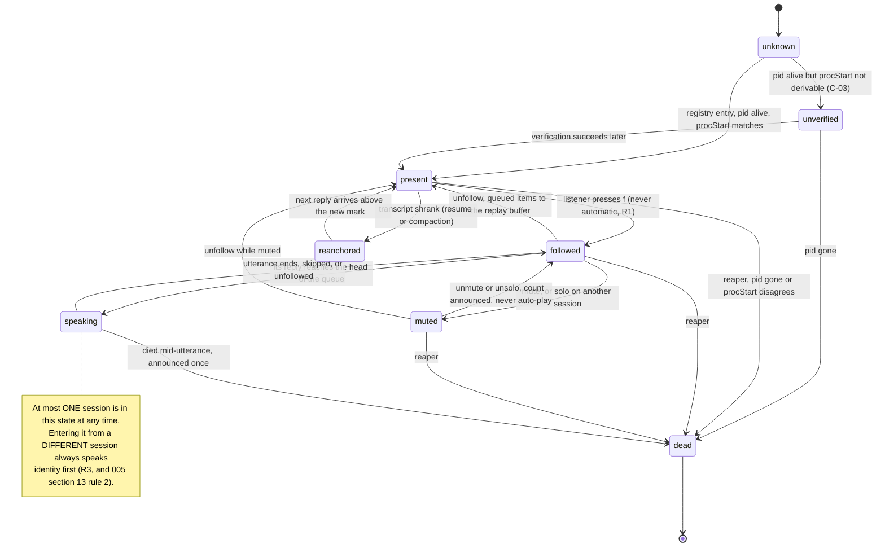

# 012 — Huddle presence: the followed set, liveness, and a room with seven agents in it

**Status:** design. **Written:** 2026-08-21. **Milestone:** M16 (`docs/TASKS.md` "Phase M16 — Huddle
presence", T160–T164).
**Author had no session context.** Every claim about our own code cites `path:line` **re-derived by
symbol at `7d4b8a8`** (originally verified at `1161722`; re-pinned 2026-08-21, see the amendment note). Every number carries **[measured-here]**, **[documented]** or **[claimed]** (constitution
R006).

**What this document decides.**

1. **The lock becomes a followed *set*** — which is `docs/design/005-agent-identity.md` section 15.1's
   named precondition for gate M15, and the reason M15 is scheduled after M16.
2. **The roster is the session registry, not the transcript directory.** That single change is the
   structural fix for PITFALLS **P31**, and it was verified live, during the fan-out that produced
   P31's entry (section 3).
3. **Liveness is `kill(pid,0)` *and* `procStart`** — cross-review **B-02** — with a parsing rule
   nobody had, because the naive comparison is wrong on every entry (section 4, measured).
4. **Mute gains an inverse: solo**, because with seven sessions "mute this one" is six presses.
5. **What presence costs while idle** — cross-review **B-03** — measured rather than asserted.

**What this document does not do.** It does not restate `docs/.discussion/003-panel-and-control-channel.md`.
Sections 6 and 7 of that document already settled display identity, the presence predicates, mute
semantics and the replay-buffer rules; this document **extends** them and says so at each point. It
does not redefine the call-sign or the earcon (`005` sections 11.1, 11.2 own both). It does not mint
control earcons. It writes no implementation code.

> ### Amended 2026-08-21 — round-7 review, `docs/design/014-review-round7.md`
>
> Six findings landed on this document. Each is resolved **in place**, in the section that owns the
> mechanism, and each carries the finding number that forced it. Nothing below is a new design; where
> a finding invalidated a rule, the rule is rewritten rather than annotated.
>
> | Finding | What changed here |
> |---|---|
> | **R7-06** needs-decision — `maxQueued` specified three incompatible ways | Section 3.3 rule 3 and section 2.3's overflow row **cite `011`'s `queue.maxQueued` and restate no number**. Per-session fairness is **not defined here either**: it is `011`'s second field `queue.perSessionFairness` (`011` section 3.2a, `since: 3`). This document supplies only the *shape* the field must express. |
> | **R7-29** needs-decision — this document invents settings `011`'s frozen schema does not carry | **Section 11a is new**: "Settings this milestone adds", one row per invented control, each shaped as an `011` `FieldDescriptor` at `since: 3`, registered through `011` section 4.2a's protocol. `011` owns every default; this document owns none. |
> | **R7-33** needs-decision — the liveness rule and gate M16 have no Windows-executable form (R013) | **Q74 is promoted to a precondition** (section 4.2a) — T160 cannot start until it is answered — and every gate-M16 row is rewritten in a form the `windows-latest` CI job can execute (section 10). Where Windows cannot produce a start time, the `unverified` path is asserted **directly**, with a negative control. |
> | **R7-36** worth-noting — `ceil(8/\|F\|)` admits 9 against a global cap of 8 | The arithmetic is wrong and is replaced: `floor(cap/\|F\|)` with the remainder to the current speaker, **and the total asserted** in the fairness test (section 10). The wireframe at section 7 rendered the inconsistency on screen and is corrected with it. |
> | **R7-37** worth-noting — `main.ts:96` miscited | Corrected to `main.ts:99`, verified by `git show 1161722:packages/plugin/src/main.ts` (section 3.3). |
> | **R7-39** worth-noting — unlabelled numbers against this document's own R006 promise | The wireframe's `58 ms` engine readout is labelled (section 7). |
>
> **R7-30 is `013`'s to resolve** and is resolved there. Its precondition is this document's section
> 2.4 row *"Session appears while `F` is empty"*, which now carries the forward pointer, because a
> reader of `012` alone would not know that `F = ∅` disarms a close signal in another milestone.
>
> **On the citations — and the deliberate re-pin that followed.** `scripts/check-citations.mjs` had
> never been run over this document. It was run for that pass: **28 flags, and all 28 were
> working-tree drift, not defects.** Every `path:line` was re-verified with `git show 1161722:<path>`
> — the SHA this document then pinned — and all but one (R7-37) was correct at that commit.
> `packages/plugin/src/huddle/index.ts` had since moved by ~30 lines under concurrent commits (R7-13
> is the same observation). That pass therefore refused to "fix" them, and said why: *re-pin the
> document deliberately, in one change, when the tree is quiet, and re-derive by symbol lookup.*
>
> **Done 2026-08-21, in the round-7 reconciliation. This document now pins `7d4b8a8`.** Every
> citation was re-derived **by symbol**, choosing the *declaration* site rather than the first use —
> `#highWater` `:138`, `MAX_TRACKED_FILES` `:85`, `WATCH_WINDOW_MS` `:87`, `MAX_REMEMBERED_IDS` `:80`,
> `#ensureWatching` `:278`, `#newestTranscript` `:467`, `followNewest` `:262`, and so on. `26 → 0`
> stale. Two things were repaired that a line-number sweep would have missed:
>
> - **`#warnedAmbiguous` does not exist**; the field is **`#warnedAmbiguousPair`** (`:157`). The old
>   citation was stale *and* named a symbol that had been renamed — the row is about retiring it, so
>   the name mattered.
> - **One bare `:NN` was inheriting the wrong file.** *"until `MAX_TRACKED_FILES` evicts it (`:49`)"*
>   inherited `speech-service.ts` from an earlier citation, and after re-anchoring it would have gone
>   **green against the wrong file**. It is now written out in full. A citation that passes while
>   pointing somewhere else is worse than one that fails; the shorthand is the hazard, and `004`
>   Panel E's rule — **cite a symbol plus the line** — is what catches it.
>
> **The instrument is honest about its own drift.** These numbers will go stale again the next time
> `packages/` moves. That is not a defect in the documents; it is what R7-13 named. The durable
> answer is the symbol, and the re-derivation command is one line:
> `CITATION_LOCKED='docs/design/006-fma.md,docs/design/007-user-stories.md,docs/design/008-crossreview-round3.md,docs/design/014-review-round7.md' node scripts/check-citations.mjs --fix`.

---

## 1. What is already settled, and is therefore not re-argued here

| Fact | Owner | Used here for |
|---|---|---|
| *"In the huddle"* = `running` and not muted. *"The voice"* = `followed`. `spoke-recently` is decoration, never membership | `003` section 7, Q29 | section 2's membership model |
| A muted session's reply is **dropped from the speech queue, retained in the replay buffer, and the omission announced** | `003` section 7, Q30 | section 6 |
| Entering the replay buffer **marks a reply seen**; replaying does **not** rewind the high-water mark | `003` section 7.1 | section 2.4 |
| `~/.claude/sessions/<pid>.json` is a live-session registry carrying `sessionId`, `cwd`, `name`, `status`, `procStart`, `messagingSocketPath` | `docs/.research/q-round1-buzz-transcript.md` Q27 | sections 3, 4, 5 |
| Display identity is the long-form chain; the call-sign is `WORDS[fnv1a32(sessionId) mod 64]` | `003` section 6, `005` section 11.2 | the wireframe, section 7 |
| Every control is one envelope with `gen`, six named refusal codes, and every refusal audible | `003` section 3 | sections 2.3, 6 |
| The dashboard is the control-pane TUI; the plugin panel is write-capable and read-blind | `003` section 4 | section 7 |
| The interrupt control never moves | `003` section 9, `005` section 11.5 | section 7 |

Two facts from our own source, verified at `1161722`, are the starting position:

- **The lock is one nullable string.** `#locked: string | null` at
  `packages/plugin/src/huddle/index.ts:118`, set by `switchTo()` (`:165-170`), cleared by `unlock()`
  (`:244-246`), read by `#ensureWatching()` (`:278`). One watcher (`#watcher`, `:119`), one watched
  file (`#watching`, `:120`).
- **Everything P22 actually fixed is already per-file.** `#primed` is a `Set<string>` keyed by file
  (`:123`), `#highWater` a `Map<string, number>` keyed by file (`:138`), and every utterance is already
  labelled with its session at the point of speaking —
  `this.#deps.speech.speak(r.text, 'queue', sessionLabel(file), file)` (`:399`). **The P22 protections do
  not assume one session. The lock does.** That asymmetry is what makes section 2 cheap.

---

## 2. The followed set

### 2.1 The question M15 could not answer

`005` section 15.1 states the bind plainly: gate M15 is *"with two agents running, you can tell who is
speaking without being told"*, and huddle follows exactly one session, and that lock **is** the P22
fix. So M16 owns the question: **what replaces a single lock without reopening P22?**

The answer starts by naming what P22 was actually about. Re-read its three faults
(`PITFALLS.md` P31 quotes the symptom, P22 the cause): the audio **changed owner without saying so**;
the priming flag was **global instead of per file**; and overflow **dropped the oldest utterance
silently**. Not one of the three is "more than one session was followed". Two of the three are
already fixed per-file, in code, at `:82` and `:97`. The lock was the third fix's cheapest available
implementation — with one owner, ownership cannot change unannounced — and it is the only one of the
three that does not survive contact with a listener who runs several agents on purpose.

**So the invariant to preserve is not cardinality. It is attribution:** the listener always knows
whose words these are, and membership only ever changes because the listener changed it.

### 2.2 The model

```
PRESENT   = every live session in the registry              (section 4 decides "live")
FOLLOWED  = a listener-chosen subset of PRESENT             (F below)
MUTED     = a listener-chosen subset of FOLLOWED
SPEAKABLE = FOLLOWED \ MUTED
SPEAKING  = at most ONE member of SPEAKABLE, ever           (the audio device is serial)
```

Five rules define it, and each one is answerable to a specific failure:

**R1 — Membership is explicit. A new session joins nothing.** A session that appears in the registry
enters `PRESENT` and stops there. It is never auto-followed, never on the strength of being newest,
busiest, or in the current worktree. This retires `#newestTranscript()`'s mtime pick
(`packages/plugin/src/huddle/index.ts:467-510`) as an *automatic* selector; it survives only as the
implementation of the explicit `followNewest()` command (`:262-266`).

*Why:* automatic membership is the whole of P22 and the whole of P31. Both were the machine choosing.

**R2 — `F` is capped, and the cap is a spoken refusal, not a silent truncation.** The cap is the
setting **`session.followMax`** (section 11a), argued default **3**. A fourth `follow` is refused with the named code `follow_capacity`
(`003` section 3 R5's discipline; the code is new, the mechanism is not) and one spoken sentence:
*"Already following three. Unfollow one first, or say follow all."* A **`follow all`** verb exists and
is capped by the same number: with seven present it refuses and **names the count**, rather than
enrolling seven.

*Why 3, and why it is taste-with-a-floor:* three is the largest number of concurrent speakers this
project has any evidence a listener can track — `005` section 14 works its identity example at three,
and the guaranteed-on-all-three voice count is **1** (P28), so at four the listener is separating
speakers by call-sign alone. The **number is the listener's** (P23): the option space is 1..7 plus
`all`, settled in Voice Lab against a recorded multi-session fixture, and `1` reproduces today's lock
exactly. What is **not** taste is that a "select all" enrolls without a cap — that is the foot-gun,
and R2 is the guard.

**R3 — Speech is serialized, and every change of speaker is announced.** The queue stays one queue.
Two followed sessions do not overlap; the second waits. Whenever the **speaker changes between
adjacent queue items**, identity is spoken — mandatory, not a setting. This is `005` section 13's
rule 2 (*"a switch is always audible in some form"*) applied to a set instead of a lock, and it is the
direct answer to P31's *"another agent seem to spoke while it was saying the test pass"*: with `|F| > 1`
the change-of-speaker announcement is the only thing standing between the listener and P22.

**R4 — Leaving is instant and never destructive.** `unfollow` removes a session from `F`. If it was
the speaker, the current utterance is **abandoned** (as `skip` does — generation bumped, queue kept:
`003` section 8.7's table) and its remaining queued items are dropped to the replay buffer with a
count announced, exactly as mute does. Unfollow is not stop: the other followed sessions keep talking.

**R5 — `F` is persisted by `sessionId`, and re-resolved on restore, never trusted.** ORCA reaps an
idle worker after five minutes (P20/P6), so `F` lives in plugin storage beside
`HUDDLE_HIGH_WATER_KEY` (`packages/plugin/src/huddle/index.ts:68`). On restore, every member is
re-checked against the live registry; a member that is gone is dropped **silently at restore** and
its absence reported only if the listener asks. (Announcing five departures at every worker re-fork is
the "announcement that interrupts is itself a harm" failure of P30.)

### 2.3 What happens to the P22 protections when `|F| > 1`

| P22 protection | Today | Under a followed set | Change needed |
|---|---|---|---|
| Per-file priming | `#primed: Set<string>` (`:123`), keyed by file | unchanged — one entry per followed file | **none** |
| High-water mark | one integer per file, `#highWater` (`:138`) | unchanged — `MAX_TRACKED_FILES = 50` (`:85`) already bounds it | **none** |
| Shrink re-anchor | `:257-264` | unchanged, per file | **none** |
| Utterance labelling | `speak(text,'queue',sessionLabel(file),file)` (`:399`) | now load-bearing rather than decorative | label must come from the identity chain (`003` section 6), not `sessionLabel()`'s hex slice (`:106-112`) |
| One watcher | `#watcher` / `#watching` singletons (`:119-120`, `:305-331`) | **must become a map keyed by file** | the one real structural change |
| One stop timer | `#stopTimer` (`:121`), `WATCH_WINDOW_MS` (`:87`) | per file — a done-edge in session A must not stop watching session B | per-file timer |
| One debounce | `#debounce` (`:122`) | per file — a shared 250 ms debounce coalesces two sessions' changes into one read of the wrong file | per-file debounce |
| Ambiguity warning | `#warnedAmbiguousPair` (`:157`), *"two agents are active… speaking the most recent"* (`:520-533`) | **retired.** It exists because the machine was guessing; under R1 it never guesses | delete, and delete its test |
| Queue overflow | `maxQueued`, drop oldest, announce (`speech-service.ts:288`); the value is `011`'s `queue.maxQueued`, not this document's | **now the sharpest edge**: three followed sessions fill one queue three times faster | section 3.3 rule 3's per-session division, registered as `011`'s `queue.perSessionFairness` |

**The one structural change is that four singletons become four per-file entries.** That is the whole
of T160's mechanism. Everything else P22 bought us is already keyed by file and was always ready for
this.

### 2.4 What a new session defaults to, stated as a table

| Situation | Default | Reason |
|---|---|---|
| Session appears in the registry | `PRESENT`, not followed | R1 |
| Session appears while `F` is empty and huddle is on | **still not followed** — huddle says nothing | the alternative is P22's auto-pick with a nicer name. **`F = ∅` is therefore a real, common state** — it is what every reap, restart and first run produces (R5). `013` section 3.3a depends on that and specifies what its listening window does when nothing is followed (**R7-30**); anything else that keys off *"a followed transcript"* must state its `F = ∅` behaviour too |
| Listener presses `f` on a present session | followed; primed per file so the backlog is **not** read (`:211-224`) | P22 fault 2 |
| Session is followed and has a persisted high-water mark from an earlier worker | resume at the mark (`:219-220`) | 006 TT10: the reply that arrived during the reap window used to vanish |
| Followed session dies | leaves `F` and `PRESENT`; announced once *when it was the speaker*, silently otherwise | section 4 |
| Followed session is muted, then unmuted | `003` section 7 Q30 rules 1–5 apply unchanged; the replay buffer already marked those replies seen (`003` section 7.1) | — |

---

## 3. P31's scale: seven transcripts in one directory

P31 is not a hypothetical, and it is not a *fan-out* problem either. **It is a roster problem**, and
the evidence is that the registry already distinguishes the two classes of writer.

### 3.1 The measurement, taken during the fan-out that this document was written in

**[measured-here]**, 2026-08-21, in `/Users/m5air/source/orca-plugin-tts`, while six sibling agents
were writing:

```
REGISTRY entries with cwd under orca-plugin-tts:  1
  pid 2052  orca-plugin-tts-13  111693de-38da-4de8-a288-506104eb7c9c  busy

TRANSCRIPTS modified in the last 10 minutes:      5
  111693de-…  212s ago   IN REGISTRY
  2ad2f15d-…   20s ago   NOT in registry
  569cbfc0-…  331s ago   NOT in registry
  8658881a-…    6s ago   NOT in registry
  a4146985-…   12s ago   NOT in registry
```

Four live transcripts, four agents genuinely producing assistant text, and **not one of them is a
registered session.** Total transcripts in this worktree's project directories: **31**.

Today's selector sorts *every* `.jsonl` in the directory by mtime and takes the newest
(`packages/plugin/src/huddle/index.ts:467-510`). In the snapshot above it would have picked
`8658881a` — a subagent — six seconds after that subagent wrote. **That is P31, reproduced as a
selection, from data on disk, without playing any audio.**

### 3.2 The rule that follows

**Presence enumerates the registry. It never enumerates transcripts.**

- The roster is `~/.claude/sessions/*.json`, filtered by section 4's liveness. Its size is bounded by
  *live processes*, not by history: **5 registry entries against 31 transcripts** in this worktree
  right now [measured-here].
- A transcript is only ever read because a **registered** session was explicitly followed, and it is
  found by `sessionId` — glob `~/.claude/projects/*/<sessionId>.jsonl`, never by re-deriving the
  project directory from `cwd`, which breaks on paths containing spaces or `@`
  (`q-round1-buzz-transcript.md` Q27).
- Subagent transcripts are therefore invisible to presence **by construction**, not by a heuristic
  that has to recognise them. Nothing has to detect a fan-out.

`decoders.ts:52` already rejects `isSidechain` records — but that filter only catches sidechain
records *inside* a followed transcript. P31's subagents each wrote a **separate file** whose records
are ordinary assistant records. The registry gate is what covers that case; the `isSidechain` filter
is not, and it should not be expected to.

**The named risk, and its handling.** Q46 (`005` section 17) is open: whether `~/.claude/sessions/`
registers non-Claude agent CLIs at all. If it does not, a registry-only roster makes Codex/Grok/omp
sessions unfollowable. So presence shows a second, clearly separated region — **UNREGISTERED**: any
transcript modified in the last **`session.unregisteredWindowMs`** (section 11a; argued default
10 min) in a followed worktree whose
`sessionId` is in no registry entry. Rules: it is **listed, never auto-followed**, follow requires an
explicit press, and the row says *"not in the session registry — may be a subagent"*. That single
region answers Q46 without reopening P31, because the failure mode of the unknown case is a row the
listener can see and decline, not audio.

### 3.3 What protects the listener from a room that is too loud

Five mechanisms, in the order they engage:

1. **The cap (R2).** Seven present, at most three followed, and `follow all` refuses by name.
2. **Serialization plus mandatory speaker-change announcement (R3).** Overlap is impossible;
   unattributed hand-off is impossible.
3. **Per-session queue fairness.** *(rewritten for **R7-06** and **R7-36**.)*

   **This document states no number.** The queue cap is `011`'s field **`queue.maxQueued`**
   (`docs/design/011-settings.md` sections 3.2 and 3.2a), which owns its value, its range and its
   `provisional` flag; the earlier text here restated C3's `8` and thereby minted a fourth
   specification of one control (R7-06). Two live defects it named are `011`'s to close under T122
   and are recorded here only so they are not re-discovered: `speech-service.ts:89` declares
   `DEFAULT_MAX_QUEUED = 20`, and `main.ts:99` passes `8` at the SHA this document pins — **`:99`,
   not `:96` as this line previously read (R7-37**, verified with `git show
   1161722:packages/plugin/src/main.ts`).

   **What M16 adds is a *shape*, not a value.** With `|F| > 1` the single global cap `C` is divided:

   ```
   base    = floor(C / |F|)          each followed session's own reservation
   bonus   = C - base * |F|          the remainder, 0 .. |F|-1
   cap(s)  = base + (s is the current speaker ? bonus : 0)
   invariant:  sum over s in F of cap(s) == C      exactly, always
   ```

   The previous rule was `ceil(C / |F|)`, which at `C = 8`, `|F| = 3` gives 3 per session and
   **9 admissible against a global cap of 8** — the arithmetic contradicted the cap it derived from,
   and section 7's own wireframe rendered the contradiction on screen (R7-36). `floor` plus a
   remainder never can: the sum is `C` by construction, and the remainder goes to the session the
   listener is *currently listening to*, which is the one whose next reply matters most.

   This division is registered as `011`'s second queue field, **`queue.perSessionFairness`**
   (`011` section 3.2a, `since: 3`) — a `bool`, because *whether to divide at all* is the choice; the
   division itself is arithmetic, not taste. `011` owns its default. See section 11a.

   Drops are still announced and coalesced (`speech-service.ts:184`), and the announcement now
   **names the session** whose replies were dropped — with several agents, *"skipped 3 older
   replies"* does not tell the listener what they lost.
4. **Solo (section 6).** One press collapses seven to one, and the inverse press restores the set.
5. **The loud-room warning, once.** When `|PRESENT|` first exceeds `session.followMax` in a worktree, one
   spoken sentence at `next` urgency: *"Seven sessions are active here; huddle is following two."*
   Once per worktree per worker lifetime, never repeated — an announcement that repeats is the P30
   harm, and a warning that never changes is a broken indicator.

**P31's own instruction stands and is not superseded**: run fan-outs in a separate worktree, or
unfollow before fanning out. This design makes the failure survivable; it does not make the practice
wrong.

---

## 4. Liveness, and the field nobody used (B-02)

### 4.1 The rule

**A registry entry is live iff `kill(pid, 0)` succeeds AND its `procStart` matches the process's
actual start time.** `kill(pid,0)` alone cannot distinguish a live session from a recycled pid, and
the consequence is not cosmetic: a dead session holds a voice slot, which pushes a live agent out of
tier 0 into tier ≥ 1, where `005` section 13 rule 1 makes the call-sign **mandatory on every turn**.
A stale file degrades the audio of every other agent (B-02).

### 4.2 The parsing rule, which the proposed fix did not have — and needs

B-02 says *"comparing `procStart` against the process's actual start time makes the liveness check
pid-reuse-proof"*. Implemented literally, it reports **every** entry stale. **[measured-here]**, macOS
26.5, this machine:

```
registry 2052.json  procStart = "Thu Aug 20 22:24:14 2026"
ps -o lstart= -p 2052         = "Fri Aug 21 01:24:14 2026"
string equality                 -> differs (would mark a live session dead)

new Date(procStart + " UTC").toISOString()      = 2026-08-20T22:24:14.000Z
new Date(ps_lstart).toISOString()               = 2026-08-20T22:24:14.000Z
                                                -> identical instants
```

Three facts follow, and each is a defect if missed:

- **`procStart` is a `ctime`-style string rendered in UTC**; `ps -o lstart=` renders **local time**.
  The machine is `IDT` (UTC+3) [measured-here], so a naive comparison is off by exactly the offset —
  and would be *correct* on a UTC machine, which is the worst kind of bug to ship.
- **Its resolution is one second.** Two processes with the same pid started in the same second are
  indistinguishable. Accept it: the residual is a pid recycled within one second of the original's
  death, and the cost of a miss is one wrong roster row, corrected at the next poll.
- **The comparison must be `|a - b| <= 1s` on parsed epoch values**, never string equality, because
  `ps` pads its output (trailing spaces observed [measured-here]) and formats differ across
  platforms.

Per-platform derivation of "the process's actual start time":

| Platform | Source | Label |
|---|---|---|
| macOS | `ps -o lstart= -p <pid>`, parsed as **local** | **[measured-here]** — matches `procStart` parsed as UTC |
| Linux | `ps -o lstart= -p <pid>`, or `/proc/<pid>/stat` field 22 against `/proc/uptime` for a monotonic answer | **[claimed]** — not run; probe named in section 9 |
| Windows | no `ps`; `(Get-Process -Id <pid>).StartTime`, or the registry's `messagingSocketPath` named-pipe existence | **[claimed]** — and it lands inside `010` section 11.2's open finding C-03, *"`kill(pid,0)`, `/tmp/…` sockets and unix-socket semantics all have undeclared Windows behaviour"* |

Where the start time cannot be derived, the entry is **`liveness: unverified`**, is shown as such in
the roster, and is **followable but never auto-anything**. It is not silently treated as live and it
is not silently dropped — a third state named out loud beats a coin flip either way (P18).

The second liveness signal costs nothing and should be used as corroboration, not as the test:
`messagingSocketPath` = `/tmp/cc-socks/<pid>.sock` existed for all five live sessions in Q27's probe.
Socket present + pid alive + `procStart` match = live; any disagreement = `unverified`.

### 4.2a Windows is a precondition, not a footnote — R7-33

**Q74 is promoted from an open question to a precondition of T160. It is answered before M16 starts,
not after M16 ships.** The reason is R013 — *a feature that degrades on one OS is not done* — and the
degradation this document itself names: *"a dead session holds a voice slot … a stale file degrades
the audio of every other agent"* (section 4.1). If `(Get-Process -Id <pid>).StartTime` does not
resolve, or does not agree with `procStart`, then **every Windows row is `unverified`, the reaper of
section 4.3 can never remove a crashed session, and that degradation is permanent on Windows.** The
earlier text treated `unverified` as a graceful fallback; it is graceful only if something is
*asserted* about it, and nothing was.

**The precondition, stated so it can be answered in one sitting** — this is Q74, unchanged in
substance and promoted in status:

```powershell
# on windows-latest, or any Windows host with a Claude session running
$e = Get-Content "$HOME\.claude\sessions\<pid>.json" | ConvertFrom-Json
$p = Get-Process -Id $e.pid
$p.StartTime.ToUniversalTime().ToString("o")            # what Windows reports
([datetime]::Parse($e.procStart + " UTC")).ToUniversalTime().ToString("o")   # what the registry says
```

Three answers are possible and **each has a specified consequence, decided now rather than when the
probe returns**:

| Q74 outcome | Windows liveness is | What section 4.3's reaper does | What gate M16 asserts |
|---|---|---|---|
| **A — `StartTime` resolves and agrees** within the 1 s tolerance | the same rule as macOS | reaps crashed sessions normally | the same rows as macOS, with the shell translated |
| **B — `StartTime` resolves but in a different timezone or format** | the same rule, with a Windows parsing branch | reaps normally | additionally the timezone row, run under two `TZ`-equivalents (`Set-TimeZone`) |
| **C — `StartTime` does not resolve at all** (access denied for another user's process is the documented case) | **`unverified` for every row** | **cannot reap on `procStart`; falls back to `kill(pid,0)` alone plus `messagingSocketPath` existence, and pid reuse is accepted as unhandled on Windows** | **the `unverified` path itself**, positively — see section 10 |

Outcome C is the one that must not be left implicit. Under C, this document's liveness rule **is
weaker on Windows than on macOS and the plugin must say so** — the roster renders those rows as
`unverified`, `read-aloud.status` names the platform limitation when asked, and the README carries it
in the same breath as the feature (the *"say why"* rule of P7/P16). A silent `unverified` is P30's
shape: a correct mechanism reporting into a channel nobody reads.

**What is not acceptable under any outcome** is the current position — a Windows path that is
`[claimed]`, a gate written in `kill -9` / `ps` / `TZ=`, and no assertion that distinguishes *"Windows
liveness works"* from *"Windows liveness silently never runs"*.

### 4.3 The reaper

Every registry poll (section 8), an entry that fails the liveness test is removed from `PRESENT` and
from `F`. Because a slot was freed, `005` section 9's reassignment path runs — and it already knows
how to announce a reassignment. Three rules:

1. **A dead session that was the speaker is announced**: *"Cedar's session ended."* Once.
2. **A dead session that was merely present is not announced.** It appears and disappears from the
   roster like any other row.
3. **Its high-water mark is retained**, not pruned, until `MAX_TRACKED_FILES` evicts it (`packages/plugin/src/huddle/index.ts:85`) — the
   same pid may not come back, but the same `sessionId` can be resumed, and re-reading a resumed
   transcript from zero is P22's third fault.

**Verify by effect:** start a session, record the roster, `kill -9` it (leaving the registry file
behind), and assert the row disappears **and** that a probe with the `procStart` comparison removed
leaves the row present. Without that negative control the test passes on a registry file that was
cleanly deleted, which proves nothing about pid reuse.

---

## 5. The second day

Cross-review B-01's neighbour: *12 dead sessions in the registry, 400 remembered ids. What does
presence look like on day two, and what prunes?*

**The registry-gated roster answers most of it structurally, and that is the point of section 3.**

| Thing that accumulates | Bound | Mechanism |
|---|---|---|
| Registry entries | **self-pruning** — the file is removed on clean exit; a named value moved and moved back in Q27's probe (5 → 6 → 5) | the OS |
| Registry entries after a **crash** | the reaper (4.3), at the next poll | ours |
| Transcript files — **31 in this worktree already** [measured-here] | never enumerated by presence | section 3.2 |
| `#highWater` entries | `MAX_TRACKED_FILES = 50` (`packages/plugin/src/huddle/index.ts:85`), oldest-touched evicted (`:409-413`) | already shipped |
| `#spoken` ids | `MAX_REMEMBERED_IDS = 300` (`:80`), and **explicitly no longer load-bearing** (`:127-128`) — the gate is `replies.slice(mark)` (`:392`) | already shipped |
| `F` membership | `session.followMax` (section 11a), and re-resolved against the live registry at restore (R5) | this document |
| Identity assignments (`005` section 9) | pruned when the `sessionId` leaves the registry **and** its transcript is gone | `005` owns it; this document supplies the liveness input |
| Replay buffer | last 20 (`003` section 4) | already designed |

**So day two looks like day one**: a roster of however many sessions are alive right now — five on
this machine, across four different worktrees [measured-here] — with no history in it. The only
day-two artifact a listener can perceive is a crashed session's row, and it survives exactly one poll
interval.

**The one thing that does not self-heal** is a `sessionId` that is resumed (`claude --resume`) after
its transcript was rewritten: the file shrinks or its uuids change, and `:257-264` re-anchors and
stays quiet, by design (006 C9). Presence must show that as a row state — **`re-anchored`** — rather
than silently, because from the listener's side an agent that stops speaking and an agent that was
re-anchored are the same experience.

---

## 6. Mute, and its inverse

`003` section 7 Q30 settled what mute *does*. With seven sessions present the missing half is
ergonomic: **"mute this one" is the wrong verb; "only this one" is the right one.**

| Verb | Effect on `F` | Effect on `MUTED` | Announced | Stale? |
|---|---|---|---|---|
| `mute <session>` | none | add | count of skipped replies, continuously in the TUI (`003` section 7 rule 3) | never — a level (`003` section 3 R4) |
| `unmute <session>` | none | remove | one sentence: *"three replies were skipped while muted; press R to replay"*, then quiet (`003` rule 4) | never |
| **`solo <session>`** | none | **`MUTED := F \ {session}`** | *"Solo: Cedar. Two others muted."* | never — a level |
| **`unsolo`** | none | restores the `MUTED` set captured at solo time | *"Solo off. Two sessions unmuted."* | never |
| `mute all` | none | `MUTED := F` | count | never |

Four rules attach:

1. **Solo saves and restores.** `solo` snapshots `MUTED` before overwriting it; `unsolo` restores that
   snapshot, not an empty set. Otherwise solo silently un-mutes a session the listener muted an hour
   ago, which is an unrequested change in what speaks — the class P22 belongs to.
2. **Solo is a level and is idempotent.** `solo X` while soloed on `X` is a no-op; `solo Y` while
   soloed on `X` moves the solo and keeps the original snapshot.
3. **Solo does not change `F`.** Muting is a speech filter, not a delivery filter (`003` section 7),
   so the muted sessions' replies still enter the replay buffer and still advance their high-water
   marks. Unsolo therefore never floods — the guarantee is inherited, not re-derived.
4. **Solo has a key and mute already has one.** `003` section 4a.1 gives `m` = mute on both surfaces.
   Solo takes **`o`** in the TUI — free in both tables of `003` section 4a — and appears in the panel's
   secondary row as a fixed-width `[ solo ]` / `[ unsolo ]` label, per `003` section 8.7's no-reflow
   rule. `o` is **not** added to the spoken control vocabulary of `003` section 4a.3 by this document;
   that list constrains the call-sign words (`005` section 11.2) and extending it is `003`'s to do.
   Recorded as Q72.

---

## 7. The display surface — extending 003's wireframe

`003` section 4 already fixed the geometry: 80×24, every region a fixed height, the Stop slot never
moving. This document changes **one region** — SESSIONS — and one status line. Everything else is
`003`'s and is reproduced only so the diff is legible.

```
┌─ Read Aloud ─────────────────────────────── engine: Piper (amy-low) · 58 ms ─┐
│                                                                              │
│  NOW READING            Cedar · orca-plugin-tts-13                  0:07/0:19│   rows 3-6, height 4
│  The normalizer now announces the file name first, then the ▐folder▌,        │   (unchanged from 003
│  then the kind. That was the third listening fix in a row.                   │    except the identity
│  ████████████████████████░░░░░░░░░░░░░░░░░░░░░░░░░░░░░░░░░░░░  38%           │    is 003 §6's chain)
│                                                                              │
│  ┌────────────────────────────────────────────────────────────────────────┐  │   rows 8-10,
│  │                          [ S ]   S T O P                               │  │   PRE-RESERVED,
│  └────────────────────────────────────────────────────────────────────────┘  │   NEVER MOVES
│    [ Space ] pause   [ N ] skip   [ M ] mute   [ O ] solo                    │
│  QUEUE  2 waiting                                  per-session cap 2+2 of 8  │   rows 12-15, height 4
│    1.  Cedar    "I have updated the roadmap and reconciled..."          0:12 │
│    2.  Willow   "The panel bridge is a transport, not a..."             0:31 │
│        (empty)                                                               │
│                                                                              │
│  SESSIONS   3 followed of 7 present            [ F ] follow  [ U ] unfollow  │   rows 17-21,
│   ▶ Cedar     orca-plugin-tts-13   main         speaking                     │   height 5  <- CHANGED
│   ● Willow    orca-5c              panel-bridge followed                     │
│   ● ~~Rowan~~ math-study-f8        main         MUTED  2 skipped             │
│   ○ Juniper   split-the-windows-…  main         present                      │
│   ⚠ (4 more, 2 unregistered — [ ↑↓ ] to scroll)                              │
│  LAST 20   [ R ] replay  [ ↑↓ ] choose         SOLO: off · loud room: 7 here │   row 22  <- CHANGED
│  [ ? ] help                                            control: connected    │   row 23
└──────────────────────────────────────────────────────────────────────────────┘
```

**The two numbers rendered in that box carry R006 labels, which they did not (R7-39):**

| Rendered as | Number | Label |
|---|---|---|
| `engine: Piper (amy-low) · 58 ms` | 58 ms per sentence | **[measured-here]** — the midpoint of Piper amy-low's **52–65 ms/sentence** on this machine (PITFALLS **P11**, `docs/.research/tts-engine-landscape.md`; macOS 26.5, Node 26.7, `sherpa-onnx-node` 1.13.6, 2 threads, one sentence → ~2 s of audio). **It is a synthesis figure and not a first-audio figure** — the device cost (P32) is not in it, and the header must not be read as a latency budget readout |
| `per-session cap 2+2 of 8` | the cap | **not a measurement** — it is `011`'s `queue.maxQueued` divided by section 3.3 rule 3. Whatever `011` sets, the box shows that value; `8` here is an illustration, not a second specification (R7-06) |

At runtime the header shows the **live** per-sentence figure for the resolved engine, so a listener
on the `say` fallback sees its real cost rather than Piper's. A hard-coded 58 in the TUI would be the
P33 shape — a number in a document that is not the number in the running system.

**What changed from `003` section 4's wireframe, and why:**

| Change | Reason |
|---|---|
| SESSIONS header carries `3 followed of 7 present` | with more than one followed session, "how many can talk to me" is the first question and it was previously not on screen |
| Marker column `▶ ● ○` — speaking / followed / present | `003`'s single `>` marked the lock; a set needs to distinguish *is speaking* from *may speak* |
| Region grows to height 5 with an explicit overflow row | seven sessions do not fit in four rows, and a silently truncated roster is the P31 blind spot rendered in a box |
| `MUTED` shown with the skipped count on the row | `003` section 7 rule 3 requires the count displayed continuously; on one row per session it belongs on the row |
| `SOLO: off` and `loud room: 7 here` on row 22 | a state that changes what speaks must be visible; a solo the listener forgot is indistinguishable from a broken plugin |
| `[ O ] solo` in the control row | section 6 |
| QUEUE header shows `per-session cap 2+2 of 8` | section 3.3 rule 3 — the fairness rule is invisible otherwise, and an invisible cap reads as a bug. **The rendering is `base+bonus of C`**, so the sum across the roster is visibly `C` and never more. It previously read `cap 3 of 8`, which showed `3 × 3 = 9` against a cap of 8 on screen — **R7-36**, the arithmetic defect caught by its own wireframe |
| Queue items labelled by **call-sign** | `005` section 11.2 owns the identity; `sessionLabel()`'s hex slice (`packages/plugin/src/huddle/index.ts:106-112`) is what M15 exists to replace |

**The plugin panel is unchanged.** It is read-blind (`003` section 4), so it gains one button —
`[ solo ]` in the secondary row — and nothing else. It cannot show a roster and must not pretend to.

---

## 8. What presence costs while idle (B-03)

B-03 found no CPU, wakeup or battery figure anywhere in this project. Here are three, measured on
this machine, plus what is honestly not measured.

| What runs | Period | Cost | Label |
|---|---|---|---|
| Registry scan: `readdir` + `JSON.parse` + `kill(pid,0)` over 5 entries | 2 000 ms while huddle is **on** | **0.115 ms per scan** (2.306 ms for 20 scans) → ~0.006 % duty cycle | **[measured-here]** |
| `fs.watch` on followed transcripts | event-driven, no timer | **5 watchers produced 2 events in 12.0 s = 0.17 events/sec** with agents mostly idle | **[measured-here]** |
| `procStart` verification via `ps` | only for entries whose pid is alive **and** whose `procStart` has not already been verified this worker lifetime — cached per (pid, procStart) | one `ps` spawn per new session, ~5–15 ms | **[claimed]** — spawn cost not isolated here |
| Registry scan while huddle is **off** | never | 0 | design constraint |
| `fs.watch` on **unfollowed** sessions | never | 0 | design constraint |

Four rules follow, and they are the design's answer to B-03 rather than a note:

1. **Presence never watches what it is not following.** Roster comes from the registry poll; only
   members of `F` get an `fs.watch`. Cost scales with `|F|` (≤ 3), not with `|PRESENT|` (7) and not
   with transcripts on disk (31).
2. **The registry poll stops when huddle is off**, and `restore()` (`:108-119`) does not start it.
3. **Nothing wakes the audio device.** `010` section 11.5 already adopted B-03's back-off for the
   paused heartbeat; presence adds no periodic sound at all.
4. **The poll interval is the setting `session.registryPollMs`, with a floor of 1 000 ms** (section
   11a). At 0.115 ms of work, the interval is
   chosen for *freshness*, not for cost — 2 s means a crashed session's row is wrong for at most 2 s.

**The honest gap.** The 0.17 events/sec figure was taken while the watched agents were between turns;
a fan-out writing continuously will be far higher, and neither figure is a *wakeup* count. The probe
that would settle it is `010` section 11.5's, unrun there and unrun here: `powermetrics` sampled for
60 s with huddle on, `|F| = 3`, queue empty, against the plugin disabled — watching wakeups/sec and
package idle residency move. Recorded as **Q73**. Do not quote the two numbers above as a battery
claim; they are CPU-time and event-count figures and nothing more.

---

## 9. A session's life, as a state chart



---

## 10. Gate M16, restated so it can fail

`docs/TASKS.md` gate M16 reads *"the panel shows who is in the room and who is talking, and you can
mute one."* The panel is read-blind (`003` section 4), so the display half of that gate is not
runnable as written. Restated:

> **The control-pane TUI shows who is in the room and who is talking, more than one session can be
> followed at once without either being spoken unattributed, and one press silences all but one.**

**Rewritten for R7-33.** The previous table was written in `kill -9`, `ps` and `TZ=`, none of which
runs on `windows-latest`, on a project whose first hard requirement is three-OS parity. Every row now
declares **where it runs** and, where the mechanism differs, **the Windows form of the same
assertion**. Rows that genuinely cannot be OS-neutral are marked, and the reason is a fact about the
platform rather than a gap in the test.

A rule that makes the difference reviewable rather than accidental: **the fixture is a directory of
files, never a process**, wherever that is possible. A registry entry is JSON on disk and a transcript
is a `.jsonl`; both can be written by the test in any language on any OS. Only two rows genuinely
need a live process, and they are the two marked `real process`.

| Test | Runs on | What would prove us wrong |
|---|---|---|
| **Two followed, interleaved replies.** Write two transcript fixtures, alternating. | all three (pure fixture) | any utterance whose speaker differs from the previous one and was not preceded by an identity announcement (R3) |
| **The P31 fixture.** Seven transcript files in one directory, one of them named by a registry-entry fixture. Follow the registered one. | all three (pure fixture) | the sink speaking **any** text from the six unregistered transcripts. *Negative control:* explicitly follow one unregistered row and assert it now speaks — otherwise the test passes on a plugin that is simply broken |
| **Pid reuse.** `real process`. Start a child, record its pid and start time into a registry-entry fixture, terminate it, then occupy the pid.<br>**POSIX:** `kill -9`, `kill(pid,0)`.<br>**Windows:** `Stop-Process -Force`, and the pid check is `Get-Process -Id` throwing `ProcessCommandException`. Occupying a specific pid is not scriptable on Windows, so the Windows form instead **rewrites `procStart` in the fixture to a different instant while the process is still alive** — which is the same assertion (a `procStart` that disagrees means dead) reached without pid arithmetic. | all three, two forms | the row surviving on the roster. *Negative control (both forms):* the same fixture with the `procStart` comparison disabled must leave it present |
| **Timezone.** Assert the liveness verdict is identical under two host timezones.<br>**POSIX:** `TZ=UTC` and `TZ=Asia/Jerusalem` in the env.<br>**Windows:** `TZ` is not honoured by .NET or by `Get-Process`, so the row is run twice against a **`procStart` string fixture** with the parser's timezone injected, plus one CI leg with the runner's timezone changed (`Set-TimeZone -Id 'Israel Standard Time'`), which requires the elevated `windows-latest` runner. | all three, two forms | any difference in the verdict — this is the exact defect section 4.2 measured, and it is *more* likely on Windows, not less, because outcome B of section 4.2a is a live possibility |
| **Windows liveness, positively asserted (new — R7-33).** `real process`. On `windows-latest` only: start a child, read `(Get-Process -Id $pid).StartTime`, and assert the liveness rule returns **`live`** for it. | Windows only | the rule returning `unverified` for a process whose start time Windows *did* report — which is the silent-degradation failure section 4.2a names. **This row is what turns Q74 from a claim into a check.** |
| **The `unverified` path, positively asserted (new — R7-33).** Force the start-time derivation to fail (inject a deriver that throws) and assert: the roster row reads `unverified`, the reaper does **not** remove it, it is followable, and nothing auto-follows it. | all three (fixture) | an `unverified` row being reaped, auto-followed, or silently rendered as `present`. *Negative control:* the same fixture with a working deriver must produce `present` and must be reapable — otherwise the test passes on a plugin that treats every row as unverified |
| **Solo restores.** Mute A, solo B, unsolo. | all three (pure fixture) | A coming back unmuted |
| **Capacity refusal.** Follow four with `session.followMax = 3`. | all three (pure fixture) | a silent fourth join, or a refusal that is not spoken and not named `follow_capacity` |
| **Death mid-utterance (T164).** Remove the speaking session's registry entry mid-reply — a file delete, not a signal — with `log` and `notify` both disabled. | all three (pure fixture) | no **spoken** sentence naming the end (P30 — the discipline that announced into a channel the listener does not read) |
| **Per-session fairness, and the total.** One agent emits 20 replies while another emits 1, two followed. | all three (pure fixture) | the single reply being evicted; the drop announcement not naming which session lost replies; **or the sum of the admitted items exceeding `queue.maxQueued`** — asserted as a total, not per session, because the total is exactly what `ceil` got wrong (**R7-36**). Run at `\|F\| = 1, 2, 3, 5` so a division that happens to work at one roster size cannot pass |
| **Idle cost.** huddle on and queue empty, versus plugin disabled.<br>**macOS:** `powermetrics`. **Linux:** `perf stat -e sched:sched_wakeup` or `/proc/<pid>/schedstat`. **Windows:** `Get-Counter '\Thread(...)\Context Switches/sec'`. | all three, three tools | any measurable wakeup delta (Q73). **This row is a probe, not a CI gate** — the three tools do not produce comparable units, and pretending they do would be a permanently-green indicator |

---

## 11. What would prove this document wrong

| Claim | What would refute it |
|---|---|
| Subagent sessions never register in `~/.claude/sessions/` | one registry entry whose `sessionId` matches a Task-tool subagent transcript. The measurement in 3.1 is **one machine, one CLI version** (Claude Code 2.1.238, macOS 26.5) |
| The P22 protections are already per-file | any of `#primed` (`:82`), `#highWater` (`:97`) or the utterance label (`:275`) turning out to need cross-file state |
| Three concurrent speakers are trackable by a listener | the M15 blind listening test scoring below 10/10 at three followed but passing at two followed — in which case `session.followMax` drops to 2 and nothing else changes |
| Serialized speech is enough | a listener reporting that waiting for agent A to finish makes agent B's reply useless by the time it is spoken, which would argue for *interrupting* by priority — a different design |
| `procStart` + `kill(pid,0)` is pid-reuse-proof | a pid recycled inside one second, which the 1-second resolution cannot see [measured-here] |
| Presence costs nothing while idle | Q73's `powermetrics` run |

---

## 11a. Settings this milestone adds — R7-29

`011` freezes `SCHEMA_VERSION = 2` over an enumerated control set and makes T124 assert
schema-versus-type coverage against a named `EXCLUDED` list (`docs/design/011-settings.md` sections
3.1, 3.3). **This document invented four controls and cited `011` nowhere**, so M16 as written would
have landed four ids that the schema, the starter-file generator and T124's gap report know nothing
about — a control that cannot be walked from the file to its consumer is not a setting, it is a
comment (**P26**).

The mechanism for adding ids after a freeze is `011`'s and is not re-argued here: a later milestone
registers new ids at **`since: 3`**, an M12-era plugin ignores an id it does not know and **says so**,
and no migration is required (`011` section 4.2, and the registration protocol in `011` section
4.2a). **`011` owns every default, range and `provisional` flag below.** The `default` column is this
document's *argued starting position*, offered as input to `011`, not as a decision — where a row is
marked taste, the value is the listener's (**P23**) and Voice Lab settles it.

| `id` | `owner` | `kind` / `values` | `default` | `provisional` | `effect` | `wire` | `since` | `help` |
|---|---|---|---|---|---|---|---|---|
| `session.followMax` | `session` | `int`, range 1–7, step 1, plus the sentinel `0` meaning *all present* | `3` | **`true`** — taste, argued in section 2 R2, settled in Voice Lab against a recorded multi-session fixture (**Q70**). `1` reproduces today's single lock exactly | `immediate` | `HuddleController.followMax` | `3` | *How many agents may speak to you at once. A further follow is refused out loud.* |
| `session.registryPollMs` | `session` | `int`, range 1 000–30 000, step 500 | `2000` | `false` — rationale: at 0.115 ms per scan **[measured-here]** (section 8) the interval is chosen for freshness, not cost; 2 s bounds how long a crashed session's row can be wrong. **The floor of 1 000 ms is correctness, not taste** — below it the poll is a busy loop against `~/.claude/sessions/` | `immediate` | `HuddleController.registryPollMs` | `3` | *How often the roster is refreshed. Lower is fresher, never cheaper.* |
| `session.unregisteredWindowMs` | `session` | `int`, range 60 000–3 600 000, step 60 000 | `600000` (10 min) | **`true`** — taste; section 3.2 argues 10 min from nothing measured | `immediate` | `HuddleController.unregisteredWindowMs` | `3` | *How recently a transcript must have changed to appear in the UNREGISTERED region.* |
| `session.unregisteredRows` | `session` | `enum`: `'hidden' \| 'count' \| 'expanded'` | `'count'` | **`true`** — **this is Q76 and it is explicitly not decided here.** The option space is designed (three values); the default belongs to the listener. `'hidden'` makes Q46's non-Claude agents unreachable; `'expanded'` renders seven subagent rows during a fan-out. `'count'` is the reversible middle and is offered as the starting position, not as an answer | `immediate` | `HuddleController.unregisteredRows` | `3` | *Whether transcripts with no session-registry entry are listed, counted, or hidden.* |
| `queue.perSessionFairness` | `queue` | `bool` | — | — | `immediate` | — | `3` | **Not this document's field.** Registered by `011` section 3.2a alongside `queue.maxQueued`; section 3.3 rule 3 supplies only the division it expresses. Listed here so the count is complete |

**Four ids, plus one that belongs to `011`.** T124's gap report counts all five (`011` section 3.3
(d)); none is wired today, so all four of ours carry `wire` as a *target*, and T124 excludes an
unwired id from the reachability assertion while still counting it in the gap.

**What is deliberately not a setting.** The mandatory speaker-change announcement (R3), the
`follow_capacity` refusal being spoken, the once-per-worker loud-room warning, and the `o` key for
solo. The first three are correctness — a listener who can turn off attribution has re-created P22 by
configuration — and the fourth is a keybinding, which `003` section 4a owns.

---

## 12. New open questions

To append to `docs/.discussion/000-open-questions.md`. **Numbered from Q70 deliberately**: `010`
section 14 and `011` both claimed Q62–Q66/Q67 concurrently, so Q62–Q69 are ambiguous and must be
cited document-qualified until someone reconciles them.

| # | Kind | Question | Cheapest reversible option |
|---|---|---|---|
| **Q70** | T | **`session.followMax`'s default.** 3 is argued in R2; the listener settles it in Voice Lab against a recorded multi-session fixture. `1` reproduces today's lock exactly. **Registered as a schema field by section 11a (R7-29)**, so the question is now *which value*, not *where it lives*. | ship 3, expose 1..7 plus `all` |
| **Q71** | D | **Interrupt or wait.** R3 serializes: agent B waits for agent A. Should a *directly addressed* session pre-empt instead? buzz's *"the pickup is the feedback that you heard them"* (`q-round1-buzz-transcript.md`, "What buzz does that we do not" item 1) argues yes; P22 argues no. | ship wait; pre-emption is additive later |
| **Q72** | D | Does `solo` / `unsolo` enter `003` section 4a.3's spoken control vocabulary? It would forbid those words as call-signs (`005` section 11.2). `003` owns that list; this document only takes the `o` key. | add both words — the cost is two of 64 call-sign slots |
| **Q73** | E | **Idle cost, properly.** `powermetrics` with huddle on, three followed, queue empty, versus the plugin disabled. Section 8's figures are CPU-time and event counts, not wakeups. Shares its shape with `010` Q66 and should be run once for both. | if it is not ~zero, the poll interval rises until it is |
| **Q74** | E | **Windows liveness — PROMOTED TO A PRECONDITION OF T160 (R7-33).** Does `(Get-Process -Id <pid>).StartTime` agree with the registry's `procStart`, and in which timezone? Section 4.2 measured macOS and reasoned about the rest; **section 4.2a states the probe, the three possible outcomes and the consequence of each, and M16 does not start until one of them is chosen.** Lands inside `010`'s open C-03. | outcome C — `unverified` everywhere on Windows, `kill(pid,0)` plus socket existence only, pid reuse unhandled and **said out loud** — is fully specified in 4.2a and asserted by gate M16's two new rows |
| **Q75** | E | **Is `procStart` UTC by construction or by this machine's accident?** The offset was exactly +3 h here, matching `IDT`. A machine running in UTC would make a string comparison pass and hide the bug. Probe: read a registry entry on a UTC host. | the epoch comparison with a one-second tolerance is correct either way |
| **Q76** | D | **Unregistered rows (3.2).** Shown always, shown only when a followed worktree has them, or hidden behind a keypress? Showing seven subagent rows during a fan-out is noise; hiding them makes Q46's non-Claude agents unreachable. **The option space is now designed and registered as `session.unregisteredRows` with three values (section 11a); the default is the listener's and this document does not pick it (P23).** | ship `'count'` as the reversible middle, expandable with `↑↓` |
